Аэрофотосъемка и ее история.
----------------------------

Еще с давних времён человечеству было ясно, что для создания
топографических карт местности, проще всего произвести наблюдения с
воздуха и нарисовать полученные данные. Так как с воздуха информацию мы
можем получить намного масштабнее и информативнее, чем с Земли.

Аэрофотосъёмка — это фотографирование территории с определённой высоты
от поверхности Земли при
помощи \ `аэрофотоаппарата <https://ru.wikipedia.org/wiki/%D0%90%D1%8D%D1%80%D0%BE%D1%84%D0%BE%D1%82%D0%BE%D0%B0%D0%BF%D0%BF%D0%B0%D1%80%D0%B0%D1%82>`__,
установленного на атмосферном \ `летательном
аппарате <https://ru.wikipedia.org/wiki/%D0%9B%D0%B5%D1%82%D0%B0%D1%82%D0%B5%D0%BB%D1%8C%D0%BD%D1%8B%D0%B9_%D0%B0%D0%BF%D0%BF%D0%B0%D1%80%D0%B0%D1%82>`__ (`самолёте <https://ru.wikipedia.org/wiki/%D0%A1%D0%B0%D0%BC%D0%BE%D0%BB%D1%91%D1%82>`__, \ `вертолёте <https://ru.wikipedia.org/wiki/%D0%92%D0%B5%D1%80%D1%82%D0%BE%D0%BB%D1%91%D1%82>`__ и
пр. или их \ `беспилотном
аналоге <https://ru.wikipedia.org/wiki/%D0%91%D0%B5%D1%81%D0%BF%D0%B8%D0%BB%D0%BE%D1%82%D0%BD%D1%8B%D0%B9_%D0%BB%D0%B5%D1%82%D0%B0%D1%82%D0%B5%D0%BB%D1%8C%D0%BD%D1%8B%D0%B9_%D0%B0%D0%BF%D0%BF%D0%B0%D1%80%D0%B0%D1%82>`__) с
целью получения, изучения и представления объективных пространственных
данных на участках произведенной съемки.

Полученные при аэрофотосъёмке данные особенно применимы
в \ `картографии <https://ru.wikipedia.org/wiki/%D0%9A%D0%B0%D1%80%D1%82%D0%BE%D0%B3%D1%80%D0%B0%D1%84%D0%B8%D1%8F>`__
при определении границ территорий, землеустройства, \ `видовой
разведке <https://ru.wikipedia.org/wiki/%D0%92%D0%B8%D0%B4%D0%BE%D0%B2%D0%B0%D1%8F_%D1%80%D0%B0%D0%B7%D0%B2%D0%B5%D0%B4%D0%BA%D0%B0>`__, \ `археологии <https://ru.wikipedia.org/wiki/%D0%90%D1%80%D1%85%D0%B5%D0%BE%D0%BB%D0%BE%D0%B3%D0%B8%D1%8F>`__,
изучении \ `окружающей
среды <https://ru.wikipedia.org/wiki/%D0%9E%D0%BA%D1%80%D1%83%D0%B6%D0%B0%D1%8E%D1%89%D0%B0%D1%8F_%D1%81%D1%80%D0%B5%D0%B4%D0%B0>`__,
производстве кинофильмов и рекламных роликов и др.

Примечательно, что \ **история аэрофотосъемки** началась еще в середине
XIX столетия. С развитием фототехники стало понятно, что аэрофотосъемка
имеет огромный потенциал. Аэрофотосъемка появилась в 50-х гг. XIX века,
когда появились первые воздушные шары. Впервые съемку с летательного
аппарата осуществил Гаспар Турнашон в 1858 г. Он фотографировал Париж с
высоты нескольких сотен метров. Активно развиваться данная разновидность
фотосъемки стала после появления дирижаблей, аэропланов и других
летательных аппаратов.

Но полеты на дирижаблях и воздушных шарах в то время были слишком
дорогие, поэтому использовать их было невыгодно. Нужен был более простой
и доступный способ. Тогда в начале ХХ века аптекарь из Германии Юлиус
Нойброннер предложил свой метод. Он приспособил маленькую камеру
на почтового голубя, что и послужило названию способу – голубиная
фотосъёмка (рисунок - 1). Способ прижился и его использовали даже
во время Первой мировой войны.

|image0|

Рисунок 1 – Голубь с фотокамерой

До этого были попытки установить камеру на воздушного змея. Но этот
способ не прижился, так как для запуска змея нужен был ветер, а во время
посадки камера могла разбиться.

В **истории аэрофотосъемки** отметился и российский инженер. В конце
XIX столетия Ричард Юльевич Тиле изобрел панорамограф (рисунок - 2). Это
устройство для получения панорамных снимков с воздушного шара.

|image1|

Рисунок 2 - Понарамограф

1909 год стал знаменательный тем, что над Римом пролетел первый
летательный аппарат тяжелее воздуха. Его использовали для съемки
короткометражного фильма.

В 1911 году появилась первая полуавтоматическая камера, предназначенная
специально для аэрофотосъемки. Спроектировал ее русский военный инженер
В.Ф. Потте. (рисунок - 3)

|image2|

Рисунок 3 – Пилоты-наблюдатели с аэрофотокамерой конструкции В.Ф. Потте

Первая мировая война стала настоящим толчком в \ **истории
аэрофотосъемки**. Для получения информации о силах вражеских войск стали
повсеместно использовать аэрофотосъемку.

Широкое применение аэрофотосъемки для геодезии и картографии также
началось во времена Первой мировой войны. Австралийские летчики
поднималась в воздух специально, чтобы фотографировать местность,
на основе этих снимков делались новые карты.

В первую мировую войну съемка с самолетов использовалась широко, как и
аэроразведка.

В Советском союзе был сконструирован аэрофотосъемочный вариант самолета
К-4 (рисунок - 4) с целью формирования карт территории страны разного
масштаба. Всего было построено около 11 машин в такой модификации.
Данные самолеты с успехом использовались при картографировании районов
Средней Азии, Западной Сибири, Урала, Центрально-Черноземной области,
Волги, Дона, Удмуртии, Азовского моря.

|image3|

Рисунок 4 – К-4 (СССР-Ф4) технического бюро «Аэрофотосъемка»

Первопроходцем коммерческой аэрофотосъемки можно считать Шермана
Фэйрчайльда. Он организовал первую компанию по производству самолетов
для полетов в условиях высокогорья. Один из его самолетов оснастили
двумя камерами. Каждый кадр с этих камер позволял делать снимок,
охватывающий территорию в 600 кв. км.

Существуют несколько разновидностей съемок с летательного аппарата:
аэрофотографическая, тепловая инфракрасная, радиолокационная,
многозональная и др. Кроме того, традиционные аэрометоды включают ряд
так называемых геофизических съемок — аэромагнитную,
аэрорадиометрическую, аэроспектрометрическую, в результате выполнения
которых получают не снимки, а цифровую информацию об исследуемых
объектах.

Аэрофотографическая съемка
~~~~~~~~~~~~~~~~~~~~~~~~~~

Из всех съемок наиболее распространенной является аэрофотографическая
съемка. В зависимости от направления оптической оси аэрофотоаппарата
различают плановую и перспективную аэрофотосъемку.

При плановой (вертикальной) аэрофотосъемке оптическую ось
аэрофотоаппарата приводят в отвесное положение, при котором снимок
горизонтален. Однако в процессе полета по прямолинейному маршруту
аэросъемочный самолет периодически испытывает отклонения, которые
характеризуют углами тангажа, крена и сноса (рыскания). Из-за колебаний
летательного аппарата аэрофотоаппарат также наклоняется и
разворачивается. Принято к плановым относить снимки, имеющие угол
наклона не более 3°.

При перспективной аэрофотосъемке (рисунок - 5) оптическую ось
аэрофотоаппарата устанавливают под определенным углом к вертикали. По
сравнению с плановым перспективный снимок захватывает большую площадь, а
изображение получается в более привычном для человека ракурсе.

|image4|

Рисунок 5 – Перспективная аэрофотосъемка

По характеру покрытия местности снимками аэрофотосъемку делят на
одномаршрутную и многомаршрутную.

Одномаршрутная аэрофотосъемка (рисунок - 6) применяется при
исследованиях речных долин, прибрежной полосы, при дорожных изысканиях и
т.д. Выборочную маршрутную аэрофотосъемку характерных объектов географ
может выполнять самостоятельно, сочетая ее с аэровизуальными
наблюдениями. Для этих целей удобно использовать ручной аэрофотоаппарат или цифровую фотокамеру.

|image5|

Рисунок 6 – Одномаршрутная аэрофотосъемка

Наибольшее производственное применение, прежде всего для топографических
съемок, получила многомаршрутная (площадная) аэрофотосъемка (Рис. 7),
при которой снимаемый участок сплошь покрывается серией параллельных
прямолинейных аэросъемочных маршрутов, прокладываемых обычно с запада на
восток. В маршруте на каждом следующем снимке получается часть
местности, изображенной на предыдущем снимке.

|image6|

Рисунок 7 – Многомаршрутная аэрофотосъёмка

Одномаршрутную и многомаршрутную аэрофотосъемку, проводимую с помощью
кадровых аэрофотоаппаратов (АФА), выполняют с перекрытиями соседних
снимков.

Перекрытиями называют части аэроснимков, на которых изображена одна и та
же местность. Значения перекрытий выражают в процентах от длины стороны
снимков.

Взаимное перекрытие снимков одного маршрута — это продольное
перекрытие, рассчитываемое по формуле

Px = (Ln x 100 %) / l

где Lx — размер перекрывающихся частей снимка; l — длина стороны снимка
по направлению маршрута.

Продольное перекрытие снимков рассчитывают или задают, исходя из
технологии фотограмметрической обработки снимков (или иных соображений).
Величина его может быть 60, 70, 80, 90 %. Перекрытие двух смежных
снимков называют двойным. Зона перекрытия трех снимков — тройное
перекрытие и т. д. Для каждого стандартного значения продольного
перекрытия определяют минимальные и максимальные пределы.

Продольное перекрытие обеспечивается частотой (временным интервалом)
включения АФА, которое зависит от высоты фотографирования и путевой
скорости летательного аппарата. Расстояние между соседними точками
фотографирования в маршруте называют базисом фотографирования и
обозначают В\ :sub:`х`.

Поперечное перекрытие р\ :sub:`у` — это перекрытие снимков соседних
маршрутов. Поперечное перекрытие рассчитывают по формуле

Py = (Ly x 100%) / l

где Ly — размер перекрывающейся части снимков двух смежных маршрутов.

Минимальное поперечное перекрытие допускается 20 %.

Продольные и поперечные перекрытия позволяют определить центральную
часть снимка, где его геометрические и фотометрические искажения
минимальны. Эту часть снимка называют рабочей площадью снимка. Рабочую
площадь снимка, ограниченную линиями, проходящими через середины двойных
продольных и поперечных перекрытий, называют теоретической (рисунок -
8).

Размеры ее сторон b\ :sub:`х` и b\ :sub:`у` по соответствующим
осям х и у рассчитывают по формулам:

|image7|,

|image8|,

|image9|

Рисунок 8 - Рабочая площадь снимка

Теоретическую рабочую площадь используют при расчетах, а практическую —
при выполнении фотограмметрических работ.

Время для съемки выбирают так, чтобы снимки содержали максимум
информации о местности. Учитывают наличие снежного покрова, смену
фенофаз развития растительности, состояние сельскохозяйственных угодий,
режим водных объектов, влажность грунтов и т.д. Обычно аэрофотосъемку
выполняют в летние безоблачные дни, в околополуденное время, но в
некоторых случаях, например для изучения почв, лесов, предпочтение
отдают поздневесенним или раннеосенним съемкам. Съемка плоскоравнинной
местности при низком положении Солнца в утренние или вечерние часы
позволяет получить наиболее выразительные аэроснимки, на которых
микрорельеф подчеркивается прозрачными тенями. Однако освещенность
земной поверхности должна быть достаточной для аэрофотографических
съемок с короткими экспонирующими выдержками. Поэтому съемку при высоте
Солнца менее 20° обычно не производят. По завершении летно-съемочных
работ оценивается качество полученных материалов: определяется
фотографическое качество аэронегативов (величина коэффициента
контрастности, максимальная плотность, плотность вуали), проверяется
прямолинейность съемочных маршрутов, контролируется продольное и
поперечное перекрытие и др.

Тепловая инфракрасная аэросъемка
~~~~~~~~~~~~~~~~~~~~~~~~~~~~~~~~

|image10|

Рисунок 9 – Результат ИК съемки

Инфракрасная (ИК) съемка проводится с использованием специальных
приборов – тепловизоров, с целью регистрации теплового излучения
геологических объектов с космических аппаратов и самолетов в интервалах
длин волн преимущественно 3,5-5 и 8-14 мкм. ИК-зондирование
осуществляется с помощью сканирующих систем и последующей визуализацией
радиационных изменений в форме тепловых карт. Последние отображают
пространственно-временное распределение температурных контрастов земной
поверхности и структурных форм литосферы.

Пороговая чувствительность ИК-тепловой аппаратуры составляет 0,1-1°К,
что позволяет фиксировать даже незначительные температурные различия
геологических объектов. Разрешение деталей на местности при космической
съемке составляет от сотен метров до первых километров. ИК-съемка с
авиационных носителей с высот не более 1 км обеспечивает разрешение до
10-15 м. Приемниками ИК-излучения способными получить тепловые карты с
высокой пороговой чувствительностью и разрешающей способностью в
спектральном диапазоне 8-14 мкм, являются фоторезисторы из сернистого
свинца, теллура и сурьмянистого индия.

Главный принцип применения ИК-изображений в геологических исследованиях
заключается в том, что одновозрастные и близкие по литологическому
составу породы при прочих равных условиях (влажность и др.) должны
обладать близкими тепловыми контрастами и, следовательно, отражаться на
ИК-изображении сходной структурой рисунка.

Наиболее ярко проявляются возможности ИК-съемки при изучении районов
активной современной вулканической и гидротермальной деятельности. В
этом случае аномальные, высокотемпературные источники тепла находятся на
поверхности, и ИК-изображение передаст картину распределения теплового
поля в момент съемки. На ИК-снимках обнаруживаются тепловые аномалии
(обычно в виде светлых пятен), определяющие положение кратера вулкана,
выходы термальных вод и газов.

С помощью тепловой аэросъемки решаются различные геологические задачи.
При геологическом картографировании и поисках полезных ископаемых
материалы ИК-съемки позволяют изучать интрузивные массивы; выявлять
древние вулканические аппараты и куполовидные поднятия в погребенных
гранитных массивах; выделять литологические разности горных пород;
обнаруживать системы разрывных нарушений; фиксировать проявления
современной гидротермальной деятельности и др.

Применение ИК-аэросъемки в гидрогеологических и инженерно-геологических
исследованиях способствует оконтуриванию очагов разгрузки подземных вод;
изучению термальных источников, явлений заболачиваемости и засоления;
обнаружению погребенных долин рек, проявлений карстовых и суффозионных
процессов, льдистых грунтов, криогенных структур и др.

Радиолокационная съемка
~~~~~~~~~~~~~~~~~~~~~~~

|image11|

Рисунок 10 – Результат радиолокационной съемки

Радиолокационная (РЛ) съемка как один из видов дистанционных методов
базируется на использовании радиоволнового участка электромагнитного
спектра 0,3-100 см. Особую эффективность такое зондирование приобретает
при изучении Земли и геологии других планет Солнечной системы, если их
поверхность закрыта для наблюдения (съемки) плотной облачностью,
туманом. РЛ-зондирование может проводиться в любое время суток. При
РЛ-съемке широко используются радиолокационные станции бокового обзора
(РЛС БО).

Материалы РЛ-аэросъемок применяются в региональных геологических
исследованиях. Рассмотрим специфику подобного зондирования земной
поверхности. Посланный РЛС БО радиосигнал по нормали отражается от
встречающихся на его пути объектов и улавливается специальной антенной,
затем передается на видикон или фиксируется на фотоэмульсии
(фотопленке). Принцип работы основан на фиксировании различного времени
прохождения зондирующего импульса до объекта и обратно.

РЛ-снимок формируется бегущим по строке световым пятном. Участок
местности, расположенный непосредственно под самолетом, не попадает в
область действия радиосигнала и образует «мертвую» зону, величина
которой зависит от высоты полета и угла локации. Выраженность
РЛ-изображения зависит от степени шероховатости поверхности отражения
(земной поверхности), геометрии объекта, угла падения луча, физических
свойств поверхности отражения (состав грунтов, влажность и др.).

РЛ-изображения информативны при изучении структурных форм литосферы,
если они выражены в рельефе, подчеркнуты сменой литологического состава
горных пород или зонами изменения гидрогеологических условий. Разломы и
трещины хорошо фиксируются на радарном изображении в виде протяженных
линий в том случае, если их простирание совпадает с направлением
летательного средства. Низкий угол съемки позволяет использовать теневой
эффект для выделения структурных элементов.

Космические РЛ-съемки наиболее информативны при региональном
геологическом картографировании, поскольку РЛ-изображения отражают
генерализованные структуры, охватывают большие по площади территории.

Многозональная аэрофотосъемка
~~~~~~~~~~~~~~~~~~~~~~~~~~~~~

|image12|

Рисунок 11 – Многозональная съемка

При изысканиях и проектировании различных инженерных сооружений в
сложных условиях местности может использоваться многозональная съемка.
Спектральное изображение формируется при одновременной съемке природных
явлений и образований в разных узких зонах электромагнитного спектра.
Многозональная аэрофотосъемка может быть выполнена одной фотокамерой или
несколькими, соединенными вместе и работающими с различными комбинациями
аэрофотопленок или светофильтров. Например, аэрофотосъемку в зонах длин
волн 0,38—0,46, 0,64—0,72, 0,80—0,90 мкм выполняют для определения
состояния посевов и очагов их заболеваний. Многозональные съемки ведут
для изучения видового состава древесной растительности или степени
увлажненности грунтов и горных пород на участках оползней, конусов
выноса, карста. Их проводят при специальном дешифрировании
аэрофотоснимков.

В настоящее время широко используется в народном хозяйстве
многозональная космическая съемка. Ее выполняют на черно-белую, цветную
и инфракрасную фотопленки. С ее помощью решают задачи рационального
использования земель, определения состава леса, выявления
гидрологических характеристик, степени влажности почв и грунтов и т. д.

Оценка качества результатов аэрофотосъемки
~~~~~~~~~~~~~~~~~~~~~~~~~~~~~~~~~~~~~~~~~~

Аэрофотосъемочные работы выполняют как государственные предприятия
(аэрофотосъемочные отряды), так и различные фирмы, имеющие лицензии на
производство аэрофотосъемки. Заказчиком может быть любая организация, у
которой есть разрешительные документы на работу с материалами
аэрофотосъемки.

Порядок заказа аэрофотосъемки состоит из следующих основных этапов:

-  организация-заказчик направляет письменное предложение
   фирме-исполнителю, в котором указывает местоположение участка
   снимаемой местности (на мелкомасштабной карте наносят границы объекта
   съемки, его площадь, сроки съемки, тип АФА и т. п.);

-  заказчик составляет и согласует с исполнителем техническое задание на
   выполнение аэрофотосъемки, если фирма-исполнитель имеет возможности
   выполнить этот вид работ. В задании отмечают технические параметры
   съемки: назначение съемки, высота фотографирования, фокусное
   расстояние АФА, съемочный масштаб, тип аэрофотоаппарата, тип
   аэрофотопленки и светофильтра, использование специальной аппаратуры,
   сопровождающей аэрофотосъемку (радиовысотомеров, приборов GPS или
   иных), тип летательного аппарата. Указывают условия проведения
   аэрофотосъемки: примерные сроки, высоту солнца. Подтверждают площади
   и местоположение участка;

-  в соответствии с техническим заданием исполнитель определяет
   стоимость комплекса аэрофотосъемочных работ, которую согласуют с
   заказчиком;

-  между заказчиком и исполнителем заключается договор на выполнение
   аэрофотосъемки.

После выполнения аэросъемочных работ оценивают качество материалов
аэрофотосъемки.

Оценку качества материалов съемки выполняют с целью выявления
соответствия реально получаемых результатов требованиям технического
задания и существующим нормативам, значения которых определены
инструкциями и наставлениями по производству аэрофотосъемок. Оценивают
фотографическое качество аэрофотоснимков и фотограмметрическое качество
материалов аэрофотосъемки.

Фотографическое качество зависит от состояния атмосферы, освещения
объекта съемки, технических условий проведения аэрофотографирования,
фотохимической обработки. При визуальной оценке на аэрофотонегативах не
должно быть обнаружено механических повреждений, изображений облаков,
теней от них, бликов, ореолов. Изображение на снимках должно быть
резким, с хорошей проработкой деталей в светлых и темных участках.
Оптическая плотность (тон) и контрастность должны соответствовать
нормативам. При визуальном способе для сравнения можно использовать
снимки-эталоны, т. е. снимки, фотографическое качество которых оценено
высококвалифицированными специалистами-экспертами. Применение приборов
позволяет более точно и объективно оценить фотографическое качество
аэрофотоизображений.

**Беспилотная аэросъемка** тесно повязана с аэросъемкой в целом, так как
первые летательные аппараты, оснащенные камерами, были беспилотными.
Но воздушный шар или летающего змея нельзя отнести к полноценным
беспилотным летающим аппаратам. Их история началась позднее.

Первая попытка запустить тяжелый беспилотный аппарат была произведена
в 1933 году. Три биплана, оснащенных системой радиоуправления были
запущены из аэродрома Великобритании. Два из них потерпели крушения,
а третьему удалось совершить удачный полет, что и стало началом эпохи
БПЛА.

**Беспилотная аэрофотосъемка** не пользовалась большим успехом
в картографии. Первые БПЛА не могли летать на длинные дистанции
и подниматься на необходимую высоту, поэтому чаще использовалась
традиционная авиация. Но для беспилотников нашлось применение. Их стали
активно использовать в военных целях во время Вьетнамской войны. Военные
самолеты и вертолеты часто подвергались обстрелам ПВО. Беспилотники было
намного сложнее обнаружить и сбить, поскольку они были менее шумными
и меньше по размерам. Да и потеря БПЛА была не такой значительной, как
потеря дорогостоящего летательного аппарата и пилота. После этого
беспилотники удачно применялись на Ближнем востоке, Афганистане
и Югославии.

Сегодня БПЛА используются как в военном деле, так и для картографии.

Современные беспилотные летательные аппараты могут сфотографировать
местность с любой высоты, что облегчает процесс создания карт. Они более
компактные и экономные, чем самолеты и вертолеты, поэтому все чаще
используются для аэрофотосъемки местности. Кроме того, различные дроны
и квадрокоптеры стали доступными для пользователей, сегодня каждый
человек может приобрести для себя небольшой беспилотник и произвести
аэрофотосъемку поверхности Земли.

Аэрокосмическая съемка
~~~~~~~~~~~~~~~~~~~~~~

|image13|

Рисунок 12 – Космическая съемка

Космическая фотосъемка - технологический процесс фотографирования земной
поверхности с космического летательного аппарата (спутника) с целью
получения фотографических изображений местности (фотоснимков) с
заданными параметрами и характеристиками.

К основным задачам космических съемок относятся:

-  исследования планет Солнечной системы;

-  изучение и рациональное использование природных ресурсов Земли;

-  изучение антропогенных изменений земной поверхности; исследование
   Мирового океана;

-  исследование загрязнения атмосферы и океана;

-  мониторинг окружающей среды;

-  исследование акваторий шельфов и прибрежных частей суши.

Основным отличием фотографирования из космоса является:

-  большая высота, скорость полета и их периодическое изменение при
   движении космического летательного аппарата (КЛА) по орбите;

-  вращение Земли, а следовательно, и объектов съемки относительно
   плоскости орбиты;

-  быстрое изменение освещенности Земли по трассе полета КЛА;

-  фотографирование через весь слой атмосферы;

-  фотографическая аппаратура полностью автоматизирована.

Большая высота съемки вызывает уменьшение масштаба снимка. Выбор высоты
орбиты осуществляется исходя из задач, которые решаются при съемке, и
необходимости получения фотографических снимков определенного масштаба.
В связи с этим повышаются требования к оптической системе фотоаппаратов
с точки зрения качества изображения, которое должно быть хорошим по
всему полю. Особенно высоки требования к геометрическим искажениям.

Мы являемся свидетелями того, как человек постепенно осваивает
околоземное пространство и автоматами, засылаемыми с Земли, успешно
изучают другие планеты солнечной системы. Созданные людьми и запущенные
в космос искусственные спутники Земли передают на Землю фотографии нашей
планеты, сделанные с больших высот.

Таким образом, сегодня можно говорить \ **о космической геодезии**, или,
как ее еще называют спутниковой геодезии.

Уже в настоящее время снимки, сделанные из космоса, используются для
внесения изменения в содержании карт, являясь наиболее оперативным
средством для выявления этих изменений. Дальнейшее развитие космической
картографии приведет еще к более значительным результатам.

Значимость, преимущество снимков Земли из Космоса по сравнению с
обычными аэрофотоснимками, бесспорны. Прежде всего, их обзорность –
снимки с высоты в сотни и тысячи километров позволяют получать и
изображения с охватом аэросъемки, и изображения территории
протяженностью в сотни и тысячи километров. Кроме того, они обладают
свойствами спектральной и пространственной генирализации, т. е.
отсеиванием второстепенного, случайного и выделением существенного,
главного. Космическая съемка дает возможность получать изображение через
регулярные промежутки времени, что в свою очередь, позволяют исследовать
динамику любого процесса.

Возможность получения космических снимков привела к появлению целого
ряда новых тематических карт – карт таких явлений, многочисленные
характеристики которых получить другими методами практически невозможно.
Так, впервые в истории науки были составлены глобальные карты облачного
покрова и ледовой обстановки. Космические снимки незаменимы при изучении
динамики атмосферных процессов - тропических циклонов и ураганов. Для
этих целей особенно эффективна съемка с геостационарных спутников –
спутников «неподвижно» зависших над одной точкой поверхности Земли, или,
точнее двигающихся вместе с землей с одной и той же угловой скоростью.

Принципиально новую информацию космические снимки дали геологам. Они
позволили повысить глубинность исследований и породили новый вид
картографических произведений – «космофотогеологические» карты.
Важнейшим достоинством космических снимков является возможность ведения
на них новых черт строения территорий, незаметных на обычных
аэрофотоснимках. Именно фильтрация мелких деталей ведет к
пространственной организации разоренных фрагментов крупных геологических
образований в единое целое. Хорошо заметные на снимках линейные
разрывные нарушения, называемые линеаментами, не всегда удается
обнаружить при непосредственных полевых обследованиях. Карты линеаментов
оказывают существенную помощь при глубинных поисках полезных ископаемых.
Неизвестные ранее геологические структуры таким путем открыты в среднем
течение Вилюя.

Снимки из Космоса сегодня интенсивно используются в гляциологии, они
явятся основным исходным материалом. Практически, все первопроходцы
космоса, особенно участники длительных космических полетов, успешно
решают различные задачи тематического картографирования. В нашей стране
леса занимают более половины территории суши. Информация о
многочисленных характеристиках этого лесного фонда огромна и должна
регулярно обновляться. Гигантские объемы оперативной, всеобъемлющей и в
тоже время детальной информации немыслимы без помощи космонавтов и
космического фотографирования. Практика уже доказала, что космическое
картографирование лесов, необходимое звено их изучения и управления
ресурсами. Регулярное космическое картографирование изменений,
происходящих в лесах очень важно для предупреждения и локализации
вредных воздействий, решения задач охраны природы. Только, с помощью
космической техники удается получать информацию о санитарном состоянии
лесов, а с помощью ежедневных съемок со спутников «Метеор» данные о
пожарной обстановке в лесах.

Космическое непрерывное картографирование состояния окружающей среды
сегодня обозначают термином «мониторинг». Диапазон средств и методов
картографа становиться все шире: от космических высот до подводных
глубин, но везде – у пульта управления космическим топографом –
планетоходом, у обычного теодолита, у создания карты стоит человек.

Виды съемок:
~~~~~~~~~~~~

Космическую съемку ведут разными методами

По характеру покрытия земной поверхности космическими снимками
можно выделить следующие съемки:

-  одиночное фотографирование,

-  маршрутную,

-  прицельную,

-  глобальную съемку.

**Одиночное (выборочное)** фотографирование выполняется космонавтами
ручными камерами. Снимки обычно получаются перспективными со
значительными углами наклона.

**Маршрутная съемка** земной поверхности производится вдоль трассы
полета спутника. Ширина полосы съемки зависит от высоты полета и угла
обзора съемочной системы.

**Прицельная (выборочная)** *съемка* ** предназначена для получения
снимков специально заданных участков земной поверхности в стороне от
трассы.

**Глобальную съемку** производят с геостационарных и
полярно-орбитальных спутников. спутников. Четыре-пять геостационарных
спутников на экваториальной орбите обеспечивают практически непрерывное
получение мелкомасштабных обзорных снимков всей Земли (космическое
патрулирование) за исключением полярных шапок.

**Аэрокосмический снимок** – это двумерное изображение реальных
объектов, которое получено по определенным геометрическим и
радиометрическим (фотометрическим) законам путем дистанционной
регистрации яркости объектов и предназначено для исследования видимых и
скрытых объектов, явлений и процессов окружающего мира, а также для
определения их пространственного положения.

Космический снимок по своим геометрическим свойствам принципиально не
отличается от аэрофотоснимка, но имеет особенности, связанные с:

-  фотографированием с больших высот,

-  и большой скоростью движения.

Так как спутник по сравнению с самолетом движется значительно быстрее,
то требует коротких выдержек при съемке.

Космическая съемка различается по:

-  масштабам,

-  пространственному разрешению,

-  обзорности,

-  спектральным характеристикам.

Эти параметры определяют возможности дешифрирования на космических
снимках различных объектов и решения тех геологических задач, которые
целесообразно решать с их помощью.

Космическая картография
~~~~~~~~~~~~~~~~~~~~~~~

Особенно широкое применение снимки из космоса нашли в картографии. И это
понятно, потому что космический фотоснимок точно и с достаточной
подробностью запечатлевает поверхность Земли, и специалисты могут легко
перенести изображение на карту.

Чтение (дешифрирование) космических снимков, также, как и
аэрофотоснимков, основано на опознавательных (дешифровочных) признаках.
Основными из них служат форма объектов, их размеры и тон. Реки, озера и
другие водоемы изображаются на снимках темными тонами (черным цветом) с
четким выделением береговых линий. Для лесной растительности характерны
менее темные тона мелкозернистой структуры. Подробности горного рельефа
хорошо выделяются резкими контрастными тонами, которые получаются на
фотографии в результате различной освещенности противоположных склонов.
Населенные пункты и дороги также можно опознать по своим дешифровочным
признакам, но только под большим увеличением. На типографских оттисках
этого сделать нельзя.

Использование космических снимков в картографических целях начинают с
определения их масштаба и привязки к карте. Эту работу обычно выполняют
по карте более мелкого масштаба, чем масштаб снимка, так как на нее
приходится наносить границы не одного, а целого ряда снимков.

Сличая снимок с картой, можно узнать, что и как изображено на снимке,
как это показано на карте и какие дополнительные сведения о местности
дает фотоизображение земной поверхности из космоса. И даже в том случае,
если карта будет того же масштаба, что и фотоснимок, все равно по снимку
можно получить более обширную и главное - свежую информацию о местности
по сравнению с картой.

Составление карт по космическим снимкам выполняют так же, как и по
аэрофотоснимкам. В зависимости от точности и назначения карт применяют
различные методы их составления с использованием соответствующих
фотограмметрических приборов. Наиболее легко изготовить карту в масштабе
снимка. Именно такие карты и помещают обычно рядом со снимками в
альбомах и книгах. Для их составления достаточно скопировать на кальку
со снимка изображения местных предметов, а затем с кальки перенести их
на бумагу.

Такие картографические чертежи называют картосхемами. Они отображают
только контуры местности (без рельефа), имеют произвольный масштаб и не
привязаны к картографической сетке.

В картографии космические снимки используют прежде всего для создания
мелкомасштабных карт. Достоинство космического фотографирования в этих
целях заключается в том, что масштабы снимков сходны с масштабами
создаваемых карт, а это исключает ряд довольно трудоемких процессов
составления. Кроме того, космические снимки как бы прошли путь первичной
генерализации. Это происходит в результате того, что фотографирование
выполняется в мелком масштабе.

В настоящее время по космическим снимкам созданы разнообразные
тематические карты. В ряде случаев характеристики некоторых явлений
можно определить только по космическим снимкам, а получить их другими
методами невозможно. По результатам космического фотографирования
обновлены и детализированы многие тематические карты, созданы новые типы
геологических ландшафтных и других карт. При составлении тематических
карт особенно полезными являются снимки, полученные в различных зонах
спектра, так как они содержат богатую и разностороннюю информацию.

Космические снимки нашли широкое применение при изготовлении
промежуточных картографических документов - фотокарт. Их составляют так
же, как и фотопланы, путем мозаичного склеивания отдельных снимков на
общей основе. Фотокарты могут быть двух видов: на одних показано только
фотографическое изображение, а другие дополнены отдельными элементами
обычных карт. Фотокарты, как и отдельные снимки, служат ценными
источниками изучения земной поверхности. Вместе с тем они являются
дополнительным материалом к обычной карте и в полной мере заменить ее не
могут.

Облик Земли постоянно меняется, и любая карта постепенно стареет.
Космические снимки содержат самые свежие и достоверные сведения о
местности и успешно используются для обновления карт не только мелкого,
но и крупного масштаба. Они позволяют исправлять карты больших
территорий земного шара. Особенно эффективно космическое
фотографирование в труднодоступных районах, где полевые работы связаны с
большой затратой сил и средств.

Съемка из космоса применяется не только для картографирования земной
поверхности. По космическим фотоснимкам составлены карты Луны и Марса.
При создании карты Луны) были использованы также и данные, полученные с
автоматических самоходных аппаратов «Луноход-1» и «Луноход-2» (рисунок -
13). Как же велась съемка с их помощью? При движении самоходного
аппарата прокладывался так называемый съемочный ход. Его назначение
создать каркас, относительно которого на будущую карту будут наносить
топографическую ситуацию. Для построения хода измерялись длины
пройденных отрезков пути и углы между ними. С каждой точки стояния
«Лунохода» выполнялась телевизионная съемка местности. Телевизионные
изображения и данные измерений передавались по радиоканалу на Землю.
Здесь производилась обработка, в результате которой составлялись планы
отдельных участков местности. Эти отдельные планы привязывались к
съемочному ходу и объединялись.

|image14|

Рисунок 13 – Панорама с борта “Лунохода-2”

Карта Марса, составленная по космическим снимкам, менее подробна по
сравнению с картой Луны, но все же она наглядно и достаточно точно
отображает поверхность планеты (рисунок - 14). Карта сделана на тридцати
листах в масштабе 1:5000000 (в 1 см 50 км). Два околополюсных листа
составлены в азимутальной проекции, 16 околоэкваториальных листов - в
цилиндрической, а остальные 12 листов - в конической проекции. Если все
листы склеить друг с другом, то получится почти правильный шар, т. е.
глобус Марса.

|image15|

Рисунок 14 – Карта Марса

Основой для карты Марса, как и для карты Луны, послужили сами
фотоснимки, на которых поверхность планеты изображена при боковом
освещении, направленном под определенным углом. Получилась фотокарта, на
которой рельеф изображен комбинированным способом - горизонталями и
естественной теневой окраской. На такой фотокарте хорошо читается не
только общий характер рельефа, но и его детали, особенно кратеры,
которые нельзя отобразить горизонталями, так как высота сечения рельефа
составляет 1 км.

Значительно сложнее обстоит дело со съемкой Венеры. Ее нельзя
сфотографировать обычным путем, потому что она укрыта от средств
оптического наблюдения плотными облаками. Тогда появилась мысль сделать
ее портрет не в световых, а в радиолучах. Для этого разработали
чувствительный радиолокатор, который мог как бы прощупывать поверхность
планеты.

Чтобы разглядеть ландшафт Венеры, надо приблизить радиолокатор к
планете. Это и сделали автоматические межпланетные станции «Венера-15» и
«Венера-16».

Сущность радиолокационной съемки заключается в следующем. Установленный
на станции радиолокатор посылает отраженные от Венеры радиосигналы на
Землю в центр обработки радиолокационной информации, где специальное
электронно-вычислительное устройство преобразует полученные сигналы в
радиоизображение.

С ноября 1983 г. по июль 1984 г. радиолокаторы «Венеры-15» и «Венеры-16»
отсняли северное полушарие планеты от полюса до тридцатой параллели.
Затем с помощью ЭВМ на картографическую сетку было нанесено
фотоизображение поверхности Венеры и, кроме того, построен профиль
рельефа по линии полета станции.

Контроль из космоса за окружающей средой
~~~~~~~~~~~~~~~~~~~~~~~~~~~~~~~~~~~~~~~~

В настоящее время проблема охраны окружающей среды носит глобальный
характер. Вот почему все большее значение приобретают космические методы
контроля, позволяющие увеличить объем исследований и ускорить получение
и переработку данных. Основное средство осуществления контроля — это
система космических съемок, опирающаяся на сеть наземных пунктов. Эта
система включает фотографирование с искусственных спутников Земли,
пилотируемых космических кораблей и орбитальных станций. Полученные
фотоизображения поступают в наземные приемные центры, где ведется
переработка информации.

Что же видно на космических снимках? Прежде всего - почти все формы и
виды загрязнений окружающей среды. Промышленность - главный источник
загрязнения природы. Деятельность большинства производств сопровождается
выбросами отходов в атмосферу. На снимках отчетливо фиксируются шлейфы
таких выбросов и простирающиеся на многие километры дымовые завесы. При
большой концентрации загрязнений сквозь них не просматривается даже
земная поверхность. Известны случаи, когда вблизи некоторых
североамериканских металлургических предприятий погибала растительность
на площади несколько квадратных километров. Здесь уже сказывается не
только воздействие вредных выбросов, но и загрязнение почвы и грунтовых
вод. Эти районы представляются на снимках блеклой сухой безжизненной
полупустыней среди лесов и степей.

На фотоснимках хорошо заметны выносимые реками взвешенные частицы.
Обильные загрязнения особенно характерны для дельтовых участков рек. К
этому приводят эрозия берегов, сели, гидротехнические работы.
Интенсивность механического загрязнения можно установить по плотности
изображения водной поверхности: чем светлее поверхность, тем больше
загрязненность. Мелководные участки также выделяются на снимках светлыми
пятнами, но в отличие от загрязнений носят постоянный характер, в то
время как последние меняются в зависимости от метеорологических и
гидрологических условий. Космическая съемка позволила установить, что
механическое загрязнение водоемов возрастает в конце весны, начале лета,
реже - осенью.

Химическое загрязнение акваторий может быть изучено с помощью
многозональных снимков, которые фиксируют, насколько угнетена водная и
окаймляющая побережье растительность. По снимкам можно установить и
биологическое загрязнение водоемов. Оно выдает себя чрезмерным развитием
особой растительности, различимой на снимках в зеленой области спектра.

Выбросы промышленными и энергетическими предприятиями теплой воды в реки
хорошо выделяются на инфракрасных снимках. Границы распространения
теплой воды позволяют прогнозировать изменения в природной среде. Так,
например, тепловые загрязнения нарушают становление ледяного покрова,
что хорошо заметно даже в видимом диапазоне спектра.

Большой ущерб народному хозяйству наносят лесные пожары. Из космоса они
заметны прежде всего благодаря дымовому шлейфу, простирающемуся иногда
на несколько километров. Космическая съемка позволяет быстро определить
масштабы распространения пожара. Кроме того, космические снимки помогают
обнаружить поблизости облачность, из которой вызывают обильный дождь при
помощи специальных распыленных в воздухе реактивов.

Большой интерес представляют космические снимки пылевых бурь. Впервые
стало возможно наблюдать их зарождение и развитие, следить за
перемещением масс пыли. Фронт распространения пылевой бури может
достигать тысячи квадратных километров. Чаще всего пылевые бури
проносятся над пустынями. Пустыня — это не безжизненная земля, а важный
элемент биосферы и поэтому нуждается в постоянном контроле.

А теперь перенесемся на север нашей страны. Часто спрашивают, почему так
много говорят о необходимости охраны природы Сибири и Дальнего Востока?
Ведь интенсивность воздействия на нее пока во много раз меньше, чем в
центральных районах.

Дело в том, что природа Севера значительно ранимее. Кто был там, тот
знает, что после проехавшего по тундре вездехода почвенный покров не
восстанавливается и развивается эрозия поверхности. Очищение водных
бассейнов происходит в десятки раз медленнее, чем обычно, и даже
небольшая вновь проложенная дорога может быть причиной труднообратимого
изменения природной обстановки.

Северные территории нашей страны простираются на 11 млн. км\ :sup:`2`.
Это - тайга, лесотундра, тундра. Несмотря на тяжелые жизненные условия и
материально-технические трудности на Севере появляется все больше
городов, увеличивается население. В связи с интенсивным освоением
территории Севера особенно остро ощущается нехватка исходных данных для
проектирования населенных пунктов и промышленных объектов. Вот почему
космическое изучение этих районов так актуально сегодня.

В настоящее время два родственных метода - картографический и
аэрокосмический - тесно взаимодействуют при изучении природы, хозяйства
и населения. Предпосылки такого взаимодействия заложены в свойствах
карт, аэроснимков и космических снимков как моделей земной поверхности.

Космические съемки, решают разные задачи, связанные с дистанционным
зондированием земли, и свидетельствуют об их широких возможностях.
Поэтому космические методы и средства уже сегодня играют значительную
роль в изучении Земли и около земного пространства. Технологии идут
вперед, в ближайшем будущем их значение для решения этих задач будут
существенно возрастать.

**Планирование маршрута полета беспилотного летательного аппарата**
~~~~~~~~~~~~~~~~~~~~~~~~~~~~~~~~~~~~~~~~~~~~~~~~~~~~~~~~~~~~~~~~~~~

Если необходимо произвести аэрофотосъемку местности с помощью БПЛА,
необходимо заранее спланировать маршрут его полёта. Обычно это делается
в специализированной программе, которая в дальнейшем передает информацию
диспетчерам для согласования маршрута.

Летное задание – специализированная инструкция, состоящая из указаний
операторам по проведению процесса съемки, содержит все необходимые
требования, включая утверждение масштаба фотографирования и фокусного
расстояния фотооборудования, формат аэрофотоснимка, заданные проценты
продольного и поперечного перекрытий, размеры съемочного участка. По
этим исходным данным определяют высоту и базис съемки, интервал между
экспозициями, число аэрофотоснимков в маршруте и на съемочный участок, а
также ориентировочное время, необходимое для аэрофотосъемки всего
участка. При этом важно не забывать, что снимки должны быть в строгом
соответствие с выбранным масштабом съемки.

Съемка местности с перекрытием
~~~~~~~~~~~~~~~~~~~~~~~~~~~~~~

Для того, чтобы получить качественную картографическую информацию и
построить 3D модель местности, необходимо провести съемку территории с
перекрытием, т.е. снимать участок земли так часто, чтобы последующий
снимок как-бы «перекрывал» предыдущий, по аналогии с кровлей крыши, где
каждая плитка накрывает часть предыдущей. То есть, съемка с БПЛА
осуществляется так, как показано на рисунке - 15 с перекрытием.

|image16|

Рисунок 15 – Перекрытие снимков

А всю территорию надо разбить на маршруты, т.е. мы получаем n-количество
снимков вдоль и поперек, соответственно с продольным и поперечным
перекрытием, так как показано на следующем рисунке.

|image17|

Рисунок 16 – Продольное и поперечное перекрытие снимков

Величина продольного перекрытия между соседними аэрофотоснимками одного
маршрута как правило в пределах 55-70 %, а поперечное — не менее 20%.

Такой вид съемки (рисунок - 17), который используется в большинстве
случаев, относится к площадной съемке с перекрытием.

|image18|

Рисунок 17 – Площадная съемка

Перед началом работ проверяют все необходимое оборудование, материалы и
полетные карты и составляют график полетов (прохождения маршрутов
съемки) в соответствие с летными задачами, затем проверяют все
необходимые расчеты параметров съемки.

Таблица - 1

|image19|

Таблица содержит все необходимые исходные данные для проведения
аэрофотосъемки и расчета всех её параметров. Конечно, ввод этих данных
идет в автоматическом режиме, но мы приведем формулы расчета, чтобы
иметь общее представление, что всегда полезно.

Для получения необходимо разрешения снимков, съемку с БПЛА необходимо
вести на строго определенной высоте полета Hпол.

|image20|

где Hпол - высота полета, м; GSD - разрешение пикселя, м/пкс; lх -
размер матрицы камеры (по оси абсцисс), пкс.Расстояние между соседними
снимками (В) для последующего расчета их количества по продольному
маршруту определяется как

|image21|

| где Px – продольное перекрытие, %; GSD – размер пикселя на местности.
| Ширина маршрута на местности (LM) зависит от размера матрицы (в
  направлении ординат) (ly) применяемой в комплексе с БПЛА цифровой
  камеры и определяется следующим соотношением:

|image22|

| где l\ :sub:`y` – ширина матрицы по оси «y», пкс.
| Определить расстояние между смежными маршрутами L\ :sub:`y` съемки с
  условием поперечного перекрытия P\ :sub:`y` можно рассчитать по
  формуле:

|image23|

Далее необходимо вычислить количество снимков в маршруте N\ :sub:`сн` ,
которое определяется как отношение длины участка к расстоянию между
снимками с учетом продольного перекрытия

|image24|

где длина участка Dx равна длине среднего маршрута в продольном
направлении от левого края первого аэрофотоснимка до правого края
последнего аэрофотоснимка с запасом на 1 снимок.

Количество маршрутов Nм вычисляют с учетом ширины участка Dy, который
измеряют в поперечном направлении посередине от верхней стороны снимка
первого маршрута до нижней стороны снимка последнего маршрута с запасом
в 1 маршрут.

|image25|

Суммарное количество снимков на исследуемый
участок N\ :sub:`уч` определяют как общее количество снимков по всем
маршрутам съемки, а минимальное полетное время съемки, которое, в
частности, может использоваться для соответствующих экономических
расчетов затрат на проведение работ, вычисляется по формуле:

|image26|

| где V – средняя скорость БПЛА в процессе съемки территории.
| Конечно, это расчетное время съемки и оно никак не связано со временем
  реальной работы, которое в зависимости от количества разбросанных
  граблей по которым приходится шагать, может и на пару порядков
  отличаться от расчетного, но все-же)
| Как говорилось выше, все необходимые вышеуказанные параметры съемки
  задаются в автоматическом режиме с учетом использования современного
  БПЛА оборудования, оснащенного специализированными контроллерами и
  современным программным обеспечением. Однако, при обеспечении
  внутреннего контроля работ необходимо проконтролировать точность
  введения исходных данных, а полученные снимки должны быть выборочно
  (либо целиком) проконтролированы на качество. Для этого необходимо
  вести (в бумажном или цифровом виде) дефектовочные карты проведенных
  съемок (оценка снимков проводится по 5-бальной шкале). Дефектовка
  проводится на месте, чтобы при необходимости переснять неудачные
  участки, чтобы не повторять командировку вновь.

|image27|

Рисунок 18 - Дефектовочные карты

| 
| Съемку земной поверхности осуществляют через толщу атмосферы,
  характеристики которой непостоянны. Состояние атмосферы определяет
  условия и результаты съемки. Физическое состояние атмосферы
  характеризуют ее прозрачность и рефракции лучей в ней, температура
  воздуха, атмосферное давление, влажность воздуха, облачность,
  перемещение воздушных масс. Наибольшее влияние на результативность
  съемки в видимом и ближнем ИК диапазонах спектра оказывают степень
  прозрачности атмосферы, освещенность и облачность.
| В слое атмосферы между земной поверхностью и съемочной системой,
  установленной на БПЛА, всегда в той или иной степени содержатся
  мельчайшие (0,01-1 мм) частицы газов, водяных паров, пыли, дыма. Они
  вызывают рассеяние света в атмосфере и обусловливают дополнительную
  яркость самого воздуха, чем снижают контрастность деталей земной
  поверхности. Свечение или мутность атмосферы за счет рассеяния света
  от взвешенных в воздухе частиц называют дымкой. При преобладании в
  атмосфере молекул газов и водяного пара сильнее рассеиваются лучи с
  короткой длиной волн и атмосферная дымка имеет преимущественно голубой
  или синий цвет. Если же преобладают взвешенные частицы пыли, дыма и
  других посторонних тел, дымкой в равной степени рассеиваются лучи всех
  цветов спектра и сама она принимает серый или белесый цвет. Такая
  дымка чаще бывает в районах с задымленностью от лесных пожаров и
  промышленных предприятий или в зонах распространения частиц пыли и
  песка.

| Аэросъемки обычно выполняют в яркие, солнечные, безоблачные дни.
  Перистые и перисто-слоистые облака им не препятствуют. При проведении
  съемки следует выбирать направление запад-восток. Это требование
  обусловлено, в частности, исключением паразитного влияния солнечного
  света.
| Аэрофотосъемка возможна и при высокой сплошной облачности,
  расположенной выше БПЛА, выполняющего съемку. Высокая сплошная
  облачность позволяет получать бестеневые аэрофотоснимки со смягченными
  тонами теней, в результате чего полог лесных насаждений
  просматривается глубже, лучше видны его затененные части.
| Для целей дешифрования лесной растительности, важное значение имеет
  влияние высоты Солнца в момент проведения съемки: чем оно выше, тем
  контрастнее выделяется соотношение между освещенными и затененными
  сторонами крон в пологе насаждений. Также более отчетливо
  отбрасываются тени.

|image28|

Рисунок 19 – Пример аэрофотоснимка

При высоте Солнца более 30° общий вид изображения полога насаждений
яркий и пестрый, так как сомкнутые насаждения состоят из светлых крон и
темного фона от затененных промежутков между кронами.

Прямым ограничением проведения съемок является наличие сильного дождя,
снега, грозовых явлений, либо резких порывов ветра с горизонтальной
скоростью более 10-15 м/с и вертикальными порывами более 3 м/с. Однако,
не смотря на то, что современные промышленные БПЛА могут
эксплуатироваться в условиях значительной ветровой нагрузки,
целесообразно иметь системы метеорологического мониторинга полетных
условий, которые должны сопровождаться контролем горизонтальной и
вертикальной скорости ветра и влажности воздуха, так как влажность
существенно влияет на плотность воздуха и, как следствие, на
аэродинамические свойства БПЛА.

Вопросы для самопроверки:
~~~~~~~~~~~~~~~~~~~~~~~~~

1. В чем преимущественное различие аэрофотосъемки от аэрокосмической
   съёмки?

2. Перечислите разновидности аэрофотосъемки и кратко их охарактеризуйте.

3. Что необходимо сделать оператору сразу после окончания аэросъемки?

4. Что такое продольное и поперечное перекрытия? Зачем они нужны?

5. Можно ли производить аэрофотосъемку в облачную погоду, при мелком
   дожде, при снегопаде?

Использованная литература:
~~~~~~~~~~~~~~~~~~~~~~~~~~

1. https://www.flycam24.ru/obshhaya-informatsiya-ob-aerosemke/istoriya-aerofotosemki/

2. https://infourok.ru/kosmicheskaya-syomka-vidi-i-svoystva-kosmicheskih-snimkov-primenenie-ih-v-kartografii-3172107.html

3. https://www.bygeo.ru/materialy/chetvertyi_kurs/distancionnue-metodu-gybin-chtenie/2220-infrakrasnaya-semkaradiolokacionnaya-semka-geologicheskaya-informativnost-aerokosmicheskih-snimkov.html

4. https://habr.com/ru/post/347344/

5. http://planetology.ru/panoramas/lunokhod2.php?language=russian

6. Инженерная аэро – геодезия. В.И. Федоров

7. Аэрокосмические методы географических исследований. Книжников Ю.Ф.

8. Методы аэрокосмических исследований – Ф.Е. Шалькевич

.. |image0| image:: media/image1.jpg
   :width: 2.05631in
   :height: 2.60574in
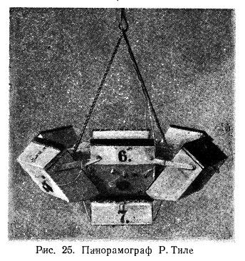
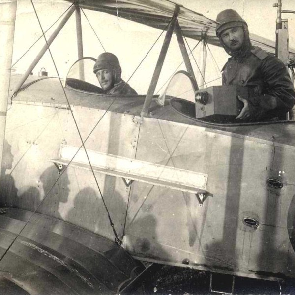
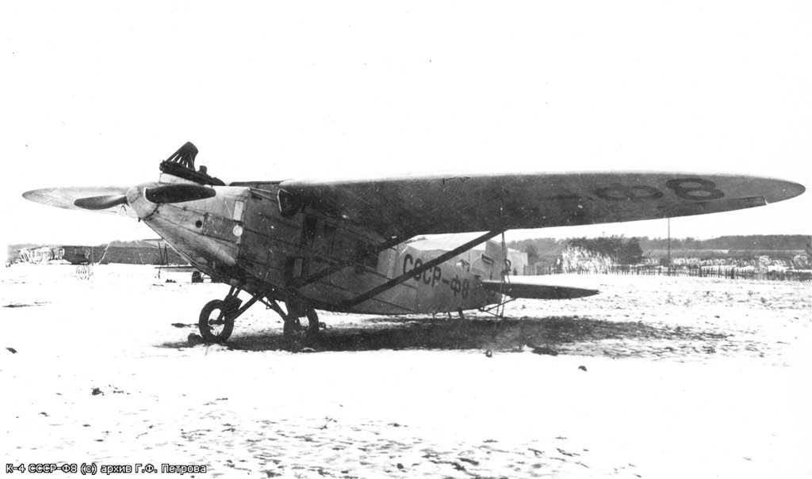
.. |image4| image:: media/image5.jpg
   :width: 3.91667in
   :height: 2.90000in
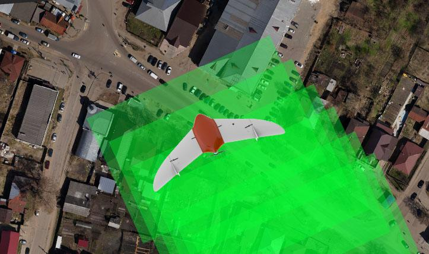
.. |image6| image:: media/image7.jpg
   :width: 6.40320in
   :height: 2.18646in
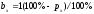
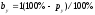
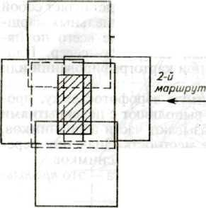
.. |image10| image:: media/image11.jpg
   :width: 4.01244in
   :height: 2.39356in
.. |image11| image:: media/image12.jpg
   :width: 4.53124in
   :height: 2.54795in
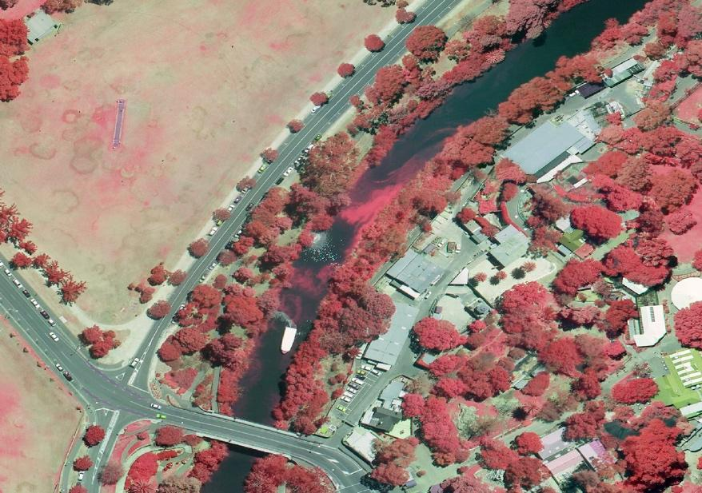
.. |image13| image:: media/image14.jpg
   :width: 5.25172in
   :height: 2.98060in
.. |image14| image:: media/image15.jpeg
   :width: 6.49236in
   :height: 0.96736in
.. |image15| image:: media/image16.jpg
   :width: 4.05635in
   :height: 2.02839in
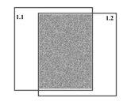
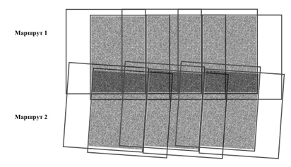
.. |image18| image:: media/image19.jpg
   :width: 4.89583in
   :height: 2.57022in
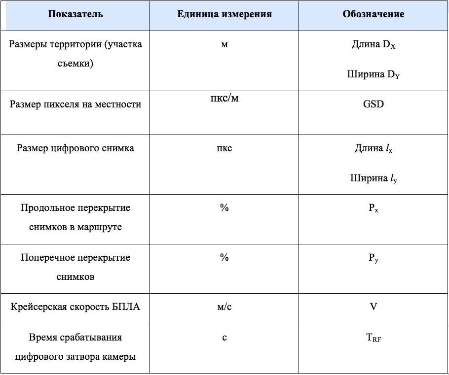
.. |image20| image:: media/image21.png
   :width: 2.62778in
   :height: 0.95764in
.. |image21| image:: media/image22.png
   :width: 2.72361in
   :height: 0.88264in
.. |image22| image:: media/image23.png
   :width: 2.14861in
   :height: 0.71250in
.. |image23| image:: media/image24.png
   :width: 3.41458in
   :height: 1.04236in
.. |image24| image:: media/image25.png
   :width: 2.01042in
   :height: 1.04236in
.. |image25| image:: media/image26.png
   :width: 2.08542in
   :height: 1.10625in
.. |image26| image:: media/image27.png
   :width: 2.48958in
   :height: 0.96806in
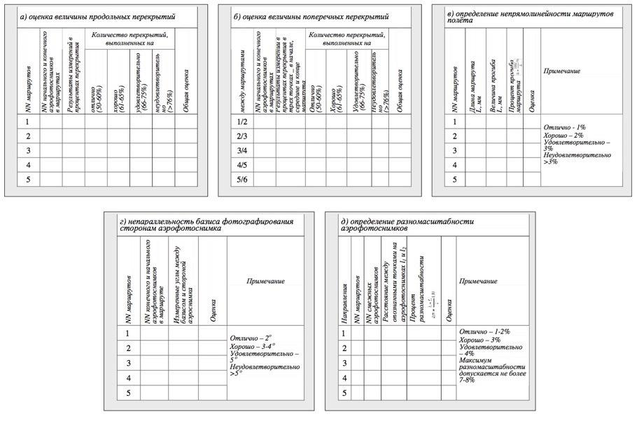
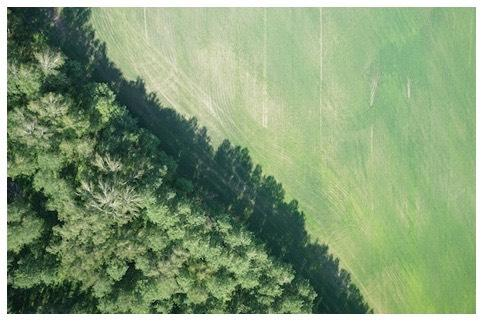
