Классификация БПЛА по летных характеристикам
============================================

Беспилотные летательные аппараты различают не только по способу их
применения в определённых сферах нашей жизни или различием конструкции ,
но и по более устойчивым параметрам и характеристикам, например,
взлетной массе, дальности, высоте и продолжительности полета, размерам
самих аппаратов и т.д.

Классификация UVS International
~~~~~~~~~~~~~~~~~~~~~~~~~~~~~~~

Международной ассоциацией по беспилотным летательным системам UVSI
(Association for Unmanned Vehicle Systems International, до 2004 года
она называлась Европейской ассоциацией по беспилотным системам – EURO
UVS) была предложена универсальная классификация БПЛА (Таблица 1),
которая объединяет многие из названных критериев.

Таблица 1

+---------------------------+--------------------------------------------------------------------+----------------------+------------------------+--------------------+-------------------------------+
| Группа                    | Категория                                                          | Взлетная масса, кг   | Дальность полета, км   | Высота полета, м   | Продолжительность полета, ч   |
+---------------------------+--------------------------------------------------------------------+----------------------+------------------------+--------------------+-------------------------------+
| Малые БПЛА                | Nano БПЛА                                                          | < 0,025              | < 1                    | 100                | < 0,5                         |
+---------------------------+--------------------------------------------------------------------+----------------------+------------------------+--------------------+-------------------------------+
|                           | Micro БПЛА                                                         | < 5                  | < 10                   | 250                | 1                             |
+---------------------------+--------------------------------------------------------------------+----------------------+------------------------+--------------------+-------------------------------+
|                           | Mini БПЛА                                                          | 20 - 150             | < 30                   | 150 - 300          | < 2                           |
+---------------------------+--------------------------------------------------------------------+----------------------+------------------------+--------------------+-------------------------------+
|                           | Легкие БПЛА для контроля переднего края обороны                    | 25- 150              | 10 - 30                | 3000               | 2 - 4                         |
+---------------------------+--------------------------------------------------------------------+----------------------+------------------------+--------------------+-------------------------------+
|                           | Легкие БПЛА с малой дальностью полета                              | 50 – 250             | 30 -70                 | 3000               | 3 - 6                         |
+---------------------------+--------------------------------------------------------------------+----------------------+------------------------+--------------------+-------------------------------+
|                           | Средние БПЛА                                                       | 150 - 500            | 70 - 200               | 5000               | 6 - 10                        |
+---------------------------+--------------------------------------------------------------------+----------------------+------------------------+--------------------+-------------------------------+
| Тактические               | Средние БПЛА с большой продолжительностью полета                   | 500-1500             | >500                   | 8000               | 10 - 18                       |
+---------------------------+--------------------------------------------------------------------+----------------------+------------------------+--------------------+-------------------------------+
|                           | Маловысотные БПЛА для проникновения в глубину обороны противника   | 250 2500             | >250                   | 50 - 9000          | 0,5 - 1                       |
+---------------------------+--------------------------------------------------------------------+----------------------+------------------------+--------------------+-------------------------------+
|                           | Маловысотные БПЛА с большой продолжительностью полета              | 15 - 25              | >500                   | 3000               | >24                           |
+---------------------------+--------------------------------------------------------------------+----------------------+------------------------+--------------------+-------------------------------+
|                           | Средневысотные БПЛА с большой продолжительностью полета            | 1000-500             | > 500                  | 5000-8000          | 24 - 48                       |
+---------------------------+--------------------------------------------------------------------+----------------------+------------------------+--------------------+-------------------------------+
|                           | Высотные БПЛА с большой продолжительностью полета                  | 2500-5000            | > 2000                 | 20000              | 24 - 48                       |
+---------------------------+--------------------------------------------------------------------+----------------------+------------------------+--------------------+-------------------------------+
| Стратегические            | Боевые (ударные) БПЛА                                              | >1000                | 1500                   | 12000              | 2                             |
+---------------------------+--------------------------------------------------------------------+----------------------+------------------------+--------------------+-------------------------------+
|                           | БПЛА, оснащенные боевой частью (летательного действия)             | -                    | 300                    | 4000               | 3 - 4                         |
+---------------------------+--------------------------------------------------------------------+----------------------+------------------------+--------------------+-------------------------------+
|                           | БПЛА – ложные цели                                                 | 150 – 500            | 0 - 500                | 50 - 5000          | < 4                           |
+---------------------------+--------------------------------------------------------------------+----------------------+------------------------+--------------------+-------------------------------+
| Специального назначения   | Стратосферные БПЛА                                                 | > 2500               | > 2000                 | > 20000            | > 48                          |
+---------------------------+--------------------------------------------------------------------+----------------------+------------------------+--------------------+-------------------------------+
|                           | Экзостратосферные БПЛА                                             | -                    | -                      | > 30500            | -                             |
+---------------------------+--------------------------------------------------------------------+----------------------+------------------------+--------------------+-------------------------------+

Приведенная выше классификация на сегодняшний день распространяется, как
на уже существующие, так и на будущие разрабатываемые модели БПЛА. В
основном эта классификация сложилась к 2000 г., когда беспилотные
аппараты только набирали популярность, но с тех пор много раз
пересматривалась. Ее и сейчас нельзя считать устоявшейся. Кроме того,
многие особые типы аппаратов с нестандартными комбинациями параметров
трудно отнести к какому-либо определенному классу.

Российская универсальная классификация
~~~~~~~~~~~~~~~~~~~~~~~~~~~~~~~~~~~~~~

Для сравнения, на сегодняшний день сложилась и Российская классификация
БПЛА, которая ориентирована преимущественно, пока только на военное
назначение аппаратов (Таблица 2):

Таблица 2

+-----------------------------------------------------+--------------------------+------------------------------+
|     Категория                                       |     Взлетная масса, кг   |     Дальность действия, км   |
+-----------------------------------------------------+--------------------------+------------------------------+
|     Микро и мини БПЛА ближнего действия             |     0 - 5                |     25 - 40                  |
+-----------------------------------------------------+--------------------------+------------------------------+
|     Легкие БПЛА малого радиуса действия             |     5 - 50               |     10 - 70                  |
+-----------------------------------------------------+--------------------------+------------------------------+
|     Легкие БПЛА среднего действия                   |     50 - 100             |     70 – 150 (250)           |
+-----------------------------------------------------+--------------------------+------------------------------+
|     Средние БПЛА                                    |     100 - 300            |     150 - 1000               |
+-----------------------------------------------------+--------------------------+------------------------------+
|     Средне – тяжелые БПЛА                           |     300 – 500            |     70 – 300                 |
+-----------------------------------------------------+--------------------------+------------------------------+
|     Тяжелые БПЛА среднего радиуса действия          |     < 500                |     70 - 300                 |
+-----------------------------------------------------+--------------------------+------------------------------+
|     Тяжелые БПЛА большой продолжительности полета   |     < 1500               |     1500                     |
+-----------------------------------------------------+--------------------------+------------------------------+
|     Беспилотные боевые самолеты                     |     < 500                |     1500                     |
+-----------------------------------------------------+--------------------------+------------------------------+

Российская классификация отличается от предложенной UVS International по
ряду параметров – упразднены группы БПЛА, некоторые классы зарубежной
классификации отсутствуют в РФ, легкие БПЛА в России имеют значительно
большую дальность и т. д.

Понятно, что у каждый БПЛА выполняет свои поставленные задачи, будь то
Микро- дрон, который мы купили в магазине, чтобы только научиться его
пилотировать или же Легкий квадрокоптер, который выполняет доставку
небольшого груза. Далее мы рассмотрим уже с вами типы БПЛА, которые
наиболее популярны в мире или оказали значительный вклад в развитии
новых типов беспилотников.

2.2 Правила регистрации БПЛА в РФ. Согласование полётов\ **.**

Одна из наиболее важных тем — закон о беспилотных летательных аппаратах
в России.

До недавнего времени, мало кто из пилотов понимал, что же будет с его
дроном и с ним самим, если полет не согласовывать, БПЛА не
регистрировать и т.д. Довольно долго законопроект в России был в
разработке и многие из нас томились ожиданиями, что же им делать сейчас
и что будет потом, после его принятия.

В 2019 году Государственная Дума приняла законопроект, который
предотвращает использование беспилотных воздушных судов в противоправных
целях. Любой дрон или квадрокоптер — это беспилотное воздушное судно
(БВС), а человек, который управляет устройством — внешний пилот.
Согласно пункту 5 статьи 32 «Воздушного кодекса Российской федерации»,
любые беспилотные гражданские воздушные суда с максимальной взлетной
массой от 0,25 кг до 30 кг, ввезенные в РФ или произведенные в РФ,
подлежат учету. Это значит, что по закону владелец квадрокоптера должен
поставить на учет беспилотный летательный аппарат — за исключением
устройств, вес которых меньше 0,25 кг. Заявления принимает Федеральное
агентство воздушного транспорта.

Заявление необходимо подать в течение 10 рабочих дней со дня
приобретения БВС на территории России либо с момента его ввоза на
территорию РФ, если покупали дрон за рубежом. Если вы сделали БВС
самостоятельно, то необходимо поставить его на учет до того, как начнете
запускать изобретение в воздух.

**Согласование полетов.**

Для осуществления полетов дронов и квадрокоптеров необходимо получить
специальное разрешение на использование воздушного пространство.
Разрешение выдает Зональный центр Единой системы организации воздушного
страхования. Если вес дрона или квадрокоптера больше 30 кг, его нужно
обязательно зарегистрировать. Параллельно с этим владелец (внешний
пилот) должен получить сертификат летной годности и свидетельство
внешнего пилота, чтобы иметь возможность управления коптером.

Чтобы запустить дрон или квадрокоптер над населенным пунктом, нужно в
обязательном порядке получить разрешение от органов местного
самоуправления. За сутки до предполагаемого полета следует подать
представление на установление режима полета в зональный центр по
организации воздушного движения. За 2 часа до вылета внешний пилот
должен связаться с диспетчером.

Есть места, где использование квадрокоптеров, дронов и других
беспилотных летательных аппаратов полностью запрещено:

-  Аэропорты и вокзалы

-  Опасные производства

-  Военные объекты

-  Стратегические государственные объекты

Классификация БПЛА по конструкции
-------------------------------------

Как известно на сегодняшний день существует большое количество типов
БПЛА, различной конструкции, предназначенные для множество разных задач.

В данном разделе мы с вами рассмотрим самые известные из них, которые
приобрели наибольшую популярность и доказали свою превосходность
относительно других типов.

Различают следующие типы БПЛА, отличающихся конструкцией и принципом
работы, взлета/посадки и назначения:

-  БПЛА самолетного типа

-  Мультироторные БПЛА

-  БПЛА Аэростатического типа

-  Беспилотные конвертопланы и гибридные модели

Рассмотрим ниже каждый из этих типов.

БПЛА самолетного типа
~~~~~~~~~~~~~~~~~~~~~~~~~~~

Такой тип аппаратов известен также как БПЛА с жестким крылом (англ.:
fixed-wing UAV). Подъемная сила у них создается аэродинамическим
способом за счет напора воздуха, набегающего на неподвижное крыло.
Аппараты такого типа, как правило, отличаются большой длительностью
полета, большой максимальной высотой полета и высокой скоростью.

Существует большое разнообразие подтипов БПЛА самолетного типа,
различающихся по форме крыла и фюзеляжа. Практически все схемы
компоновки самолета и типы фюзеляжей, которые встречаются в пилотируемой
авиации, применимы и в беспилотной.

|image0|

Рисунок - самолет Proteus

На рисунке 1 показан экспериментальный многоцелевой самолет Proteus
разработки американской компании Scaled Composites. Разработаны как
пилотируемый, так и беспилотный варианты этого самолета. Особенностью
конструкции является тандемная схема расположения крыльев. Его длина
составляет 17,1 м, размах задних крыльев 28 м, потолок высоты 16 км (при
нагрузке 3,2 т), взлетная масса 5,6 т, максимальная скорость 520 км/ч
(на высоте 10 км), длительность полета до 18 ч. Силовая установка – два
турбореактивных двигателя с тягой по 10,2 кН .

|image1|

Рисунок 2 - БПЛА RQ-4 Global Hawk

На рисунке 2 показан разведывательный БПЛА RQ-4 Global Hawk,
разработанный американской фирмой Teledyne Ryan Aeronautical, дочерним
предприятием компании Northrop Grumman. Он отличается необычной формой
фюзеляжа, в носовой части которого размещено радиолокационное,
оптическое и связное оборудование. Аппарат изготовлен из композитных
материалов на основе углеволокна и алюминиевых сплавов, имеет длину 13,5
м, размах крыльев 35 м, взлетную массу около 15 тонн, способен нести
полезную нагрузку массой до 900 кг. RQ-4 Global Hawk может находиться в
воздухе до 30 часов на высоте до 18 км. Максимальная скорость 640 км/ч.
Силовая установка – турбореактивный двигатель с тяговым усилием 34,5 кН.

|image2|

Рисунок - БПЛА Х-47В

На рисунке 3 показан перспективный боевой палубный БПЛА Х-47В,
разрабатываемый компанией Northrop Grumman (США). Он имеет форму широко
выгнутой буквы "V" без хвостовой части. Крылья могут складываться, что
немаловажно для ограниченной площади палубы авианосца. Для управления
полетом БПЛА оснащен 6-ю рабочими плоскостями. Турбореактивный двигатель
канадской фирмы Pratt amp. Whitney обеспечивает высокую скорость полета
беспилотного аппарата и расположен в задней части аппарата. Беспилотник
состоит из четырех частей, собранных из композитных материалов и
соединяющихся примерно в середине корпуса. Самолет имеет длину 11,6 м,
размах крыльев 18,9 м (в сложенном состоянии 9,4 м), собственную массу
6,3 т, максимальную взлетную массу 20,2 т. Крейсерская скорость
составляет 900 км/ч. Радиус действия 3900 км. Потолок 12,2 км.
Предположительно аппарат будет приспособлен для выполнения дозаправки в
воздухе. При этом БПЛА будет готов при необходимости беспрерывно
выполнять поставленную боевую задачу в течение 80 часов, что на порядок
больше длительности полета боевых самолетов с пилотами.

Компания «Геоскан» разработала сразу несколько беспилотников самолетного
типа. Один из них «Геоскан 201» (на рисунке 4). Он предназначен для
получения геопривязанных фотографий отдельных объектов, площадной и
линейной аэрофотосъемки, развивает скорость до 130 км/ч, а
продолжительность полета может достигать до 3-х часов.

Полученные с использованием комплекса материалы могут использоваться
для:

-  создания ортофотопланов масштаба 1:500 - 1:2000;

-  трехмерного моделирования участка местности;

-  создания карт высот местности;

-  вычисления объемов пород в карьерах и насыпных объектах;

-  обследования состояния объектов инфраструктуры, дорожного полотна;

-  инвентаризации лесов и посевов;

-  оценки ущерба и планирования аварийно-спасательных работ; при ЧС,
   таких как наводнения, оползни и пожары.

|image3|

Рисунок - «Геоскан 201»

В качестве движителей аппаратов самолетного типа обычно используются
тянущие или толкающие винты, а также импеллеры (лопаточные машины,
заключенные в цилиндрический кожух – англ.: impeller, ducted fan,
shrouded propeller) или реактивные двигатели.

Для аппаратов самолетного типа обычно необходима взлетно-посадочная
полоса (ВПП) или же стартовые катапульты (рисунок 5). Есть также
самолетные БПЛА легкого класса, запускаемые "с руки". При посадке может
применяться ВПП, парашют или специальные уловители (тросы, сетки или
растяжки)

|image4|

Рисунок - стартовая катапульта

Взлеты и посадки традиционных БПЛА самолетного типа – процесс достаточно
трудоемкий и затратный, требующий наличия специальных вспомогательных
средств (ВПП, устройств запуска и посадки), поэтому разработчики новой
техники все чаще обращаются к нетрадиционным схемам самолетных БПЛА,
позволяющим создать безаэродромные беспилотные системы. Речь идет прежде
всего о самолетах вертикального взлета и посадки (СВВП). На сегодняшний
день существует много разновидностей аппаратов ВВП. Многие из них
являются гибридами самолетов и вертолетов, и рассмотрены в следующем
разделе. Те же СВВП, которым в большей степени присущи свойства
самолета, чем вертолета, обычно имеют в качестве движителя реактивный
двигатель, импеллер или небольшие по размеру пропеллеры. Их условно
можно разделить по положению фюзеляжа при взлете и посадке на аппараты с
вертикальным положением фюзеляжа (тэйлситтеры, от англ. – tailsitter)

Тэйлситтеры в стартовом положении обычно опираются хвостовой частью на
грунт. Если в качестве движителя используются тянущие винты, то они
располагаются в носовой части (рис. 2.3.6). Посадка, как и взлет, у
таких аппаратов обычно производится вертикально. Самое сложное для СВВП
– это переход с вертикальной фазы полета на горизонтальную и обратно. У
показанного на рисунке 6 БПЛА SkyTote, например, для управления полетом
в этих фазах используется даже специальный нейросетевой контроллер.

|image5|

Рисунок - БПЛА SkyTote

Существует особый вид БПЛА – аппарат с жестким зонтообразным крылом,
основанных на эффекте Коанда. Хотя эти аппараты мало похожи на самолеты,
по принципу полета они все же больше всего соответствуют этой
классификационной группе.

Эффект Коанда – физическое явление, названное так, потому что в 1932
году румынский ученый Анри Коандэ обнаружил, что поток жидкости или газа
стремится отклониться по направлению к стенке тела с криволинейной
поверхностью и при определенных условиях прилипает к ней, вместо того,
чтобы продолжать движение в начальном направлении. Действие эффекта
Коанды проявляется тогда, когда подача слоя воздуха на поверхность
производится через узкую щель. Этот тонкий скоростной слой захватывает
окружающий воздух. В итоге создается т.н. настилающая струя –
полуограниченная струя, которая всегда развивается только вдоль
поверхности ограждения. Дальность распространения настилающей струи
увеличивается приблизительно в 1,2 раза по сравнению со стесненной
струей (т.е. струей, ограниченной со всех сторон, как в трубе). Таким
образом, струя, которая настилается на поверхность, имеет большую
дальнобойность при остальных одинаковых условиях, чем струя
ненастилающая.

Летательный аппарат на эффекте Коанда (рисунок 7) устроен довольно
просто: над зонтообразной поверхностью установлен вентилятор или
реактивный двигатель, создающий поток воздуха, выходящий через узкую
щель и настилающий криволинейную поверхность.

|image6|

Рисунок - Летательный аппарат на эффекте Коанда

Такой аппарат имеет преимущество при использовании по сравнению с
обычными вертолетами в городских условиях, лесистой и горной местности,
где велика вероятность повреждения несущего винта вертолета. У
предлагаемого аппарата небольшие столкновения с препятствиями не могут
нарушить его работу.

Мультироторные (вертолетные) системы
~~~~~~~~~~~~~~~~~~~~~~~~~~~~~~~~~~~~

Одним из наиболее массовых БПЛА является мультикоптер. К этой группе
относятся БПЛА, имеющие больше двух несущих винтов. Реактивные моменты
уравновешиваются за счет вращения несущих винтов попарно в разные
стороны или наклона вектора тяги каждого винта в нужном направлении.
Беспилотные мультикоптеры, как правило, относятся к классам мини- и
микро-БПЛА.

Основное назначение мультикоптеров – это фото- и видеосъемка различных
объектов, поэтому они, как правило, оснащаются управляемыми подвесами
для камер. Мультикоптеры также используются в качестве устройств для
оперативного мониторинга ситуации, проведения сельскохозяйственных работ
(например, опрыскивание), для доставки грузов небольшого веса.

|image7|\ |image8|\ |image9|\ Рисунок 8 –“Tricopter” Рисунок 9 –
“+Copter Рисунок 10 – “XCopter”

|image10|\ |image11|\ |image12|

Рисунок - “Y4Copter” Рисунок - “HexaCopter” Рисунок - “H6Copter”

|image13|\ |image14|\ |image15|

Рисунок 14 - “Y6Copter” Рисунок 15 - “OctoCopter” Рисунок 16 -
“ButterflyCopter”

Трикоптер – самая простая схема построения мультикоптеров (рисунок -
17). Обычно трикоптер движется двумя винтами вперед, а третий является
хвостовым. Первые два винта имеют противоположные направления вращения и
взаимно компенсируют реактивные закручивающие моменты, у хвостового же
винта пары нет, поэтому для компенсации его реактивного момента ось
вращения этого винта немного наклоняют в сторону, противоположную
направлению закручивания. Это делают с помощью специального сервопривода
и тяги, которые используются для стабилизации или управления положением
аппарата по курсу.

|image16|

Рисунок - Пример Трикоптера

Квадрокоптер – самая распространенная схема построения мультикоптеров.
Наличие четырех жестко зафиксированных роторов дает возможность
организовать довольно простую схему организации движения. Существуют две
таких схемы движения: схема "+" и схема "х". В первом случае один из
роторов является передним, противоположный ему – задним, и два ротора
являются боковыми. В схеме "х" передними являются одновременно два
ротора, два других являются задними, а смещения в боковом направлении
также реализуются одновременно парой соответствующих роторов (рисунок
18) Алгоритм управления частотами вращения винтов для схемы "+"
несколько проще и понятнее, чем для схемы "х", однако последняя
используется все же чаще из-за конструктивных преимуществ: при такой
схеме проще разместить фюзеляж, который может иметь вытянутую форму,
бортовая видеокамера имеет более свободный обзор.

|image17|

Рисунок - Геоскан 401

Гексакоптеры и октокоптеры, имеющие соответственно по 6 (рисунок - 19) и
8 (рисунок - 20) моторов обладают гораздо большей грузоподъемностью по
сравнению с квадрокоптерами. Они также способны сохранять устойчивый
полет при выходе из строя одного двигателя. Такие аппараты отличаются
также гораздо меньшим уровнем вибраций, что особенно важно для
видеосъемки.

|image18|\ |image19|\ Рисунок – Октокоптер Рисунок – Гексокоптер

БПЛА Аэростатического типа
~~~~~~~~~~~~~~~~~~~~~~~~~~

БПЛА аэростатического типа (blimps) – это особый класс БПЛА, в котором
подъемная сила создается преимущественно за счет архимедовой силы,
действующей на баллон, заполненный легким газом (как правило, гелием).
Этот класс представлен, в основном, беспилотными дирижаблями (рисунок -
21)

Дирижабль (от фр. dirigeable – управляемый) – летательный аппарат легче
воздуха, представляющий собой комбинацию аэростата с движителем (обычно
это винт (пропеллер, импеллер) с электрическим двигателем или ДВС) и
системы управления ориентацией благодаря которой дирижабль может
двигаться в любом направлении независимо от направления воздушных
потоков.

|image20|

Рисунок - БПЛА аэростатического типа

Отличительное преимущество дирижабля - большая грузоподъемность и
дальность беспосадочных полетов. Достижимы более высокая надежность и
безопасность, чем у самолетов и вертолетов. (Даже в самых крупных
катастрофах дирижабли показали высокую выживаемость людей.) Меньший, чем
у вертолетов, удельный расход топлива и, как следствие, меньшая
стоимость полета в расчете на единицу массы перевозимого груза. Размеры
его внутренних помещений могут быть очень велики, а длительность
нахождения в воздухе может измеряться неделями. Дирижаблю не требуется
взлетно-посадочной полосы (но зато требуется причальная мачта) — более
того, он может вообще не приземляться, а просто «зависнуть» над землей
(что, впрочем, осуществимо только при отсутствии сильного бокового
ветра).

|image21|

Рисунок - Дирижабль для аэрофотосъемки

Наиболее типичные применения современных беспилотных дирижаблей – это
реклама и видеонаблюдение (рисунок - 22). Однако в последние годы их все
чаще заказывают телекоммуникационные компании для использования в
качестве ретрансляторов сигналов. Существуют также проекты постройки
дирижаблей очень большой грузоподъемности – 200-500 тонн.

Привлекают внимание новые концепты дирижаблей, имеющие, как правило,
нетрадиционные форму оболочки и способ движения.

Беспилотные дирижабли линзообразной формы планирует выпускать ОАО
"Долгопрудненское конструкторское бюро автоматики" при поддержке
"Рособоронэкспорта" и "Ростехнологий". Они будут иметь от 22 до 200 м в
диаметре и смогут переносить до нескольких сотен тонн груза. Пока
созданы лишь демонстрационные масштабные модели таких дирижаблей. Пример
– успешно испытанная модель ДП-27 "Анюта" (рисунок - 23). Дисковидная
форма этого аппарата обеспечивает устойчивость к боковому ветру,
простоту управления и высокую маневренность этого многоцелевого
беспилотного дирижабля. Диаметр корпуса судна – 17 м с объемом оболочки
– 522 куб. м, грузоподъемность – 200 кг, максимальная высота подъема
достигает 800 м. С помощью 4 двигателей по 25 л.с. аппарат развивает
скорость до 80 км/ч, бензобак объемом 40 л позволяет демонстратору
осуществлять полет на дистанцию 300 км.

|image22|

Рисунок -ДП-27 "Анюта"

Беспилотные конвертопланы и гибридные схемы
~~~~~~~~~~~~~~~~~~~~~~~~~~~~~~~~~~~~~~~~~~~

Гибридные винтокрылые аппараты – автожиры и конвертопланы. Кроме
рассмотренных классов аппаратов самолетного и мультироторного типа
существуют их гибридные разновидности, такие как автожиры и
конвертопланы, которые имеют некоторые признаки как вертолетов, так и
самолетов.

Автожир (другие названия: гирокоптер, гироплан, ротаплан, англоязычные:
autogiro, gyrocopter, gyroplane, rotoplane) – схема, подобная самолету,
у которого в качестве крыла (или в дополнение к нему) установлен
свободно вращающийся винт (рисунок - 24)

|image23|

Рисунок - Пример одного их первых автожиров

Как и вертолету, автожиру несущий винт необходим для создания подъемной
силы, однако создание подъемной силы основным винтом автожира основано
на другом принципе. Он создает виртуальную дисковую поверхность, при
набегании на которую встречного потока воздуха и создается подъемная
сила. Здесь существенно, что в полете этот винт наклонен назад, против
потока – подобно фиксированному крылу с положительным углом атаки
(вертолет, наоборот, наклоняет винт в сторону движения, т.к. создает
приводным несущим винтом и подъемную, и горизонтальную пропульсивную
силы одновременно). Кроме несущего ротора, автожир обладает еще и
тянущим или толкающим маршевым винтом (пропеллером), как и у обычного
самолета. Этот маршевый винт и сообщает автожиру горизонтальную
скорость.

Большинство автожиров не могут взлетать вертикально, но им требуется
гораздо более короткий разбег для взлета (10-50 м, с системой
предраскрутки ротора), чем самолетам. Почти все автожиры способны к
посадке без пробега или с пробегом всего несколько метров. По
маневренности они находятся между самолетами и вертолетами, несколько
уступая вертолетам и абсолютно превосходя самолеты. Автожиры превосходят
самолеты и вертолеты по безопасности полета. Самолету опасна потеря
скорости, поскольку он сваливается при этом в штопор. Автожир при потере
скорости начинает снижаться. При отказе мотора автожир не падает, вместо
этого он снижается (планирует), используя эффект авторотации (несущий
винт вертолета при отказе двигателя также переводится в режим
авторотации, но на это теряется несколько секунд и падают обороты
ротора, важные при вынужденной посадке). При посадке автожиру не
требуется посадочная полоса.

Скорость автожира сравнима со скоростью легкого вертолета и несколько
уступает легкому самолету. По расходу топлива они уступают самолетам,
техническая себестоимость летного часа автожира в несколько раз меньше,
чем у вертолета, благодаря отсутствию сложной трансмиссии. Типичные
автожиры летают со скоростью до 180 км/ч), а расход топлива составляет
15 л на 100 км при скорости 120 км/ч. Другими преимуществами автожиров
являются гораздо меньшая, чем в вертолетах, вибрация, а также
способность летать при значительном (до 20 м/с) ветре.

В настоящее время автожиры производятся и в беспилотном исполнении
фирмами разных стран. Назначение их самое разнообразное. Так, российская
компания "Рустехресурс" (г. Воронеж) разработала беспилотный автожир
"Химик" для сельскохозяйственных работ – опыления посадок химикатами
(рисунок - 25)

|image24|

Рисунок - автожир "Химик"

Конвертоплан (англ.: convertiplane, heliplane) – летательный аппарат с
поворотными винтами, которые на взлете и при посадке работают как
подъемные, а в горизонтальном полете – как тянущие (при этом в полете
подъемная сила обеспечивается крылом самолетного типа). Таким образом,
этот аппарат ведет себя как вертолет при взлете и посадке, но как
самолет в горизонтальном полете. Большие винты конвертоплана помогают
ему при вертикальном взлете, однако в горизонтальном полете они
становятся менее эффективными по сравнению с винтами меньшего диаметра
традиционного самолета.

Среди конвертопланов можно выделить три принципиально различающихся
подкласса: аппараты с поворотными винтами (Tiltrotor), с поворотным
крылом (Tiltwing) и со свободным крылом (Freewing).

В конвертопланах с поворотными роторами обычно поворотными являются не
сами винты, а гондолы с винтами и двигателями. Крылья (обычно небольшой
площади) при этом остаются неподвижными. На рисунке 26 приведен пример
беспилотного конвертоплана типа Tiltrotor.

|image25|

Рисунок - конвертоплан Tiltrotor

В конвертопланах с поворотным крылом поворачивается все крыло вместе с
установленными на нем двигателями и винтами. Достоинством такой схемы
является то, что при вертикальном взлете крылья не закрывают воздушный
поток от винтов (увеличивая тем самым эффективность работы винтов). На
рисунке 27 приведены примеры конвертопланов типа Tiltwing.

|image26|

Рисунок - конвертопланов типа Tiltwing

Беспилотные конвертопланы с поворотным крылом, построенные по схеме,
показанной на рисунке 28, часто рассматривают как особые подклассы
мультикоптеров (точнее – квадрокоптеров) – соответственно QTR UAV (Quad
Tilt Rotor UAV) и QTW UAV (Quad Tilt Wing UAV).

|image27|

Рисунок - Конвертолпан с поворотным крылом

В конвертопланах со свободным крылом (Freewing) в зависимости от фазы
полета отклоняются винты, создавая вертикальную или горизонтальную тягу,
а крылья свободно вращаются вокруг оси, перпендикулярной фюзеляжу.

Под напором воздуха, создаваемого винтами, крылья принимают
вертикальное, горизонтальное или какое-либо промежуточное положение.
Аппараты такой конструкции отличаются стабильностью полета. На рисунке
29 показан пример беспилотника типа Freewing.

|image28|

Рисунок - беспилотник типа Freewing

Вопросы для самопроверки:
-------------------------

-  Какие отличия международной классификации от российской?

-  Перечислите места, где использование дронов категорически запрещено.

-  Если мой дрон весит 251 грамм, его нужно регистрировать?

-  За счёт чего летает дирижабль?

-  Если у трикоптера и гексакоптера в полете сломался один двигатель,
   смогут ли они продолжить полёт? Почему?

-  В чём особенность конвертоплана?

Список использованных источников
--------------------------------

1. Сборник научных трудов Харьковского университета Воздушных Сил, 2012,
   выпуск 4 - “Летательные аппараты: аэродинамика, силовые установки,
   оборудование и вооружение”

2. Беспилотная авиация: терминология, классификация, современное
   состояние - `Владимир
   Фетисов <https://www.libfox.ru/tags/%D0%92%D0%BB%D0%B0%D0%B4%D0%B8%D0%BC%D0%B8%D1%80+%D0%A4%D0%B5%D1%82%D0%B8%D1%81%D0%BE%D0%B2/>`__
   2014 год

3. `*https://russiandrone.ru/news/kvadrokoptery\_i\_drony\_nuzhno\_li\_razreshenie\_v\_2020\_godu/* <https://russiandrone.ru/news/kvadrokoptery_i_drony_nuzhno_li_razreshenie_v_2020_godu/>`__

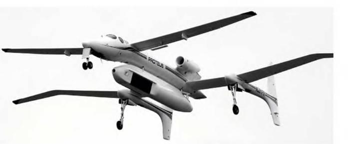
.. |image1| image:: media/image2.jpg
   :width: 6.13819in
   :height: 3.37500in
.. |image2| image:: media/image3.jpg
   :width: 6.49236in
   :height: 2.01250in
.. |image3| image:: media/image4.jpg
   :width: 4.91767in
   :height: 3.68279in
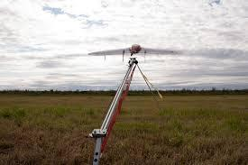
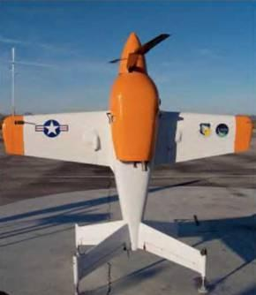
.. |image6| image:: media/image7.png
   :width: 5.32326in
   :height: 3.45606in
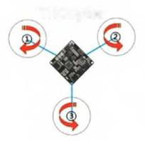
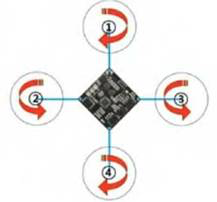
.. |image9| image:: media/image10.png
   :width: 2.11080in
   :height: 1.88136in
.. |image10| image:: media/image11.png
   :width: 2.12798in
   :height: 2.27784in
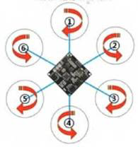
.. |image12| image:: media/image13.png
   :width: 2.23456in
   :height: 2.19240in
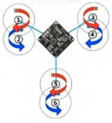
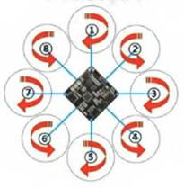
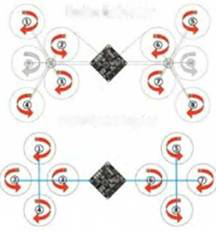
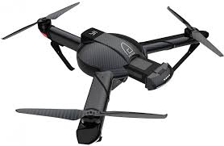
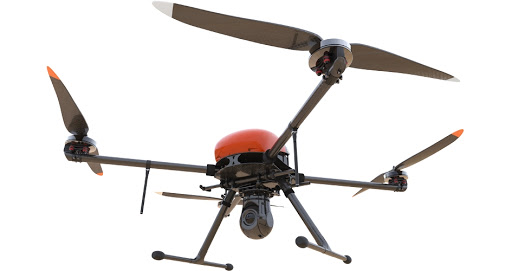
.. |image18| image:: media/image19.png
   :width: 2.99917in
   :height: 2.51042in
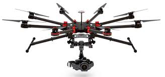
.. |image20| image:: media/image21.jpg
   :width: 3.86814in
   :height: 2.57708in
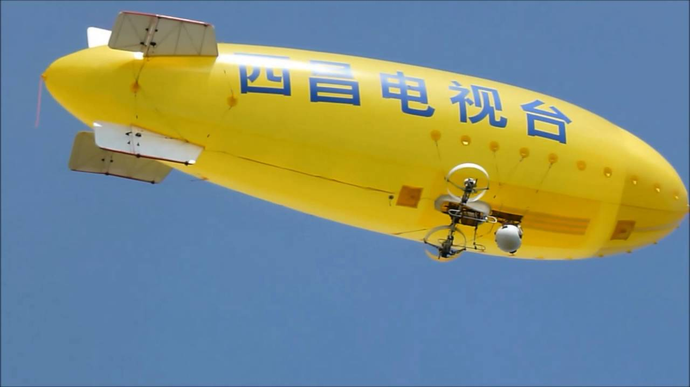
.. |image22| image:: media/image23.png
   :width: 6.49236in
   :height: 2.03264in
.. |image23| image:: media/image24.png
   :width: 3.38889in
   :height: 2.16667in
.. |image24| image:: media/image25.png
   :width: 6.49236in
   :height: 2.63750in
.. |image25| image:: media/image26.png
   :width: 4.50047in
   :height: 2.44977in
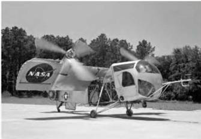
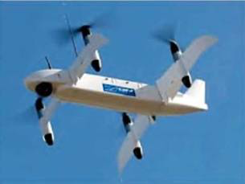
.. |image28| image:: media/image29.png
   :width: 2.40449in
   :height: 2.00000in
