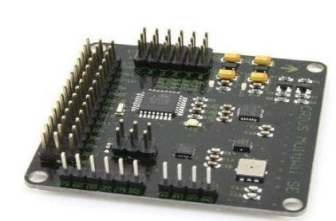
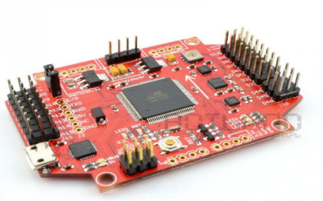
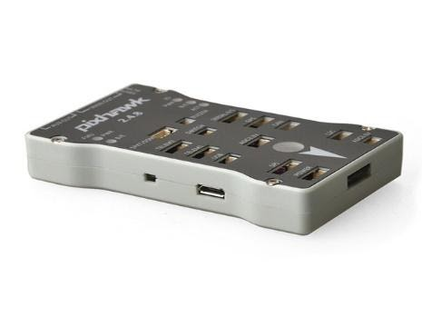
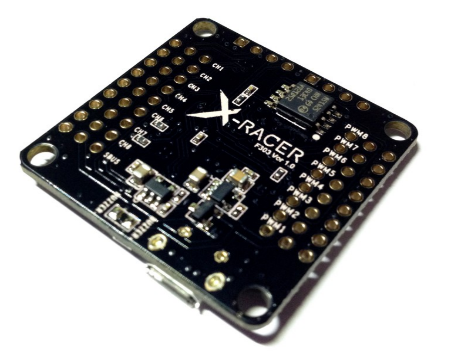
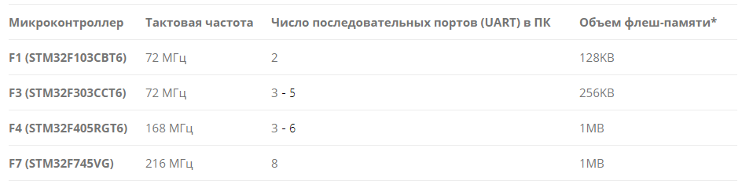
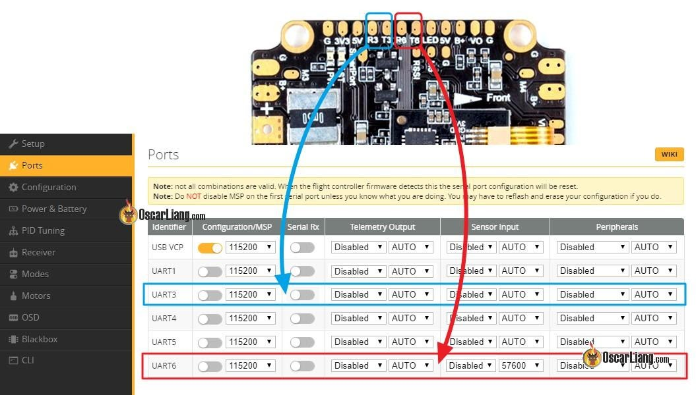
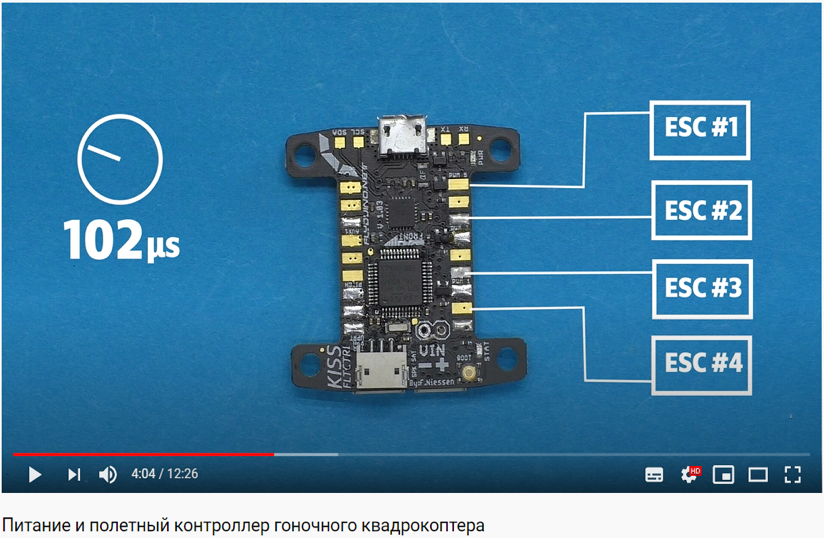

Полетный контроллер
===================

Беспилотники мультироторного типа, аэродинамически неустойчивы и требуют
постоянной стабилизации в полете. Так как человек не способен
одновременно контролировать скорость вращения трех и более двигателей
достаточно точно, чтобы сохранять баланс беспилотного летательного
аппарата в воздухе. Появление достаточно быстродействующих
микроконтроллеров и интегральных датчиков ускорения и угловой скорости
на основе микроэлектромеханических систем (МЭМС), позволили решить эту
задачу, и стимулировать развитие высокопроизводительных полетных
контроллеров (автопилотов), алгоритмы которых в свою очередь раскрывают
новые возможности управления полетом.

Полетный контроллер – электронное устройство, представляющее из себя
вычислительную систему, работающую по сложным алгоритмам, и управляющая
полетом беспилотного летательного аппарата. Функции полетного
контроллера могут определяться установленной на борту мультикоптера
дополнительной периферией (GPS, модем, OSD, подвес для фото/видеокамеры,
датчики тока и напряжения, поисковые средства и тд.).

Основные задачи выполняемые полетным контроллеров:

1. Стабилизация аппарата в воздухе.

Сбор и обработка информации с инерциального измерительного блок (IMU),
датчиков ускорений и угловой скорости, обеспечивая аэродинамическую
устойчивость аппарата в горизонтальной плоскости. Некоторые IMU включают
в себя магнитометры позволяя стабилизировать ориентацию аппарата
относительно магнитного меридиана и удержания направления движения. 

2. Автоматическое удержание высоты.

Сбор и обработка информации с барометрических, ультразвуковых,
инфракрасных сенсоров или радиотехнических высотомеров, датчики
рассчитывают высоту и обеспечивают стабилизацию аппарата в вертикальной
плоскости. Возможность привязки позиции коптера на заданной высоте и в
заданной точке при помощи модулей GPS/ГЛОНАСС.

3. Автономный полет.

Выполнение заранее построенного маршрута полетного задания созданным в
специальном программном обеспечении с постоянным или переменным
соблюдением телеметрических данных заданными оператором, и осуществлять
автоматический возврат в точку старта при помощи модуля GPS/ГЛОНАСС.

4. Система искусственного (технического) зрения

Остановка перед препятствиями и их преодоление, по средству набора
сенсоров, определяющих расстояние до объекта. В случае оснащения
системой технического зрения, полетный контроллер должен обладать
высокой вычислительной способностью, который в реальном времени будет
аккумулировать и обрабатывать данные с сенсоров, постоянно сканирующих
окружающую среду. Состав системы может отличаться типом и количеством
датчиков, соответственно у разных коптеров различается, как принцип, так
и математические алгоритмы работы и взаимодействия между этими
датчиками.

Система технического зрения может включает набор следующих сенсоров:
стереоскопические (датчик изображения), инфракрасные или ультразвуковые
дальномеры, двумерные лидары, 3D-лидары (Flash-LiDAR Time-of-Flight).
Последние с алгоритмами одновременной навигации и построения карты
(SLAM) позволяют строить 3D-модель окружающего пространства и
планировать в нем безопасный маршрут, предотвращая столкновения с
препятствиями.

5. Передача на землю текущих параметров полета

Сбор и обработка данных с внешних источников данных (GPS/ГЛОНАСС,
датчики тока, напряжения, температуры) и штатных (барометр,
акселерометр, магнитометр) с последующей передачей потока данных на
модуль OSD (On-Screen Data – будет рассмотрен далее), которые на земле
отображаются на FPV-очках или дисплее. Данные телеметрии так же могут
передаваться непосредственно с полетного контроллера при помощи
радиомодема, который обеспечивает двухстороннюю связь по протоколу UART
(универсальный асинхронный приемопередатчик) через радиоканал.

Инерциальный измерительный блок (IMU)
-------------------------------------

Полетный контроллер оснащен набором миниатюрных измерительных устройств
(датчиков), которые лежат в основе инерциального измерительного блока. 

Инерциальный измерительный блок или система инерциальной навигации (от
англ. IMU – Inertial Measurement Unit) – это система, которая определяет
своё положение в пространстве используя свойства инерции тел, то есть
определяет на какой угол и по какой оси она была повернута и была
смещена относительно начальной точки. Измерительный блок включает в себя
датчики линейного ускорения (акселерометр) и угловой скорости
(гироскоп). Основной задачей датчиков на полетном контроллере является
непрерывное получение навигационных данных для математических расчетов
микроконтроллером (микропроцессором), который устанавливает положение
беспилотника относительно горизонта и обнаруживает изменения углов
ориентации, относительно его предыдущего положения в пространстве, затем
направляет данные в электронные регуляторы оборотов двигателей (ESC).
Вычисленные данные микроконтроллером позволяют обеспечивать полет
мультикоптером, управляя газом, углами крена, тангажа и рысканья
(throttle, pitch, roll, yaw).

Современные датчики положения и ускорений используемые при управления
беспилотными летательными аппаратами основаны на технологии
микроэлектромеханических систем (МЭМС).

МЭМС (MEMS) или микроэлектромеханические системы представляет собой
технологию, которая позволяет миниатюризировать механические структуры и
полностью интегрировать их с электрическими схема, что приводит к одному
физическому устройству, где механические и электрические компоненты
работают для реализации желаемой функциональности. Таким образом,
МЭМС-устройство представляет собой микро (т.е. очень маленький) чип, в
котором одновременно находятся электрическая система, отвечающая за
обработку сигналов и движущаяся механическая система. Физические размеры
МЭМС-устройств могут варьироваться от одного микрона до нескольких
миллиметров, а также от относительно простых структур практически без
движущихся элементов до очень сложных электромеханических систем.

Принцип работы интегрального гироскопа
~~~~~~~~~~~~~~~~~~~~~~~~~~~~~~~~~~~~~~

Гироскоп (от греч. «gyros» – круг и «skopeo» – смотрю, наблюдаю) – это
устройство, которые способно реагировать на изменение углов ориентации
объекта, относительно инерциальной системы отсчета и определять его
положение в пространстве. Схема показана на рисунке 1.

|image0|

Рисунок 1 – Устройство интегрального гироскопа

Чувствительным элементом интегрального гироскопа являются две подвижные
массы (грузики), которые находятся в непрерывном движении на упругом
подвесе в противоположенных направлениях. Источником колебаний подвижной
массы является гребенчатые электростатические двигатели. Подвижная
масса, вместе с электродами, расположенная на подложке, образуют
конденсаторы, входящие в состав дифференциальной схемы, вырабатывающей
сигнал, пропорциональный разности емкостей конденсатора. Линейное
ускорение одинаково воздействует на обе подвижные массы и подложку,
поэтому сигнал на выходе дифференциальной схемы не появляется. Как
только произойдет изменение угловой скорости относительно оси вращения,
то на подвижные массы начинает действовать сила Кориолиса, отклоняя
подвижные массы в противоположных направлениях. Соответственно, емкость
одного конденсатора увеличивается, а другого уменьшается, что порождает
разностный сигнал, пропорциональный величине углового ускорения. Таким
образом, осуществляется преобразование угловой скорости гироскопа в
электрический параметр, величина которого детектируется специальным
датчиком. 

Для того, чтобы мультикоптер определял положение в пространстве
относительно трех ортогональных направлений х, y, и z, внутри одного
корпуса микросхемы располагаются три датчика перпендикулярно осям. От
сюда происходит название – трех осевой гироскоп.

Принцип работы интегрального акселерометра
~~~~~~~~~~~~~~~~~~~~~~~~~~~~~~~~~~~~~~~~~~

Акселерометр (от лат. «accelero» – ускоряю и греч. «metreo» – измеряю) –
это устройство, которое измеряет кажущееся ускорение (разность между
истинным ускорением объекта и гравитационным ускорением). В состав
интегрального акселерометра входят высокоточный чувствительный элемент
(движущийся) для определения ускорений и электронная часть,
осуществляющая обработку сигнала (рисунок 2).

|image1|

1 – Поликремниевые пружины; 2 – Фиксированные пластины (контакты); 3 –
Кремниевая подложка (корпус); 4 – Подвижная масса с проводниками; 5 –
Изменение емкости.

Рисунок 2 – Устройство интегрального акселерометра

На статическом корпусе (не подвижном) параллельно размещены тонкие
фиксированные пластины (контакты), снимающие показания, а источником
данных является подвижная масса закрепленная на упругих поликремниевых
пружинах и выполнения в виде тонкой рамки с отведенными в стороны
проводниками и допускающая перемещение в определенных пределах, когда к
определенной оси применятся ускорение. 

Отведенные в сторону проводники подвижной массы располагаются между
фиксированными пластинами (контактами), через которые снимаются
показания перемещения проводников. Объектом измерения выступает
изменяющаяся емкость между фиксированными пластинами и проводниками
подвижной массы, где изменение емкости пропорционально ускорению оси
относительно который происходит движение.

 Датчик обрабатывает это изменение емкости и преобразует его в
аналоговое выходное напряжение, где специальный чип, интегрированный в
корпус МЭМС-устройства, его измеряет. С учетом этих данных и заранее
известных массы и параметров подвижного элемента, чип выдает итоговое
значение ускорения по одному из трех ортогональных направлений x, y, и
z. Это значение используется микроконтроллером для автоматического
выравнивания полета мультикоптера.

Интегральные акселерометры, как и гироскопы в мультикоптерах являются
трехосевыми, с тремя датчика расположены внутри одного корпуса
микросхемы перпендикулярно осям х, у и z.

В современных МЭМС микросхемах трехосевые акселерометры и трехосевые
гироскопы часто объединяют в одном корпусе, в этом же корпусе
располагается электронная часть для предварительной обработки сигналов,
с внешними протоколом обмена I\ :sup:`2`\ C или SPI. Ниже на рисунке 3
приведены наиболее популярные IMU, объединяющие акселерометр и гироскоп,
используемые в полетных контроллерах.

|image2|

\*MPU9150 – это MPU6050 со встроенным магнитометром АК8975;

\*MPU9250 – это MPU6500 с тем же магнитометром.

Рисунок 3 – Модели IMU и способы подключения

У IMU есть две основные характеристики, это частота работы или частота
сэмплирования и чувствительность к шумам (механическим вибрациям и
электрическим помехам). Чтобы частично решить проблему с возникающими
механическими вибрациями, на полетный контроллер устанавливаются
демпферы или пористый материал, который сможет гасить вибрацию.

I\ :sup:`2`\ C и SPI – это протоколы связи (BUS) между микроконтроллером
и IMU. В зависимости от того, какой протокол будет выбран, будут
зависеть ограничения в скорости работы IMU. При использовании SPI,
появляется возможность работать с большими частотами 32KHz, в то время
как с протоколом I\ :sup:`2`\ C лимит ограничен в 4KHz. Поэтому
большинство современных полетных контроллеров используют протокол SPI.

Типы полетных контроллер (ПК)
-----------------------------

Сегодня разрабатывается огромное количество различных типов полетных
контроллеров для конкретных задач и видов беспилотников. Рассмотрим
некоторые из них, используемых в мультироторных системах.

ПК MultiWii – один из первых и широко известных полетных контроллеров
для беспилотных летательных аппаратов (рисунок 4). Имеет открытые
исходные коды, так же имеет базовую инерциальную навигационную систему
(трехосевой гироскоп и трехосевой акселерометр), которая может
запрограммирована определенным требованиям. Имеет встроенные датчики
давления (барометр) для определения высоты и магнитометр для
стабилизации курса. Поддерживает прямое подключение модуля GPS, за счет
чего реализуется точное позиционирование и возможностью полного
программирования автономного полета. Подходит для аэрофото/видеосъемке,
возможно подключение Bluetooth или радиомодема.

|image3|   |image4|

Рисунок 4 - Контоллеры MultiWii

ПК PixHawk – один из наиболее функциональных полетных контроллеров с
открытым исходным кодом и архитектурой (рисунок 4). Построен на
современной элементной базе, прежде всего 32-битном микроконтроллере
STM32 на основе ядра ARM7 [10]. Базовая инерциальная навигационная
система включает в себя трехосевой гироскоп и трехосевой акселерометр,
так же высокоточной барометр и магнитометр. Полетный контроллер оснащен
дополнительным микроконтроллером (резервной системой) работающая на
отдельной цепи питания, предусмотренный на случай отказа основного.
Возможность подключения дополнительной периферии через протоколы обмена
данных (UART, CAN, I\ :sup:`2`\ C, SPI). Модуль GPS для автономных
полетов по заданным координатам и поддержка MicroSD (черный ящик) для
записи полетной информации.

|image5|               |image6|

Рисунок 5 – Контроллер PixHawk

ПК XRacer F3 – полетный контроллер основан на поколении микропроцессоров
серии F3, и разработан специально для FPV гонок, что предоставляет
больше возможностей по гибкой настройке полетных параметров (рисунок 6).
Имеет минимум расширенных функций, гироскоп и акселерометр, барометр и
магнитометр не используются при FPV гонках.  Два последовательных порта
UART 1 и 2 и один отдельный порт SBUS (он же UART3), восемь контактных
площадок для моторов, установленный чип памяти на 16МБ для настройки ПИД
коэффициентов и отдельная кнопка для прошивки загрузчика.

|image7|               |image8|

Рисунок 6 – XRacer F3

Процессор полетного контроллера
~~~~~~~~~~~~~~~~~~~~~~~~~~~~~~~

Процессор или правильней называть его микроконтроллером отвечает за все
вычислительные операции системы и от него зависит насколько быстро будут
обрабатываться поступающие к нему данные. Микроконтроллеры (процессоры)
делятся на поколения: F1, F3, F4, F7. Серия поколений микроконтроллеров
основаны на базе семейства 32-битных микроконтроллерных интегральных
схемах STM32.

 Основные отличия в работе этих поколений заключается в размере памяти и
вычислительных мощностях (тактовая частота). Таблица с отличительными
техническими характеристиками микроконтроллеров различных поколений
приведена ниже.

Таблица 1 - Технические характеристики микроконтроллеров различных
поколений

|image9|

\*под флеш-памятью понимается встроенная память для хранения прошивки.

Примечание: тактовая частота микроконтроллера – это количество тактов в
секунду которые выполняет микроконтроллер, чем больше тактовая частота,
тем большее количество операций за 1 секунду может выполнить
микроконтроллер, то есть это величина, которая определяет скорость его
работы. К примеру, тактовая частота в 72 МГц микроконтроллера F1
означает, что он может выполнить 72000000 миллиона различных операций за
1 секунду.

Серия процессора F1 является самой медленной из всех рассматриваемых,
некоторые программные обеспечения его уже не поддерживают из-за
ограниченных вычислительных возможностей, но работа полетного
контроллера не ограничена полностью, а лишь в добавлении новых
ресурсоемких функций. Несмотря на то, что процессоры F1 и F3 имеют
одинаковую максимальную тактовую частоту в 72 МГц, F3 выполняет операции
быстрее благодаря дополнительному математическому сопроцессору. Модели
полетных контроллеров на F3 имеют больше функциональных возможностей по
сравнению с F1 благодаря расширенному количеству UART портов. 

Микроконтроллер F4 имеет тактовую частоту выше более, чем в 2 раза по
сравнению с моделью F3, что повышает его вычислительные возможности. При
этом так же имеет дополнительный сопроцессор.

Новые полетные контроллеры оснащаются микроконтроллеров F7, так как
потребность в производительности современных мультикоптеров возрастает и
обрабатывать данные становится все труднее. У микроконтроллера 7-ого
поколения еще выше тактовая частота 216 МГц, и он имеет встроенный
цифровой сигнальный процессор (от англ. Digital Signal Processor, DSP),
специализированный процессор, предназначенный для обработки оцифрованных
сигналов в режиме реального времени. Цифровой сигнальный процессор
является узкоспециализированным, его единственная задача заключается в
приеме на вход предварительно оцифрованных физических сигналов, к
примеру видеоизображение, показания температуры, давления и положения, и
производить над ними математические манипуляции. Структура DSP
разрабатывается таким образом, чтобы они могли быстро выполнять
арифметические функции, как сложение, вычитание, умножение и деление.
Это позволяет улучшить и оптимизировать алгоритмы работы полетных
контроллеров.

Последовательный порт UART
~~~~~~~~~~~~~~~~~~~~~~~~~~

 UART (с англ. Universal asynchronous receiver/transmitter) или УАПП
(универсальный асинхронный приемопередатчик) – физический протокол
передачи данных. Протокол называется последовательным, так как данные
через него передаются по одному биту, последовательно бит за битом.
Последовательный интерфейс позволяет подключать различную внешнюю
периферию (устройства) к полетному контроллеру. Как например камеры,
телеметрия и OSD, приемник и тд.

|image10|

Рисунок 7 – Пример UART порта и их настройка в Betaflight конфигураторе

Чем больше UART портом имеет полетный контроллер, тем более гибко можно
настраивать мультикоптер, и тем больше необходима производительность
микроконтроллера, так как слабый микроконтроллер физически не сможет
обрабатывать большое количество внешней периферии.

Основные рабочие линии у последовательного порта: RXD и TXD, или просто
RX и TX. Передающая линия (для передачи данных) – TXD (Transmitted
Data), RXD (Received Data) – принимающая (для приема данных). TXD на
периферийном устройстве подключается к RXD на полетном контроллере и
наоборот.

Данные черного ящика (BlackBox)
~~~~~~~~~~~~~~~~~~~~~~~~~~~~~~~

Полетные данные черного ящика используются при настройке PID и
диагностике различных проблем, связанных с производительностью или
летными характеристиками, которые могут возникнуть у мультикоптера.

Существуют несколько способов хранения данных черного ящика в
зависимости от используемого полетного контроллера:

– чип флэш-памяти;

– MicroSD карта.

Первый способ представляет собой встроенную флэш-память в виде чипа на
плате полетного контроллера. Она как правило имеет небольшую емкость и
хранить относительно не много данных, имеет малую скорость обмена
данными (скачивание логов), но при этом экономится место и не нужный
отдельный разъем. В таблице 1 указаны объемы встроенной памяти в
зависимости от модели микроконтроллера. 

|image11|

Рисунок 8 – Полетный контроллер со слотом для MicroSD

Второй способ реализуется по средству внешнего регистратора данных, то
есть со встроенным слотом для MicroSD карты (рисунок 8), которая
позволяет осуществлять запись и хранение полетных данных в намного
больших объемах, с высокой скоростью обмена данными и без необходимости
очистки свободного места.

Типы коннекторов
~~~~~~~~~~~~~~~~

На полетном контроллере существует три типа соединений между периферией
(рисунок 9). Пластиковые разъемы используются в основном для
подключения внешней периферии, которую иногда необходимо отключать и
снимать, не очень прочные, но достаточно удобные. Контактные площадки
для пайки проводов, достаточно крепки, но есть риск их перегреть при
пайке, что придет к отслоению от основной платы, то же самое может
вызвать сильное напряжение. Отверстия для припаивания более универсальны
и удобны тем, что провод будет гораздо прочнее находиться в пазе.

|image12|

   1 – пластиковый разъем (типа JST); 2 – контактные площадки; 3 –
сквозные отверстия.

Рисунок 9 – Основные типы соединений на полетном контроллере

Программное обеспечение 
~~~~~~~~~~~~~~~~~~~~~~~~

Отличие полетных контроллеров заключается не только в типах используемых
компонентов, из которых они состоят, но и в устанавливаемом программном
обеспечение (прошивках). Прошивка, на которой работает полетный
контроллер – это специальный набор правил и алгоритмов, которые
обрабатывает микроконтроллер и без нее мультикоптер не включится и не
взлетит. Для каждой прошивки разрабатывается свой поддерживаемый
конфигуратор.

Конфигуратор (Configurator) – это программа с графическим интерфейсом, с
помощью которой настраивается (включаются и отключаются датчики,
меняются параметры PID, подключается внешняя периферия, задаются
начальные и максимальные обороты двигателя и тд.) и загружаются прошивка
в полетный контроллер. Хранится прошивка на интегрированном чипе
флэш-памяти, который был рассмотрен ранее.

Одними из самых популярных конфигураторов, с помощью которых можно
прошивать и гибко настраивать мультикоптер:

– Betaflight Configurator;

– CleanFlight Configurator;

– Raceflight Configurator.

Существенных отличий в работе между ними нет, за исключением разного
интерфейса и поддерживаемых полетных контроллеров (рисунок 10).

|image13|

1 – Betaflight Configurator); 2 – CleanFlight Configurator; 3 –
Raceflight Configurator.

Рисунок 10 – Основные виды конфигураторов для настройки мультикоптера

Вопросы для самопроверки 
-------------------------

1.  Дайте определение понятию полетный контроллер. Назовите основные
    задачи, выполняемые полетным контроллером.

2.  Что такое инерциальный измерительный блок (IMU)? Что включает в себя
    включает IMU? Основная задача IMU.

3.  Расшифруйте аббревиатуру МЭМС. Что из себя представляет технология
    МЭМС? Что такое МЭМС-устройство и назовите его физические размеры.

4.  Дайте определение понятию гироскоп. Устройство и принцип работы
    интегрального гироскопа.

5.  Дайте определение понятию акселерометр. Устройство и принцип работы
    интегрального акселерометра.

6.  Что такое I\ :sup:`2`\ C и SPI? Назовите отличия в работе.

7.  Дайте определение понятию микроконтроллер. Назовите основные
    поколения микроконтроллеров и их принципиальные отличия. Что такое
    тактовая частота микроконтроллера?

8.  Основные способы хранения данных на полетном контроллере. Назовите
    принципиальные отличия.

9.  Что такое UART и его основное назначение? Назовите основные рабочие
    линии UART.

10. Типы соединений на полетном контроллере. Преимущества и недостатки.

11. Что такое прошивка мультикоптера? Понятие конфигуратор и его
    назначение.

Материалы для самостоятельного изучения
---------------------------------------

МЭМС микросхема с трехосевым акселерометром и трехосевым гироскоп на примере MPU-6050.
~~~~~~~~~~~~~~~~~~~~~~~~~~~~~~~~~~~~~~~~~~~~~~~~~~~~~~~~~~~~~~~~~~~~~~~~~~~~~~~~~~~~~~

|image14|\ |image15|

Ссылка:
`*https://youtu.be/EK6TuEPhBG8* <https://youtu.be/EK6TuEPhBG8>`__ 

Принцип работы полетного контроллера, виды микроконтроллеров (процессоров) и их принципиальные отличия.
~~~~~~~~~~~~~~~~~~~~~~~~~~~~~~~~~~~~~~~~~~~~~~~~~~~~~~~~~~~~~~~~~~~~~~~~~~~~~~~~~~~~~~~~~~~~~~~~~~~~~~~

|image16| |image17|

Ссылка:
`*https://youtu.be/A-pTizBGrNg* <https://youtu.be/A-pTizBGrNg>`__ 

Знакомство с одним из видов конфигураторов и основными параметрами полетного контроллера в Betaflight.
~~~~~~~~~~~~~~~~~~~~~~~~~~~~~~~~~~~~~~~~~~~~~~~~~~~~~~~~~~~~~~~~~~~~~~~~~~~~~~~~~~~~~~~~~~~~~~~~~~~~~~

|image18|\ |image19|

Ссылка:
`*https://youtu.be/izYsxHh8JBY* <https://youtu.be/izYsxHh8JBY>`__

Назначение черного ящика (Blackbox), использование данных (логов) для диагностики и настройки мультикоптера.
~~~~~~~~~~~~~~~~~~~~~~~~~~~~~~~~~~~~~~~~~~~~~~~~~~~~~~~~~~~~~~~~~~~~~~~~~~~~~~~~~~~~~~~~~~~~~~~~~~~~~~~~~~~~

|image20|\ |image21|

Ссылка:
`*https://youtu.be/GphFE2Lt8SU* <https://youtu.be/GphFE2Lt8SU>`__

Список использованных источников
--------------------------------

1. *Система инерциальной навигации imu-u1*

   `*https://alex-exe.ru/project/imu-u1/* <https://alex-exe.ru/project/imu-u1/>`__

1.  *Что такое МЭМС?*

    `*http://digitrode.ru/articles/1684-chto-takoe-mems-tehnologii-i-mems-komponenty.html* <http://digitrode.ru/articles/1684-chto-takoe-mems-tehnologii-i-mems-komponenty.html>`__

2.  *МЭМС-технологии STMicroelectronics*

    `*https://ptelectronics.ru/stati/mems-tehnologii-stmicroelectronics/* <https://ptelectronics.ru/stati/mems-tehnologii-stmicroelectronics/>`__

3.  *Принцип работы интегрального магнитометра*

    `*https://clck.ru/NjBZU* <https://clck.ru/NjBZU>`__ 

4.  *Как работает акселерометр? Взаимодействие ADXL335 с Arduino*

    `*https://radioprog.ru/post/751* <https://radioprog.ru/post/751>`__

5.  *«Когда меньше – лучше». Какие бывают и для чего используются
    микроэлектромеханические системы?*

    `*https://nplus1.ru/material/2017/01/24/mems* <https://nplus1.ru/material/2017/01/24/mems>`__

6.  *Выбираем полетный контроллер для квадрокоптера.*

    `*https://blog.rcdetails.info/vybiraem-poletnye-kontroller-dlya-kvadrokoptera/#processor* <https://blog.rcdetails.info/vybiraem-poletnye-kontroller-dlya-kvadrokoptera/#processor>`__

7.  *Полетный контроллер MultiWii.*

    `*https://multicopterwiki.ru/index.php/MultiWii* <https://multicopterwiki.ru/index.php/MultiWii>`__

8.  *Полетный контроллер KK 2.1.5 LCD и MultiWii Pro+GPS.*

    `*http://forum.rcdesign.ru/f126/thread471782.html* <http://forum.rcdesign.ru/f126/thread471782.html>`__

9.  *Полетный контроллер MultiWii.*

    `*https://ru.wikipedia.org/wiki/%D0%9F%D0%BE%D0%BB%D1%91%D1%82%D0%BD%D1%8B%D0%B9\_%D0%BA%D0%BE%D0%BD%D1%82%D1%80%D0%BE%D0%BB%D0%BB%D0%B5%D1%80#MultiWii* <https://ru.wikipedia.org/wiki/%D0%9F%D0%BE%D0%BB%D1%91%D1%82%D0%BD%D1%8B%D0%B9_%D0%BA%D0%BE%D0%BD%D1%82%D1%80%D0%BE%D0%BB%D0%BB%D0%B5%D1%80#MultiWii>`__

10. *Полетный контроллер Pixhawk PX4 Autopilot 2.4.8*

    `*https://rccopter.ru/product/pixhawk-px4-autopilot-flight-controller* <https://rccopter.ru/product/pixhawk-px4-autopilot-flight-controller>`__

11. *Обзор полетного контроллера XRacer-F3 FPVModel*

    `*https://blog.rcdetails.info/obzor-poletnyj-kontroller-xracer-f3-ot-fpvmodel/* <https://blog.rcdetails.info/obzor-poletnyj-kontroller-xracer-f3-ot-fpvmodel/>`__

12. *STM32 microcontroller integrated circuits.*

    `*https://en.wikipedia.org/wiki/STM32* <https://en.wikipedia.org/wiki/STM32>`__

13. *Полетный контроллер на чипах STM32 серии F1, F2, F3 и т.д.*

    `*https://blog.rcdetails.info/poletnye-kontrollery-na-f1-f3-i-f4/#f2-f5-f6* <https://blog.rcdetails.info/poletnye-kontrollery-na-f1-f3-i-f4/#f2-f5-f6>`__

14. *UART и с чем его едят?*

    `*https://habr.com/ru/post/109395/* <https://habr.com/ru/post/109395/>`__

.. |image0| image:: media/image1.png
   :width: 5.62500in
   :height: 3.00000in
.. |image1| image:: media/image2.png
   :width: 5.64792in
   :height: 3.68194in
.. |image2| image:: media/image3.png
   :width: 6.49653in
   :height: 2.77500in

.. |image6| image:: media/image7.jpeg
   :width: 2.73889in
   :height: 2.06806in
.. |image7| image:: media/image8.png
   :width: 2.56806in
   :height: 2.12500in

.. |image11| image:: media/image12.jpeg
   :width: 3.93194in
   :height: 3.01111in
.. |image12| image:: media/image13.png
   :width: 4.23889in
   :height: 3.62500in
.. |image13| image:: media/image14.png
   :width: 5.97561in
   :height: 3.81532in
.. |image14| image:: media/image15.jpeg
   :width: 3.78090in
   :height: 2.58333in

.. |image17| image:: media/image18.gif
   :width: 2.14306in
   :height: 2.23056in
.. |image18| image:: media/image19.png
   :width: 3.61581in
   :height: 2.63333in
.. |image19| image:: media/image20.gif
   :width: 2.14634in
   :height: 2.14634in
.. |image20| image:: media/image21.jpeg
   :width: 3.67287in
   :height: 2.55000in
.. |image21| image:: media/image22.gif
   :width: 2.04858in
   :height: 2.10976in
