Аэродинамика. Винтомоторная группа. 
====================================

Винтомоторная группа (ВМГ) – установка, создающая тягу, под воздействием,
которой винтовой ЛА движется в требуемом направлении (или стремится
двигаться, например, зависает, когда сила, создаваемая ВМГ
компенсируется силой тяжести).

В ВМГ входят двигатель, воздушный винт, узлы (например, механизмы
управления коллективным шагом лопастей воздушного винта), системы и
агрегаты, необходимые для обеспечения надёжной и эффективной работы.
Также в ВМГ может входить контроллер мотора, определяющий его
характеристики.

Аэродинамика
------------

Аэродинамика - наука о движении воздуха и о механическом взаимодействии
между воздушным потоком и обтекаемыми телами. Основная задача, решаемая
аэродинамикой, состоит в определении сил и моментов, действующих на
летательный аппарат и его части в тех или иных условиях полета.

Одним из фундаментальных законов аэродинамики является закон Д.
Бернулли. Данный закон был сформулирован для жидкостей, но он справедлив
и для газов.

Закон Бернулли гласит, что в тех участках течения жидкости, где скорость
больше давление меньше и наоборот.

Сам по себе закон Бернулли является следствием закона сохранения энергии
в потоке идеальной жидкости или газе и выведен как следствие уравнения
Эйлера:

:math:`\frac{\rho v^{2}}{2} + \rho\text{gh} + p`\ =\ :math:`\text{const}`

**V** – скорость потока

**g** - ускорение свободного падения

**h** - высота, на которой находится объект газа

**p** - давление в точке пространства, где расположен центр массы
рассматриваемого элемента жидкости

:math:`\rho`- плотность газа.

Для горизонтального потока :math:`\rho gh` постоянно,
:math:`\frac{\rho v^{2}}{2} + p = \text{const}`. Из этого уравнения
следует, что при увеличении динамического давления (
:math:`\frac{\rho v^{2}}{2}` ) уменьшается статическое давление (
:math:`p` ), т.е. чем больше скорость потока, тем меньше давление внутри
этого же потока. Наглядно представлено на Рисунок 1 - Закон Бернулли

|image0|

Рисунок 1 - Закон Бернулли

При переходе жидкости с участка трубы с большим сечением на участок с
меньшим, скорость течения возрастает, т.е. жидкость движется с
ускорением. Тот же самый принцип справедлив и для газа.

Аэродинамические характеристики крыла
~~~~~~~~~~~~~~~~~~~~~~~~~~~~~~~~~~~~~

Крыло в авиационной технике — несущая поверхность, имеющая в сечении по
направлению потока профилированную форму и предназначенная для создания
аэродинамической подъёмной силы.

В полете крыло подвергается влиянию многих сил, обусловленных наличием
воздуха, но все их можно представить в виде четырех главных сил: силы
тяжести, подъемной силы, силы тяги винта и силы сопротивления воздуха
(лобовое сопротивление). Сила тяжести остается постоянной и включает в
себя вес аппарата и силу притяжения. Подъёмная сила противодействует
силе тяжести и варьируется в зависимости от количества энергии,
затрачиваемой на движение вперёд. Силе тяги винта противодействует сила
сопротивления воздуха (лобовое сопротивление).

При прямом и горизонтальном полёте силы взаимно уравновешивают друг
друга (рисунок 2). При любом изменении любой из сил характер полёта
изменяется, что приводит к изменению курса направление ЛА. Например,
если изменяется подъёмная сила, результатом будет подъём крыла вверх.
Уменьшение подъёмной силы и увеличении силы тяжести приводят к потере
высоты и снижению летательного аппарата. Крыло будет изменять свою
траекторию полёта в сторону преобладающей силы, если равновесие сил не
соблюдается.

|image1|

Рисунок 2 - Аэродинамические силы, действующие на ЛА

**Лобовое сопротивление** - направлено параллельно набегающему потоку
(против полета). Сила лобового сопротивления возникает вследствие
разности давлений впереди и за крылом, а также вследствие трения воздуха
в ПС крыла.

Подъёмная сила.
~~~~~~~~~~~~~~~

Описанное уравнением Бернулли явление позволяет объяснить возникновение
аэродинамических сил, а главное подъемной силы крыла\ *.*

Рассмотрим природу возникновения подъёмной силы. Опыты в лабораториях
позволили установить, что при набегании на тело воздушного потока
частицы воздуха обтекают тело. Если поместить крыло в аэродинамическую
трубу в подкрашенном потоке воздуха, то можно заметить картину обтекания
тела воздухом. Полученная картина называется спектром обтекания. На
Рисунок 3 представлена упрощенная схема обтекания плоской пластинки,
поставленной под углом 90° к направлению потока.

|image2|

Рисунок 3 - Упрощённая схема обтекания под прямым углом

На схеме видно, что при таком расположении тела никакой подъёмной силы
не возникает. Воздух впереди пластинки создаёт подпор, плотность струек
повышается, а сзади пластинки воздух оказывается разреженным. Повышение
давления воздуха впереди пластинки и разрежение позади нее приводят к
тому, что струйки воздуха с силой устремляются в разреженное
пространство, закручиваются и образуют сзади пластинки те завихрения,
которые видны на представленном спектре.

Поставим пластинку под острым углом к потоку. На рисунке 4 можно видеть
схематичное изображение спектра обтекания данной пластинки.

|image3|

Рисунок 4 - Упрощённая схема обтекания под острым углом

Под пластинкой давление повышается, а над ней, вследствие срыва струй,
получается разрежение воздуха, т. е. давление понижается. Благодаря
образующейся разности давлений и возникает аэродинамическая сила. Она
направлена в сторону меньшего давления, т.е. назад и вверх. Отклонения
аэродинамической силы от вертикали зависит от угла, под которым
пластинка поставлена к потоку. Этот угол получил название угла атаки.

Подъёмная сила крыла возникает не только за счёт угла атаки, но также
благодаря несимметричному профилю поперечного сечения крыла, который
чаще всего имеет более выпуклую верхней часть (рисунок 5).

|image4|

Рисунок 5 - Изображение спектра обтекания профиля крыла

Крыло, перемещаясь, рассекает воздух. Одна часть встречного потока
воздуха пройдёт под крылом, другая - над ним. За счёт выпуклости верхней
части крыла, верхние струйки воздуха проходят больший путь в сравнении с
нижними. Однако количество воздуха, набегающего на крыло - всегда
одинаково, значит верхние струйки должны двигаться быстрее. В
соответствии с законом Бернулли, если скорость воздушного
потока под крылом меньше, чем над крылом, то давление под крылом,
наоборот, будет больше, чем над ним. Эта разность давлений и создает
аэродинамическую силу \ ***R*** (рисунок 6), составляющей которой
является подъёмная сила **Y.** Подъемная сила крыла тем больше, чем
больше угол атаки, кривизна профиля (его несущие свойства), площадь
крыла, плотность воздуха и скорость полета **υ**, причем, от скорости
подъемная сила зависит в квадрате. Но следу­ет помнить, что угол атаки
должен быть меньше некоторого критического значения \ **а\ :sub:`кр`**,
при превышении которого подъемная сила падает.

|image5|

Рисунок 6 - Аэродинамические силы и центр давления крыла

Развивая подъемную силу, крыло всегда испытывает и лобовое
сопротивление. Сила лобового сопротивления \ ***X*** направлена по
потоку прямо против движения и, значит, тормозит его. Подъемная сила
всегда перпендикулярна набегающему потоку. Из рисунка видно, что сила
лобового сопротивления \ ***X* **\ и подъемная сила\ ** *Y*** являются
составляющими силы \ ***R*** по направлению скорости \ ***v*** и
перпендикулярно ей. Сила **R** называется полной аэродинамической силой
крыла. Точку приложения полной аэродинамической силы называют центром
давления крыла (ЦД).

Подъемная сила летательного аппарата, уравновешивая его вес, дает
возможность осуществлять полет, лобовое же сопротивление тормозит его
движение. Отсюда ясно, что крылу надо придать такую форму, чтобы оно
развивало как можно большее значение подъемной силы и, в то же время
давало малое лобовое сопротивление.

Число, показывающее, во сколько раз подъемная сила больше лобового
сопротивления, называется аэродинамическим качеством.

Аэродинамические характеристики пропеллера 
~~~~~~~~~~~~~~~~~~~~~~~~~~~~~~~~~~~~~~~~~~~

Лопасти воздушного винта имеют аэродинамический профиль, и при его
вращении в воздушной среде возникает похожая картина, как и при движении
крыла.

|image6|

Рисунок 7 - Распределение давление при вращении пропеллера

В данном случае перетекание происходит как на внешнем, так и на
внутреннем краях лопасти. А так как подъемная сила возникает вследствие
разности давлений на верхней и нижней поверхностях лопасти, то любое
выравнивание этих давлений вызывает потери подъемной силы (Рисунок 7).

Длина окружности, описываемой элементом «Б», больше чем окружность,
описываемая элементом «А». Поэтому, скорость элемента «Б» относительно
воздуха, будет больше чем элемента «А». Иными словами, скорость элемента
лопасти относительно воздуха зависит от того, на каком расстоянии он
расположен от оси вращения. Чем это расстояние больше, тем большую
скорость имеет элемент. На оси вращения скорость будет равна нулю, а на
конце лопасти она будет максимальной (Рисунок 8).

|image7|

Рисунок 8 - Распределение скоростей при вращении винта

Винтомоторная группа
--------------------

Двигатель — это устройство, которое преобразует какой-либо вид энергии в
механический и наоборот. Эффективность данного процесса зависит от
внутренней конструкции двигателя, которая в свою очередь зависит от
источника тока (постоянного или переменного).

Квадрокоптеры используют два вида двигателей коллекторные и
бесколлекторные.

Коллекторные моторы
~~~~~~~~~~~~~~~~~~~

|image8|

Рисунок 9 - Устройство коллекторного мотора

Коллекторный двигатель состоит из следующих элементов (Рисунок 9):

**Якорь.** Металлический вал, являющийся стержнем всей конструкции. Вал
является движущимся элементом, от которого зависит крутящий момент. На
нём также располагается ротор.

**Ротор**. Связан с ведущим валом. Внешняя конструкция вращается внутри
статора. Задача ротора получать или отдавать напряжение рабочему телу.

**Подшипники**. Расположены на противоположных концах якоря для его
сбалансированного вращения.

**Щётки**. Типичным материалом для изготовления щёток является графит.
Задача щёток предавать напряжение через коллектор в обмотки.

**Коллектор (коммутатор).** Выполнен в виде соединенных между собой
медных контактов. Во время процесса вращения он принимает на себя
энергию со щёток и направляет её в обмотки.

**Обмотки.** Расположены на роторе и статоре разных полярностей.
Предназначены для генерации собственного магнитного поля под
воздействием разных полярностей, за счёт чего якорь приходит в действие.

**Сердечник статора.** Выполнен из металлических пластин. Может иметь
катушку возбуждения с полярным напряжением обмотки ротора или постоянные
магниты. Данная конструкция зависит от источника напряжения. Является
статичным элементом всего механизма.

**Принцип работы.**

Электрический ток, поступая на обмотки якоря создаёт в них
электромагнитное поле, которое с одной стороны имеет южный полюс, с
другой стороны северный. Электромагнитное поле, которое возникает в
любой из обмоток якоря, взаимодействуя с каждым из полюсов магнитов
статора, приводит в действие сам якорь, вращая его. Далее ток, через
коллектор и щетки переходит к следующей обмотке и так, последовательно,
переходя от одной обмотки якоря к другой. Вал электродвигателя совместно
с якорем вращается, до тех пор, пока к нему подаётся напряжение.
(Рисунок 10)

В стандартные коллекторные моторы входит якорь с тремя и более
обмотками. Сделано так для того, чтобы в момент раскручивания двигатель
не остановился в одном положении.

|image9|

Рисунок 10 - Принцип работы коллекторного двигателя

Преимущества:

-  Низкая стоимость

-  Простота конструкции

-  Высокая скорость до 10 000 об/мин.

-  Высокий крутящий момент даже на малых оборотах.

-  Возможность регулировать скорость в широких пределах.

-  Невысокие пусковые токи и нагрузки.

Недостатки:

-  Высокий уровень шумов при работе. Особенно на высоких скоростях.
   Щетки трутся о коллектор, дополнительно создавая шумы.

-  Трение щёток приводит к их искрению и последующему износу.

-  Необходимость частого обслуживания коллекторного узла.

-  Нестабильность показателей при изменении нагрузки.

-  Высокая частота отказов из-за наличия коллектора и щёток, малый срок
   службы этого узла.

Бесколлекторные двигатели
~~~~~~~~~~~~~~~~~~~~~~~~~

На рисунке 11 представлены основные типы бесколлекторных двигателей.
Подвижная часть двигателя называется ротором. Неподвижная — статором.
В зависимости от того, как эти части расположены относительно друг друга, двигатели разделяют на два типа: Inrunner и Outrunner.

- |	**Inrunner** имеет неподвижные обмотки по внутренней поверхности корпуса (статор) и вращающийся внутри магнитный ротор.
- |	**Outrunner** — наоборот, имеет подвижный корпус с магнитами по его внутренней поверхности, в центре которого закреплен статор с обмотками.

|image10|

Рисунок 11 - Типы бесколлекторных двигателей

Принцип работы

Для вращения бесколлекторного двигателя на обмотки синхронно подаётся
напряжение. Синхронизация обеспечивается за счёт использования внешних
датчиков, например, датчиков Холла или на основе противоЭДС, возникающая
в двигатели при его вращении (бездатчиковый метод).

Преимущества:

-  Частота вращения изменяется в широком диапазоне;

-  Возможность использования во взрывоопасной и агрессивной среде;

-  Большая перегрузочная способность по моменту;

-  Высокие энергетические показатели (КПД более 90 %);

-  Большой срок службы, высокая надёжность и повышенный ресурс работы за
   счёт отсутствия скользящих электрических контактов.

Недостатки:

-  Относительно сложная система управления двигателем;

-  Высокая стоимость двигателя, обусловленная использованием
   дорогостоящих материалов в конструкции ротора (магниты, подшипники,
   валы).

Пропеллеры
~~~~~~~~~~

Воздушный винт (пропеллер) — лопастной агрегат, работающий в воздушной
среде, приводимый во вращение двигателем и являющийся движителем,
преобразующим мощность (крутящий момент) двигателя в действующую
движущую силу тяги.

Пропеллер состоит из ступицы и лопастей. Количество лопастей может быть
от 2 до 8,и более. Изделие создается из высокопрочного материала. Скорость
вращения воздушного пропеллера может составлять 1200 оборотов в минуту,
поэтому для создания применяются максимально прочные материалы.

|image11|

Рисунок 12 - Характеристики винта

Среди основных технических характеристик винта выделяют (Рисунок 12):

-  **Диаметр.** Диаметр окружности, описываемой лопастями;

-  **Шаг.** Расстояние, которое может пройти винт за один оборот. Чем
   больше угол атаки лопасти, тем больше это расстояние;

-  **Угол атаки.** Угол наклона лопасти, относительно горизонтальной
   плоскости;

-  **Тяга.** Подъёмная сила, которая создаётся винтом. Она
   компенсируется остальными силами реакции (сопротивление воздуха,
   гравитация). Из этого следует, что пока тяга больше сопротивления –
   коптер будет разгоняться в направлении, противоположном вектору тяги;

**Пропеллерная константа (Prop Const).** Константа величины потерь на
воздушном сопротивлении при вращении пропеллера: чем тоньше материал, из
которого сделан пропеллер, тем меньше эта константа, и тем меньше
развиваемая на моторе мощность для раскрутки такого пропеллера. Данный
параметр оказывает влияние на подъёмную силу и на мощность мотора,
требуемую для раскрутки пропеллера;

**Количество лопастей.** Данный параметр влияет на подъёмную силу и
стабильность полёта. Чем больше лопастей, тем эти параметры лучше.

Тяга воздушных винтов варьируется за счет изменения оборотов двигателя
или шага винта. Изменение шага позволяет изменять тягу, не меняя
оборотов двигателя. Стоит отметить, что увеличение оборотов, и как
следствие, ускорение вращения пропеллера, считается наиболее быстрым
способом увеличить тягу.

Виды лопастей (Рисунок 13):

-  Normal (N) – Имеют заострённые на концах лезвия. Это уменьшает тягу,
   но и снижает расход энергии аккумулятора;

-  Bullnose (BN) – Бычий нос (Закруглённые). В сравнении с предыдущим
   видом имеют большую тягу и площадь. За счёт тяжести ведут себя более
   стабильно, и увеличивают отзывчивость дрона по рысканью. Из
   недостатков сильно повышают расход энергии аккумулятора;

-  Hybrid Bullnose (HBN) – промежуточный вариант. Данные пропеллеры
   имеют, как и преимущества, так и недостатки предыдущих двух
   вариантов.

|image12|

Рисунок 13 - Виды лопастей

Направление вращения

Для электродвигателей есть два направления вращения. CW – вращение вала
по часовой стрелке, CCW – вращение вала против часовой стрелки.
Направления нужно или чередовать, так как каждый пропеллер создаёт
реакционную силу, которая стремится развернуть то, к чему он прикреплён,
в направлении вращения, или размещать соосно на одном луче, тогда
реакционная сила одного компенсирует оную, у второго (Рисунок 14).

|image13|

|image14|

Рисунок 14 - Направление вращения пропеллеров и их расположение на
мультикоптере

Материал

-  **Пластик**. Популярный материал для изготовления пропеллеров.
   Пластиковые пропеллеры обладают низкой ценой и очень широки
   ассортиментом. Обладают разной, но в основном высокой гибкостью и
   мягкостью.

-  **Углеродное волокно.** Материал, обладающий высокой жесткостью,
   оставаясь при этом достаточно лёгким. К недостаткам материала можно
   отнести высокую стоимость.

-  **Композит**. Внутри пластик, снаружи покрытие из углеродного
   волокна. Дешевизна пластика, жёсткость и износостойкость соотносима с
   карбоновыми пропеллерами. Обладает не высокой ценой.

|image15|

Рисунок 15 - Материалы для пропеллеров

Маркировка

Есть два типа обозначений: LLPP x B или L x P x B.

1. LLPP x B, где

-  L - длинна

-  P - шаг

-  B - количество лопастей (для двух лопастей может не указываться)

Например, 5045 × 3 – длинна 5 дюймов, шаг 4.5 дюйма, 3 лопасти.

2. L x P x B

Например, 5 × 45 х 3 – длинна 5 дюймов, шаг 4.5 дюйма, 3 лопасти.

Обозначение направления вращения и профиля лопасти

Иногда в конце присутствует буква R или C. Она определяет направление
вращения пропеллера:

-  R – по часовой стрелке;

-  C – против часовой стрелки.

Также в конце может присутствовать обозначение профиля лопасти:

-  N – нормальная (заострённая);

-  BN – закруглённая;

-  HBN – промежуточная.

-  

Регуляторы оборотов
~~~~~~~~~~~~~~~~~~~

**ESC** значит **Electronic Speed Controller** — регулятор хода или
скорости. ESC нужны для регулировки скорости вращения моторов. Регулятор
получает сигнал, (уровень газа) от полетного контроллера, и управляет
бесколлекторным мотором, меняя его скорость вращения за счет управления
мощностью.

Регулятор скорости состоит из следующих компонентов (Рисунок 16):

-  Микроконтроллер;

-  Драйверы ключей;

-  Силовые транзисторы (ключи, MOSFET);

-  LDO (стабилизатор питания микроконтроллера);

-  Куча конденсаторов (фильтры);

-  Опционально: датчик тока;

-  Опционально: светодиоды.

|image16|

Рисунок 16 - Конструкция регулятора

Максимальный ток

Важный параметр при выборе регулятора это максимальный ток, он
измеряется в амперах. Моторы потребляют энергию при вращении, если им
нужен ток больше, чем может выдать регулятор, то регулятор перегреется и
сломается. Есть три момента, которые влияют на потребляемый ток и могут
перегрузить регуляторы:

-  Увеличение KV моторов;

-  Увеличение размера мотора (диаметр и высота статора);

-  Использование более тяжелых пропеллеров (диаметр или шаг).

Существует два значения максимального тока: максимальный продолжительный
ток и пиковый ток.

**Максимальный продолжительный ток** (Continuous current) — это ток
через мотор, который может выдавать регулятор скорости продолжительное
время без вреда для себя. Регуляторы обычно способны выдерживать гораздо
больший ток, в течение короткого времени (порядка 10 секунд), это и есть
**пиковый максимальный ток** (burst current rating).

Моторы определяют потребляемый ток, поэтому рейтинг регуляторов должен
быть такой же, как у моторов (или выше), но использовать очень мощные и
большие регуляторы нет никакого смысла, например, если вы замените 20А
регулятор 40-амперным, то квадрокоптер будет хуже летать из-за
увеличившегося веса.

Потребляемый ток

При помощи стенда для измерения тяги и ваттметра можно самостоятельно
выяснить потребляемый ток. Некоторые производители моторов указывают
потребляемый ток в описании к моторам.

Например, если вы используете FPVModel 2206 (англ.), с винтом 5030 и
аккумулятором 4S Lipo, то он будет потреблять 10 А при 100% газе, в этом
случае регулятора на 12 А будет достаточно, но если вы планируете
использовать винты 6045 с этим же мотором, максимальный ток может
достигать 20 А, в этом случае безопаснее использовать регулятор на 20А.

Можно использовать регуляторы с запасом, т.е если моторы рассчитаны на
регуляторы в 20А, то можно использовать регулятор на 30А или 40А. Однако
минус такого варианта в увеличении веса и стоимости квадрокоптера.

Ток аккумулятора

Следующий параметр, который тоже стоит учитывать - какой ток может
выдать ваш аккумулятор. Большинству 5″ квадрокоптеров хватит регуляторов
на 20 А, т.к. четырехбаночные аккумуляторы емкостью 1300 — 1500 мА\*ч
просто не выдают большую мощность продолжительное время.

Большинство аккумуляторов 4S емкостью около 1500 мА\*ч дают ток не
больше 80 ампер. Например, у вас винтомоторная группа, которая может
потреблять до 120 ампер, соответственно она будет потреблять такой ток,
но обычно не более пары секунд. Из-за того, что аккумулятор не сможет
выдать такой ток, его напряжение очень сильно просядет и ток станет
значительно меньше.

Напряжение питания

Важно отслеживать совместимость регулятора и напряжения, подаваемого на
него. Если подать на регулятор слишком большое напряжение, то он просто
сгорит, возможно вместе с моторами.

Прошивка
~~~~~~~~

Две самые старые прошивки для регуляторов мультикоптеров — **SimonK** и
**BLHeli**. Эти прошивки стали стандартными для большинства регуляторов
и в настоящее время почти все регуляторы идут с уже предустановленными
**BLHeli** или **SimonK.** Большинство пользователей выбирает
**BLHeli**, потому что эта прошивка имеет очень простой интерфейс и
богатый функционал.

BLHeli\_S

Это второе поколение прошивки BLHeli, специально разработанное для
регуляторов с аппаратным ШИМ (PWM). Имеет более простой интерфейс.
Подходит для некоторых регуляторов типа: Aikon SEFM 30A, DYS XS и т.д.

BLHeli\_32

Прошивка BLHeli\_32 — это третье и самое свежее поколение BLHeli.
Прошивка разработана специально для 32-битных микроконтроллеров,
исходный код закрыт. Более мощные процессоры дают более плавное, точное
и надежное управление моторами.

Процессор
~~~~~~~~~

Большинство современных регуляторов используют микроконтроллеры фирм
Atmel, Silabs или ARM Cortex. Разные микроконтроллеры имеют различную
производительность и работают под управлением разных прошивок.

-  на Atmel (8 бит) можно использовать как SimonK так и BLHeli

-  на SiLabs (8 бит) можно использовать только BLHeli или BLHeli\_S

-  Atmel ARM Cortex 32-bit, STM32 (конкретнее: STM32 F0) — BLHeli\_32

Восьмибитные регуляторы на ATMEL раньше были очень популярны, потом
благодаря большей производительности, популярность начали набирать
микроконтроллеры от Silabs. В 2016 году появились регуляторы на
32-битных микроконтроллерах.

Протоколы

Протоколы используемые в регуляторах скорости определяют скорость
передачи сигнала от полетного контроллера к самому регулятору, а это
может оказать заметное влияние на поведение квадрокоптера. Оригинальный
(самый старый) протокол — PWM или ШИМ, имеет задержку до 2 мс, а один из
самых быстрых — Multishot — 5-25 мкс.

Список протоколов, используемых в регуляторах коптеров (от старых к
новым):

-  PWM

-  Oneshot125

-  Oneshot42

-  Multishot

-  DShot (DShot150, DShot300, DShot600, DShot1200)

-  ProShot

Активное торможение и аппаратный ШИМ

Данные параметры оказывают отдельное влияние на поведение квадрокоптера:

-  Активное торможение или Damped Light или Active Braking — улучшает
   отзывчивость моторов;

-  Аппаратный ШИМ (Hardware PWM) — улучшает отзывчивость и плавность,
   делает квадрокоптер заметно тише и более энергоэффективным. Дает
   более точное управление;

-  Отдельный драйвер затворов полевых транзисторов — дешевые регуляторы
   используют обычные транзисторы для управления мощными силовыми
   транзисторами, использование специальных аппаратных драйверов
   улучшает активное торможение.

Размер и вес

Как правило размер и вес регуляторов пропорционален максимально
допустимому току.

Маленькие регуляторы, разработанные для мини-квадрокоптеров, имеют
достаточно стандартные размеры и вес около 4-6 грамм. Сложнее сделать
регуляторы ещё меньше и легче, без ухудшения характеристик. Однако минус
таких регуляторов, что они быстрее нагреваются и их остаточно сложно
охладить.

Вопросы для самопроверки по разделу:
------------------------------------

1. Каким образом образуется тяговая сила винта?

2. На что влияет количество лопастей на воздушном винте?

3. Опишите данные и шаги подбора винта.

4. Опишите принцип работы коллекторного и бесколлектроного двигателей.

5. Назовите их плюсы и минусы.

6. Как подключить бесколлекторный двигатель к коптеру?

Материалы для самостоятельного изучения
---------------------------------------

Принцип работы бесколлекторного двигателя
~~~~~~~~~~~~~~~~~~~~~~~~~~~~~~~~~~~~~~~~~

|image17|\ |image18|

Ссылка:
`https://youtu.be/7N9CHEF2214 <https://youtu.be/7N9CHEF2214>`__

Принцип работы коллекторного двигателя 
~~~~~~~~~~~~~~~~~~~~~~~~~~~~~~~~~~~~~~~

|image19|\ |image20|

Ссылка:
`https://youtu.be/S6YKqv-iP0g <https://youtu.be/S6YKqv-iP0g>`__

Список использованных источников
--------------------------------

#. Как выбрать регулятор скорости для гоночного квадрокоптера

   `https://blog.rcdetails.info/kak-vybrat-regulyator-hoda-dlya-gonochnogo-kvadrokoptera/ <https://blog.rcdetails.info/kak-vybrat-regulyator-hoda-dlya-gonochnogo-kvadrokoptera/>`__

#. Аэродинамика самолёта

   `https://vzletim.ru/upload/iblock/572/aerodynamics03.pdf <https://vzletim.ru/upload/iblock/572/aerodynamics03.pdf>`__

#. Аэродинамика воздушного винта

   `http://avia-simply.ru/vozdushnij-vint/ <http://avia-simply.ru/vozdushnij-vint/>`__

#. В чём разница между коллекторными и бесколлекторными двигателями

   `https://dronomania.ru/faq/kollektornyj-i-beskollektornyj.html <https://dronomania.ru/faq/kollektornyj-i-beskollektornyj.html>`__

#. Отличия коллекторных и бесколлекторных моторов

   `http://www.rc-club.by/forum/threads/1626/ <http://www.rc-club.by/forum/threads/1626/>`__

#. Пропеллеры для квадрокоптера: виды, использование и как выбрать

   `https://profpv.ru/propellery-dlya-kvadrokoptera/ <https://profpv.ru/propellery-dlya-kvadrokoptera/>`__

#. Пропеллеры для квадрокоптера – основные параметры и как подобрать

   `https://drongeek.ru/profi/propellery-dlya-kvadrokoptera <https://drongeek.ru/profi/propellery-dlya-kvadrokoptera>`__

#. Закон Бернулли

   `https://ru.wikipedia.org/wiki/Закон\_Бернулли <https://ru.wikipedia.org/wiki/Закон_Бернулли>`__

#. Подъёмная сила крыла

   `https://clstunt.ru/index.php/tekhnologii/37-slovar-terminov/313-pod-emnaya-sila-kryla <https://clstunt.ru/index.php/tekhnologii/37-slovar-terminov/313-pod-emnaya-sila-kryla>`__

.. |image0| image:: media/image1.jpeg
   :width: 6.49653in
   :height: 3.92616in
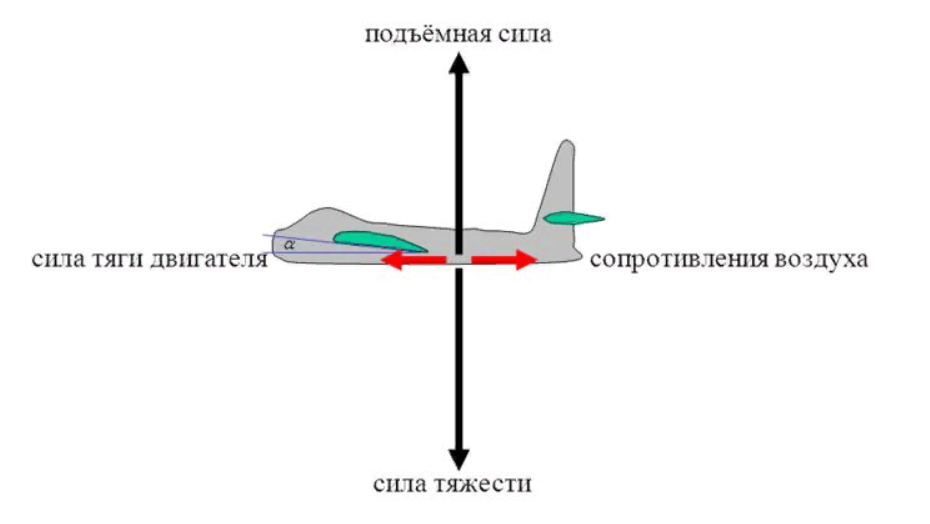
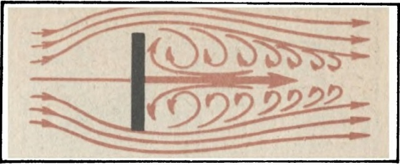
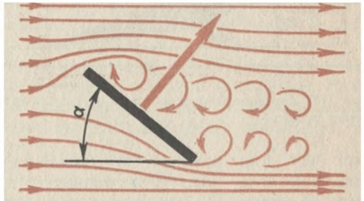
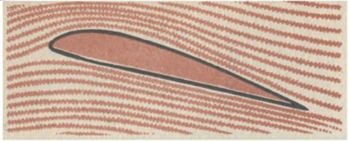
.. |image5| image:: media/image6.png
   :width: 6.06250in
   :height: 2.39583in
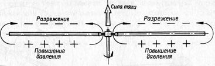
.. |image7| image:: media/image8.jpg
   :width: 5.98492in
   :height: 3.17094in
.. |image8| image:: media/image9.jpeg
   :width: 4.79167in
   :height: 3.14079in
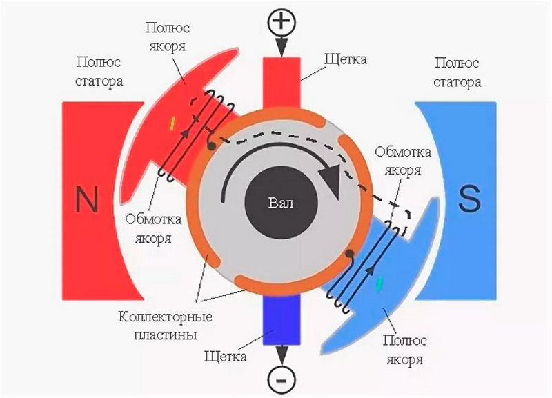
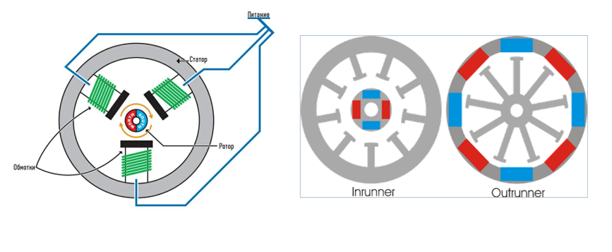
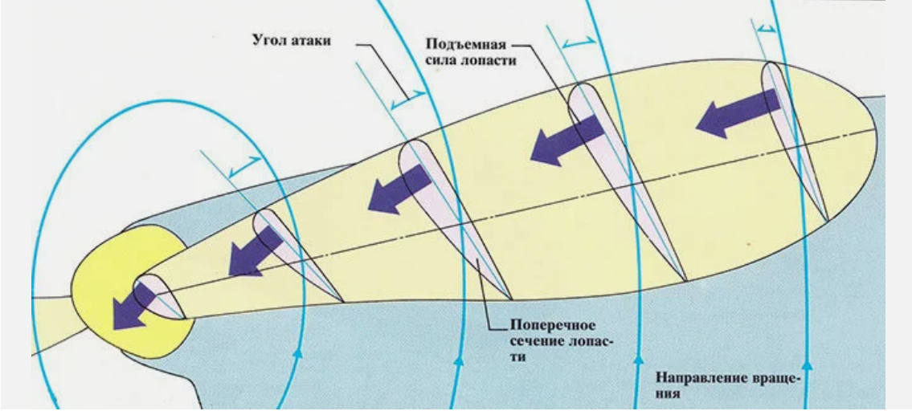
.. |image12| image:: media/image13.jpeg
   :width: 5.86774in
   :height: 2.95370in
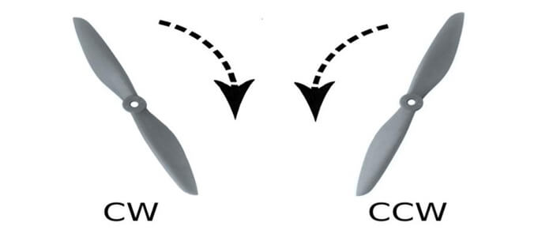
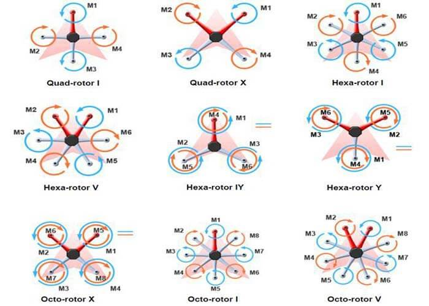
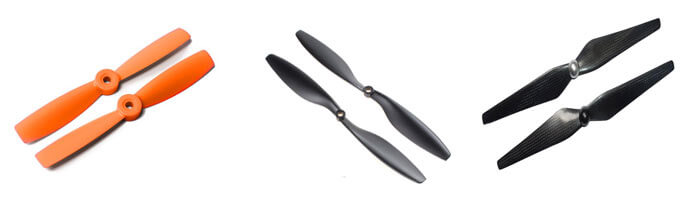
.. |image16| image:: media/image17.jpeg
   :width: 6.49653in
   :height: 4.42703in
.. |image17| image:: media/image18.gif
   :width: 1.80486in
   :height: 1.80486in
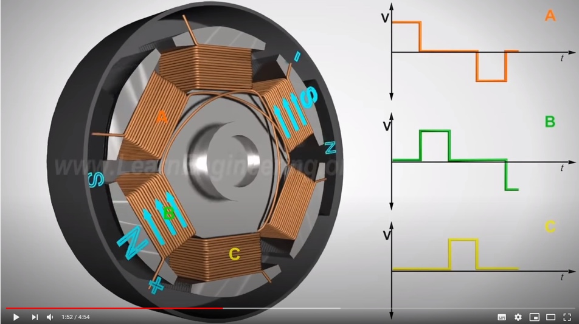
.. |image19| image:: media/image20.gif
   :width: 1.79236in
   :height: 1.79236in
.. |image20| image:: media/image21.png
   :width: 4.33889in
   :height: 2.47014in

