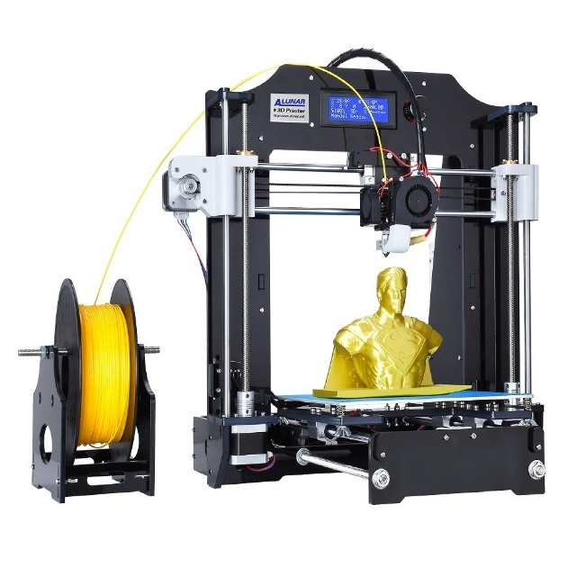
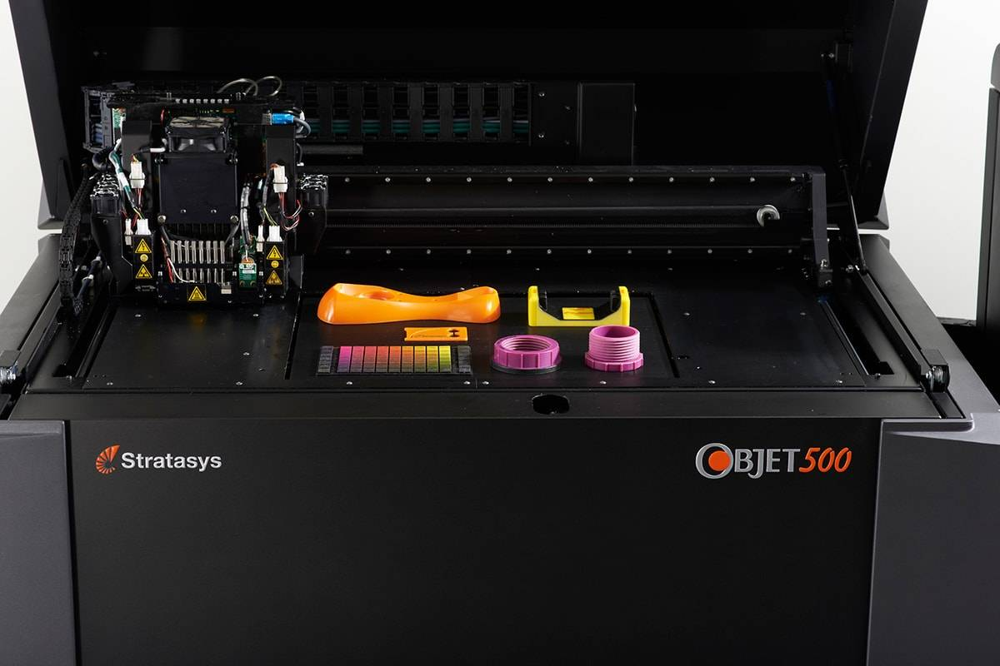
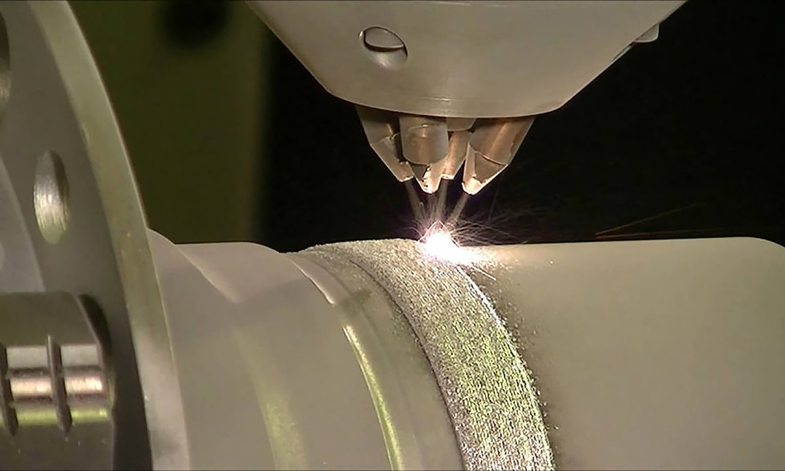
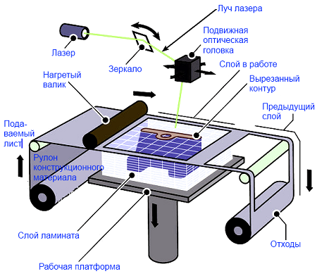
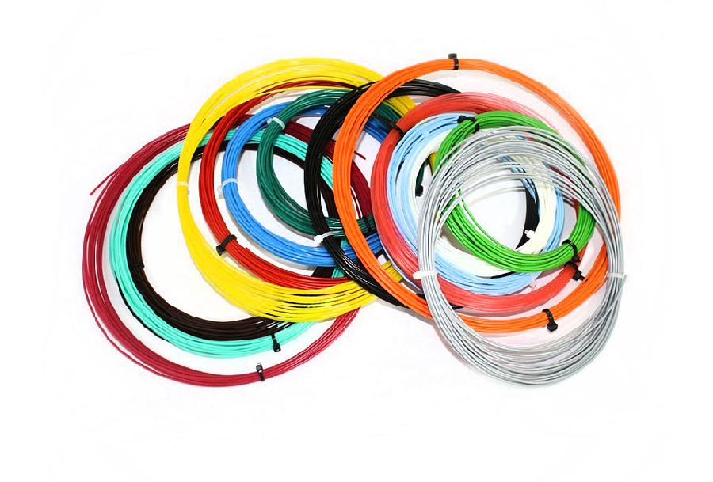
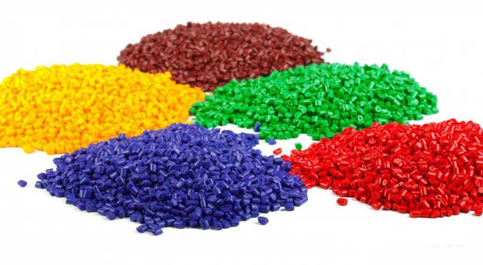
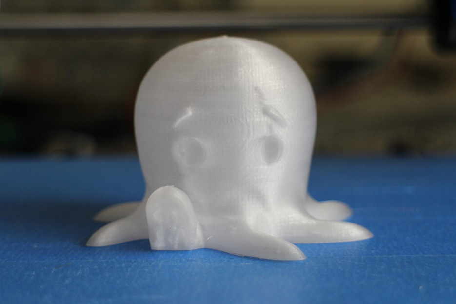
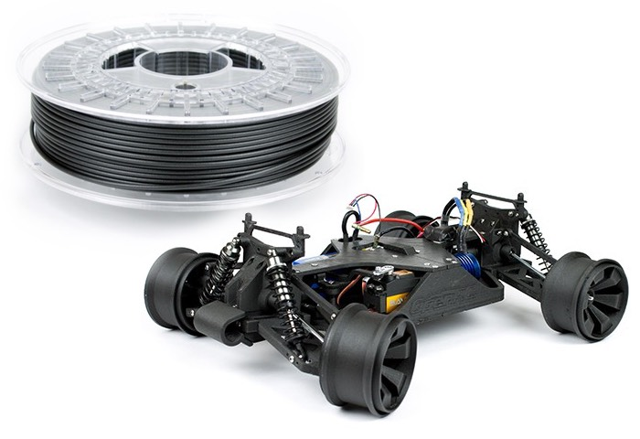
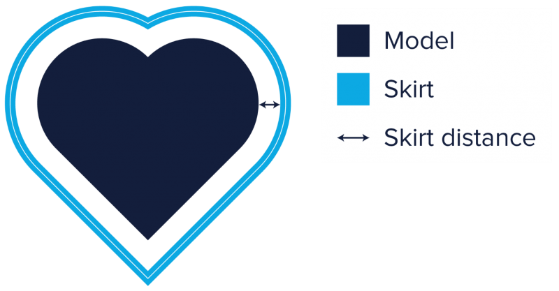
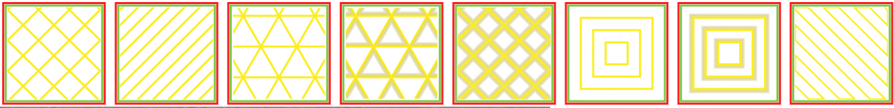

Основы технологии 3D печати
===========================

**3D принтер** — это периферийное устройство, использующее метод
послойного создания физического объекта по цифровой 3D-модели.

В современном мире существует достаточно большое количество 3D принтеров
разных фирм, имеющих разное назначение и использующих разные материалы
для печати. Поэтому, прежде чем поднимать вопрос о подготовке модели к
печати, стоит разобраться какой принтер использовать для этого, и какой
материал больше всего подойдёт для этой модели.

Виды принтеров
--------------

По технологии 3D печати принтеры можно разделить на 7 видов. Ниже
перечислим и кратко опишем каждый из видов.

FDM (fused deposition modeling) – метод послойного наплавления
~~~~~~~~~~~~~~~~~~~~~~~~~~~~~~~~~~~~~~~~~~~~~~~~~~~~~~~~~~~~~~

Данный класс принтеров выдавливают материал слой за слоем через
сопло-дозатор. Являются самыми популярными принтерами на данный момент.
Печатающая головка состоит из нагревателя (хот-энд), в котором пластик
расплавляется, а затем выдавливается через сопло с отверстием малого
диаметра, а также из подающего механизма (экструдера – колд-энд),
обеспечивающего дозированную подачу материала в нагреватель.

В качестве материала таких принтеров может использоваться не только
пластик, но и разные кулинарные ингредиенты, а в случае медицинских
принтеров даже гель с набором живых клеток.

|image0|

Рисунок * – FDM печать

Технология Polyjet
~~~~~~~~~~~~~~~~~~

Суть данной технологии лежит в выстреливании маленьких доз фотополимера
из тонких сопел, как при струйной печати, но в случае это технологии
материал полимеризуется на поверхности изготавливаемого девайса под
воздействием ультрафиолетового излучения. В отличии от стереолитографии,
о которой речь пойдет чуть позже, в Polyjet печатать можно различными
материалами.

Плюсы данной технологии: быстрая печать, т.к. жидкость можно наносить
очень быстро, толщина слоя до 16 микрон (Для сравнения клетка крови
составляет 10 микрон)

Минус данной технологии: печать возможна только с использованием
фотополимера, что достаточно узкоспециализировано из-за дороговизны и
хрупкости материала.

Применяются данные принтеры в промышленном прототипировании и медицине.

|image1|

Рисунок 2 – технология Polyjet

LENS (LASER ENGINEERED NET SHAPING)
~~~~~~~~~~~~~~~~~~~~~~~~~~~~~~~~~~~

Материал в форме порошка выдувается из сопла и попадает на
сфокусированный луч лазера. Часть порошка, которая попадает под лазер
спекается и послойно формирует трехмерную делать. Применяется данная
технология для печати стальных и титановых объектов в промышленности.

Особенностью также является возможность смешивать разных материалов,
получая сплавы.

|image2|

Рисунок 3 – LENS технология

LOM (laminated object manufacturing)
~~~~~~~~~~~~~~~~~~~~~~~~~~~~~~~~~~~~

Здесь с помощью ножа или лазера сначала нарезаются тонкие ламинированные
листы материала, а затем листы прессуются и спекаются или склеиваются в
трехмерный объект. Таким образом можно делать модели из бумаги, пластика
или алюминия. В случае алюминиевых моделей используется тонкая
алюминиевая фольга, которая вырезается по контуру слой за слоем, а затем
спекается с помощью ультразвуковой вибрации.

|image3|

Рисунок – LOM технология

SL (Stereolithography) Стереолитография
~~~~~~~~~~~~~~~~~~~~~~~~~~~~~~~~~~~~~~~

Данный вид печать достаточно специфичен из-за токсичности фотополимера,
для которого нужны специальные средства защиты и респираторы.

Как происходит печать:

Есть небольшая ванна с жидким полимером. Луч лазера путём воздействия УФ
лучей полимеризует поверхность материала. После того как один слой
готов, платформа с деталью опускается, жидкий полимер заполняет пустоты,
далее запекается следующий слой и процесс повторяется. После печати
производиться постобработка объекта путём удаления материалов поддержки
и шлифовки. Иногда для придания необходимых свойств модель может
запекаться в ультрафиолетовых духовках.

Преимущество данной технологии в быстроте и точности (до 10 микрон)
выполнения работы. Однако содержание такого принтера дома достаточно
сложное и дорогое.

|image4|

Рисунок 5 – SL технология

LS (laser sintering) Лазерное спекание
~~~~~~~~~~~~~~~~~~~~~~~~~~~~~~~~~~~~~~

Похоже на SL, но вместо жидкого полимера используется порошок, который
спекается лазером.

Плюсы:

-  Более надёжная печать, т.к. порошок выступает надёжной поддержкой

-  Порошковые материалы являются более доступными в покупке

-  Минусы:

-  Пористая поверхность

-  Некоторый порошки взрывоопасны и требуют камеры хранения, заполненной
   азотом

-  Долгое остывание деталей из-за высоких температур печати (ожидание до
   1 дня)

|image5|

Рисунок 6 – Технология лазерного спекания

3DP (three dimensional printing)
~~~~~~~~~~~~~~~~~~~~~~~~~~~~~~~~

На материал в порошковой форме наносится клей, связывающий гранулы.
Затем поверх склеенного слоя наносят свежий слой порошка и так
продолжается по кругу. На выходе модель получается по свойствам схожая с
гипсом.

Плюсы:

-  Легкий вариант печатать цветные объекты, т.к. в клей можно добавить
   краску

-  Дешево

-  Доступная в условиях офиса и дома

-  Материалом может выступать любой порошок, вплоть до съедобных.

-  Минусы:

-  Поверхность модели получается довольно грубой с невысоким разрешением
   (около 100 микрон)

-  Материал нужно подвергать постобработке в виде запекания для придания
   необходимых свойств.

|image6|

Рисунок – 3DP технология

Виды материалов для печати
--------------------------

Выбор материала печати очень важен, т.к. от этого будут зависеть
свойства модели и её качество.

Разновидностей материалов существует огромное множество от пластика до
гелей с живыми клетками. Ниже мы разберём самые популярные виды.

PLA
~~~

Самый популярный пластик для домашней печати. Этим пластиком легко
печатать, т.к. температура печати гораздо ниже, по сравнению с ABS.
Вторым плюсом этого материала является отсутствие запаха во время
печати, однако несмотря на это испарения всё же присутствуют. Третье –
это самый толерантный к окружающей среде материал, изготавливаемый из
возобновляемых ресурсов, например, кукурузы.

Основные характеристики PLA пластика для 3D печати

-  Прочность: высокая \| гибкость: низкая \| долговечность: средняя;

-  Сложность использования: низкая;

-  Температура печати: 180°C – 230°C;

-  Температура стола для печати: 20°C – 60°C (не обязательно);

-  Усадка/деформации при охлаждении: минимальная;

-  Растворим: Дихлорэтан, Хлористый метилен;

-  Экологически безопасный: зависит от производителя.

Использовать материал можно практически во всех случаях, кроме изделий,
которые должны гнуться, т.к. PLA достаточно хрупкий для этого. Также
материал не подходит для моделей, которые будут находиться в среде с
высокими температурами, т.к. при превышении 60°C модель расплавиться.

|image7|

Рисунок – Пруток PLA пластика

ABS
~~~

Занимает второе место по популярности после PLA. При печати этим
пластиком нужно поддерживать высокие температуры, т.к. пластик имеет
свойство ужиматься при охлаждении. Испарения пластика вредны для
организма, поэтому во время печати не стоит находиться близко с
принтером. Печатать обязательно в хорошо проветриваемом помещении и с
использованием подогретого стола.

Основные характеристики ABS пластика для 3D печати

-  Прочность: высокая \| гибкость: средняя \| долговечность: высокая;

-  Сложность использования: средняя;

-  Температура печати: 210°C – 250°C;

-  Температура стола для печати: 80°C – 110°C;

-  Усадка/деформации при охлаждении: терпимая;

-  Растворитель: Ацетон и его аналоги;

-  Экологически безопасный: нет.

Данный пластик более устойчив к ударам и высоким температурам. Также он
достаточно гибкий. Поэтому печать этим материалом рекомендована для
изделий, которые потом будут часто монтироваться или будут подвержены
ударам или нагревам. Как пример, из этого пластика делаются знаменитые
кубики LEGO.

|image8|

Рисунок 9 – кубики LEGO из ABS пластика

PETG (PET, PETT)
~~~~~~~~~~~~~~~~

PET (Polyethylene terephthalate) – это самый распространённый пластик в
мире, из которого сделаны почти все бутылки для напитков или контейнеры
для еды.

В печати используется его разновидность – PETG. G – это glycol-modified,
что делает материал менее хрупким и более чистым. Если сравнивать PETG с
PLA и ABS, то этот пластик будет чем-то средним между этими двумя. PETG
более пластичный и чем PLA и им легче печатать чем ABS пластиком.

У пластика есть 3 особенности:

-  PETG абсорбирует влагу из воздуха, т.е. хранить его нужно в
   прохладном и сухом месте

-  Пластик усаживаются во время печати, так что при печати первых слоев
   нужно быть особенно внимательными

-  По сравнению с ABS материал сильнее царапается

Polyethylene coTrimethylene Terephthalate (PETT) – вторая разновидность
PET. Этот материал более жесткий чем PETG, обрел популярность из-за
того, что прозрачный.

Основные характеристики PETG (PET, PETT):

-  Прочность: высокая \| гибкость: средняя \| долговечность: высокая;

-  Сложность использования: низкая;

-  Температура печати: 220°C – 250°C;

-  Температура стола для печати: 50°C – 75°C;

-  Усадка/деформация: минимальная;

-  Растворимый: Гексафторизопропанол, Дихлорэтан;

-  Экологически безопасный: зависит от производителя.

PETG достаточно универсальный материал с хорошей жесткостью и
сопротивлением высоким температурам. Благодаря этому PETG отлично
проявит себя для изготовления отдельных деталей для механизмов, машин,
того же 3D принтера. Отлично подойдет для защитных изделий и корпусов.

|image9|

Рисунок – PETG пластик

HIPS
~~~~

Данный материал совмещает в себе твердость полиэстера и эластичность
Rubber материала. В мире пластика используется для изготовления
контейнеров и упаковок, например, CD боксов.

В 3D печати данный материал выполняет роль суппорт структуры, так как во
время печати материал не может ложиться в воздухе. То есть, например,
если в принтере есть 2 экструдера, то основная модель печатается ABS
пластиком, а поддержки и заполнение отверстий производиться с помощью
HIPS. После завершения печати поддержки удаляются с помощью лимонной
кислоты или бесцветного жидкого углеводорода.

Рекомендуется парное иcпользование именно с ABS, потому что у этих
пластиков похожая твердость, жесткость и одинаковая температура печати.

Конечно, данный пластик может выступать не только в качестве суппорта
(поддержки), но и в качестве самостоятельного материала, так как он
тверже PLA и усаживается меньше, чем ABS, а также легко поддаётся
обработке и отлично впитывает краску.

|image10|

Рисунок – HIPS пластик

Другие материалы
~~~~~~~~~~~~~~~~

Конечно, существует ещё много различных подвидов пластика и материалов
для печати. Например, Glow-in-the-Dark – пластик с фосфоресцирующим
материалом, который позволяет светиться в темноте или Carbon Fiber –
пластик, смешанный с карбоном, позволяющий модели быть упругой и легкой.

Главное в выборе материала – это определиться, где будет использоваться
ваша модель, а также, безусловно, возможность принтера печатать этим
материалом, который вы выбрали.

|image11| |image12|

Рисунок – Другие виды пластика

Печать модели на 3D принтере
----------------------------

Подготовку модели для печати на принтере производят с помощью
специальных программ, которые переводят формат вашей модели в
примитивный код для принтера. Одной из таких программ является программа
Cura.

Cura 3D — слайсер для 3D-принтеров. Он разбивает трехмерную модель и на
слои, создает файл известный как Gcode, который является кодом для
печати 3D модели на 3D-принтере.

Программа переводит файлы STL, OBJ или 3MF в формат, понятный для
принтера. 3D-принтеры печатают один слой на другом, чтобы создать
3D-объект. Cura обрабатывает 3D-модель и определяет, как эти слои
разместятся на платформе для 3D печати, создавая набор инструкций для
принтера.

По мере того, как вы становитесь более опытным, вы сможете перейти к
этому коду и отрегулировать скорость вращения вентиляторов, высоту слоев
и температуру горячего конца в разных точках. Это может быть удобно,
когда вам нужно устранить некоторые проблемы с 3D-печатью.

Поскольку каждый принтер имеет свои настройки, область печати, размер
сопла, Cura передается аппаратные настройки в профиле принтера. Как
только у него появятся необходимые данные, вы можете указать такие
параметры, как высота и толщина слоя. Основываясь на основных
характеристиках принтера и ваших настройках, Cura рассчитает путь,
который должна пройти печатающая головка для печати вашей модели и
создаст Gcode.

Затем G-код можно сохранить на SD-карту или отправить на принтер по
беспроводной сети или кабелю, в зависимости от принтера, непосредственно
из Cura.

Настройка профиля принтера
~~~~~~~~~~~~~~~~~~~~~~~~~~

Некоторые принтеры поставляются с уже адаптированным ПО Cura. Это
касается принтеров Ultimaker или Lulzbot. Часто адаптированный слайсер
можно скачать прямо с сайта производителя принтеров.

При первом включении программы вам будет предложено выбрать принтер.
Если в перечисленных принтерах есть ваш, то практически все настройки
будут подогнаны под ваш принтер. Если принтера нет, нажмите «Другие»
(«Other»), может быть ваш принтер будет в списке. Если нет, выберите
«Пользователь» («Custom») и «Добавить принтер» («Add printer»).

Войдя в окно «Добавить принтер» вам нужно настроить размеры вашего
принтера. Характеристики можно узнать из инструкции к принтеру или на
сайте производителя.

После ввода нажмите «Finish». Профиль создан.

Загрузка модели
~~~~~~~~~~~~~~~

После настройки профиля можно импортировать модель. Для этого нажмите
«Файл» в верхнем меню, затем «Открыть файл». Выберете ваш файл STL, OBJ
или 3MF на вашем компьютере и Cura импортирует его.

Изменение точки обзора в Cura
~~~~~~~~~~~~~~~~~~~~~~~~~~~~~

Когда модель появляется в области сборки, она обычно выглядит слишком
маленькой или наоборот большой. Вы сможете увидеть модель под другим
углом или с другой высоты.

Навигация в области сборки Cura: удерживайте нажатой клавишу «Shift» и
щелкните левой кнопкой мыши, чтобы переместить область сборки по экрану.
Это часто полезно, если вы увеличиваете масштаб модели, чтобы
рассмотреть некоторые более мелкие детали, только чтобы обнаружить, что
детали, на которые вы хотите посмотреть, скрыты за пределами экрана
из-за масштаба.

Поворот вокруг области сборки Cura: нажмите и удерживайте правую кнопку
мыши, чтобы вращать область сборки (в Ubuntu и Mac вы можете просто
нажать левую кнопку мыши и перетащить, чтобы повернуть модель). Это
удобно для проверки 3D-модели со всех сторон.

Увеличьте область построения в слайсере Cura: используйте колесо
прокрутки мыши, чтобы увеличивать и уменьшать масштаб модели.

Просмотр 3D модели в Cura
~~~~~~~~~~~~~~~~~~~~~~~~~

В программном обеспечении Cura есть три основных способа просмотра
модели. Каждый из них полезен по-разному, особенно когда возникает
проблема с вашими отпечатками.

Твердотельный: вид по умолчанию Cura позволяет получить хорошее
представление о том, как будет выглядеть модель во время печати. Он
покажет вам размер и форму, связанные с платформой для печати. Как
правило, если все выглядит хорошо, и вы использовали ярлыки просто для
перемещения по модели, то все будет хорошо.

Рентген: эта функция отлично подходит для сложных 3d моделей и позволяет
быстро увидеть внутренние структуры вашего отпечатка. В действительности
это пригодится, если ваш отпечаток страдает от пересекающихся ребер.

Слои: делается это с помощью клавиш со стрелками. Кроме того, есть
слайдер для быстрого просмотра всех слоев, которые формируют ваш
отпечаток. По мере продвижения в Cura эта функция удобна для точного
определения слоев, где вы хотите изменить настройки G-кода, например,
увеличить скорость вращения вентилятора, высоту слоя или поток.

Перемещение, масштабирование и вращение модели в Cura
~~~~~~~~~~~~~~~~~~~~~~~~~~~~~~~~~~~~~~~~~~~~~~~~~~~~~

Иногда вам может понадобиться переместить модель вдоль области сборки
Cura, потому что вы не хотите печатать модель прямо в центре платформы
принтера. В других случаях импортированная модель может иметь
неправильную ориентацию в области сборки.

Если ваша модель нуждается в корректировке, все, что вам нужно сделать,
это нажать на модель, чтобы она была выделена, а затем выбрать один из
вариантов в инструментах слева. Здесь вы можете быстро перемещать,
вращать и масштабировать модель.

Когда вы щелкнете по любой из опций инструмента в Cura, вы увидите
стрелки вокруг модели. Просто выберите нужную окружность, чтобы изменить
направление, в котором вы хотите увидеть или расположить вашу модель.
Возможно, вы захотите напечатать более одной модели. Выбрав модель,
щелкните правой кнопкой мыши и выберите дубликат. Cura автоматически
создаст еще одну модель. Если достаточно места для печати двух или
более, все модели на платформе будут желтыми. Если места недостаточно,
то модель вне области печати будет затенена серым цветом.

Панель настроек Cura
~~~~~~~~~~~~~~~~~~~~

Возможно, самая важная часть Cura — это панель настроек справа. Вам
нужно выбрать правильные настройки в этой панели, чтобы получить
желаемое качество печати. Панель настроек Cura разделена на две части.
Самый верхний раздел — это настройки принтера, а следующий раздел
называется настройкой печати.

Принтер: это принтер, который вы выбрали в первом шаге. Если у вас
несколько принтеров, их можно настроить, а затем выбрать из этого
выпадающего меню. Материал: быстро выберите материал, который использует
ваш принтер. Этот параметр используется для принтеров, которые привязаны
к аппарату и не будут отображаться, если на вашем аппарате нет этой
функции.

Есть 2 вида настроек печати: **рекомендуемые и пользовательские**.

Рекомендуемый: рекомендуемые параметры печати рассчитываются на основе
параметров, введенных вами при первоначальной настройке слайсера Cura
для вашего принтера. Этот вариант является отличным выбором, когда вы
только начинаете или просто хотите посмотреть, как программное
обеспечение взаимодействует с 3D принтером. Параметры ограничены
заголовком «Рекомендуемые», но вы можете быстро настроить качество,
заполнение, адгезию платформы и поддержки.

-  Printer (Принтер). Убедитесь, что выбран ваш 3D принтер.

-  Material (Материал). Убедитесь, что указан актуальным материал для 3D
   печати.

-  Profile (Профиль). Выберите качество 3D печати.

-  Infill (Наполнение). Hollow (Пустотелая) - печать пройдет максимально
   быстро, но внутри модель не будет заполняться материалом. Solid
   (Полное наполнение) - модель будет с максимальной жесткостью из-за
   полного наполнения, но печать займет много времени и материала. Для
   начала лучше использовать самую универсальную настройку Light (Слабое
   наполнение).

-  Helper Parts (Вспомогательные детали). Это настройки материала
   поддержки и адгезии. Если вы печатаете в первый раз, лучше
   активировать обе опции. Если площадь контакта вашей модели со столом
   для печати большая, то можно отключить опцию Print Build Paste
   Adhesion. Если в модели нет резких смен углов и своеобразных
   "навесов" (например, расставленные в стороны под 90 градусов руки в
   модели человека), то можете отключить опцию Print Support Structure.

Пользовательский: именно здесь начинается самое интересное, и вы сможете
настроить параметры печати — от качества до скорости.

Генерация G-кода
~~~~~~~~~~~~~~~~

На данном этапе ваша модель готова к 3D печати и все, что вам осталось -
экспортировать файл из Cura 3D на SD карту или отправить ее напрямую на
ваш 3D принтер. Cura 3D проведет все необходимые операции для
конвертирования STL или OBJ файла в G-код, который поймет ваш 3D
принтер.

-  Сохраните файл 3D модели. В Cura нажмите Save to file, Save to
   SD или Send to Printer.

-  Оцените время 3D печати. Cura 3D предоставит вам предварительную
   оценку времени, которое понадобится для печати вашей модели.

-  Начните 3D печать. Если вы передали G-код напрямую, сядьте и
   расслабьтесь, пока ваш принтер будет печатать. Если вы используете SD
   карту, установите ее в 3D принтер и запустите печать.

Пользовательские настройки
~~~~~~~~~~~~~~~~~~~~~~~~~~

Использование \ **Simple (Рекомендуемых)** настроек — это только начало.
Со временем вам захочется реализовать более гибкие настройки. Эти
настройки вы можете найти во **вкладке Advanced (Расширенные)**. Мы
рассмотрим их ниже.

В панели настройки печати справа выберите \ **Advanced (Custom).**

-  **Quality (Качество).** Это связано с \ **Layer Height (Высота
   слоя).** Эта настройка зависит от возможностей вашего 3D принтера.
   Чем меньше высота слоя, тем лучше качество, а увеличение высоты слоя
   повысит скорость печати. По умолчанию высота слоя установлена на 0.1
   мм для Ultimaker 2 Extended. На картинке вы можете увидеть разницу в
   толщине слоёв печати.

|image13|

Рисунок – Сравнение толщины слоя печати

-  **Shell (Стенки)**. Этот параметр отвечает за толщину стенок вашей
   модели, а также за толщину нижнего и верхнего слоев. Этот параметр
   должен быть пропорциональным (1x, 2x, 3x и т.п.) диаметру сопла.
   Например, толщина стенки 0.8, если вы печатаете на 3D принтере
   Ultimaker 2 будет означать, что стенка будет состоять из двух линий,
   так как у этой модели диаметр сопла 0.4 мм.

-  **Speed (Скорость).** Если сказать в общем, то чем меньше скорость,
   тем качественнее 3D печать.

-  **Cooling (Охлаждение).** Важная составляющая любого 3D принтера и
   однозначно надо это опцию активировать. Как правило, кулеры работают
   не на полную мощность до окончания 5-го слоя.

-  **Support (Материал поддержки).** Дает возможность добавлять
   суппорт-структуры.

-  **Build Plate Adhesion (Адгезия стола для печати).** Не у всех
   моделей достаточная площадь основания для хорошего контакта со столом
   для печати. Если так, то эта настройка поможет вам обеспечить
   качественный контакт с основанием.

-  **Special Modes (Специальные режимы).** Если вы печатаете больше
   одной модели, эта опция позволит вам указать, что они будут
   печататься одна за одной.

Настройки качества 3D печати
~~~~~~~~~~~~~~~~~~~~~~~~~~~~

-  **Quality (Качество).** У каждого 3D принтера есть максимальная и
   минимальная высота слоя материала. В этом окне вы можете указать
   желаемую высоту слоя. 0.02 мм — это высокое качество и медленная
   скорость 3D печати, а 0.6 мм - наоборот, низкое качество и большая
   скорость печати.

-  **Shell (Стенки).** Выбор толщины стенок. Большая толщина стенок
   позволит напечатать более жесткую модель с более качественной
   поверхностью. Если используется сопло диаметром 0.4 мм, то толщину
   стенок надо выставлять пропорционально: 0.4, 0.8, 1.2 мм и т.п.

-  **Top/Bottom Thickness (Верхняя/Нижняя Толщина).** Как правило,
   выставляется пропорционально размеру сопла. Одна из рекомендуемых
   практик - начинать с двойного размера диаметра сопла.

Настройки материала
~~~~~~~~~~~~~~~~~~~

-  **Material (Материал).** У каждого материала для 3D печати свои
   характеристики. В большинстве случаев возможность использовать тот
   или иной материал определяется конструктивными узлами 3D принтера, а
   не софтом. Так что эта настройка вам вряд ли пригодится.

-  **Enable Retraction (Включить подачу в обратном направлении).**
   Рекомендуется всегда включать эту опцию. Благодаря ей материал
   подается в обратном направлении во время холостых перемещений
   экструдера.

Настройки скорости
~~~~~~~~~~~~~~~~~~

-  **Print Speed (Скорость печати).** Это общая скорость 3D печати во
   время непосредственной подачи материала. Если обобщить, то чем меньше
   скорость, тем качественнее печать. Рекомендуемая скорость 3D печати
   составляет 60 мм/с. Если вы хотите увеличить эту скорость, то
   рекомендуется одновременно увеличить и температуру **печати (Printing
   Temperature).**

-  **Travel Speed (Скорость холостых перемещений).** Это скорость, с
   которой перемещается печатающая головка, когда материал не подается.
   На Ultimaker 2 эта скорость по умолчанию устанавливается на 120 мм/с.
   Эту скорость рекомендуется выставлять в зависимости в скорости
   непосредственной печати. А если быть точнее, то в 2 раза больше. В
   таком случае ускорения и торможения будут происходить достаточно
   плавно, чтобы обеспечить качественную и при этом быструю печать.

Ниже представлен пример сопоставления разных скоростей печати модели.

|image14|

Рисунок – Сравнение скорости печати

Настройки наполнения
~~~~~~~~~~~~~~~~~~~~

**Infill Density (Интенсивность наполнения).** Это количество материала,
которое подается для внутренней части модели. Чем выше наполнение, тем
больше жесткость модели. Как правило, этот параметр ставят на 20%.

Настройки охлаждения
~~~~~~~~~~~~~~~~~~~~

**Enable Fan Cooling (Включить охлаждение кулерами).** Отключать эту
опцию не рекомендуется. Как правило, какой бы материал вы не
использовали, для качественной 3D печати необходимо охлаждение.

Настройки материала поддержки
~~~~~~~~~~~~~~~~~~~~~~~~~~~~~

-  Опцию \ **Enable Support (Активировать материал поддержки)** лучше не
   отключать, если вы не уверены на 100%, что у вас нет узлов с резкой
   сменой углов.

-  Опция \ **Placement (Расположение) **\ дает возможность выбрать, где
   именно суппорта будут расположены: \ **Touching Build Plate (Касается
   стола для печати) означает**, что суппорта буду расположены только на
   столе для печати. \ **Everywhere (Везде)** означает, что суппорт
   структуры могут базироваться и на детали.

Настройки адгезии стола
~~~~~~~~~~~~~~~~~~~~~~~

Одна из самых распространенных проблем 3D печати - когда модель
отлепляется от стола для печати. \ **Build Plate Adhesion (Адгезия
(сцепляемость) стола для печати)** — это как раз те настройки, которые
помогают улучшить контакт модели и стола. Существует три варианта для
улучшения контакта - **Skirt**, \ **Brim** или **Raft**.

**Skirt — это** настройка, которую лучше использовать всегда. Это линия
вокруг 3D модели во время печати первого слоя, которая помогает
прочистить сопло во время начала 3D печати.

**Brim —** это несколько дополнительных линий (обрамление), которые
печатаются перед первым слоем модели и обеспечивают лучшую сцепляемость
нижнего слоя модели и стола.

**Raft —** сетка (подложка) под первым слоем 3D модели, благодаря
которой значительно улучшается контакт модели и стола.

|image15|

Рисунок – Настройка Skirt

Шаблоны заполнения — влияет на прочность модели, расход материала и
время печати

По умолчанию, слайсер Cura печатает заполнение в виде сетки, печатая в
одном диагональном направлении. Это обеспечивает разумную прочность, не
расходуя слишком много материала. Это также один из самых быстрых
шаблонов с точки зрения времени печати. Стандартный шаблон заполнения
Cura должен подойти для большинства распространенных применений. Однако,
в некоторых специальных приложениях шаблон по умолчанию может быть не
самым лучшим. В таких случаях Cura предлагает широкий выбор шаблонов
заполнения.

|image16|

Рисунок – Шаблоны заполнения при печати

Доступно больше шаблонов заполнения, чем показано на рисунке. Чтобы
изменить шаблон заполнения Cura, включите скрытый параметр «Шаблон
заполнения», и он появится в разделе «Заполнение». У вас есть выбор из
13 различных моделей. Некоторые из важных моделей:

Сетка: заполнение в форме сетки, с линиями в обоих диагональных
направлениях на каждом слое

Линии: создаёт заполнение в форме сетки, печатая в одном диагональном
направлении

Треугольники: создает треугольный узор заполнения.

Куб: 3D-заполнение наклонных кубов.

Тетраэдр: трехмерное заполнение фигур пирамиды.

Концентрический: заполнение печатается снаружи по направлению к центру
модели. Таким образом, линии заполнения не будут видны через стены
отпечатка.

Концентрическое 3D: заполнение печатается снаружи по направлению к
центру модели с наклоном по всему отпечатку.

Zig Zag: заполнение в виде сетки, непрерывно печатаемое в одном
диагональном направлении.

Основные факторы, которые необходимо учитывать при выборе шаблона
заполнения в слайсере Cura:

-  Будет ли деталь использоваться под нагрузками?

-  Модель имеет большую поверхность?

Если деталь будет использоваться не в качестве механической части, а
скорее в эстетических целях, то вам, возможно, удастся не заполнять ее
вообще. Однако, если та же 3D-модель имеет большую внутреннюю полость,
то для поверхности потребуется некоторые поддержки для печати. В таких
случаях ваш лучший тип заполнения — концентрический. Будет
использоваться минимальное кол-во материала и самая быстрая печать. В то
же время он обеспечивает достаточную поддержку верхних стенок. Если вы
хотите, чтобы модель имела разумную прочность, даже если вы не
собираетесь использовать ее в механических целях, тогда лучше всего
выбрать 2D-модель, такую как Сетка, Линии или Треугольники. Линии
обеспечивают наименьшую прочность, но не потребляют много материала и
быстро печатают. Сетка потребляет больше материала, медленнее, но
обеспечивает большую прочность. Треугольники предлагают большую
прочность и высокие боковые нагрузки. Используйте этот заполнитель,
когда вам нужна прочность стенок или более длинные, тонкие конструкции.
Если модель будет использоваться под нагрузками, лучшим вариантом будет
использование трехмерного шаблона заполнения, например, кубического или
тетраэдрического. С этими узорами в Cura вы получите отличные внутренние
поддержки и почти изотропные механические свойства.

Каждая из перечисленных настроек имеет дополнительные опции, которые
позволят более гибко настроить качество контакта 3D модели и стола для
печати.

.. |image4| image:: media/image5.jpeg
   :width: 4.71667in
   :height: 2.71303in
.. |image5| image:: media/image6.png
   :width: 6.49653in
   :height: 3.41284in
.. |image6| image:: media/image7.jpeg
   :width: 6.49653in
   :height: 4.07531in

.. |image10| image:: media/image11.jpeg
   :width: 4.45833in
   :height: 2.64825in
.. |image11| image:: media/image12.png
   :width: 2.94093in
   :height: 2.30208in

.. |image13| image:: media/image14.jpeg
   :width: 5.67055in
   :height: 3.54410in
.. |image14| image:: media/image15.png
   :width: 6.57951in
   :height: 4.56667in

