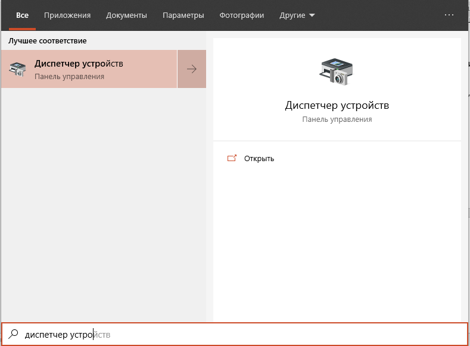
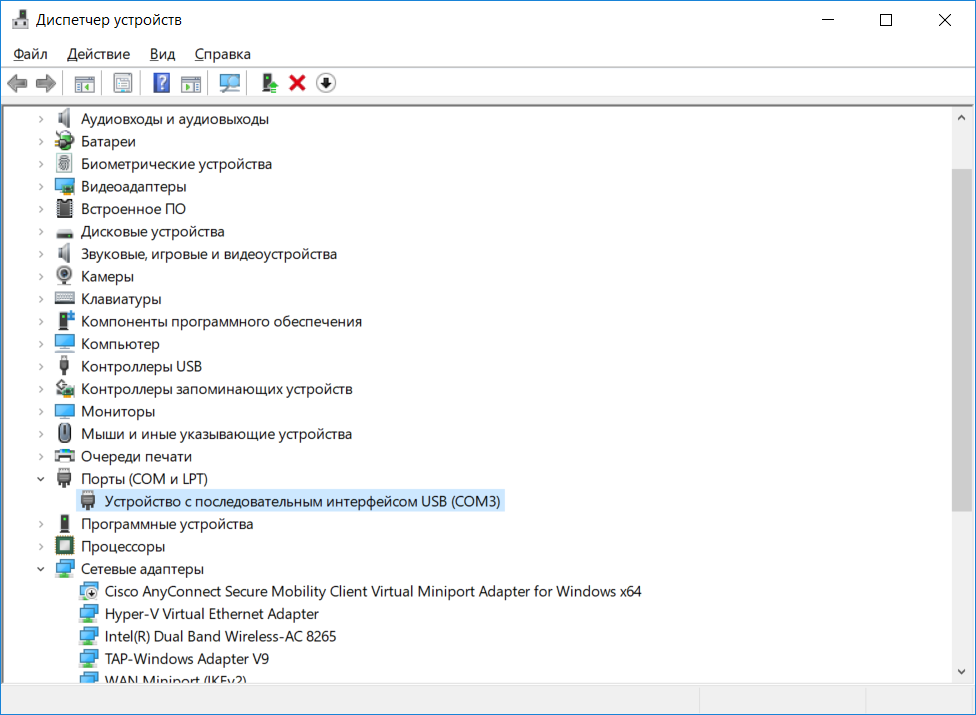
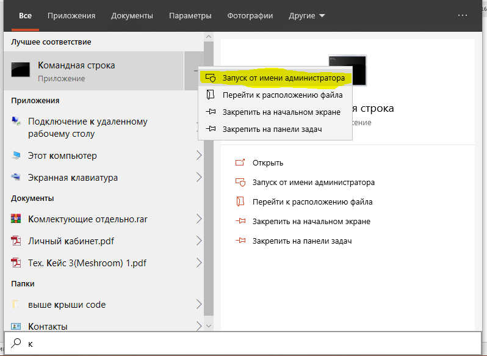
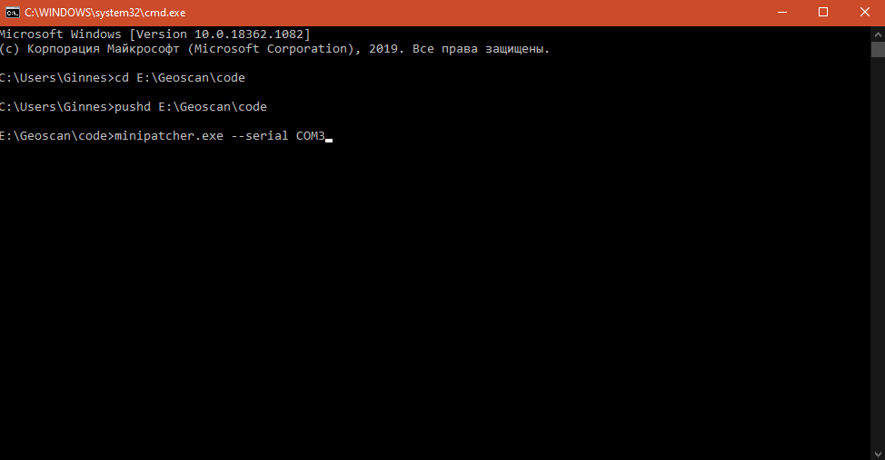
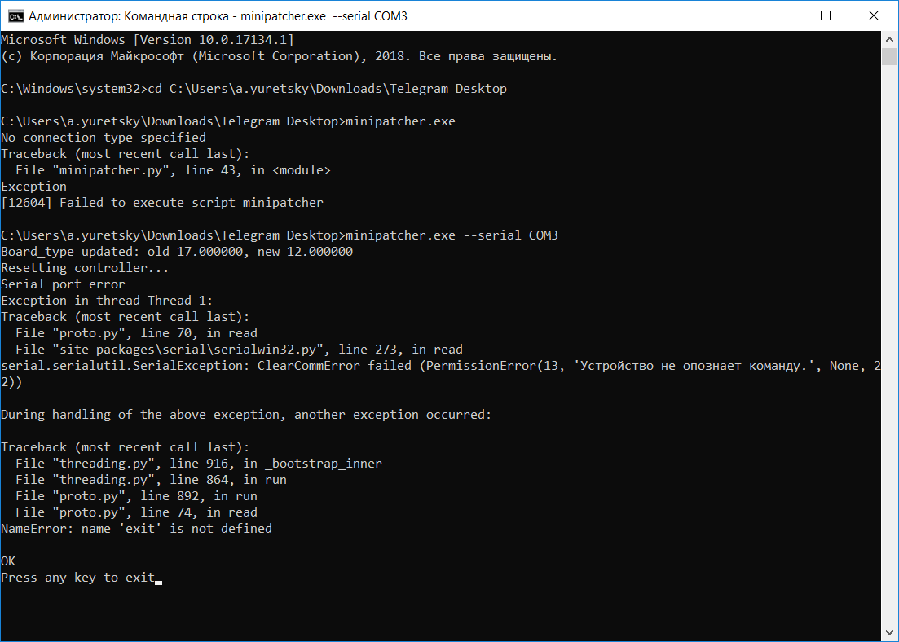

Обновление параметров подключения для квадрокоптера Пионер Мини.
================================================================

Описание проблемы
-----------------

Не удается осуществить подключение **"Пионер мини"** к программе **Pioneer Station**.

При нажатии на кнопку «Подключение» - «По кабелю USB»

|image0|

Появляется следующее сообщение:

|image1|

Причина возникновения проблемы
------------------------------

Проблема возникает из-за неверно установленного при заводской настройке
параметра идентификатора устройства.

Метод решения
-------------

Для изменения идентификатора устройства необходимо выполнить следующие
действия:

1. Сохранить утилиту **«minipatcher.exe»** на жесткий диск ПК (ноутбука)

:download:`minipatcher.exe <FAQ/minipatcher.exe>`

2. Подключить Пионер мини к ПК (ноутбуку) по кабелю USB, включить
   квадрокоптер.

3. Определить в **“Диспетчере устройств”** Windows номер **СОМ порта**,
   к которому подключен **Пионер Мини.** В данном примере COM3.

|image2|

|image3|

1. Запустить командную строку от имени администратора (правая кнопка
   мыши по иконке утилиты)

|image4|

5. Перейти в директорию, куда была сохранена утилита. Введите команду

\ ***pushd C:\\Название директории***

Название директории — это путь куда вы сохранили утилиту
**«minipatcher.exe».** Например, **E:\\Geoscan\\code**

6. Запустить утилиту. Введите команду, где вместо хх указать номер СОМ
порта в системе

***minipatcher.exe --serial COMxx***

*Где xx номер COM порта*

|image5|

Результат выполнения утилиты показан на рисунке ниже:

|image6|

Если порт был указан верно, то утилита обновит значение параметра и
выполнит перезагрузку **Пионера Мини**. Подключение к **Pioneer
Station** станет снова возможно.

