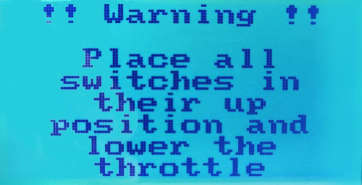
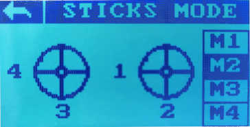

Проверка пульта радиоуправления при проблемах с включением.
===========================================================

Описание проблем
----------------

Пульт ДУ после включения не пускает в основное меню, либо нет реакции при нажатии(движении) по экрану.
После включения появляется следующее сообщение:

|image1|

Причина возникновения проблем
-----------------------------

Проблема возникает из-за встроенной в аппаратуру защиты от неправильного положения стиков и тумблеров на момент включения.

Методы решения
~~~~~~~~~~~~~~

1. Переведите все тумблеры в положение «от себя» (крайнее верхнее положение)

2. Левый стик переведите в нижнее положение, правый - в центральное.

После проделанных операций пульт управления должен отобразить основной дисплей. Если этого не произошло, и на экране продолжает отображаться предупреждение попробуйте инвертировать действия из пункта 2. Левый стик раположить в центре, а правый - опустить в нижнее положение.

Если пульт так и не проходит проверку на положение стиков, пожалуйста, выполните следующие действия:

1.  Включите пульт предварительно удерживая левый и правый стики в нижнем левом положении. Пульт запустится в инженерном режиме.

|image2|

2. Выберите опцию KEY TEST после чего, необходимо перевести все тумблеры (SwA, SwB, SwC, SwD,) в крайние положения и нажать кнопки (Key1 и Key2), расположенные на тыльной стороне радиоаппаратуры. Название исправных переключателей будет выделяться на экране. В случае, если есть тумблеры которые не проходят проверку - обратитесь в техподдержку.

|image3|

3. Выберите опцию STICK MODE. В столбце справа установите M2.

|image4|

.. |image2| image:: media/rc_test/factory.jpg
.. |image3| image:: media/rc_test/key_test.jpg
