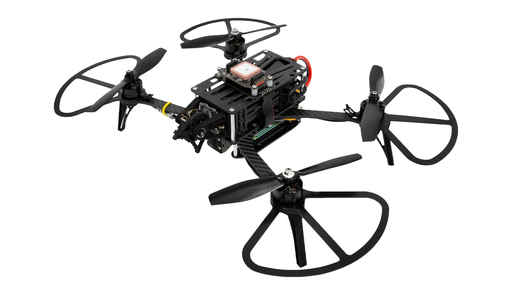

.. """Пионер""" documentation master file, created by
   sphinx-quickstart on Mon Sep 10 13:58:08 2018.
   You can adapt this file completely to your liking, but it should at least
   contain the root `toctree` directive.

.. _Вернуться на сайт "Пионер": https://www.geoscan.aero/ru/pioneer/

.. _Пионер стандарт: instructions/pioneer-standart/main-standart.html

.. _Пионер Мини: instructions/pioneer-mini/main-mini.html

.. _Пионер Макс: instructions/pioneer-max/main-max.html

.. _"Программирование": programming/programming.html

.. _"Инструкции": instructions/main_instruction.html

.. _"модулях": module/module_main.html

.. _"Базу данных": database/main-database.html

.. _"Проекты на Пионере": learning-cases/main-cases.html

.. _"FAQ": FAQ.html

.. |pioneer| image:: _static/images/pioneer.png
   :width: 250

.. |pioneermini| image:: _static/images/pioneermini.png
   :width: 250

.. raw:: html

    

Документация Геоскан "Пионер"
=================================

.. raw:: html

    

        
 
 Геоскан "Пионер" - это линейка многофункциональных образовательных квадрокоптеров. Их можно использовать как учебную платформу в школе, авиамодельной секции, кружке робототехники или дома. 
 

        

            
 Каждый квадрокоптер представляет собой набор для создания и программирования беспилотных летательных аппаратов, который позволит ученикам школ, авиамодельных секций и кружков робототехники освоить полезные навыки и узнать о современных профессиях. 

            
 С помощью набора Геоскан Пионер Вы сможете интегрировать последние технические достижения в учебный процесс. 

        

        

            
 С "Пионером" вы сможете: 

            <ul>
                <li> изучить основы робототехники и авионики; </li>
                <li> узнать, как устроен квадрокоптер; </li>
                <li> научиться управлять им; </li>
                <li> адаптировать платформу под разные задачи; </li>
                <li> освоить азы программирования. </li>
            </ul>
        

    

.. raw:: html

    

        

            

                <a href="./instructions/pioneer-standart/main-standart.html">
                    
  

                    
 
Пионер Базовый
 

                </a>
            

            

                <a href="./instructions/pioneer-mini/main-mini.html">
                    
  

                    
 
Пионер Мини
 

                </a>
            

            

                <a href="./instructions/pioneer-max/main-max.html">
                    
  

                    
 
Пионер Макс
 

                </a>
            

        

    

.. tile::
    :icon: _static/images/instructions.png
    :head: Инструкции по эксплуатации
    :caption: Соберите и настройте квадрокоптер для первого полета!

    В данном разделе вы найдете основную информацию для первой сборки и настройки квадрокоптера для первого полёта.

    На данный момент в линейке представлено три модели:

    * Пионер мини
    * Пионер стандарт
    * Пионер макс

    .. toctree::
        :maxdepth: 2
        :caption: Содержание:

        instructions/main_instruction

.. tile::
    :icon: _static/images/modules.png
    :head: Дополнительные модули
    :caption: Расширьте возможности своих летательных аппаратов!

    Для подключения используются разъёмы Х1 и Х2 на верхней части платы. Большинство модулей монтируются на плате подключения дополнительных модулей и соединяются с базовой платой шлейфами. Модули GPS и навигации в помещении крепятся напрямую на базовую плату «Пионера».

    .. figure:: _static/images/p_base.png
        :alt: ../_images/p_base.png

    .. toctree::
        :maxdepth: 2
        :caption: Больше о каждом из модулей вы можете узнать на посвященной ему странице:

        module/module_main

.. tile::
    :icon: _static/images/code.png
    :head: Программное обеспечение
    :caption: Научитесь программировать ваш квадрокоптер!

    Кроме полета на дистанционном управлении, «Пионер» может следовать заложенной перед взлетом программе и автономно выполнять прописанные задачи.

    Для удобства программирования квадрокоптер поддерживает работу с такими инструментами как Pioneer Station и TRIK Studio, которые позволяют сформировать полетное задание и загрузить его в память «Пионера» при подключении к компьютеру.

    В этом разделе вы научитесь работать с квадрокоптером через интерфейс Pioneer Station, рассмотрите примеры полетных сценариев и узнаете как программировать подключаемые модули.

    .. toctree::
        :maxdepth: 2
        :caption: Содержание:

        programming/programming

.. tile::
    :icon: _static/images/books.png
    :head: База знаний (Теория)
    :caption: Узнайте много интересной информации о БПЛА!

    В данном разделе вы сможете найти информацию связанную со сферой автономных летательных аппаратов. Информацию в данном разделе можно использовать при разработке собственных образовательных программ.

    .. toctree::
        :maxdepth: 2
        :caption: Содержание:

        database/main-database

.. tile::
    :icon: _static/images/cloud.png
    :head: Загрузки
    :caption: Скачайте необходимые прошивки и ПО!

    В данном разделе вы найдете полезные файлы которые смогут вам помочь при работе с квадрокоптерами линейки «Пионер».

    Данный раздел содержит следующие подразделы:

    * **Software** - подраздел в котором вы сможете найти прошивки автопилота, параметры автопилота, тестовые Lua-скрипты, версии НСУ Pioneer Station.
    * **Hardware** - подраздел в котором хранятся файлы по связанные с аппаратной частью, здесь содержатся: 3d модели, «распиновки» разъемов.
    * **Методики и инструкции** - содержит наши образовательные методические материалы, а также сторонние инструкции от других производителей.

    .. toctree::
        :maxdepth: 2
        :caption: Содержание

        downloads/download-main

.. tile::
    :icon: _static/images/drone.png
    :head: Методики и кейсы
    :caption: Учитесь и повторите классные проекты от сообщества!

    В данном разделе документации, вы найдете различные примеры проектов созданные на базе квадрокоптеров «Пионер». А также методические указания для организации учебного процесса.

    .. toctree::
        :maxdepth: 3
        :caption: Содержание:

        learning-cases/main-cases

`Вернуться на сайт "Пионер"`_

.. toctree::
    :hidden:
    :maxdepth: 2
    :caption: Содержание:

    instructions/main_instruction
    module/module_main
    programming/programming
    database/main-database
    downloads/download-main
    learning-cases/main-cases
    FAQ
    changelog
