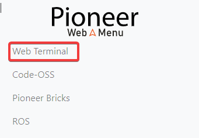
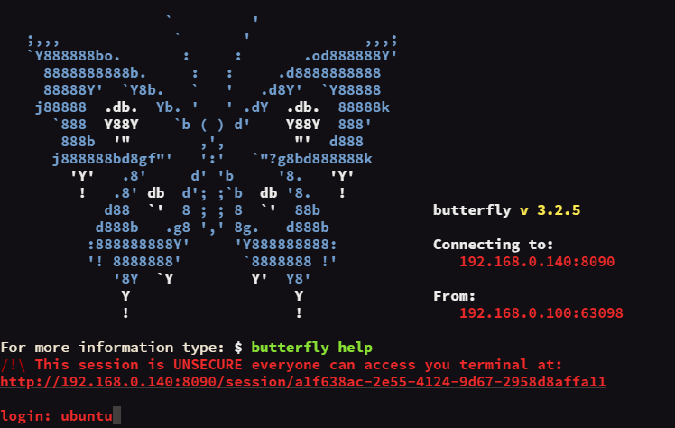
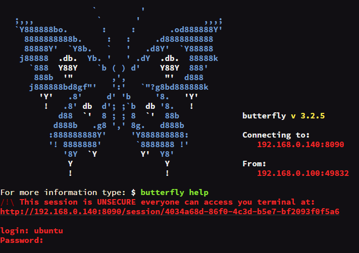

Butterfly Web Terminal
========================

Веб-терминал Butterfly представляет собой полный аналог ssh-подключения с терминала компьютера в браузере на любом устройстве.

Как пользоваться?
------------------

Открыть Butterfly можно с помощью кнопки в Web Menu

Также можно открыть Butterfly введя в адресную строку браузера <ip коптера>:8090

.. hint:: IP по умолчанию `10.0.0.31 <http://10.0.0.31:8090/>`_  

В окне браузера откроется терминал, дождитесь загрузки и после слова "login:" введите имя пользователя.
По умолчанию **ubuntu**

Далее нажмите Enter, введите системный пароль, и снова нажмите Enter.
По умолчанию **geoscan123**

.. attention:: Пароль не будет отображаться при вводе. Если вы ввели неправильный пароль, перезагрузите страницу в браузере и проделайте авторизацию ещё раз.

Если введённые данные верны, то на экране появится зелёная строка с именем пользователя и мигающий индикатор курсора.

Теперь можно пользоваться веб-терминалом Butterfly как обычной командной строкой

:doc:`terminal_basics` 
