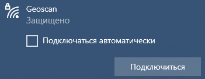

Первый запуск
=============

.. important:: Перед началом, убедитесь, что SD-карта с образом вставлена в Raspberry Pi.

1. Подсоедините аккумулятор к Пионер Макс
2. Дождитесь загрузки Raspberry Pi (около 20 секунд) 
3. Подключитесь к Wi-Fi сети "Geoscan" со своего устройства (пароль по умолчанию: geoscan123)
   
.. написать какие лампочки мигают в пункте 2

Теперь вы можете пользоваться Пионер Макс с помощью:
   * `WebMenu (инструменты управления Пионер Макс) <web_menu.html>`_
   * `SSH (работа с командной строкой) <ssh.html>`_

