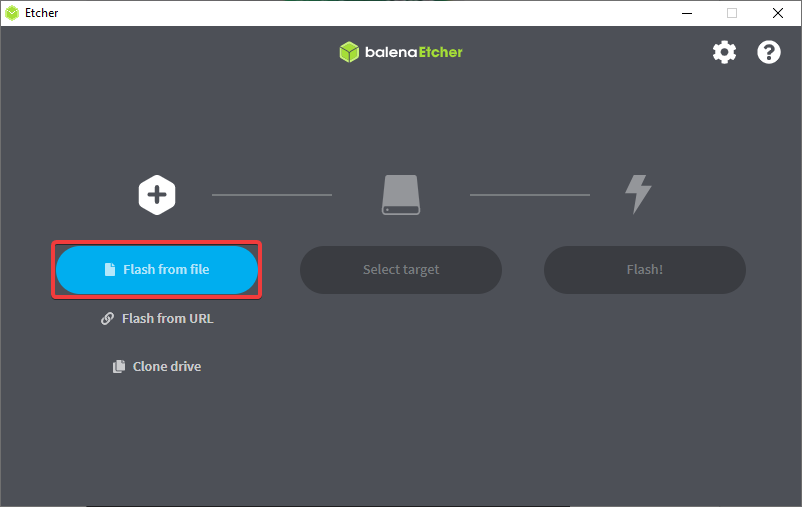

Установка образа
================

Для полноценной работы с "Пионер Макс" необходимо установить образ для Raspberry Pi
на sd-карту, идущую в комплекте с квадрокоптером.

Состав последнего образа 2.1.2.1:
    * Ubuntu 20.04
    * ROS Noetic Ninjemys bare-bones
    * Python 3.8
    * TensorFlow Lite Runtime
    * OpenCv
    * Flask
    * PyzBar
    * AprilTag

.. important:: Для установки образа потребует sd-карта размером не менее 16 гб.

1. Скачайте актуальную версию `образа <https://github.com/geoscan/geoscan_pioneer_max/tree/master/builds>`_
2. Скачайте `balenaEtcher <https://www.balena.io/etcher/>`_
3. Вставьте SD-карту в ваш компьютер
4. Запустите balenaEtcher
5. В появившемся окне нажмите "Flash from file"
   

6. Выберите скачанный файл образа
7. Нажмите "Select Target" и выберите вашу SD-карту
   
.. figure:: ../const/media/install_image/balena2.png
   :alt: Похоже, картинка не загрузилась :c 
   :align: center
   :scale: 65%

1. Нажмите "Flash!", чтобы начать запись образа на карту
   
.. figure:: ../const/media/install_image/balena3.png
   :alt: Похоже, картинка не загрузилась :c 
   :align: center
   :scale: 65%

1.  Дождитесь завершения установки 
    
2.  Извлеките SD-карту из компьютера и вставьте её в Raspberry Pi
    
.. figure:: ../const/media/install_image/sdcard_rpi.jpg
   :alt: Похоже, картинка не загрузилась :c 
   :align: center
   :scale: 25%

:doc:`./first_launch` 
