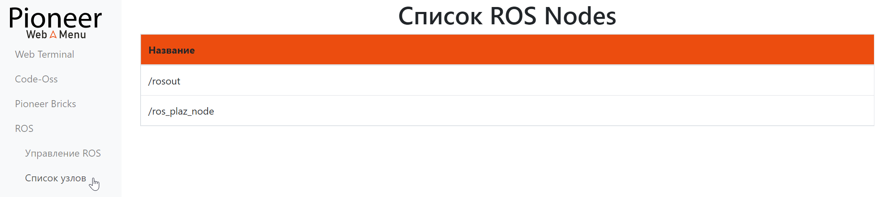
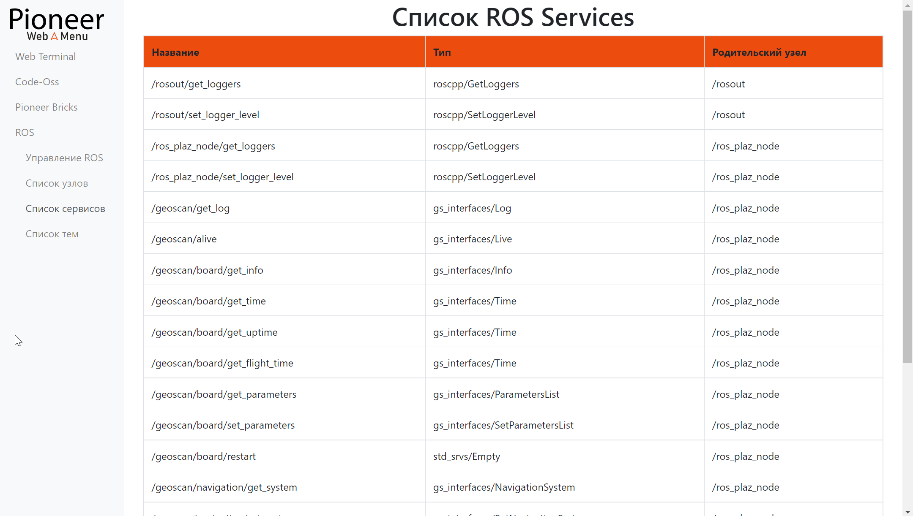

ROS-система в WebMenu
=======
.. ссылку на что такое рос система
Пункт ROS в WebMenu отвечает за управление ROS-системой.

.. contents::
    :local:

Управление ROS
~~~~~~~~~~~~~~~~~~~~~~~~~~

.. image:: ../const/media/web_menu/ros-menu-control.png
    :alt: Похоже, картинка не загрузилась :c 
    :align: center

* Кнопка **Включить ядро ROS** аналогична команде **roscore** в терминале
        *Запускает только ядро ROS и ничего больше*
* Кнопка **Включить ROS систему** аналогична команде **rospioneer start** в терминале 
        *Запускает ROS систему (ядро ROS + необходимые для работы Пионер Макс ноды, подключается к базовой плате Пионер)*
Если ROS уже запущен, то кнопки заменяются на выключение ROS ядра и системы, по нажатию, как ни странно, выключают.

.. tip:: Запуск ROS системы из WebMenu не позволит увидеть отладочную информацию в консоли, для удобства отладки рекомендуем использовать **rospioneer start** на стадии написания кода

Список узлов
~~~~~~~~~~~~~~~~~~~~~~~~
*Аналог команды rosnode list в терминале*

Позволяет увидеть все запущенные ноды в текущей ROS системе.

Список сервисов
~~~~~~~~~~~~~~~~~~~~~~~~~
*Аналог команды rosservice list в терминале*

Позволяет увидеть все запущенные сервисы в текущей ROS системе

Список тем
~~~~~~~~~~~~~~~~~~~~
*Аналог команды rostopic list в терминале*

.. image:: ../const/media/web_menu/ros-menu-topiclist.png
    :alt: Похоже, картинка не загрузилась :c 
    :align: center

Позволяет увидеть все созданные топики в текущей ROS системе

.. attention:: Списки отображаются только после включения ROS ядра

.. Добавить ссылки на страницы с описаниями, что такое сервис, нода, топик (сделать слова кликабельными)