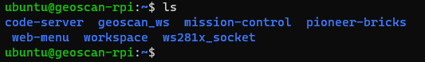
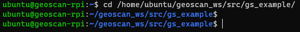
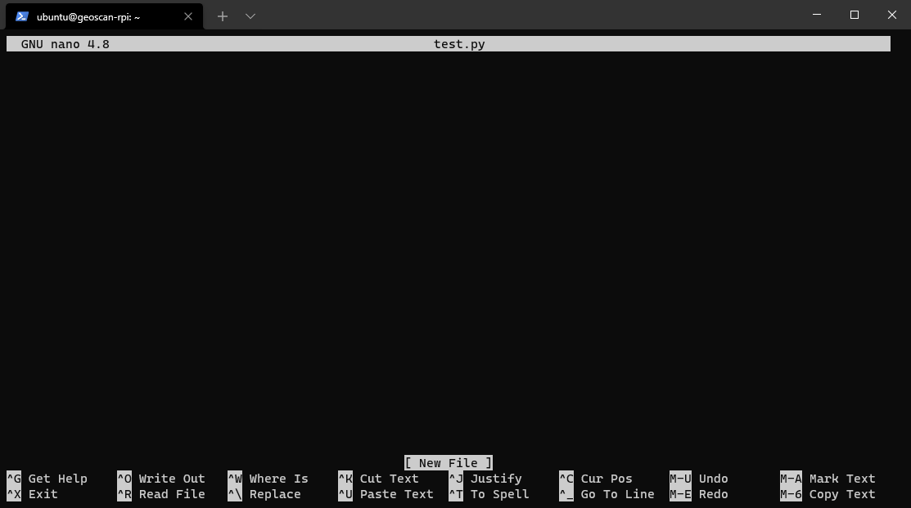

Основы работы в терминале Linux
================================

Образ "Пионер Макс" использует операционную систему Ubuntu 20.04, принадлежащей к семейству ОС Linux.
Поэтому, для успешной работы с Пионер Макс потребуется изучить основные команды ОС Linux.

Команды можно использовать в любом терминале: при подключении по SSH, в Butterfly или же во встроенном терминале Code-OSS.

У каждой команды есть ряд параметров (флагов), которые позволяют модифицировать работу команды.

В качестве примера рассмотрим одну из основных команд - **ls**

Результатом работы команды **ls** без каких-либо флагов будет список файлов и папок, находящихся в текущей директории.

Если же воспользоваться командой вместе с аргументом **-l**, то перед именами файлов выдается режим доступа, количество ссылок на файл, имена владельца и группы, размер в байтах и время последней модификации.

.. image:: ../const/media/terminal_basics/lsl.png
    :alt: Похоже, картинка не загрузилась :c 
    :align: center
    :scale: 100%

.. hint:: Можно использовать сразу несколько аргументом с одним дефисом или добавлять их раздельно.
    Например **ls -l -a** или **ls -la**

Основные необходимые команды
-----------------------------

ls
****
Команда **ls** позволяет просмотреть содержимое текущей директории.

Основные флаги:
    * **-l** - перед именами файлов выдается режим доступа, количество ссылок на файл, имена владельца и группы, размер в байтах и время последней модификации
    * **-a** - выводит список всех файлов, включая скрытые

pwd
****
*(Print Working Directory)*

Выводит полный путь до текущей директории. 

.. image:: ../const/media/terminal_basics/pwd.png
    :alt: Похоже, картинка не загрузилась :c 
    :align: center
    :scale: 100%

cd 
****
Позволяет перейти в другую директорию по абсолютному или относительному пути.

.. пример для одной точки
.. code-block:: bash
   :caption: Использование:

   cd <путь к директории>

Переход по абсолютному пути
###############################
После cd нужно указать полный путь до нужной директории

Переход по относительному пути
###############################

Если нужно попасть в папку /home/ubuntu/geoscan_ws/src/, но вы уже находитесь в папке /home/ubuntu,
то не нужно писать полный путь, а можно перейти на директории уровнем ниже, из той, в которой мы находимся сейчас

.. code-block:: bash

   cd geoscan_ws/src

Также символ **.** означает текущую директорию, а **..** - директорию уровнем выше.

.. code-block:: bash
   :caption: Пример перехода на директорию выше:

   cd ..

.. code-block:: bash
   :caption: Пример перехода в директорию того же уровня:

   cd ../<название>

.. tip:: В терминале есть функция автодополнения названий по нажатию на Tab.

mkdir
*****
Позволяет создать директорию.

.. code-block:: bash
   :caption: Использование:

   mkdir <путь>/<название директории>

Если не указать путь, то директория создастся по текущему пути.

.. image:: ../const/media/terminal_basics/mkdir.png
    :alt: Похоже, картинка не загрузилась :c 
    :align: center
    :scale: 100%

touch
******
Позволяет создать файл.

.. code-block:: bash
   :caption: Использование:

   touch <путь>/<название файла>.<расширение файла>

.. image:: ../const/media/terminal_basics/touch.png
   :alt: Похоже, картинка не загрузилась :c 
   :align: center
   :scale: 100%

Если не указать путь, то файл создастся по текущему пути.

Консольный текстовый редактор Nano
-----------------------------------

На Пионер Макс предустановлен текстовый редактор Nano, который позволяет создавать и редактировать любые файлы.

.. code-block:: bash
   :caption: Использование:

   nano <название файла>.<расширение файла>

Если файла с таким названием и расширением не существует, то nano автоматически создаст и откроет его.

.. image:: ../const/media/terminal_basics/nano1.png
   :alt: Похоже, картинка не загрузилась :c 
   :align: center
   :scale: 100%

После открытия файла вы увидите окно, в котором можно писать текст или редактировать существующий.

Управление в nano происходит с помощью горячих клавиш, их описание всегда есть внизу терминала.

**Ctrl+S** сохранит введённые данные и покажет, сколько строчек было изменено.

.. image:: ../const/media/terminal_basics/nano3.png
   :alt: Похоже, картинка не загрузилась :c 
   :align: center
   :scale: 60%

.. table:: Основные горячие клавиши

    +-----------------+----------------+
    | Горячая клавиша | Функционал     |
    +=================+================+
    | Ctrl+S          | Сохранить файл |
    +-----------------+----------------+
    | Ctrl+X          | Выйти из Nano  |
    +-----------------+----------------+
    | Ctrl+K          | Вырезать       |
    +-----------------+----------------+
    | Ctrl+U          | Вставить       |
    +-----------------+----------------+
    | Alt+U           | Отменить       |
    +-----------------+----------------+
    | Alt+E           | Вернуть        |
    +-----------------+----------------+

Если файл не был сохранён перед выходом из Nano, то он уточнит, не хотите ли вы сделать это. 
Введите **Y**, если да, и **N**, если нет, и нажмите Enter.

.. warning:: Если файл не удаётся сохранить, возможно для его редактирования требуются права администратора

Команда sudo
------------

Данная команда позволяет выполнять действия от имени администратора.

Добавьте sudo перед командой, в случае необходимости введите системный пароль.

.. code-block:: bash

   sudo nano <название файла>.<расширение файла>

Файл откроется от имени администратора, что позволит редактировать системные файлы.
