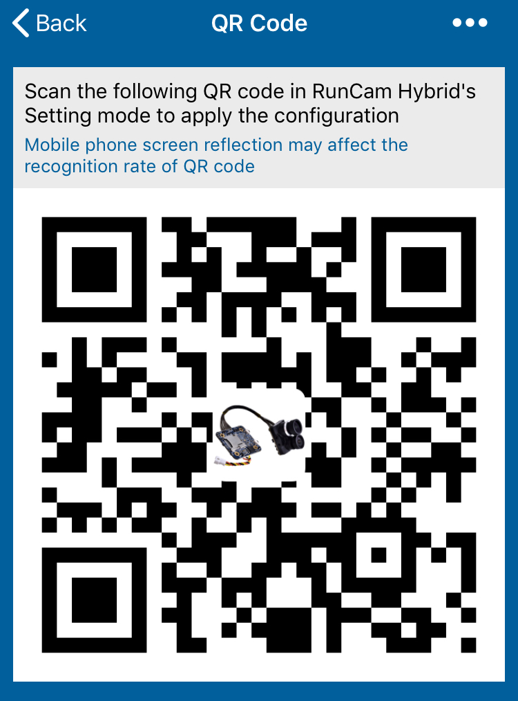
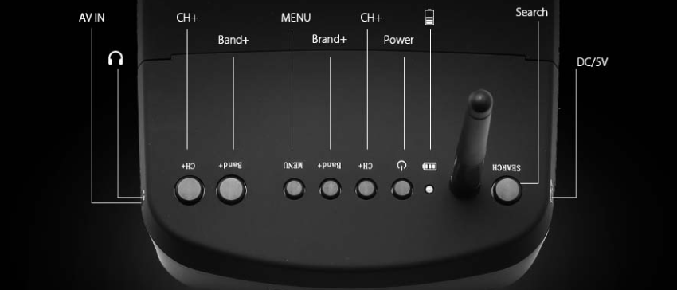
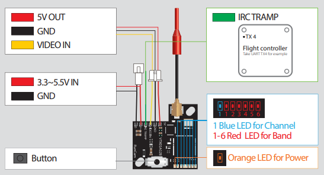
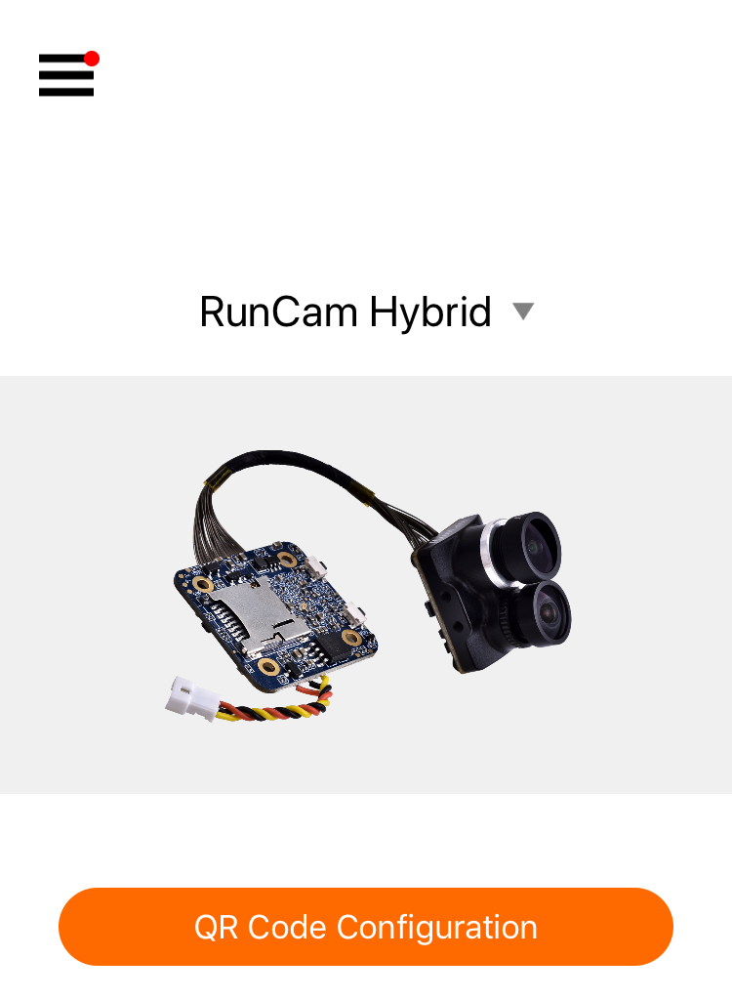
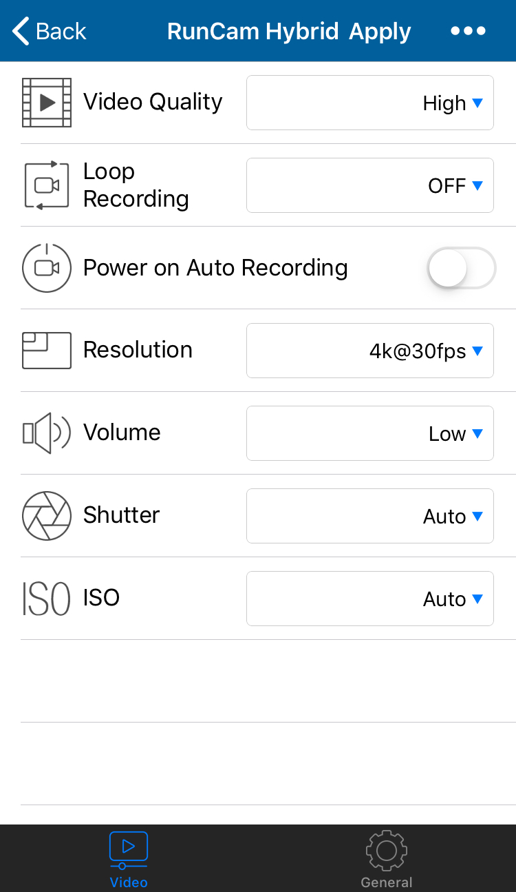
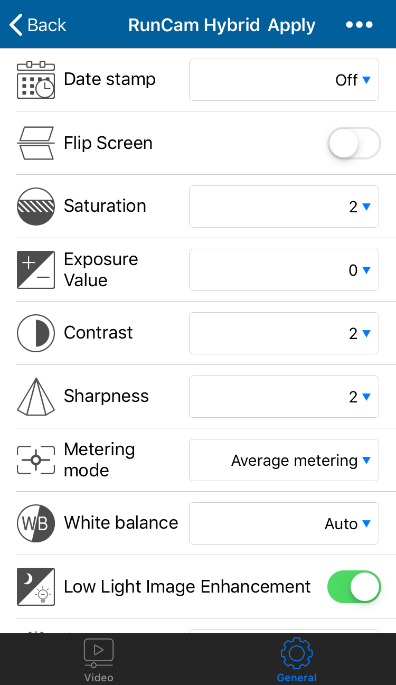

Работа с модулем камеры Runcam Hybrid 4K
========================================

    Модуль подходит как для съемки видео в формате 4K, так и для полетов
    в режиме FPV. Для этого камера оснащена двумя объективами. Камера
    Runcam Hybrid 4K закреплена на поворотном подвесе. В корпусе модуля
    спрятана плата с кнопками управления, разъемами и слотом, в который
    установлена карта microSD. На ней по умолчанию сохраняются все
    фотографии и видеоролики.

Базовые операции с камерой
--------------------------

.. figure:: media/image1.png
   :align: center

*Кнопки на камере:*

*1 – кнопка переключения режимов;*

*2 – кнопка питания/затвора.*

.. csv-table::
   :widths: auto

   "Включение/выключение ", "Зажмите и удерживайте *кнопку питания/затвора* для того, чтобы включить/выключить камеру"
   "Режим ожидания", "Свечение светодиода-индикатора (далее — индикатор) рядом с *кнопкой* *переключения режимов* синим цветом"
   "Переключение режимов", "В режиме ожидание необходимо зажать *кнопку* *переключения режимов*, чтобы переключить камеру из *режима записи* в *режим чтения QR-кода*"
   "Режим видео", "Для начала записи видео необходимо нажать *кнопку затвора/питания.* Индикатор медленно начнет мигает синим цветом с интервалом в 0, 5 секунды. Для остановки записи необходимо нажать *кнопку затвора/питания*, после чего цвет индикатора перестанет мигать. "
   "Настойка при помощи *QR*-кода", "Переключив камеру в режим чтения *QR*-кода (индикатор — Зеленый), считайте камерой, сгенерированный в приложении *QR*-код. После автоматической настройки камера самостоятельно перейдет в режим ожидания (индикатор — Синий)."
   "Запись *HD­*-камерой", "После начала записи индикатор медленно, с интервалом в 1 секунду мигает зеленым цветом."
   "Ошибка чтения *SD*-карты", "С интервалом в 0,5 секунды мигает синим цветом."
   "Ошибка соединения", "С интервалом в 0,5 секунды мигает зеленым цветом."

Настройка камеры при помощи QR-кода
-----------------------------------

Настройка записи *HD*-камеры производится при помощи считывания камерой
сгенерированного в приложении *QR*-кода. Необходимо скачать приложение
*RunCam* по ссылкам ниже.

*Apple*:
`ссылка на скачивание в AppStore <https://apps.apple.com/ru/app/runcam-app/id1015312292>`__

*Android*:
`ссылка на скачивание в Google Play <https://play.google.com/store/apps/details?id=com.runcam.runcam2&referrer=utm_source%3DAndroidPIT%26utm_medium%3DAndroidPIT%26utm_campaign%3DAndroidPIT>`__

Выбрать камеру ‘\ *RunCam Hybrid*\ ’

|image1| |image2|

| Выбрать необходимые настройки
| |image3| |image4|

Сгенерировать *QR*-код

Чтобы сгенерировать *QR*-код необходимо перевести камеру в режим чтения *QR*-кода и навести камеры на экран телефона, дождаться перенастройки камеры.

Работа с дополнительным оборудованием. FPV-комплект.
--------------------

*Eachine EV800* является совместимым шлемом FPV.

.. important:: Для заказа FPV-комплекта, в который входит видеопередатчик и FPV-шлем, пишите на почту sales@geoscan.aero

Интерфейс шлема:

-  *DC/5V* — разъем подключения заряда батареи шлема.

-  *AVIN/AUDIO* — видеовход/аудиовыход.

-  *SEARCH* — кнопка автоматического поиска частотной сетки и частоты
   передаваемого видео.

-  Индикатор заряда батареи.

-  Кнопка питания — для включения шлема необходимо зажать кнопку питания
   и дождаться появления изображения камеры. Для выключения шлема
   необходимо зажать на 3-4 секунды кнопку питания, затем отпустить, шлем
   выключится.

-  *CH+* — кнопка переключения частоты (вперед).

-  *Band+* — кнопка переключения частотной сетки (вперед).

-  *MENU* — кнопка настройки шлема. Быстрое нажатие кнопки переключает
   между каналами получаемого видео с беспроводного на проводное,
   получаемое с видеовхода *AV IN*.

-  Большие кнопки *CH+/Band+* дублируют функционал меньших кнопок
   *CH+/Band+*.

Подключение шлема к FPV-камере Пионер Макс
~~~~~~~~~~~~~~~~~~~~~~~~~~~~~~~~~~~~~~~~~~

Необходимо подключить квадрокоптер к питанию от АКБ. Убедиться, что
светодиод-индикатор на камере ‘\ *RunCam’* светит, затем, что светят
светодиоды на видеопередатчике. После этого следует включить *FPV*-шлем и
нажать кнопку автоматического поиска ‘\ *SEARCH’*. Дождаться появления
изображения к камеры квадрокоптера на экране шлема.

При необходимости точной настройки частотной сетки и частоты
передаваемого видеопередатчиком изображения. Следует при помощи кнопки
переключения на видеопередатчике настроить необходимый канал и частоту,
затем настроить шлем. Таблица частот видеопередатчика приведена в
документации производителя по видеопередатчику *RunCam TX200*, либо же в
соответствии с таблицей ниже.

.. figure:: media/image9.png
   :align: center

.. |image1| image:: media/image2.png
   :width: 2.07613in
   :height: 3.54331in

