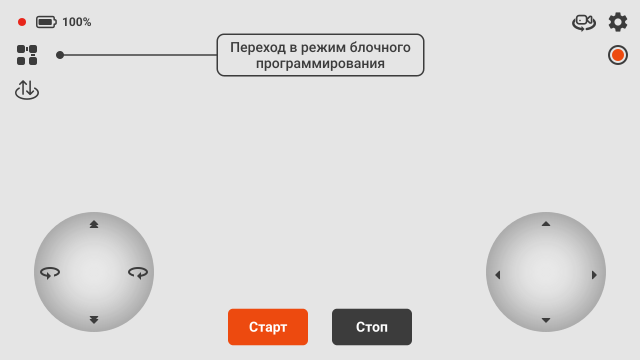
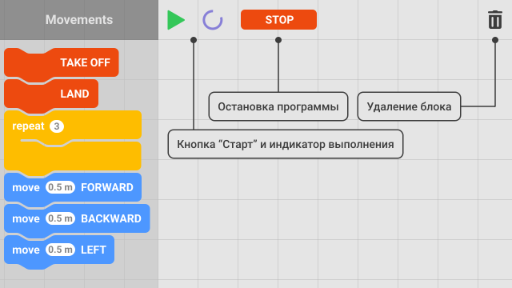
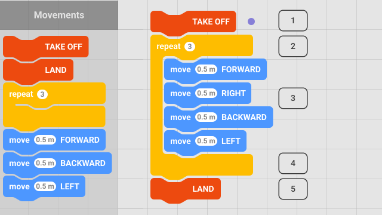

Блочное программирование в приложении Jump
==========================================

Мы создали в приложении Jump визуальную среду программирования для детей и подростков. Она позволяет в простой и доступной форме познакомиться с основными функциями Пионера Мини.

В блочном программировании все возможные движения и действия квадрокоптера представлены в виде перетаскиваемых блоков, которые могут соединяться в программу управления квадрокоптером. Блоки перетаскиваются по технологии drag-and-drop: удерживание нажатия на блоке запускает процесс перетаскивания, а отпускание нажатия заканчивает процесс перетаскивания.

Для перехода в раздел запустите приложение на вашем устройстве и нажмите иконку с блоками в верхнем левом углу. 

Интерфейс
---------

Экран разделён на две части. 
В левой части экрана представлена палитра всех блоков. Часть из них может не помещаться на экране вашего устройства. В этом случае следует воспользоваться вертикальным тач-скролом для поиска необходимого блока.
Правую часть экрана занимает рабочая область, в которой создаётся программа. Также справа находятся кнопки и вспомогательные блоки.

1.	Кнопка запуска в виде зелёного треугольника служит для старта готовой программы.
2.	Индикатор работы отображается в процессе выполнения программы.
3.	Кнопка остановки выполнит экстренную посадку в случае непредвиденных обстоятельств.
4.	Корзина для удаления ненужных блоков с рабочей области.

Если вы напишете большую программу, она может не поместиться на экран устройства. Для этого случая предусмотрено масштабирование рабочей области. Чтобы увеличить или уменьшить масштаб, разведите или сведите два пальца на рабочей области.

Описание блоков
---------------

Ниже описаны все доступные блоки и выполняемые ими действия.

.. raw:: html

 	

 	<table rules="all" align="center">
 		
	 		<tr style="background-color:#FFD747;">
	 			<th>Название блока</th><th>Изображение</th><th>Действие</th>
	 		</tr>
	 		<tr>
	 			<td>TAKE OFF</td><td></td><td>Взлёт на высоту 'Take off'. Высота задаётся параметром Flight_com_takeoffAlt и указывается в метрах.</td>
	 		</tr>
	 		<tr>
	 			<td>LAND</td><td></td><td>Посадка.</td>
	 		</tr>
	 		<tr>
	 			<td>REPEAT</td><td></td><td>Выполняет включающие в себя операции указанное количество раз.</td>
	 		</tr>
	 		<tr>
	 			<td>MOVE FORWARD</td><td></td><td>Движение вперёд. Расстояние указывается в метрах.</td>
	 		</tr>
	 		<tr>
	 			<td>MOVE BACKWARD</td><td></td><td>Движение назад. Расстояние указывается в метрах.</td>
	 		</tr>
	 		<tr>
	 			<td>MOVE LEFT</td><td></td><td>Движение влево. Расстояние указывается в метрах.</td>
	 		</tr>
	 		<tr>
	 			<td>MOVE RIGHT</td><td></td><td>Движение вправо. Расстояние указывается в метрах.</td>
	 		</tr>
	 		<tr>
	 			<td>MOVE UP</td><td></td><td>Движение вверх. Расстояние указывается в метрах.</td>
	 		</tr>
	 		<tr>
	 			<td>MOVE DOWN</td><td></td><td>Движение вниз. Расстояние указывается в метрах.</td>
	 		</tr>
	 		<tr>
	 			<td>TURN LEFT</td><td></td><td>Поворот относительно вертикальной оси (рысканье) влево. Значение указывается в градусах.</td>
	 		</tr>
	 		<tr>
	 			<td>TURN RIGHT</td><td></td><td>Поворот относительно вертикальной оси (рысканье) вправо. Значение указывается в градусах.</td>
	 		</tr>
	 		<tr>
	 			<td>SET COLOR</td><td></td><td>Включение бортовых светодиодов. При нажатии открывает палитру доступных цветов.</td>
	 		</tr>
	 		<tr>
	 			<td>SLEEP</td><td></td><td>Установка задержки. Значение указывается в секундах.</td>
	 		</tr>
	 		<tr>
	 			<td>TAKE PHOTO</td><td></td><td>Сделать фотографию. Фото сохранится на устройство или SD-карту, в зависимости от настроек приложения.</td>
	 		</tr> 		
 	</table>
 	 

Пример составления программы
-----------------------------

Для создания программы необходимо перенести блоки из палитры в рабочую область и выстроить их в необходимом порядке. Блоки автоматически присоединяются в то место, в которое их установили. Таким образом новый блок можно разместить перед, после или между существующих блоков.

.. important:: Блоки, отвечающие за передвижение коптера, обязательно должны находиться между блоками взлёта (Take off) и посадки (Land)!

В качестве примера рассмотрим небольшую программу полёта по квадрату.

1. Поскольку программа подразумевает полёт, начинаем её с блока **TAKE OFF** для осуществления взлёта. Маркер рядом с блоками поможет сориентироваться, какое действие выполняется в текущий момент.
2. Открываем цикл и указываем количество повторов.
3. Вносим в блок цикла блоки движения: **MOVE FORWARD**, **MOVE RIGHT**, **MOVE BACKWARD** и **MOVE LEFT** для движения вперёд, вправо, назад и влево соответственно. Указываем необходимые расстояния в блоках.
4. После указанного количества повторов произойдёт выход из цикла и переход к следующим блокам программы.
5. Завершаем программу блоком **LAND** для посадки Пионера Мини.

