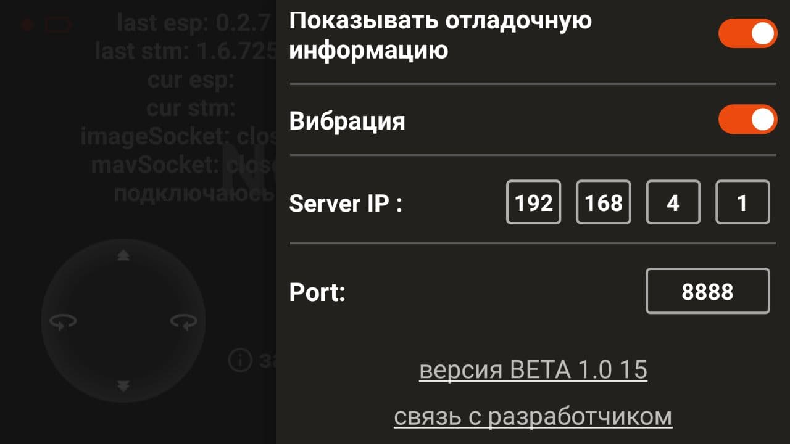

Мобильное приложение Geoscan Jump
=================================

В ручном режиме, управление квадрокоптером осуществляется с помощью мобильного приложения для смартфонов "Geoscan Jump". Перед началом работы загрузите актуальную версию с `сайта компании “Геоскан”`_ или из `Google Play`_.

.. _сайта компании “Геоскан”: https://www.geoscan.aero/ru/products/pioneer/mini#pills-download

.. _Google Play: https://play.google.com/store/apps/details?id=com.malinowski.quadro&hl=ru

   Ссылка на скачивание с сайта

.. important:: Обратите внимание, что мобильное приложение поддерживает устройства с операционной системой Android версии выше 6.0 и версией 12.1

Для осуществления полёта необходимо произвести привязку смартфона к квадрокоптеру.

.. figure:: media/onoffswitch.png
   :align: center
   :scale: 120%

#. Включить квадрокоптер, нажав на кнопку включения сбоку, сзади должна появиться цветовая светодиодная индикация.
#. Подключится к Wifi точке квадрокоптера в меню настроек WiFi сетей на телефоне (WiFi-точка: Pioneermini; пароль: 12345678).
#. Запустить установленное на смартфоне приложение **Geoscan Jump**.
#. Следуйте инструкциям в приложении.

.. important:: Ознакомьтесь с остальной частью инструкции, прежде чем начинать полет.

Бета-версия приложения
______________________

Мы постоянно совершенствуем наш продукт и поэтому приглашаем присоединиться к нашему открытому бета тесту.

Скачать новое приложение можно здесь: https://play.google.com/store/apps/details?id=com.malinowski.quadro

.. figure:: media/qr-code.png
   :align: center
   :scale: 10%

.. important:: Участие в тестировании добровольное. Имейте в виду, так как это бета версия при использовании могут встречаться баги (неисправности). О них вы можете сообщать через форму обратной связи нажав на значок жучка в приложении *Jump*. Удачных полетов!

При возникновении затруднений при обновлении можете написать в наш телеграмм-канал https://t.me/GeoscanPioneer.

Новый интерфейс, обратите внимание на версию приложения.

История бета тестов
~~~~~~~~~~~~~~~~~~~

**Тестирование от 19.03.21**

Что обновляем:

#. Мобильное приложение Geoscan Jump;
#. Новая прошивка Автопилота Пионера Мини;
#. Обновленная версия библиотеки pioneer_sdk;

Мы надеемся, что тестирование не займет много времени, и мы сможем "отловить" много багов и надеемся, что вы в этом очень поможете перед выходом официального обновления.

Итак, что нового:

#. Перешли на новый протокол передачи данных MavLink для более стабильного соединения и управления;
#. Новая архитектура приложения, чтобы проще добавлять новые возможности и упрощения разработки;
#. Отображение заряда батареи в процентах;
#. Добавили индикацию со статусом текущего состояние;
#. Возможность запускать/остановить lua-script в режиме program;
#. Система push-уведомлений с сохранением истории в приложении;
#. Возможность фиксировать джойстики управления;
#. Возможность изменять размер джойстиков;
#. Отладка получения текущей версии прошивок квадрокоптера;
#. Размытая последняя картинка при потере соединения.

Так же была обновлена прошивка автопилота и библиотека pioneer_sdk:

#. Поправлена проблема связанная с запуском моторов квадрокоптера не с первого раза, теперь это работает стабильнее;
#. Событие автопилота takeoff не приводит теперь к посадки коптера;
#. Исправлена работа скрипта led_height.py на OC Windows;
#. Теперь скрипт aruco_flight.py не запускает полет без предварительной калибровки камеры через скрипт camera_calibration;

.. important:: Напоминаем, квадрокоптер предназначен для полёта в помещениях.
