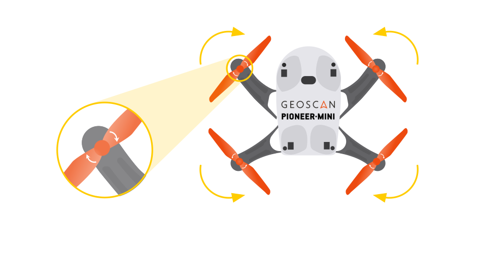

Подготовка к полету - первый старт. Пионер Мини.
================================================

Перед полетом прочтите станицы :doc:`geoscan_jump` и  :doc:`mini_control`.

А также прочтите технику безопасности :doc:`mini-operation_flight` и :doc:`mini-operation_lipo`.

.. important:: Перед осуществлением полета, обязательно обновите прошивку (если версия автопилота ниже, чем 1.6.7011) и параметры автопилота «Пионера Мини». Полет с устаревшей версией прошивки автопилота может быть небезопасен.
               Проверьте версию прошивки автопилота в Pioneer Station и при необходимости перейдите на страницу
               :doc:`../settings/firmware_upgrade`.

**Для успешного старта:**

#. Полностью зарядите аккумулятор квадрокоптера и проверьте заряд батареек в джойстике, а также смартфоне.
#. До упора вставьте аккумулятор в отсек в нижней части квадрокоптера.
#. Убедитесь что на квадрокоптере нет заметных повреждений.
#. Подключитесь к квадрокоптеру через Wifi сеть.
#. Убедитесь, что появился видеопоток с камеры квадрокоптера;
#. Прозвучит звуковой сигнал и на квадрокоптере загорятся светодиоды.
#. Дождитесь пока светодиод статуса не начнет мерцать.
#. Запустите моторы. Для этого нажмите кнопку "Старт".
#. Дождитесь пока все винты начнут вращаться и плавно взлетайте. Во время полета соблюдайте правила эксплуатации. Не допускайте падения квадрокоптера.
#. После полета остановите моторы. Для этого нажмите кнопку "Стоп".

.. important:: Перед полетом проверяйте правильность установки пропеллеров. Сверьтесь с рисунком ниже.

.. important:: Напоминаем, квадрокоптер предназначен для полёта в помещениях.

    

 	
 	
