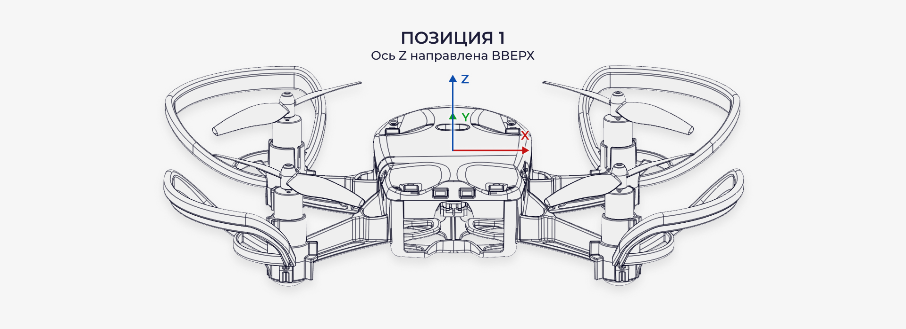
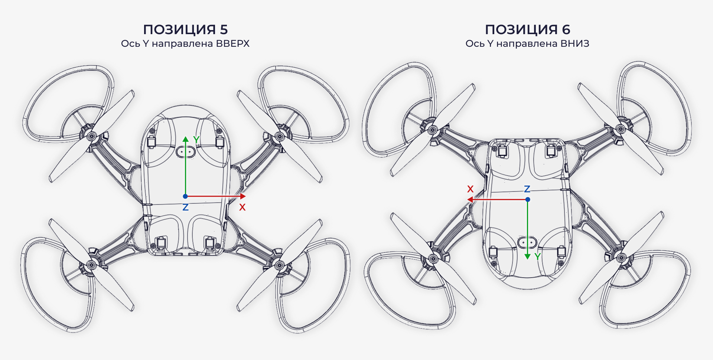

Калибровка акселерометра
========================

Калибровка акселерометра на квадрокоптере "Пионер Мини" необходима в тех случаях, когда была сброшена калибровка произведённая на заводе изготовителе или по прошествии большого количества полётов.

.. attention:: Пожалуйста, не производите калибровку акселерометра без должной необходимости.

Акселерометр измеряет ускорение по трем осям координат, и входит в состав инерциальной системы квадрокоптера вместе с гироскопом. Без этих двух датчиков, управление квадрокоптером было бы крайне затрудненно.

.. attention:: Перед началом калибровки рекомендуется снять защиту воздушных винтов. Во время калибровки, ставьте квадрокоптер только на твёрдую и ровную поверхность, не производите ее на весу в руках! 

.. raw:: html

   

        <iframe src="https://www.youtube.com/embed/RLewlM72Efc?list=PLV31ZusyYaea0riqT4wL3znAhbiARwQqw" allowfullscreen="" style="position: absolute; width:100%; height: 100%;" frameborder="0"></iframe>
   

Для начала калибровки, подключите квадрокоптер к Pioneer Station. После чего выберете значок квадрокоптера в верхнем меню, внутри будет вкладка "Калибровка", далее нажмите "Калибровка акселерометра".

.. figure:: media/PioMiniCalibration/PioMiniAccelCalib_0.png
   :align: center

Так как в Pioneer Station на данный момент имеются картинки со стандартным Пионером. Изображения с Пионер Мини, представленные ниже должны вам помочь. Следуйте инструкциям в Pioneer Station.

Калибровка оси Z
~~~~~~~~~~~~~~~~

**Шаг1.** Расположите устройство осью Z ВВЕРХ

**Шаг2.** Расположите устройство осью Z ВНИЗ

.. figure:: media/PioMiniCalibration/PioMiniAccelCalib_2.png
   :align: center

Калибровка оси X
~~~~~~~~~~~~~~~~

|	**Шаг3.** Расположите устройство осью X ВНИЗ
|	**Шаг4.** Расположите устройство осью X ВВЕРХ

.. figure:: media/PioMiniCalibration/PioMiniAccelCalib_3-4.png
   :align: center

Калибровка оси Y
~~~~~~~~~~~~~~~~

|	**Шаг5.** Расположите устройство осью Y ВВЕРХ
|	**Шаг6.** Расположите устройство осью Y ВНИЗ

