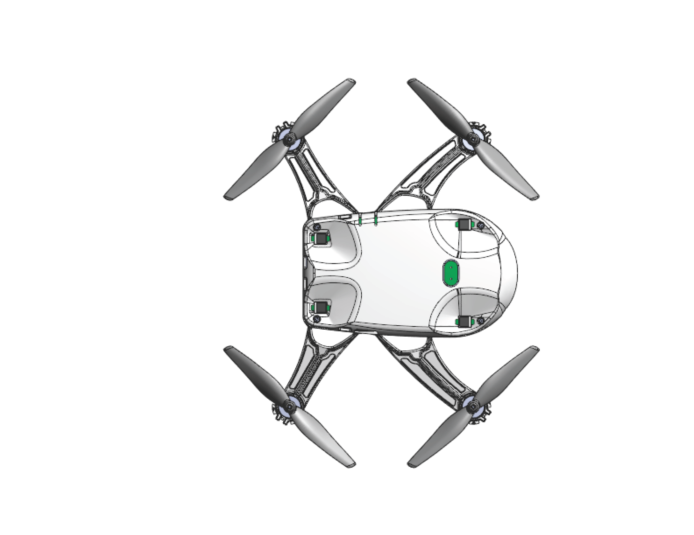
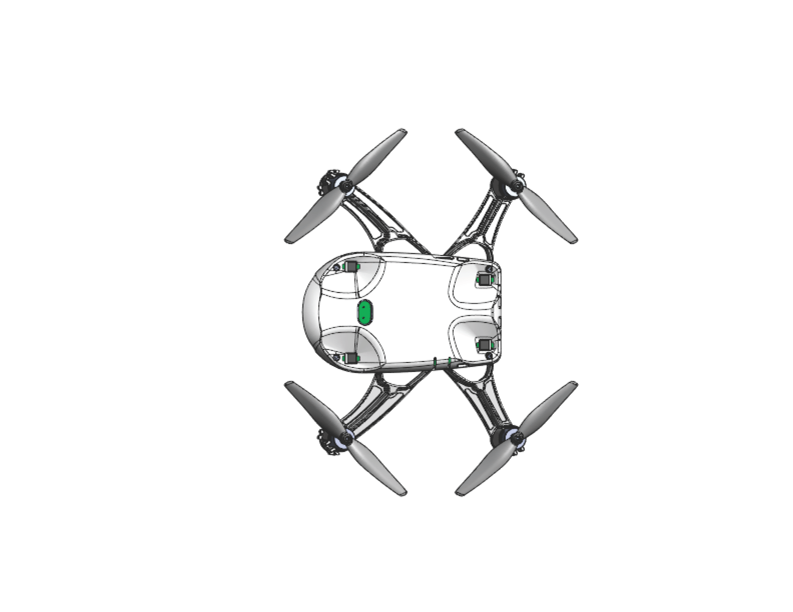
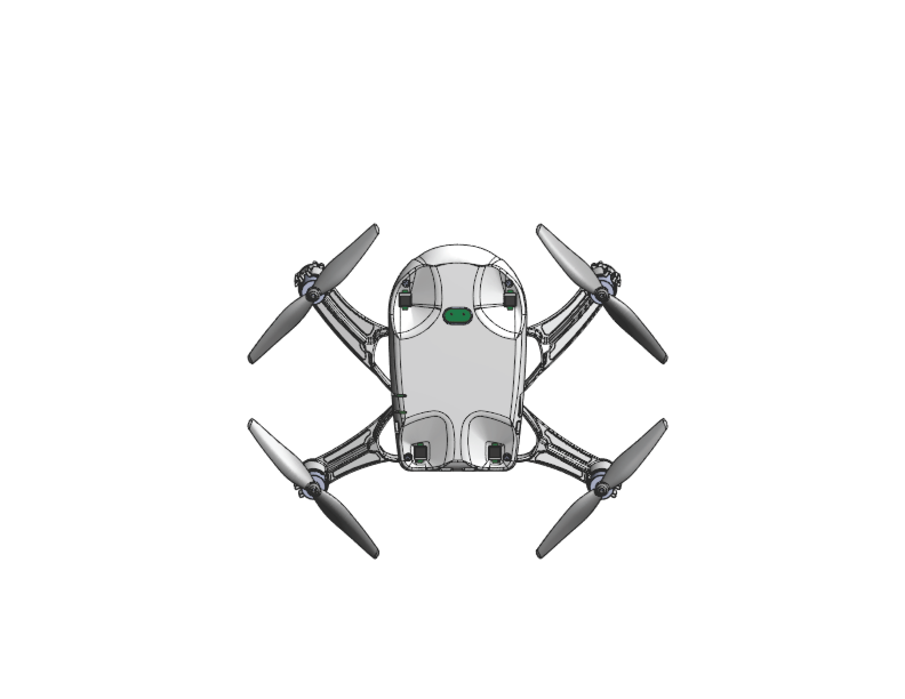
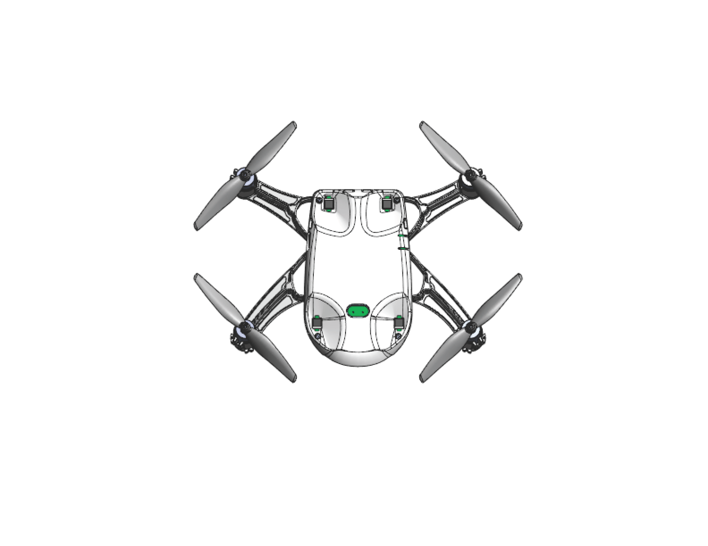

Калибровка акселерометра
========================

Калибровка акселерометра на квадрокоптере "Пионер Мини" необходима в тех случаях, когда была сброшена калибровка произведённая на заводе изготовителе или когда по прошествии большого количества полетов.

.. admonition:: Пожалуйста, не производите калибровку акселерометра без должной необходимости.

Акселерометр измеряет ускорение по трем осям координат, и входит в состав инерциальной системы квадрокоптера вместе с гироскопом. Без этих двух датчиков, управление квадрокоптером было бы крайне затрудненно.

Перед началом калибровки, рекомендуется найти максимально ровную поверхность, а также снять защиту воздушных винтов с квадрокоптера.

Для начала калибровки, подключите квадрокоптер к Pioneer Station. После чего выберете значок квадрокоптера, внутри будет вкладка "Калибровка", далее нажмите "Калибровка акселерометра".

.. figure:: media/accel.PNG
   :align: center
   :scale: 100%

Так как в Pioneer Station на данный момент имеются картинки со стандартным Пионером. Изображения с Пионер Мини, представленные ниже должны вам помочь.

Во время калибровки, ставьте квадрокоптер только на твёрдую поверхность, не производите ее на весу в руках.

Следуйте инструкциям в Pioneer Station.

**Шаг 1**

Калибровка оси Z

*Расположите устройство осью ВВЕРХ*

.. figure:: media/mini-z-up.png
   :align: center
   :scale: 25%

**Шаг 2**

Калибровка оси Z

*Расположите устройство осью ВНИЗ*

.. figure:: media/mini-z-down.png
   :align: center
   :scale: 25%

**Шаг 3**

Калибровка оси Y

*Расположите устройство осью ВВЕРХ*

**Шаг 1**

Калибровка оси Y

*Расположите устройство осью ВНИЗ*

**Шаг 5**

Калибровка оси X

*Расположите устройство осью ВВЕРХ*

**Шаг 6**

Калибровка оси Z

*Расположите устройство осью ВНИЗ*

