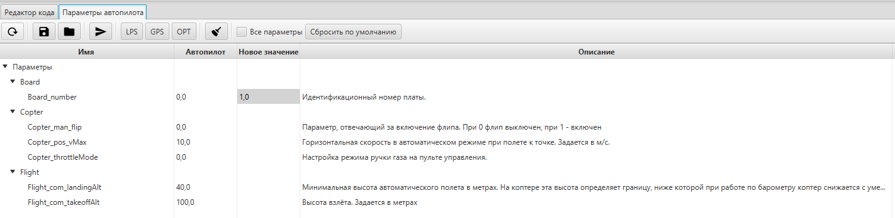
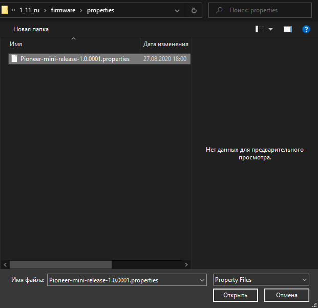

.. _autopilot_parameters:

Настройка параметров автопилота Пионера Мини
============================================

Параметры полета квадрокоптера в автоматическом режиме можно тонко настроить, используя программу :doc:`../../../programming/pioneer_station/pioneer_station_main`. Для этого подключите "Пионер Мини" к компьютеру  и перейдите из вкладки "редактор кода" в "настройки параметров автопилота"

.. _инструкции: ../../../programming/pioneer_station/pioneer_station_upload.html

Для настройки "Пионер Мини" должен быть подключен к компьютеру, для перехода к настройке откройте вкладку "Параметры автопилота", текущие параметры должны отображаться в правой части окна.

.. note:: Настоятельно рекомендуем обновить параметры вашего "Пионер Мини". Стандартные параметры автопилота и "Пионера Мини" и обычного "Пионера" различаются имейте это в виду. Это связано с *различной электронной начинкой* квадрокоптеров.

Перейдите во вкладку "параметры автопилота". В первом столбце таблицы приведены названия параметров. Узнать, за что каждый из них отвечает, можно, посмотрев в крайний правый столбец "Описание". Во втором столбце отображаются текущие значения, присвоенные каждому из параметров. Если вы хотите поменять какое-либо из них, введите новое значение в столбец справа от текущего значения и нажмите Enter.
Завершив редактирование, не забудьте сохранить изменения, нажав кнопку **сохранить изменения на автопилот** |push|.

.. |push| image:: media/push_param.PNG

.. attention:: Самостоятельное изменение некоторых параметров автопилота может непреднамеренно привести к фатальным ошибкам работы автопилота.

В верхней части окна также присутствуют кнопки **LPS** и **OPT**. Каждая из них загружает в квадрокоптер стандартный набор параметров для полета, соответственно, в локальной системе позиционирования и модуля оптического позиционирования. На данный момент никаких кнопок нажимать не надо, оптический поток включен сейчас по умолчанию и выставлены оптимальные параметры.

.. attention:: На данный момент времени, полностью реализован и стабильно работает режим полета по оптическому потоку. Встроенный модуль оптического позиционирования позволяет вам летать стабильно в помещениях с достаточным освещением. Остальные режимы будут добавлены со временем.

Загрузка стандартных параметров Пионера Мини
--------------------------------------------

.. attention:: Перед загрузкой стандартных параметров, не забудьте обновить прошивку автопилота, это очень важно. Как это сделать вы можете просмотреть в документе
               :doc:`firmware_upgrade`.

Чтобы  загрузить параметры "Пионер Мини":

1) Скачайте файл параметров с установленным Pioneer Station, в папку Firmware/Properties

`Файл параметров автопилота версии 9202 <https://disk.yandex.ru/d/fdTyvffNctHW3A>`__ - для работы с автопилотом версии 1.6.9202 и новее.

2) Нажмите кнопку "Открыть из файла" |upload|

3) После чего в папке с установленным Pioneer Station, откройте папку "Firmware", затем папку "Properties" после чего выберите файл *pioneer-mini_1.0.9202.properties* нажмите "Открыть".

4) В открывшемся окне, вы увидите отличающиеся значения. Изображение снизу является примером. Параметры в колонке "Автопилот" находится параметры которые уже в вашем коптере, в столбце "Файл" находятся новые значения параметров которые будут изменены. Нажмите кнопку "ОК".

.. figure:: media/different_param.PNG
   :align: center

5) Для загрузки новых параметров нажмите кнопку **сохранить изменения на автопилот** |push|

6) Нажмите кнопку "Обновить из автопилота" |update| чтобы проверить, изменились ли параметры.

7) Хороший признак того, что вы всё сделали правильно, это то, что сзади на квадрокоптера светодиод мигает фиолетовым цветом.

.. |upload| image:: media/upload_param.PNG

Дополнительные сведения
-----------------------

Также вы имеете возможность открыть *"все параметры"* автопилота. Если вы не знаете что это за параметры, лучше их не изменять. Если у вас возникли вопросы по изменению тех или иных параметров, вы всегда можете обратится в техподдержку или Telegram-канал "Геоскан Пионер".

Также вы можете сохранять свои сборки параметров автопилота. Для того чтобы их сохранить, нажмите сохранить в файл параметры автопилота |download|. Рекомендуется сохранять старые параметры АП перед загрузкой новых, чтобы в случае необходимости вернуться на старые параметры.

Следите за обновлениями, в будущем появится страницу подробно рассказывающая что такое автопилот (АП) и что делают параметры  АП.

.. tip:: Если у вас не получилось по каким либо причинам загрузить параметры автопилота, советуем перезапустить Pioneer Station.

.. |download| image:: media/download_param.PNG

Для работы с логами автопилота перейдите в :doc:`logs`, но чтобы записать лог, нужно совершить полет, поэтому советуем перейти вам в подраздел :doc:`../flight/mini-flight`

