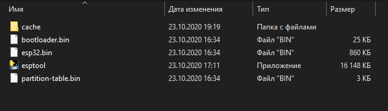
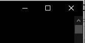

Инструкция по обновлению ESP-32
===============================

Контроллер ESP-32 отвечает за передачу видеопотока и передачу команд управления с телефона на квадрокоптер.

На данный момент вышла бета версия новой прошивки ESP-32 с новой версией Geoscan Jump, которая качественно улучшает:

* Скорость передачи видеопотока;

* Скорость передачи команд управления;

* Стабильность WiFi соединения;

* Совместимость с большим количеством телефонов.

Если вы хотите принять участие в тестировании, вам необходимо написать на почту: geoscan.edu@gmail.com с просьбой добавить вас как тестировщика новой прошивки. Через некоторое время, вам в ответном письме вышлют инструкцию как установить бета-версию приложения Geoscan Jump.

Перед началом тестирования
--------------------------

Перед начало тестов убедитесь:

#. Что версия автопилота: 1.6.7011. Проверить можно на странице :doc:`firmware_upgrade`

#. Параметры загружены из файла 0003 или esp-test-0006. Загрузить по ссылке ниже или на странице :doc:`autopilot_parameters`

:download:`esp-test-0006 <media/esp32/Pioneer-mini-esp-test-1.0.0006.properties>`

Проверить загрузили ли вы конкретные параметры esp-test-1.0.0006 или нет, можно через номер борта, для этого отключите коптер по USB нажав кнопку "подключение", затем заново подключите, если у вас "номер борта" изменился на 451, как на скриншоте, значит все сделано верно.

.. figure:: media/esp32/properties-test.PNG
   :align: center
   :scale: 50%

#. Что вы обновили прошивку ESP-32, как описано ниже.

#. У вас установлено приложение Geoscan Jump для внутреннего тестирования. Версия 0.9. Номер версии можно проверить в самом приложении в вкладке "Расширенные настройки".

.. figure:: media/esp32/jump-version.jpg
   :align: center
   :scale: 50%

Если правильную версию установить не удалось, попробуйте установить через ПК, для этого войдите в аккаунт Google, и откройте ссылку, которую вам прислали в письме.

Предварительно удалив старую версию, нажмите кнопку "Установить".

.. figure:: media/esp32/google-play.PNG
   :align: center
   :scale: 50%

Второй вариант, как можно установить приложение, это открыв ссылку "скачайте его из Google Play" в мобильном телефоне.

.. figure:: media/esp32/gp-phone2.jpg
   :align: center
   :scale: 50%

Процесс обновления контроллера ESP-32
-------------------------------------

Для обновления прошивки ESP-32, вам понадобиться специальная утилита. Данная инструкция объяснит процесс работы с ней.

1. Подключите Пионер Мини к компьютеру через Micro-USB разъем.

.. figure:: media/esp32/copter-usb.jpg
   :align: center
   :scale: 50%

2. Нажмите кнопку включения,  левый светодиод должен начать моргать.

3. Скачайте архив ESPTOOL, в нем содержится утилита для прошивки контроллера ESP-32

:download:`ESPTOOL <media/esp32/esptool.zip>`

4. Разархивируйте ZIP архив, нажав на него правой кнопкой мыши и выбрав "Извлечь все...".

.. figure:: media/esp32/esp-zip.jpg
   :align: center

5. Откройте разархивированную папку и запустите из нее файл ESPTOOL.exe

.. attention:: Перед этим вам необходимо закрыть программу Pioneer Station, если она у вас открыта.

6. Дождитесь обновления прошивки ESP-32, она может занимать до 5 минут.

.. figure:: media/esp32/esptool-work1.jpg
   :align: center

7. После появления сообщения "Hard resetting via RTS pin..." закройте утилиту нажатием на "крестик".

.. figure:: media/esp32/esptool-work2.png
   :align: center

8. Перезапустите Пионер Мини нажатием на кнопку включения.

.. figure:: media/esp32/copter-restart.jpg
   :align: center
   :scale: 50%

9. Квадрокоптер готов к работе.

Программа тестирования
----------------------

Ознакомьтесь с данной формой, в ней есть программа тестирования и сбор обратной связи.

https://docs.google.com/forms/d/e/1FAIpQLSetCRUd6qxBQKpz9E8a4lPeY4LNdpARPmGI30LouCZI9lODjw/viewform?usp=sf_link

