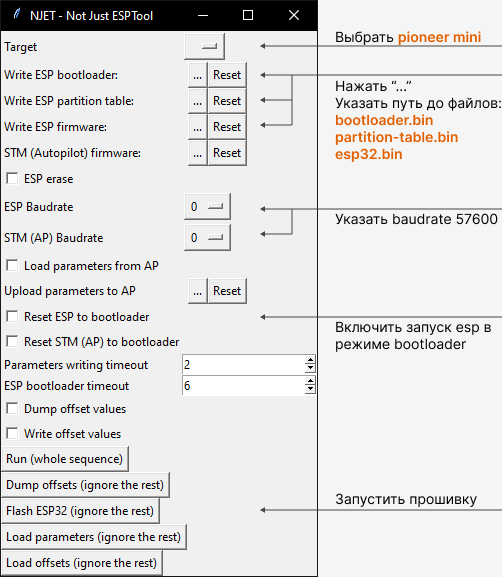
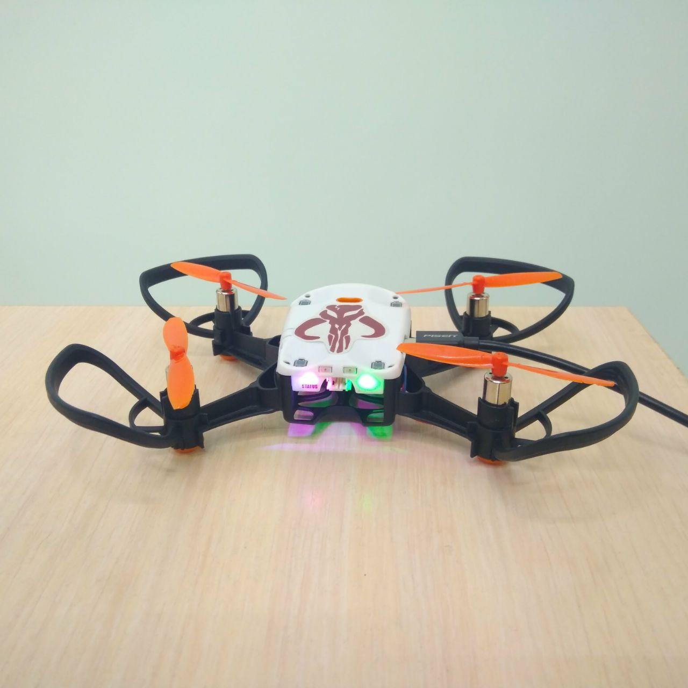
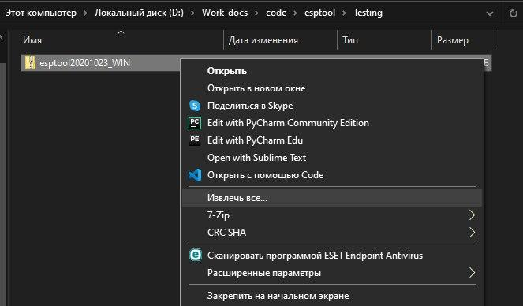
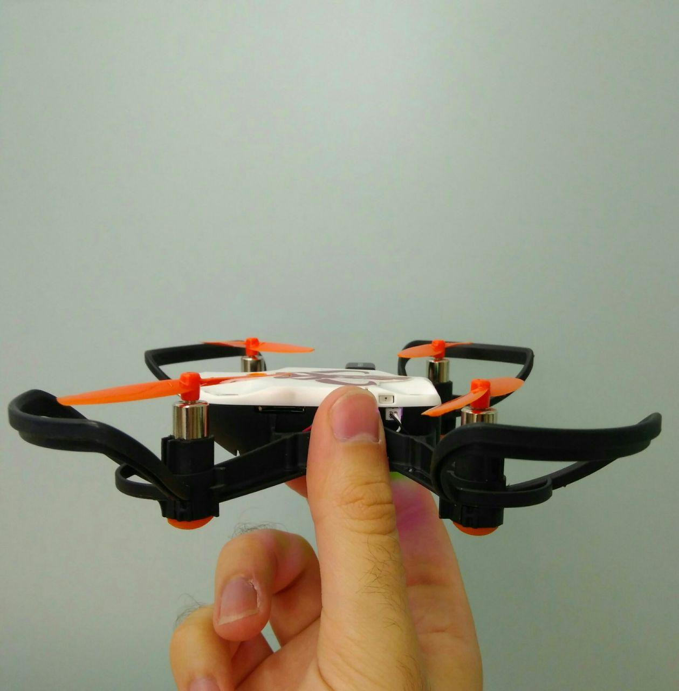
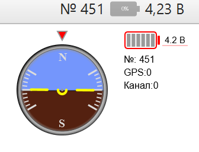
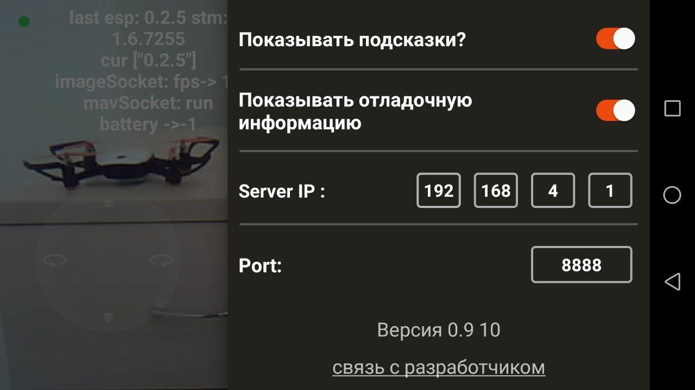

Обновление прошивки ESP-32
==========================

Контроллер ESP-32 отвечает за передачу видеопотока и передачу команд управления с телефона на квадрокоптер.
Для обновления прошивки ESP-32, необходимо воспользоваться одной из специальных утилит. Алгоритм работы с каждой из них описан в инструкции ниже.

.. important:: Перед началом обновления прошивки убедитесь, что версия автопилота: |fw_ap_mini|. В противном случае прошивка может привести к выходу квадрокоптера из строя. Проверить можно в Pioneer Station. Для этого подключите квадрокоптер по USB, в правом нижнем углу программы в строчке "Версия АП" должно быть |fw_ap_mini|. При необходимости - `выполните обновление <https://docs.geoscan.aero/ru/master/instructions/pioneer-mini/settings/firmware_upgrade.html>`_. 

.. note:: Программа PioneerStation должна быть закрыта во время работы Njet или ESPtool. 

Обновление с помощью NJET
-------------------------

1. `Скачайте архив <https://disk.yandex.ru/d/lv-1D3d56IktXw>`_ с программой NJET и разархивируйте его в удобное место, нажав правой кнопкой мыши и выбрав опцию "Извлечь всё...".
2. Подключите Пионер Мини к компьютеру через Micro-USB разъем, нражмите кнопку включения. При этом начнёт мигать левый светодиод.
3. Перейдите в разархивированную папку и запустите из неё файл **njet_gui.exe**. Предварительно убедитесь, что программа Pioneer Station закрыта. Дождитесь запуска приложения.
4. В поле **Target** выберите **pioneer_mini**
5. В полях **Write ESP bootloader / partition table / firmware** укажите путь к соответствующим файлам. После разархивации они находятся в папке "tools".
6. В полях **ESP / STM Baudrate** выберите значения **57600**
7. Установите галочку в чекбоксе **Reset ESP to bootloader**. 
8. Остальные настройки оставьте без изменений. Нажмите кнопку **FlashESP32** и дождитесь обновления прошивки. Она может занимать до 5 минут. После появления сообщения **"Hard resetting via RTS pin..."** в командной строке закройте утилиту и перезагрузите Пионер Мини.

NJET позволяет загрузить параметры автопилота. Для этого отметьте чекбокс **Load parameters from AP** после чего в строке **Upload parameters to AP**
укажите путь к параметрам автопилота для текущей версии прошивки и нажмите кнопку **Load parameters**. Обратите внимание, что при загрузке параметров чекбокс **Reset ESP to bootloader** должен быть отключён.

Обновление с помощью ESPTool
----------------------------

1. Подключите Пионер Мини к компьютеру через Micro-USB разъем и нажмите кнопку включения. Левый светодиод при этом должен начать моргать.

2. Скачайте архив ESPTOOL, в нем содержится утилита для прошивки контроллера ESP-32

`ESPTOOL с прошивкой ESP 0.5.6 и параметрами автопилота 9202 <https://disk.yandex.ru/d/3IprqU238K4N_g>`__

3. Разархивируйте ZIP архив, нажав на него правой кнопкой мыши и выбрав "Извлечь все...".

4. Откройте разархивированную папку и запустите из неё файл runiterative.bat

.. attention:: В файле par.properties содержатся параметры автопилота. Они загрузятся автоматически, в данной версии программы.

5. Дождитесь обновления прошивки ESP-32, она может занимать до 5 минут.

.. figure:: media/esp32/esptool-work1.jpg
   :align: center

6. После появления сообщения "Hard resetting via RTS pin..." закройте утилиту нажатием на "крестик".

.. attention:: Приложение не должно закрываться автоматически, дождитесь надписи указанной выше.

.. figure:: media/esp32/esptool-work2.png
   :align: center

7. Перезапустите Пионер Мини нажатием на кнопку включения.

8. Квадрокоптер готов к работе.

.. attention:: Если процесс обновления не удаётся завершить из-за ошибки **>>>OFFSET_ERROR<<<** вам необходимо произвести перекалибровку акселерометра. Чтобы это сделать, перейдите на страницу :doc:`accel-mini`.

В ESPTOOL 2.0 в случае возникновение аналогичной проблемы надо нажать любую кнопку.

Проверка после обновления
--------------------------

Перед началом убедитесь:

1. Что параметры загружены верно.

Проверить загрузили ли вы конкретные параметры 9202 или нет, можно через номер борта, для этого отключите коптер по USB нажав кнопку "подключение", затем заново подключите, если у вас "номер борта" изменился на *2906*. (пример на снимке экрана ниже, там 501)
При работе с ESPTOOL 2.0 и pioneer_sdk номер борта должен поменяться на *2906*.

При необходимости можно загрузить по ссылке ниже или на странице :doc:`autopilot_parameters`

`Параметры автопилота 9202 для прошивки АП 1.6.9202 <https://disk.yandex.ru/d/fdTyvffNctHW3A>`__ 

2. Что вы обновили прошивку ESP-32, как описано выше. Для проверки откройте Jump, в расширенных настройках включите отображение отладочной информации. В строке напротив "cur" должна быть надпись ["0.5.6"] или выше.

.. figure:: media/esp32/cur-version.png
   :align: center

Также проверить, прошло ли обновление успешно через имя WiFi сети. Если сеть называется "Pioneer_Mini" и после слова "Mini" отсуствует набор случайных цифр и букв, значит обновление не прошло.

После успешного обновления имя сети должно измениться например на "PioneerMini5afg415bb".

3. У вас установлено приложение Geoscan Jump последний версии. Номер версии можно проверить в самом приложении в вкладке "Расширенные настройки". Должна быть  версия |utd_gs_jump| или выше.

История обновлений
------------------

**Список изменений версии 0.5.6**

09.02.22 вышла новая прошивка ESP-32 0.4.5 Для корректной работы квадрокоптера, вам обязательно нужно обновить прошивку данного контроллера.

**Список изменений версии 0.4.5**

*  Добавлена возможность записи видео с квадрокоптера на SD-карту.
*  Добавлена возможность подключения к внешней сети WiFi.
*  Выход в OpenSource
*  Исправлены баги предыдущих версий.

06.10.21 вышла новая прошивка ESP-32. 

**Новая версия прошивки ESP-32 и обновленный Geoscan Jump, качественно улучшают:**

* Скорость передачи видеопотока;

* Увеличено количество кадров в секунду;

* Скорость передачи команд управления;

* Стабильность WiFi соединения;

* Совместимость с большим количеством телефонов.

**Новая версия параметров автопилота версии 0014:**

* Улучшена стабильность взлета и посадки;

* Квадрокоптер быстрее отключается при переворотах и столкновениях;

* Управление в режимах полета Althold и Stabilize стало более отзывчивым;

* Убран баг с автозапуском LUA скрипта.

