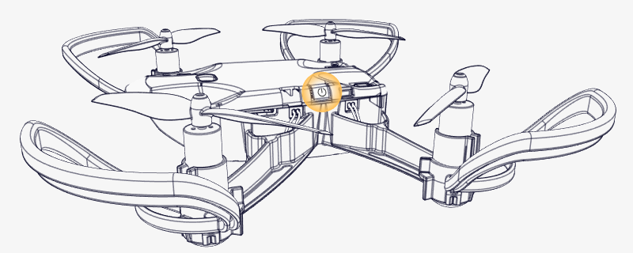
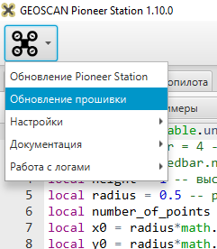
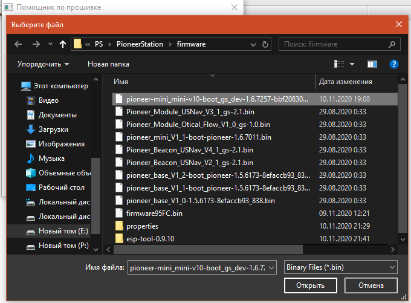

Обновление прошивки автопилота
==============================
Для корректной работы всех систем Pioneer Mini необходимо устанавливать последнюю актуальную версию прошивки. Процедура обновления и настройки происходит с помощью программы  Pioneer Station.

.. important:: Перед осуществлением первого полета, обязательно обновите прошивку и параметры автопилота "Пионера Мини". Полет с устаревшей версией прошивки автопилота ниже чем |utd_ap_mini| может быть небезопасен.

Пошаговая инструкция обновления версии автопилота "Пионера Мини"
~~~~~~~~~~~~~~~~~~~~~~~~~~~~~~~~~~~~~~~~~~~~~~~~~~~~~~~~~~~~~~~~

1. Скачайте актуальную версию программы `Pioneer Station`_.

2. Cкачайте актуальную версию прошивки |fw_ap_mini|. Тестовые и ранние версии прошивки находятся в разделе :doc:`../../../downloads/software-d`.

3. Подключите квадрокоптер к компьютеру с помощью кабеля micro-USB входящий в комплект поставки. И запустите программу "Pioneer Station". Включите квадрокоптер нажав на кнопку сбоку. Левый светодиод сзади должен начать мигать.

2. В левом нижнем углу нажмите кнопку **"Подключение"** и выберете **"По кабелю USB"**

.. figure:: media/firmware-step1.PNG
   :align: center

.. note:: Если по истечении 10 секунд окно программы не обновилось, попробуйте переподключить квадрокоптер и перезапустить программу. Если это не помогло, попробуйте `скачать и установить драйвер порта`_, после чего переподключите "Пионер Мини" и перезапустите программу.

3. В верхнем правом углу нажмите иконку **"квадрокоптера"** и выберете **"Обновление прошивки"**

4. В открывшемся окне нажмите **"Далее"**. Коптер перейдёт в в режим загрузчика. 
Более подробно про режим загрузчика читайте в разделе :doc:`mini_first-power-on`.

5. В следующем окне нажмите **"Обновить"** и выберете модуль **"DFUPioneer-Mini-A"** это и есть базовая плата "Пионера Мини".

.. figure:: media/firmware-step3.PNG
   :align: center

.. note:: Если при выборе устройства квадрокоптер не отображается в окне, нажать кнопку "Обновить" еще раз.

6. В следующем окне нажмите **"Встроенный"** или **"Из файла"** и найдите файл с примерным названием **pioneer_mini_V1_1-boot-pioneer-1.6.92**.bin** Самое главное чтобы в названии файла было прописано *pioneer_mini* и версия прошивки |utd_ap_mini| или старше.

7. Нажмите "Прошить", обновление прошивки может занимать до нескольких минут в зависимости от вашего ПК.

.. attention:: Не прерывайте соединение USB между коптером и ПК во время обновления, это может привести к серьезным проблемам и временному выходу квадрокоптера из строя!

8. Дождитесь окончания прошивки, это может занять несколько минут. После завершения нажмите "ОК", после чего отключите питание (от USB и/или от аккумулятора) и затем заново включите квадрокоптер нажатием на кнопку на корпусе. Левый задний светодиод должен периодически мигать фиолетовым (или желтым) цветом.

9. Заново подключитесь к квадрокоптеру в стандартном режиме по USB и проверьте версию АП. Если все сделано правильно то в столбце *"Версия"* вы увидите значение не меньше чем |utd_ap_mini|.

10. Еще переподключите квадрокоптер нажатием на кнопку, на самом квадрокоптере. Должен исчезнуть отказ *RESTART_REQUIRED*

.. figure:: media/firmware-step4.PNG
   :align: center

11. После обновления прошивки автопилота до более высокой версии, вам необходимо обновить параметры автопилота. Вы можете сделать это автоматически при обновлении второго контроллера ESP-32, либо вручную на странице :doc:`autopilot_parameters`. Параметры автопилота "Пионер Мини" и обычного "Пионера" различаются, имейте это в виду. Это связано с *различной электронной начинкой* квадрокоптеров. Также параметры непосредственно влияют на качество полета.

.. tip:: Отказ *UNPROTECTED* не влияет на полет, это служебное уведомление для разработчиков. На пользовательский опыт это никак не влияет. Отказ *RESTART_REQUIRED* пропадает через 2 перезагрузки, если этого не проиходит -напишите в техническую поддержку.

.. tip:: Если Вы столкнулись с проблемой обновления прошивки или работы "Пионера", напишите в тех. поддержку Геоскан support@geoscan.aero или `телеграмм аккаунт <https://t.me/geoscan_edu>`__ технической поддержки.

.. note:: 

.. note:: Если у вас возникла ошибка "Ошибка подключения к НСУ", вы можете исправить ее через обновления параметров через ESPTOOL или воспользовавшись утилитой minipatcher:
          :doc:`../../../mini-nsu`

Изменения в версиях автопилота
~~~~~~~~~~~~~~~~~~~~~~~~~~~~~~

Автопилот 1.6.9202
~~~~~~~~~~~~~~~~~~
(Список изменений в доработке)

Автопилот 1.6.7747
~~~~~~~~~~~~~~~~~~

#. Обновлённые параметры. Исправлено значение параметра UMux. Теперь оно автоматически = 3. 
#. Добавлен режим полёта по точкам относительно коптера.
#. Управление светодиодами по MavLink

Автопилот 1.6.7482
~~~~~~~~~~~~~~~~~~

#. Полностью перешли на новый протокол передачи данных MavLink для более стабильного соединения и управления;
#. Добавили возможность запускать/остановить lua-script в режиме program напрямую с мобильного телефона;
#. Улучшили работу с pioneer_sdk.

Автопилот 1.6.7459
~~~~~~~~~~~~~~~~~~

Добавлена возможность программирования квадрокоптера на языке Python. Для этого была специально разработана библиотека *pioneer_sdk*. Подробное описание на странице:
:doc:`../../../programming/python/python_main`

Автопилот 1.6.7257
~~~~~~~~~~~~~~~~~~

* Добавлен режим "Failsafe" (экстренной посадки). Квадрокоптер будет совершать автоматическую посадку под собой в месте возникновения неполадки.

  Данный режим будет включаться автоматически при следующих условиях:

  * Разорвалось WiFi соединение;
  * Произошло зависание контроллера ESP32;
  * Превышены задержки в связи между квадрокоптером и телефоном;
  * Закрылось приложение JUMP;
  * Телефон выключился/заблокировался.

  "Failsafe" работает в двух режимах:

  1) С посадкой в точку под собой, где произошла неполадка (по умолчанию, рекомендуемый).

  2) С посадкой в точку взлета с некоторой точностью (отклонение от точки взлета около 1.5 метра) (экспериментальный, использовать с осторожностью. Квадрокоптер летит автономно, препятствия не огибает.)

* Восстановлена корректная работа программируемых RGB светодиодов. Попробуйте встроенные примеры в программе **"Pioneer Station"**

* При включение квадрокоптера, 4 RGB светодиода будут показывать уровень заряда, красный аккумулятор разряжен, ярко-зеленый аккумулятор заряжен.

.. _Более подробно про режим загрузчика: //mini_first-power-on.html
.. _Pioneer Station: ../../../programming/pioneer_station/pioneer_station_main.html
.. _Pioneer Station: ../../../programming/pioneer_station/pioneer_station_main.html
.. _скачать и установить драйвер порта: https://www.silabs.com/products/development-tools/software/usb-to-uart-bridge-vcp-drivers