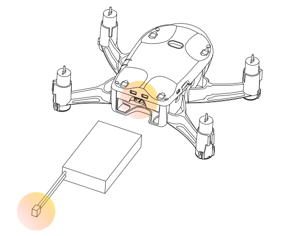

Зарядка и аккумулятор
=====================

Для зарядки аккумуляторной батареи квадрокоптера используйте штатный кабель microUSB из комплекта поставки и разъем microUSB на плате квадрокоптера.

При наличии группового зарядного устройства (поставляется опционально), вы можете заряжать одновременно до 4-х аккумуляторов.

Установка аккумулятора
~~~~~~~~~~~~~~~~~~~~~~

Вставьте аккумуляторную батарею в отсек в нижней части квадрокоптера, аккуратно продвинув батарею до упора.
Подключите разъем АКБ к разъему питания на плате квадрокоптера.
Чтобы не перепутать полярность питания, разъемы снабжены ключами.

Процесс зарядки через USB-разъем квадрокоптера
~~~~~~~~~~~~~~~~~~~~~~~~~~~~~~~~~~~~~~~~~~~~~~

Является основным способом зарядки. Установите и подключите аккумулятор
в квадрокоптер. Возьмите кабель microUSB из комплекта поставки и подключите его к USB-разъему вашего компьютера или к адаптеру питания USB, например от зарядки смартфона.

.. attention:: Напряжение 5 В, рекомендуемая сила тока не более 2 А. При зарядке с большей силой тока через micro-USB квадрокоптера может вывести его из строя.

Настройка группового зарядного устройства
~~~~~~~~~~~~~~~~~~~~~~~~~~~~~~~~~~~~~~~~~

.. sidebar:: Примечание

   Способ зарядки описанный в этом пункте, предназначен для группового зарядного устройства на 4 аккумулятора. Данная зарядка постовляется опционально.
 

Без аккумуляторов подключите групповое зарядное устройство к USB-адаптеру питания или USB-порту компьютера.
Если групповое зарядное устройство исправно, четыре светодиода должны загореться зеленым и загораться по очереди. Важно убедиться в том, что выбра режим напряжения 4,2 В, это можно понять по направлению мигания светодиодов и специальной стрелке на корпусе прибора. В противном случае необходимо нажать специальную кнопку на обратной стороне прибора и удерживать её в течение 3-х секунд во включенном состоянии.

.. attention:: Убедитесь, что светодиоды зарядного устройства загораются в направлении напряжения 4,2 В, прежде чем подключать аккумуляторы!

Процесс зарядки через групповое зарядное устройство
~~~~~~~~~~~~~~~~~~~~~~~~~~~~~~~~~~~~~~~~~~~~~~~~~~~

Извлеките аккумулятор из квадрокоптера. Аккуратно подключите разъем аккумуляторной батареи к соответствующему разъему зарядного устройства. Всего можно подключить до 4 аккумуляторов. Для того, чтобы не перепутать полярность, разъемы снабжены ключами.

Если светодиод канала горит зеленым – батарея заряжена, дополнительная зарядка не требуется. Если светодиод мигает зеленым, это значит, что начался процесс зарядки.

.. attention:: Напряжение 5 В, рекомендуемая сила тока не более 2 А.

Чтобы узнать об индикации и включении коптера перейдите на страницу :doc:`mini first-power-on`
