История и сферы применения
====================================

История развития беспилотных летательных аппаратов
--------------------------------------------------

До начала XXI века, БПЛА в основном представляли собой летательные
аппараты самолетного типа и военного назначения. Это связано с тем, что
электроника тех времен была достаточно дорогой и громоздкой. И
обслуживание такой аппаратуры могли себе позволить в основном только
военные. Любительский авиамоделизм был дорогостоящей экзотикой, а о
квадрокоптере в 1990-х не могло идти и речи. Только с появлением
доступных и достаточно быстродействующих микропроцессоров и миниатюрных
датчиков на основе новых технологий, благодаря всему этому появились
первые проекты автопилотов на их основе. Благодаря этому стало возможно
создание мультикоптеров, поскольку эти аппараты аэродинамически
неустойчивы и требуют постоянной электронной стабилизации в полете.
Развитие мультикоптеров в свою очередь стимулировало развитие полетных
контроллеров и к началу 2010-х годов произошло массовое распространение
беспилотников среди рядовых потребителей и все большому применению в
гражданской сфере.

Первый в истории грузовой БПЛА

При ведении военных действий в труднодоступной местности возникла идея
альтернативного способа доставки своеобразного «груза». Первая воздушная
бомбардировка с применением беспилотных летательных аппаратов состоялась
в 1849 году во время Революции 1848-1849 годов в Австрийской империи.

События происходили примерно через сто лет после первого полета
воздушного шара братьев Монгольфьер в Венецианской Республике, которая
была образована после восстания в Венеции против австрийского правления
в марте 1848 года. Австрийцы в конце концов взяли город в осаду.

Причиной столь неординарной для своего тактики ведения боя, было вызвано
географическим положением Венеции на островах внутри лагуны и
невозможностью артиллерийских орудий тех лет поразить цель с
противоположного берега. Идея об использовании аэростатах с подвешенными
к ним гранатами (рисунок 1) пришла австрийскому артиллеристу Францу фон
Ухатиусу.

+------------+------------+
| |image0|   | |image1|   |
+============+============+
+------------+------------+

Рисунок 1 - Схема аэростата-бомбардировщика [1]

Конструкция представляла собой аэростат, наполняемый горячим дымом. К
нему подвешивалась граната осколочно-фугасного действия, с установленной
на ней запальной трубкой и фитилем. Длина фитиля рассчитывалась таким
образом, чтобы в заданной точке он пережег крепежную веревку и
одновременно воспламенил прессованную пороховую мякоть в запальной
трубке. После этого бомба падала вниз и через несколько секунд -
взрывалась, а облегченный баллон взмывал в небеса. Диаметр шара
составлял 6,9 м, а масса гранаты примерно 15 кг. [3]

Первые попытки были совершены 12 и 15 июня, результат был признан
удовлетворительным и вдохновленный маршал Радецкий поддержал инициативу
Ухатиуса и распорядился срочно начать массовое производство. К августу
по различным оценкам было изготовлено около 200 штук, и 20 или 22
августа был совершен первый авианалет. Несмотря на то, что многие бомбы
не сработали, на венецианцев это произвело большой психологический
эффект и вскоре они прекратили сопротивление и сдали город.

На сегодняшний день грузовые аэростаты переживают «второе рождение» в
сервисах грузоперевозок при помощи БПЛА, таких, как программа Amazon
Prime Air (о ней будет рассказано в разделе **Сферы применения
беспилотных летательных аппаратов – Логистика**).

Радиоуправляемая лодка Николы Теслы

Спустя полвека, в 1898 году в «Новом свете» на выставке изобретений в
Мэдиссон Сквер Гарден в городе Нью-Йорк сербский ученый с мировым именем
Никола Тесла представлял свой прототип всех будущих радиоуправляемых
транспортных средств (рисунок 2).

|image2|

Рисунок 2 – Никола Тесла представляет свой проект [4]

В большом бассейне плавал странного вида для тех лет кораблик с длинной
металлической антенной посередине палубы. С помощь специального пульта
ученый мог им управлять дистанционно без проводов, менять скорость
передвижения, выполнять сложные маневры, мигать огоньками на борту
судна. Команды передавались радиосигналами с пульта управления на
приемную антенну на радиоуправляемом судне, после чего расшифровывались
и уже тогда механика приходила в движение, выполняя указания Теслы,
присланные с пульта. То есть, говоря современным языком, это была первая
радиоуправляемая модель. [5]

«Devil automata» - автоматический дьявол, как Тесла называл это судно
(рисунок 3), является примером развития радио и электричества и
прародителем современного беспилотного транспорта. И что самое важное –
управляемым, в отличие от предыдущего примера с беспилотным
шаром-бомбардировщиком.

|image3|

Рисунок 3 – схема из патента на Devil automata [6]

1903 - 1908 годы. От самолета до винтокрылого аппарата

Если до XX века полеты человек совершал на аппаратах легче воздуха,
подобных дирижаблям и аэростатам, то начало нового столетия ознаменовало
полеты на аппаратах тяжелее воздуха.

Пионеры пилотируемой авиации самолетного типа, братья Райт, 17 декабря
1903 года совершили 4 полета на самолете Flyer I по прямой с
максимальной дальностью 260 метров и продолжительностью и 59 секунд.
Полет осуществлялся при встречном ветре и с использованием катапультного
устройства для пилота.

Следующая версия, Flyer II, преодолела 5 километров. Спустя два года, 5
октября 1905, самолет «Flyer III» (рисунок 4) покрывал уже 39 км.

|image4|

Рисунок 4 – Flyer III конструкции братьев Райт [7]

Если самолет использует для создания подъемной силы крыло, то
винтокрылые аппараты способны взлететь благодаря вращающемуся несущему
винту. К главным преимуществам таких аппаратов относят: возможность
зависать в воздухе и осуществлять вертикальный взлет и посадку.

Поэтому следующим шагом стал аппарат изобретателей французского
происхождения братьев Бриге и Шарля Рише, построенный в 1907 г. Взлетная
масса аппарата равнялась почти 600 кг, в конструкции было 4 винта
диаметром по 4,1 метра. Назывался данный аппарат Gyroplane No. I
(рисунок 5).

|image5|

Рисунок 5 - Gyroplane No. I [8]

К сожалению, взлететь ему удалось всего лишь на 60 сантиметров
(впоследствии – на 1,5 метра), и полет его был трудноуправляем. Тем не
менее уже в 1908 году появился Gyroplane No.II (рисунок 6) по схеме
биплан с винтами между крыльями, которому удалось совершить несколько
полетов, прежде чем он разбился при жесткой посадке [9]. Схема гироплана
(другие названия – гирокоптер, автожир) сейчас достаточно успешно
используется в малой авиации как аналог небольшим пассажирским
вертолетам. Подробнее об автожирах вы узнаете в разделе ??.

|image6|

Рисунок 6 - Gyroplane No.II

Что интересно - впоследствии братья Бриге основали самолетостроительную
компанию Breguet Aviation, которой суждено было проработать целых 60 лет
и в 1971 году влиться в французский концерн Dassault, на счету которого,
например, бизнес-джеты серии Falcon, многоцелевые истребители Rafale и
Mirage, перспективные беспилотники nEUROn [8].

1917 – 1920 годы. Гирокомпас и умные летающие бомбы

К концу первой мировой авиация вошла в арсенал военных наравне с танками
и артиллерией. В 1917 году доктор Питер Купер и Элмер Сперри изобрели
автоматический гиростабилизатор (гирокомпас), который позволял самолету
удерживать заданное направление полета. В результате удалось превратить
учебный самолет Curtiss N-9 (рисунок 7) в первую беспилотную летающую
бомбу.

Во время тестовых полетов самолет пролетел 50 миль с 300-ти фунтовым
(136 килограмм) боеприпасом на борту, однако ему так и не довелось
поучаствовать в боях.

|image7|

Рисунок 7 – Curtiss N-9 [11]

Самолет управлялся с помощью двух механических гироскопов (рисунок 8):
один стабилизировал бомбу в полете по углу крена, другой удерживал ее на
заданном курсе. Для выхода на заданную высоту полета самолет был оснащен
`барометрическим <https://ru.wikipedia.org/wiki/%D0%91%D0%B0%D1%80%D0%BE%D0%BC%D0%B5%D1%82%D1%80>`__
`альтиметром <https://ru.wikipedia.org/wiki/%D0%90%D0%BB%D1%8C%D1%82%D0%B8%D0%BC%D0%B5%D1%82%D1%80>`__,
который выставлялся на определенное фиксированное значение перед
запуском. Сам самолет взлетал с катапульты или с корпуса движущегося
автомобиля [11].

|image8|

Рисунок 8 - авиационный гирокомпас конструкции Сперри [12]

В отличие от аппарата Сперри, «Жук» Кеттеринга, или воздушная торпеда
Кеттеринга [13], разрабатывался не на основе какого-то конкретного
самолета, а с нуля. Это делалось с целью упростить и облегчить
конструкцию, избавив ее от элементов, необходимых для пилотируемого
полета, а также подготовить аппарат к массовому производству, обеспечив
его минимальную стоимость при изготовлении.

Сделанная из дерева и тканевого полотна «воздушная торпеда Кетеринга»
(рисунок 9) представляла собой небольшой биплан, взлетающий с рельсовой
катапульты, вооруженный бомбовой нагрузкой также в 300 фунтов, и
предназначалась для бомбардировки городов и других больших объектов.
Можно считать ее первым действующим прообразом современной крылатой
ракеты.

Модификация состояла в том, что, в дополнение к гирокомпасу, на борту
«торпеды» было установлено устройство, считающее количество оборотов
винта и таким образом оценивающее оставшееся расстояние до цели. При
достижении цели самолет сбрасывал крылья и превращался в пикирующую
бомбу.

|image9|

Рисунок 9– Воздушная торпеда («Жук» Кеттеринга) и ее конструктор Чарльз
Кеттеринг [13]

1922 – 1942 годы. Первые пилотируемые вертолеты

Одним из первых стабильно летающих вертолетов, построенных по
мультироторной схеме, принято считать разработку Георгия Ботезата
(рисунок 10) - российского эмигранта, уехавшего в США после событий
революции 1917 года. Первый полет его аппарата состоялся в 1922 году и
разрабатывался по заказу военно-воздушных сил США.

Аппарат мог подняться на высоту до 5 метров. Для управления тягой и
поворотом вокруг одной из осей (крен, тангаж, рыскание) использовалось
два небольших винта с переменным шагом. Таким образом, всего получалось
6 винтов.

\ |image10|

Рисунок 10– Вертолет Ботезата

К сожалению, как и у гироплана Бриге-Рише, конструкция Ботезата также
оказалась сложной и громоздкой и не обеспечивала необходимой тяги для
подъема полезного груза на нужную высоту.

Военные того времени решили прекратить финансирование проекта и отдать
предпочтения автожирам, а сам Георгий Ботезат вернулся к тематике
вертолетов только после 1936 года.

Но к этому времени его обошел другой эмигрировавший в США
авиаконструктор российского происхождения Игорь Сикорский, создавший
первый серийный вертолет Sikorsky R-4, который успешно взлетел в 1942
году. Одновинтовая схема вертолета Sikorsky R-4 (рисунок 11) стала
классической и до сих пор используется на большинстве аппаратов данного
типа.

|image11|

Рисунок 11 – Вертолет Sikorsky R-4

1935 год. Первый радиоуправляемый «дрон» - беспилотный самолет-мишень

Боевая авиация успешно развивалась и начинала наносить все более
чувствительный урон во время военных действий. Необходимо было найти
способы увеличить эффективность основного средства противодействия
самолетам – зенитной артиллерии.

Для тренировки расчетов зенитной артиллерии в Великобритании был создан
и в 1935 году совершил свой первый полет радиоуправляемый самолет-мишень
De Havilland DH82B Queen Bee «Королева пчел» [14] (рисунок 12),
созданный на базе популярного учебно-тренировочного самолета Tiger Moth
[15] Это был первый массовый полноразмерный радиоуправляемый самолет.

|image12|

Рисунок 12 – Queen Bee в полете

Самолет имел две кабины: в передней мог при необходимости размещаться
пилот, в задней находилась аппаратура радиоуправления с пневматической
системой серводвигателей, подсоединенных к аэродинамическим рулям
управления самолетом. Слева от двигателя находился четырехлопастной
вентилятор, использующийся для обеспечения работы пневматической
системы.

Всего было построено около 380 экземпляров данной модификации, а его
основа Tiger Moth использовалась в Королевских ВВС до 1959 года.

Возможно, De Havilland Queen Bee не зря прозвали «матерью всех дронов»
[16], так как многие современные дроны используют отработанные на ней
технологии: взлет с катапульты, специальная раскраска управляющих
поверхностей для определения ориентации самолета в воздухе, систему
автоматической беспилотной посадки в случае потери радиосвязи.

Вторая мировая война и развитие систем телеуправления

Вторая мировая война запустила серьезную гонку вооружений. Одним из
перспективных направлений были системы телеуправления, причем объектами
такого управления могли становиться танки, самолеты-бомбардировщики
(американский Interstate TDR-1, советские ТБ-1 и ТБ-3), планирующие
управляемые бомбы (немецкие Henschel Hs 293 и Fritz-X) и прочие виды
техники. Некоторые из образцов изготавливались относительно массово, и,
хотя не внесли решающего вклада в войну, использовались как полноценное
оружие.

Самым известным беспилотным агрегатом стала нацистская крылатая ракета
Фау-1 (рисунок 13, 14), показавшая перспективу массового применения
беспилотных летательных аппаратов в боевых действиях.

На начальном этапе Второй мировой войны авиапроизводитель Fieseler
разработал Fieseler Fi-103, ставшую известной как Фау-1
(Vergeltungswaffe – оружие возмездия). Она является первой серийной
крылатой ракетой, имевшей успешное боевое применение. Фау-1 была
оснащена пульсирующим воздушно-реактивным двигателем, который позволял
преодолевать расстояние в 250-400 км с бомбовой нагрузкой в 750-1000 кг.

|image13|

Рисунок 13 – Фау-1

Ракета могла стартовать как с пусковой установки с земли, так и с
самолета-носителя. Система управления ракетой представляла собой
механический программируемый автопилот. Ориентация и стабилизация
осуществлялась с помощью командных приборов на борту: главный 3-х осевой
гироскоп, два вспомогательных 2-х осевых гироскопа, магнитный компас,
барометр и другие. Дальность полета задавалась перед стартом. В полете
лопастной анемометр (датчик скорости набегающего потока воздуха)
скручивал этот счетчик до нуля, после чего пневматическая часть системы
управления переводила руль высоты в режим пикирования, и ракета
устремлялась вниз к цели.

|image14|

Рисунок 14 – Конструкция Фау-1

Первое боевое применение «оружия возмездия» состоялось в 1944 году при
бомбардировке Лондона. К 1945 году в направлении Лондона было запущено
около 10 000 крылатых ракет. В реальности своей цели достигали немногие,
однако эффект от применения нового оружия был поистине устрашающий. По
некоторым оценкам, Фау-1 нанесла достаточно серьезный ущерб
Великобритании, унеся жизни более 5000 человек.

После войны. Скоростные «внедорожные» разведчики

Во-второй половине XX века американские вооруженные силы активно
вкладывали деньги в проекты, казавшимися им перспективными. Примером
такого проекта можно назвать «летающий джип» Curtiss-Wright VZ-7
(рисунок 15), первый полет которого состоялся в 1958 году.

Армии США требовался малозаметный скоростной разведчик – «летающий
внедорожник», который бы мог добраться в труднодоступные местности с
минимальным риском обнаружить себя.

Аппарат, построенный по схеме квадрокоптера, мог разгоняться до 51 км/ч
и подниматься на высоту в 60 м., а также перевозить одного пассажира или
около 100 кг. груза. Управление осуществлялось изменением шага винтов и
рулевой пластиной, расположенной в выхлопной струе двигателя сзади, что
отличает его по типу управления от современных квадрокоптеров.

Всего было изготовлено два экземпляра, которые успешно прошли испытания,
но не устроили заказчиков – военных, и проект был закрыт. Тем не менее,
можно считать этот проект одним из предвестников современных аэротакси,
с которыми мы познакомимся в разделе(добавить ссылку) ??.

|image15|

Рисунок 15 – Curtiss-Wright VZ-7

Современные военные БПЛА

Современные военные БПЛА подразделяются на:

-  разведывательные – производят разведку и целеуказание, а также могут
   являться ложными целями для систем противовоздушной обороны;

-  ударные – несут на борту вооружение, способны вести огонь
   самостоятельно;

-  многоцелевые.

Большая часть таких БПЛА – самолетного типа. Лишь в последнее время
начали появляться отдельные образцы мультироторного типа.

В конце 1970 - начале 1980 годов израильские военно-воздушные силы
создавали инновационные по тем временам аппараты, которые успешно вошли
в состав воздушного флота многих стран, в том числе и США.

В 1978 году Israel Aircraft Industries разработали БПЛА Scout
«разведчик» (рисунок 16) - поршневой самолет с 13-футовыми (около 4
метров) крыльями, изготовленными из стекловолокна. Его было достаточно
сложно сбить благодаря небольшим размерам и малой радиолокационной
заметности. Основная задача этого устройства - передавать оперативную
информацию в реальном времени с обзорной 360\ :sup:`о` телекамеры,
установленной на борту.

В ходе Ливанской войны в 1982 году израильские военные задействовали
большое количество таких БПЛА для операции по разгрому группировки сил и
средств противовоздушной обороны Сирии. Это было первое массированное и
успешное применение БПЛА в боевых условиях.

|image16|

Рисунок 16 – IAI Scout

Scout и сейчас состоит на вооружении, несмотря на то что уже появились
разведывательные БПЛА куда меньшего размера.

Среди вооруженных (ударных) БПЛА - известный MQ-1 Predator (рисунок 17),
разработанный в США. Изначально, это был разведывательный БПЛА, на
который после модернизации решили установить два ракеты класса
«воздух-земля» для поражения различных наземных целей, будь то
движущийся танк или подземный бункер.

При этом оператор БПЛА может находиться за многие тысячи километров от
места полета аппарата (рисунок 18) – таковы возможности дальней
радиосвязи военного беспилотника. На данный момент редкий военный
конфликт обходится без участия MQ-1 Predator.

|image17|

Рисунок 17 – MQ-1 Predator с ракетой HellFire

|image18|

Рисунок 18 – современное рабочее место оператора боевого БПЛА

Основным вектором развития БПЛА в начале XXI века стало повышение
автономности. А также, в зависимости от типа БПЛА, увеличение
тяговооруженности, снижение радиолокационной заметности. Примером
последних разработок является хорошо известный экспериментальный самолет
Northrop Grumman X-47B (рисунок 19), обладающий высокой степенью
автономности и способный совершать большинство действий без
вмешательства оператора. К примеру, в 2013 году он совершил
автоматическую посадку на палубу авианосца, а в апреле 2015 года стал
первым БПЛА, который произвел дозаправку в воздухе [17]. К сожалению,
проект сворачивается из-за чрезвычайно высокой стоимости.

|image19|

Рисунок 19 – БПЛА X-47B на палубе авианосца

В России 3 августа 2019 года совершил первый 20-минутный полет тяжелый
ударный БПЛА нового поколения С-70 «Охотник» разработки ОКБ Сухого
(облет аэродрома на высоте 600 метров в полностью автономном режиме).

В сентябре 2019 года «Охотник» выполнил первый совместный полет с
истребителем 5-го поколения Су-57 (рисунок 20) для отработки
взаимодействия по расширению радиолокационного поля истребителя и
целеуказанию для применения авиационных средств поражения [18].

|image20|

Рисунок 20 – Совместный полет С-70 «Охотник» и истребителя Су-75

Вопросы для самопроверки
------------------------

#. Какая страна первая применила беспилотные аэростаты в военных целях? Как они были устроены?
#. Как называется устройство, позволяющее автоматически стабилизировать полёт летательного аппарата? Что входит в его состав?
#. Где был построен первый серийный вертолёт? Кто являлся его главным конструктором?
#. Назовите модели современных БПЛА военного назначения? Какие у них бывают различия?
#. По каким причинам квадрокоптеры в современном виде, не появились раньше? Что этому мешало?

Материалы для самостоятельного изучения
---------------------------------------

Видеоролики от Никиты

О чем ролик. Скриншот. Ссылка

Список использованных источников
--------------------------------

1.  On This Day: Austria Drops Balloon Bombs on Venice (на английском
    языке)
    http://www.findingdulcinea.com/news/on-this-day/July-August-08/On-this-Day--Austria-Rains-Balloon-Bombs-on-Venice.html

2.  The History Of Drones (Drone History Timeline From 1849 To 2019) (на
    английском языке) https://www.dronethusiast.com/history-of-drones/

3.  22 августа 1849 года состоялась первая в мире воздушная
    бомбардировка https://aftershock.news/?q=node/328911&full

4.  Автоматичният дявол - радиоуправляемая лодка Николы Тесла (на
    болгарском языке)
    https://nauka.offnews.bg/news/Tehnologii\_7/Avtomatichniiat-diavol\_67896.html

5.  Радиоуправляемая лодка Теслы
    https://wariwona.livejournal.com/77658.html

6.  Nikola Tesla U.S. Patent 613,809 - Method of and Apparatus for
    Controlling Mechanism of Moving Vehicle or Vehicles
    https://teslauniverse.com/nikola-tesla/patents/us-patent-613809-method-and-apparatus-controlling-mechanism-moving-vehicle-or

7.  Wright Flyer III - статья в Википедии (на английском языке)
    https://en.wikipedia.org/wiki/Wright\_Flyer\_III

8.  Нобелиат эпохи Возрождения
    https://polymus.ru/ru/news/blogs/channels/15386-nobelevskie-laureaty/129551/

9.  Breguet-Richet Gyroplane No.2
    http://www.aviastar.org/helicopters\_eng/breguet\_gyro2.php

10. Автожир - статья в Википедии https://ru.wikipedia.org/wiki/Автожир

11. Летающая бомба Сперри (Sperry Flying Bomb) - статья в Википедии
    https://ru.wikipedia.org/wiki/Sperry\_Flying\_Bomb

12. Aircraft gyrocompass built by Sperry - статья в Википедии
    https://en.wikipedia.org/wiki/Elmer\_Ambrose\_Sperry#/media/File:Horizontal-gyro\_hg.jpg

13. Воздушная торпеда Кеттеринга - статья в Википедии
    https://ru.wikipedia.org/wiki/Воздушная\_торпеда\_Кеттеринга

14. De Havilland DH82B Queen Bee (de Havilland Aircraft Museum) (на
    английском языке)
    https://www.dehavillandmuseum.co.uk/aircraft/de-havilland-dh82b-queen-bee/

15. De Havilland Tiger Moth - статья в Википедии
    https://ru.wikipedia.org/wiki/De\_Havilland\_Tiger\_Moth

16. The Mother of All Drones (история развития проекта De Havilland
    Queen Bee) (на английском языке)
    http://www.vintagewings.ca/VintageNews/Stories/tabid/116/articleType/ArticleView/articleId/484/The-Mother-of-All-Drones.aspx

17. Northrop Grumman X-47 - статья в Википедии
    https://ru.wikipedia.org/wiki/Northrop\_Grumman\_X-47B

18. Новейший ударный беспилотник "Охотник" совершил первый совместный
    полет с Су-57 https://tass.ru/armiya-i-opk/6937073

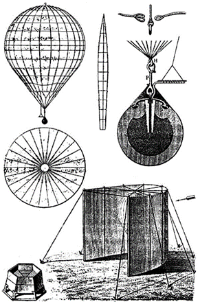
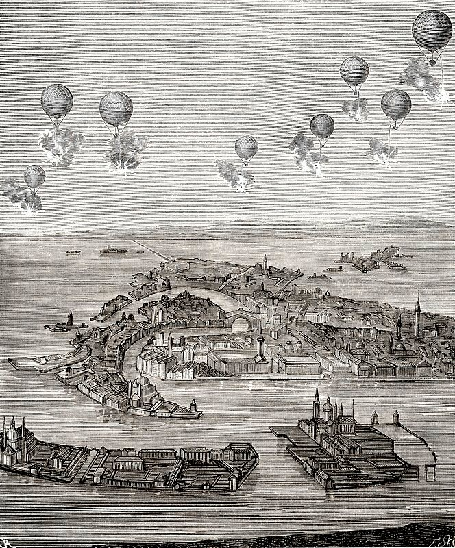
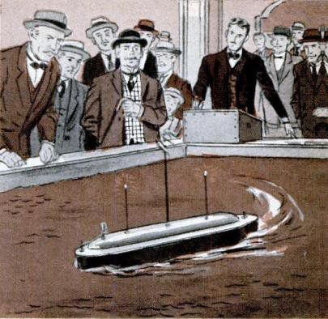
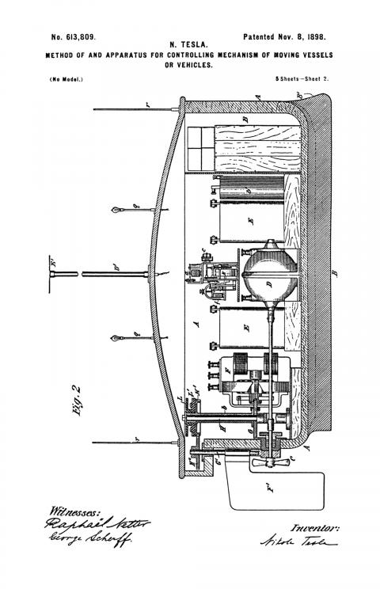
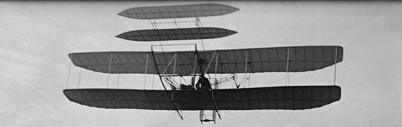
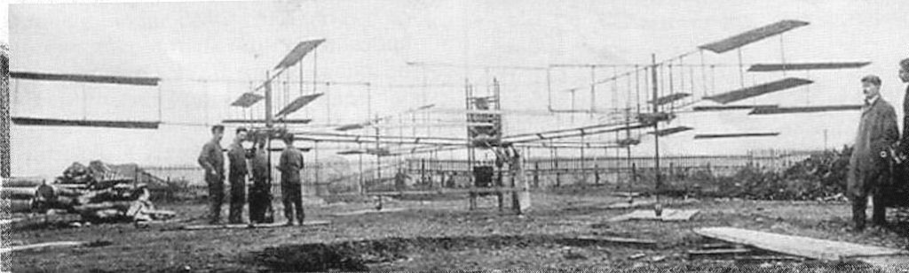
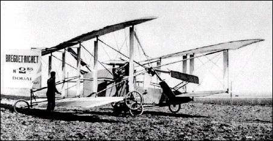
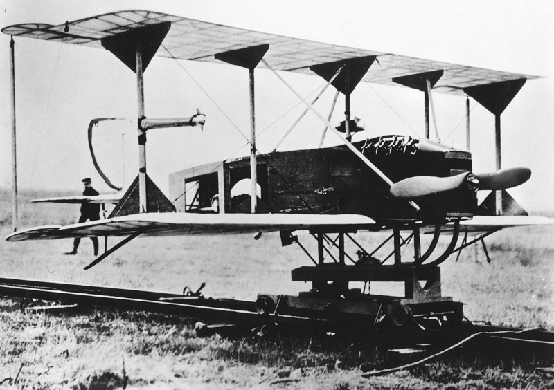
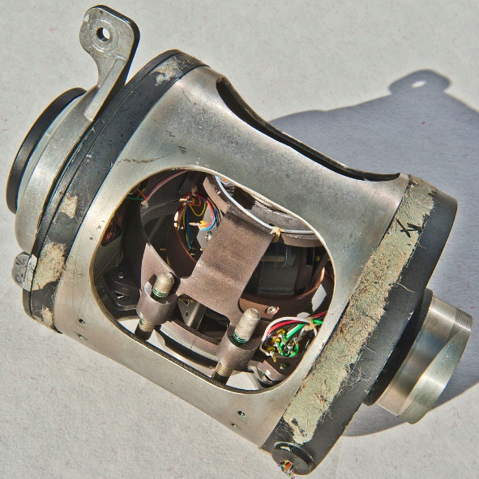
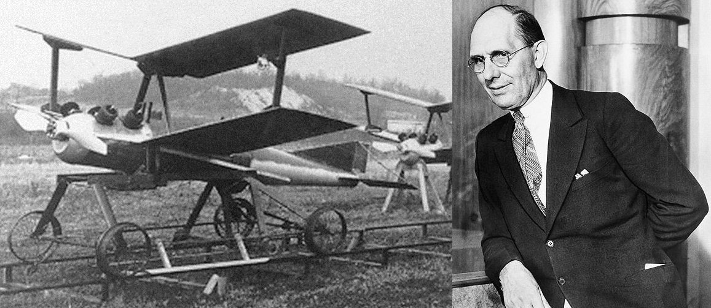
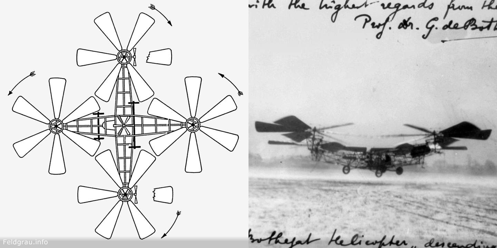
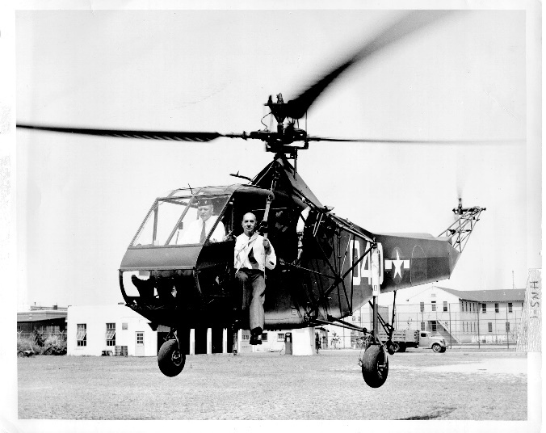
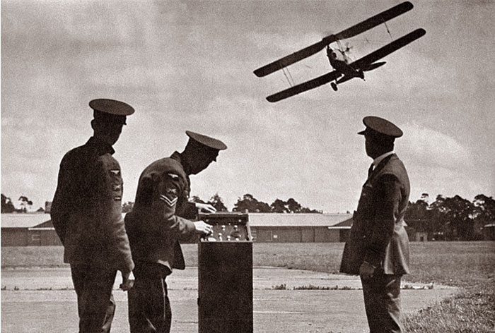
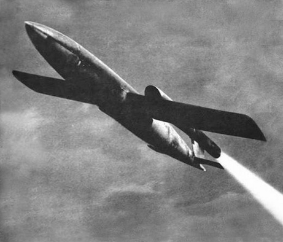
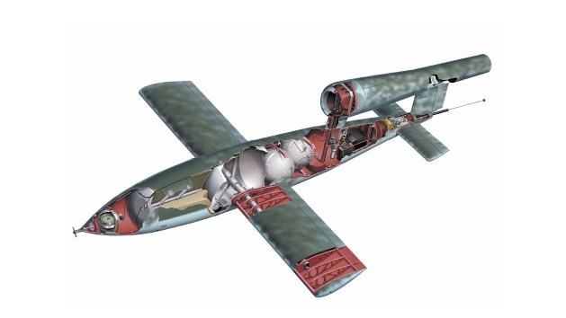
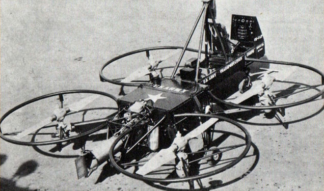
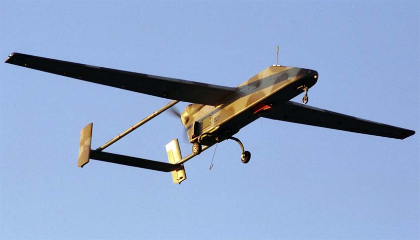
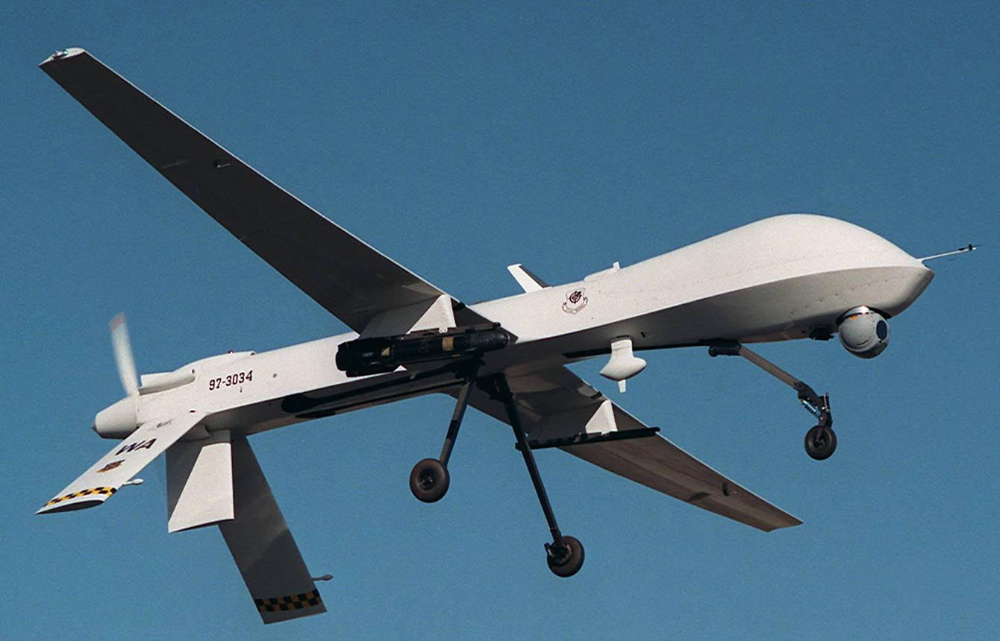
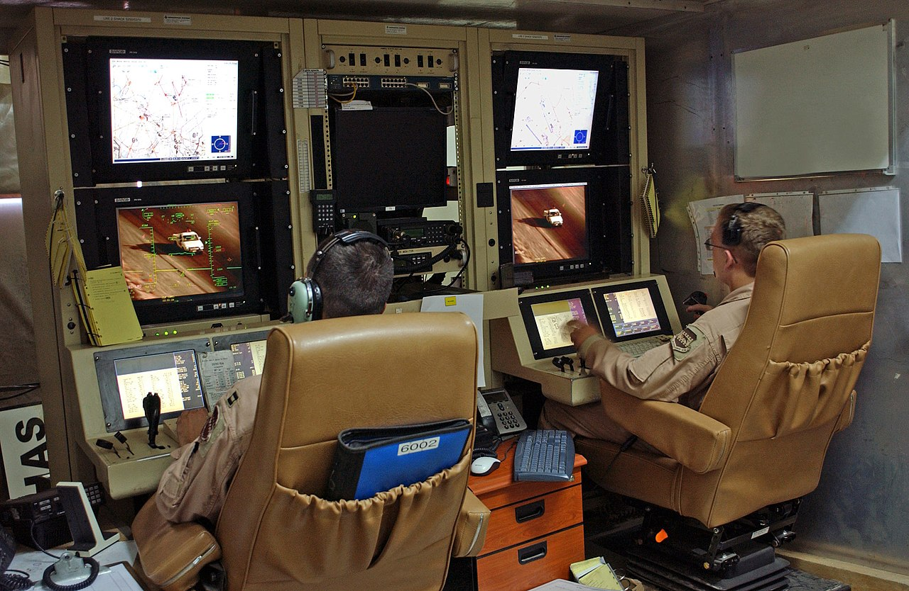
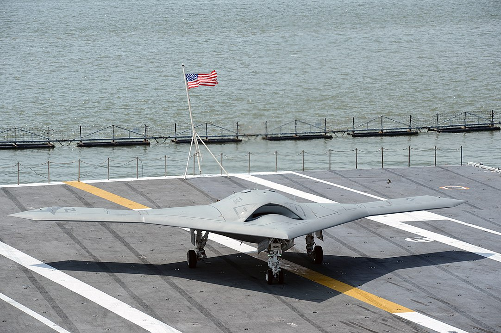
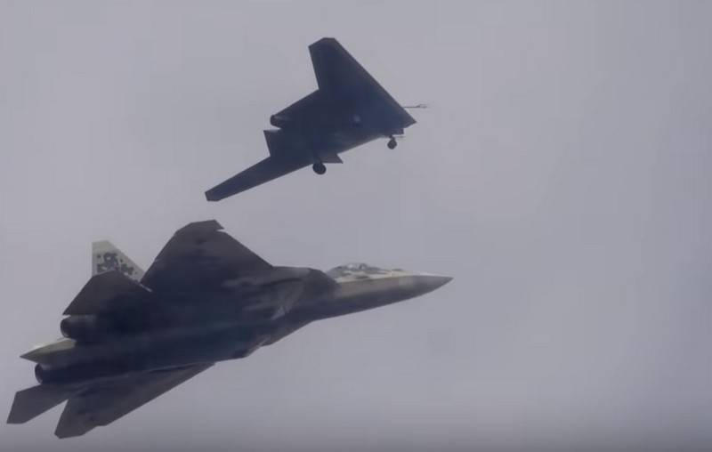
