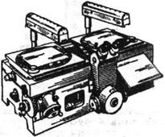
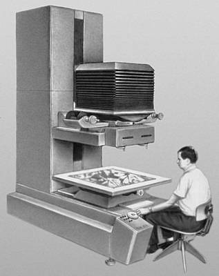
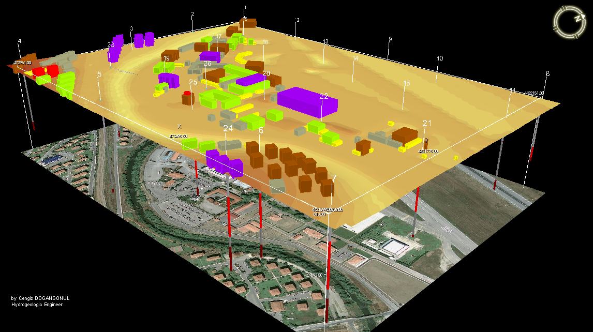
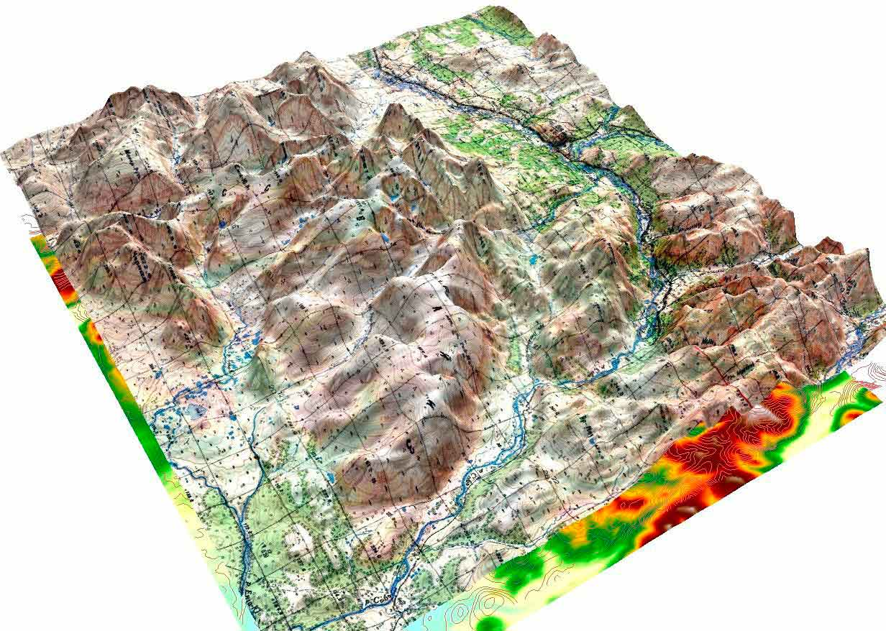
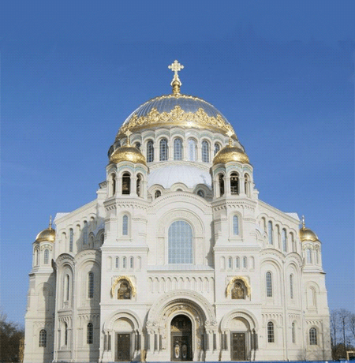
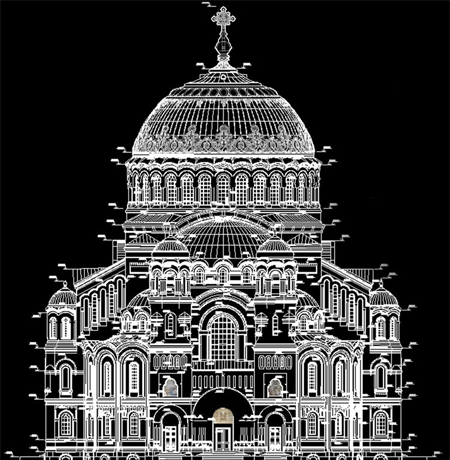

Фотограмметрия, как наука
=========================

После проведения аэрофотосъёмки или космической съёмки результаты
снимков необходимо обработать. Именно этим и занимаемся такая наука как
фотограмметрия.

Термин **«фотограмметрия»** происходит от трех греческих
слов: \ **photos** – свет, \ **gramma** - запись, \ **metrio** –
измерение. Дословно – измерение светозаписи.

Фотограмметрия — это научно-техническая дисциплина, занимающаяся
определением характеристик объектов, таких как форма, размеры, положение
в пространстве и других свойств объектов, по фотографическим
изображениям.

Дисциплина использует все существующие виды изображений, полученные с
помощью фотокамер, цифровых камер, телевизионных камер, сканерных
съемочных систем, радиолокационных и лазерных съемочных систем и т.д. и
развивается по трем основным направлениям.

**Первое** направление связано с созданием карт и планов по снимкам. Это
направление часто называют фототопографией.

**Второе** направление связано с применением фотограмметрии для решения
прикладных задач в различных областях науки и техники: в архитектуре,
строительстве, медицине, криминалистике, автомобилестроении,
робототехнике, военном деле, геологии и т.д. Это направление в
фотограмметрии называют наземной или прикладной фотограмметрией.

**Третье** направление – это космическая фотограмметрия. Снимки Земли,
полученные из космоса, используются для изучения ее природных ресурсов и
для контроля за охраной окружающей среды. Снимки других небесных тел, в
частности Луны, Венеры, Марса, позволяют изучить их рельеф и получить
много другой полезной информации.

Такое широкое применение фотограмметрии обусловлено следующими ее
достоинствами:

-  Высокая точность, потому что снимки объектов получают прецизионными
   (с соблюдением высокой точности параметров) камерами, а обработку
   снимков выполняют строгими методами.

-  Высокая производительность, достигаемая благодаря тому, что измеряют
   не сами объекты, а их изображения. Это позволяет автоматизировать
   процессы измерений по снимкам и последующую обработку на компьютере.

-  Объективность и достоверность информации, за счет того, что
   информация об объекте получается фотографическим путем.

-  Возможность повторения измерений в случае получения спорных
   результатов.

-  Возможность получения в короткий срок информации о состоянии, как
   всего объекта, так и отдельных его частей.

-  Безопасность выполнения работ, так как измерения выполняются
   неконтактным методом. Это имеет особое значение, когда объект
   недоступен или пребывание в его зоне опасно для здоровья человека.

-  Возможность изучения неподвижных, а также медленно и быстро
   движущихся объектов, скоротечных и медленно протекающих процессов.

Фотограмметрия как наука появилась в середине 19 столетия, через 13 лет
после появления фотографии. Однако использование перспективных
изображений при составлении топографических карт осуществлено
значительно раньше. Теоретическое обоснование возможности определения
формы, размеров и положения объекта в пространстве по его перспективному
изображению было дано в 1759 году И. О. Ламбертом в работе «Свободная
перспектива». В 1764 году великий русский ученый М. В. Ломоносов в
инструкции для географических исследований России предложил составлять
перспективные рисунки местности с помощью камеры-обскуры. В 1839 году
французский ученый Ж. М. Дагер применил для фиксации изображения,
получаемого с помощью такой камеры, светочувствительное серебро, которое
наносилось на металлическую пластинку. На этой пластинке получалось
позитивное фотографическое изображение. Так появилась фотография.

Применять фотографии для создания топографических карт впервые предложил
французский геодезист Доминик Ф. Араго примерно в 1840 г., а в 1860 г.
французский военный инженер Э. Лосседа выполнил фотографирование Парижа
с воздушного шара и по фотоснимкам создал план, точность которого
оказалась выше плана, полученного геодезическим методом. Этой работой
было положено начало фотограмметрического метода съемки, который в
последующие годы совершенствовался и стал применяться во многих странах.

В России первые фототопографические съемки были выполнены в 1891-1898
гг. инженерами Н.О. Виллером, Р.Ю. Тиле, П.И. Щуровым для целей
трассирования железных дорог в Закавказье и Восточной Сибири.

В истории развития фотограмметрии можно выделить три основных периода,
которые можно условно назвать как аналоговая, аналитическая и цифровая
фотограмметрия.

Аналоговая фотограмметрия берет свое начало с изобретения в 1901 г. К.
Пульфрихом стереокомпаратора (рисунок - 1). Этот прибор позволяет
измерять координаты точек снимков составляющих стереопару.

|image0|

Рисунок 1 – стереокомпаратор К. Пульфриха

Далее развитие фотограмметрии пошло по пути создания специальных
оптических и механических приборов, предназначенных для
непосредственного создания карт по аэро и наземным снимкам. Эти приборы
позволяют выполнить все процессы преобразования снимков в карту. Первый
такой прибор, стереоавтограф, был разработан в 1909 г. (Е. Орель) для
создания карт по наземным снимкам. В 1915 г Газзер запатентовал
стереопроектор, который стал прототипом мультиплекса, позволяющего
построить стереоскопическую модель на экране по множеству снимков и
измерять ее с целью создания карты. В 1932 г. Ф.В.Дробышев изобрел
стереометр, позволяющий нарисовать рельеф местности непосредственно на
снимках. Контурную часть карты получали по фотопланам, составленных по
множеству трансформированных снимков. Трансформирование снимков
выполняли на специальных приборах, называемых фототрансформаторами
(рисунок - 2), которые позволяют преобразовать наклонный снимок в
горизонтальный. В этот период было разработано достаточно много
различных универсальных фотограмметрических приборов, как в России, так
и за рубежом, которые используются в некоторых предприятиях и в
настоящее время.

|image1|

Рисунок 2 - Фототрансформатор

Аналитическая фотограмметрия. Этот этап в развитии фотограмметрии
начинается с появлением ЭВМ (примерно в 1950г.). Начиная с этого времени
стали развиваться аналитические методы фотограмметрической обработки
снимков, которые продолжают совершенствоваться и по настоящее время. В
1957 г. У.В. Хелава (Канада) разработал первый аналитический
универсальный прибор, представляющий собой сочетание стереокомпаратора и
электронной вычислительной машины. На стереокомпараторе выполнялись
измерения координат точек снимков, а на ЭВМ – все преобразования этих
измерений в проекцию карты. По сравнению с аналоговыми приборами
аналитические позволяют значительно повысить точность обработки снимков
и производительность. Таких приборов и систем было разработано
достаточно много (Швейцария, Германия, Франция, Италия, Россия и
Украина). В настоящее время они не выпускаются, но используются на
производстве.

Цифровая фотограмметрия начала развиваться с появлением цифровых
изображений. В начале 90-х годов прошлого столетия появились первые
коммерческие цифровые фотограмметрические системы, позволяющие решать
все фотограмметрические задачи на компьютере, включая стереоскопическое
наблюдение и измерение снимков на экране компьютера. Отличительной
особенностью цифровых фотограмметрических систем является возможность
широкой автоматизации всех процессов преобразования снимков в карту. Это
направление в развитии фотограмметрии в настоящее время является
основным и уже широко применяется на производстве.

Современная технология обработки материалов аэрофототопографической
съемки предполагает получение цифровых топографических или специальных
карт (планов) соответствующего содержания:

**Цифровая карта** – это карта (план) в цифровой форме, обеспечивающей
возможность ее хранения, манипулирования и отображения. При этом
математическая основа цифровой карты, проекция, разграфка, точность и
др. остаются такими же, как и для соответствующей ей аналоговой карты.

**Цифровая модель местности (ЦММ)** – совокупность информации о
положении, характеристиках объектов местности, связях между ними, а
также топографической поверхности, представленные в форме, доступной для
обработки на программном обеспечении.

|image2|

Рисунок 3 - Цифровая модель местности (ЦММ)

Основой для получения цифровой карты является цифровая модель местности
(ЦММ), в составе которой можно выделить и цифровую модель рельефа (ЦМР).

**Цифровая модель рельефа (ЦМР)** – информация о рельефе местности,
представленная совокупностью точек с известными координатами и высотами,
связей между ними и способа определения высот новых точек по их
известным плановым координатам.

|image3|

Рисунок 4 - Цифровая модель рельефа (ЦМР)

Для решения задач цифровой фотограмметрии на современном этапе развития
применяются полнофункциональные цифровые фотограмметрические системы,
ориентированные на решение всего комплекса задач по созданию
топографических и специальных карт и планов, эксплуатируются во многих
специализированных топографо-геодезических и изыскательских организациях
и не только.

Огромным плюсом сегодняшнего времени стало появление трёхмерных
технологий, позволяющие получать модели цифровых карт, ЦММ и ЦМР в
режиме 3D, что значительно усовершенствовало такую дисциплину как
фотограмметрия.

На сегодняшний день можно смело сказать, что фотограмметрия переживает
взрывной рост в архитектуре и строительстве, социально­-культурной
сфере, киноиндустрии и анимации в компьютерных играх.

Для примера возьмем мониторинг процесса строительства — весьма
актуальная проблема. Уже несколько лет 3D­ модель объекта строительства
используют для отображения прогресса стройки. Например, готовая в срок
часть объекта на модели отображается зеленым, находящаяся в процессе —
желтым, к строительству которой еще не приступили — серым (или скрыта
вовсе), а просроченная — красным. Однако эти данные могут быть
необъективны, так как не показывают непосредственно строительную
площадку, а определить общий прогресс по фотографиям, как правило,
довольно тяжело.

Фотограмметрия предлагает инновационное решение этой проблемы.
Используется БЛА, который по заданной траектории облетает строительную
площадку и производит аэрофотосъемку объекта. Далее массив фотографий
выгружается в один из программных комплексов и производится сборка
актуальной модели. Установив период облета, будь то неделя или месяц,
удается отследить объективный прогресс строительства, который можно
использовать для отчетов начальству. С помощью дополнительного ПО можно
даже сравнивать эти две модели и подсвечивать разницу в них.

Большинство архитекторов и проектировщиков сталкиваются с задачей
реставрации старых зданий, а иногда и ремонта новых. Задача приобретает
масштаб катастрофы в тот момент, когда срочно необходимы чертежи
объектов с указанными размерами, а они утеряны или уже потеряли свою
актуальность. В помощь архитекторам и другим специалистам, связанным с
реконструкцией и реставрацией зданий, приходит именно фотограмметрия.
Нужный объект фотографируется, а после по смежным изображениям
выявляются одинаковые точки и определяется их положение в координатах
базового снимка. Точки складываются воедино на воображаемых каркасах, и
получается готовая модель (рисунок - 5).

|image4|\ |image5|

Рисунок 5 – Фотограмметрия в архитектуре

Социально-­культурная сфера — это другая область инновационного
применения фотограмметрии. Сейчас в музеях и выставочных центрах во всем
мире наиболее популярна технология виртуального тура. Это набор
сферических панорам, соединенных между собой ссылками для перехода. У
нее определенно есть свои плюсы — это дешево, быстро и просто.

С помощью фотограмметрии можно создать интерактивный трехмерный тур в
виртуальной реальности. Фотореалистичность, универсальность,
интерактивность — отличие колоссальное. Цифровой камерой делается массив
фотографий, например, скульптуры и комнаты, в которой она находится.
Далее этот массив загружается в программные продукты, и после доработки
специалистами на выходе мы имеем трехмерную комнату со скульптурой,
которую можно буквально обойти вокруг и посмотреть со всех ракурсов.

В последние годы фотограмметрия нашла свое место в современной
киноиндустрии, объемное изображение фильмов по так называемой 3D
технологии получило особую популярность у молодежи. Главный метод
мультипликации с ее самого начала развития всегда завораживал своими
конечными результатами в виде популярных мультипликационных фильмов. А
всем известный фильм «Аватар» Дж. Кэмерона был частично совмещен с
анимацией и технологиями фотограмметрии для воссоздания эффектной
планеты «Пандора».

Особо следует отметить применения технологического процесса
фотограмметрии в разработке современных компьютерных игр. Он заключается
в пошаговом качественном фотосканировании и получении при помощи
специальных программ объемной геометрии от многочисленных
фотоизображений различных ракурсов. К примеру, с помощью такой
технологии были созданы игры «Star Wars: Battlefront» и «Cyberpunk 2077»

Примечательно, что теперь с помощью фотограмметрии и специального ПО
любой желающий может с легкостью создать любую 3D модель существующего
объекта с помощью камеры и сделанных на неё фотоснимках. Именно этому мы
и научимся с вами в следующем разделе.

Вопросы для самопроверки:
-------------------------

-  Какие три основные направления в фотограмметрии? Что они решают?

-  С чем связано появление такой науки как фотограмметрия?

-  Что такое цифровая карта?

Список использованных источников:
---------------------------------

1. `https://studopedia.ru/15\_137662\_nekotorie-svoystva-tsentralnoy-proektsii-v.html <https://studopedia.ru/15_137662_nekotorie-svoystva-tsentralnoy-proektsii-v.html>`__

2. https://geostart.ru/post/293

3. https://books.ifmo.ru/file/pdf/2455.pdf

