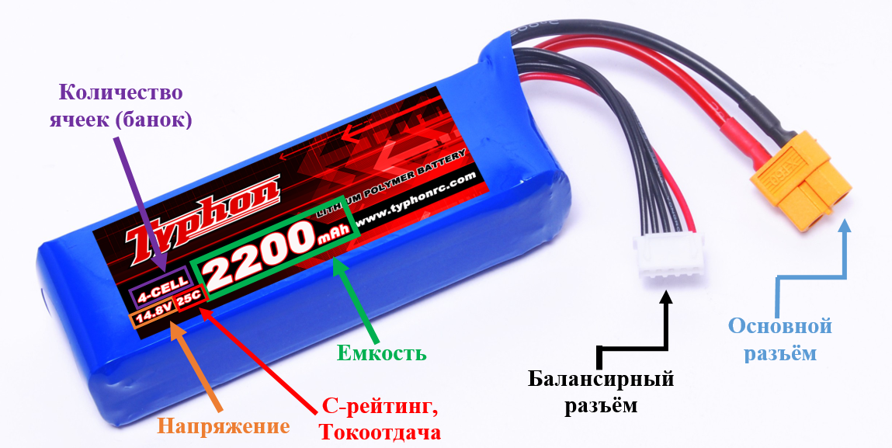
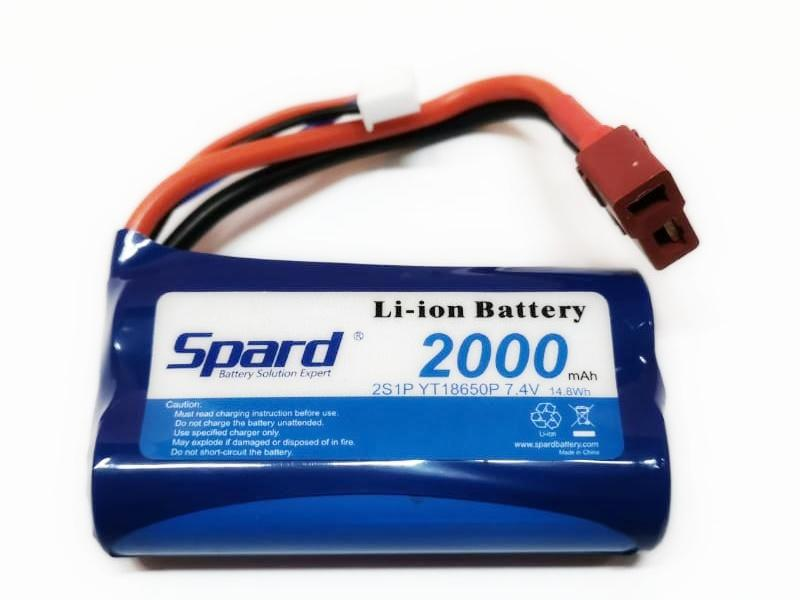
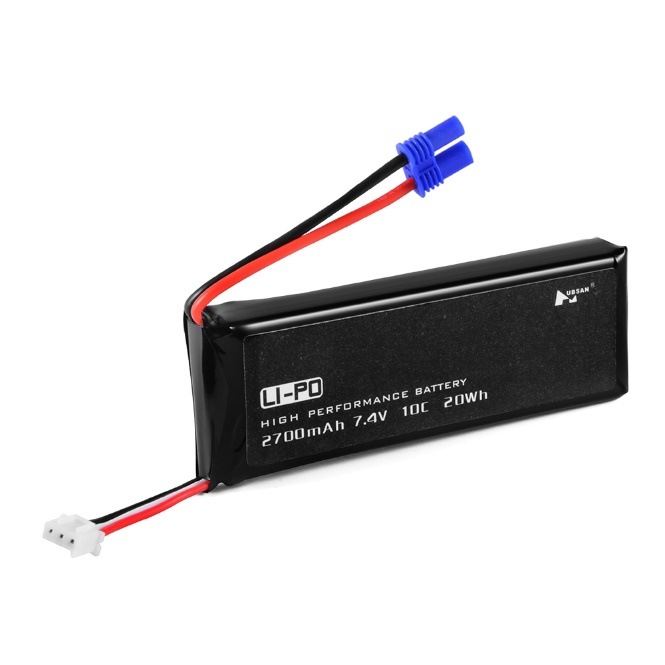
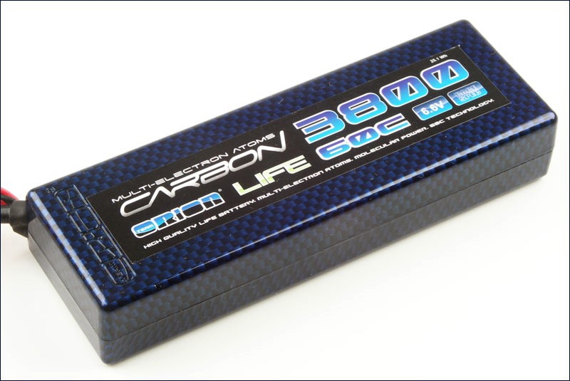
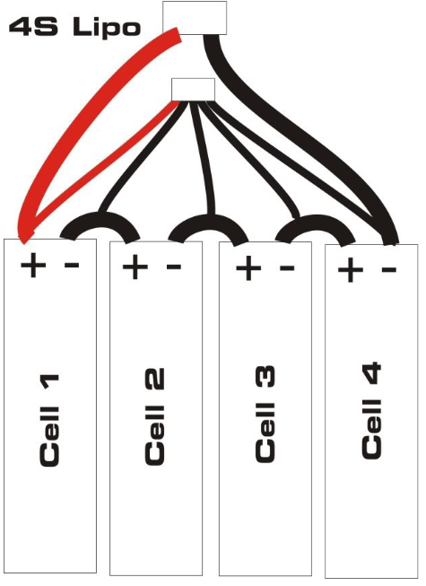
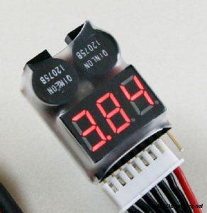
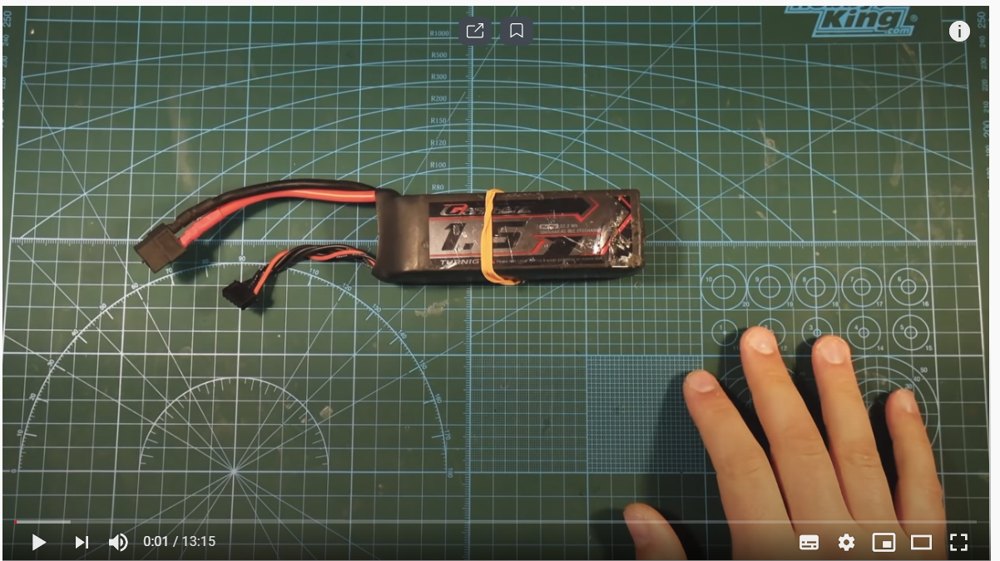

Аккумуляторные батереи
======================

**Аккумулятор** — устройство для накопления энергии с целью её
последующего использования. На рисунке 1 наглядно показаны
характеристики аккумулятора и основные разъёмы

|image0|

Рисунок 1 – Устройство аккумулятора

У аккумулятора есть два вида разъёмов: основной и балансирный.

Основной разъём у аккумулятора должен подходить к разъёму коптера.
Балансирный разъём служит для балансировки аккумулятора при зарядке,
если проще, то он нужен, чтобы убедиться, что все банки аккумулятора
заряжены одинаковы.

Существуют разные виды аккумуляторов. Для питания квадрокоптеров самым
популярным считается литий-полимерный аккумулятор. Однако помимо него
существуют ещё несколько видов используемых в этой сфере аккумуляторов.

Виды аккумуляторов
~~~~~~~~~~~~~~~~~~

Литий-ионный аккумулятор

Литий-ионный аккумулятор (Li-ion) — тип электрического аккумулятора,
который широко распространён в современной бытовой электронной технике и
находит своё применение в качестве источника энергии в электромобилях и
накопителях энергии в энергетических системах (рисунок 2).

Литий-ионный аккумулятор состоит из электродов (катодного материала на
алюминиевой фольге и анодного материала на медной фольге), разделённых
пористым сепаратором, пропитанным электролитом. Пакет электродов помещён
в герметичный корпус, катоды и аноды подсоединены к
клеммам-токосъёмникам. Корпус иногда оснащают предохранительным
клапаном, сбрасывающим внутреннее давление при аварийных ситуациях или
нарушениях условий эксплуатации.

Преимущества:

-  Высокая энергетическая плотность (ёмкость);

-  Низкий саморазряд;

-  Высокая токоотдача;

-  Большое число циклов заряд-разряд;

-  Не требуют обслуживания.

Недостатки:

-  Широко применяемые литий-ионные аккумуляторы при перезаряде,
   несоблюдении условий заряда или при механическом повреждении часто
   бывают чрезвычайно огнеопасными;

-  Огнеопасны;

-  Теряют работоспособность при переразряде;

-  Теряют ёмкость на холоде;

-  Такого вида аккумуляторы используются в маленьких коптерах.

|image1|

Рисунок 2 – Li-ion аккумулятор

Литий-полимерный аккумулятор

Литий-полимерный аккумулятор (Li-Po) — это усовершенствованная
конструкция литий-ионного аккумулятора. В качестве электролита
используется полимерный материал (Рисунок 3).

Обычные бытовые литий-полимерные аккумуляторы не способны отдавать
большой ток, но существуют специальные силовые литий-полимерные
аккумуляторы, способные отдавать ток, в 10 и даже 130 раз превышающий
численное значение ёмкости в ампер-часах. Они широко применяются как
аккумуляторы для радиоуправляемых моделей.

Преимущества:

-  Большая плотность энергии на единицу массы;

-  Низкий саморазряд;

-  Толщина элементов от 1 мм;

-  Возможность получать очень гибкие формы;

-  Слабо выраженный эффект памяти;

-  Незначительный перепад напряжения по мере разряда;

-  Диапазон рабочих температур литий-полимерных аккумуляторов довольно
   широкий: от −20 до +40 °C по данным производителей.

Недостатки:

Аккумуляторы пожароопасны при перезаряде и/или перегреве. Для борьбы с
этим явлением все бытовые аккумуляторы снабжаются встроенной электронной
схемой, которая предотвращает перезаряд и перегрев вследствие слишком
интенсивного заряда. По этой же причине требуют специальных алгоритмов
зарядки (зарядных устройств).

Количество рабочих циклов 800—900, при разрядных токах в 2С до потери
ёмкости в 20 %.

Данный тип является самым популярным для установки на квадрокоптеры.

|image2|

Рисунок 3 – Li-Po аккумулятор

Литий-железо-фосфатный аккумулятор

Литий-железо-фосфатный аккумулятор (Li-Fe) - тип электрического
аккумулятора, являющийся видом литий-ионного аккумулятора, в котором
используется фосфат железа в качестве катода (Рисунок 4).

Данный вид элементов питания считается одним из самых безопасных среди
всех существующих видов аккумуляторов. Литий-фосфатные аккумуляторы
LiFePO4 имеют очень стабильную химию, и способны хорошо выдерживать
большие нагрузки при разряде (в работе с низким сопротивлением) и заряде
(при зарядке аккумулятора большими токами).

LiFePO\ :sub:`4` аккумуляторы происходят от литий-ионных, однако имеют
ряд существенных отличий.

Преимущества:

-  LiFePO4 обеспечивает более длительный срок службы, чем другие
   литий-ионные подходы;

-  В отличие от других литий-ионных, LiFePO4 аккумуляторы, как и
   никелевые, имеют очень стабильное напряжение разряда. Напряжение на
   выходе остается близко к 3,2 В во время разряда, пока заряд
   аккумулятора не будет исчерпан полностью. И это может значительно
   упростить или даже устранить необходимость регулирования напряжения в
   цепях;

-  Использование фосфатов позволяет избежать затрат кобальта и
   экологических проблем, в частности, при попадании кобальта в
   окружающую среду при неправильной утилизации;

-  LiFePO\ :sub:`4` имеет более высокий пиковый ток (а, учитывая
   стабильность напряжения — пиковую мощность), чем у LiCoO\ :sub:`2`;

-  Морозостойкость;

-  LiFePO\ :sub:`4` элементы медленнее теряют ёмкость, чем литий-ионные;

-  Одним из важных преимуществ по сравнению с другими видами
   литий-ионных аккумуляторов, является термическая и химическая
   стабильность, что существенно повышает безопасность батареи.

Недостатки:

-  Удельная плотность энергии (энергия / объём) нового аккумулятора LFP
   примерно на 14% ниже, чем у новых литий-ионных аккумуляторов;

-  LiFePO\ :sub:`4` аккумуляторы имеют более низкую скорость разряда,
   чем свинцово-кислотные или литий-ионные. Так как скорость разряда
   определяется в процентах от ёмкости аккумулятора, то более высокая
   скорость разряда может быть достигнута в более ёмких аккумуляторах
   (больше ампер-часов). Однако могут быть использованы
   LiFePO\ :sub:`4` элементы с высоким током разряда (имеющие более
   высокую скорость разряда, чем свинцово-кислотные батареи, или
   LiCoO\ :sub:`2` той же мощности);

-  Из-за более медленного снижения плотности энергии, спустя некоторое
   время эксплуатации, LiFePO\ :sub:`4` элементы уже имеют большую
   плотность энергии, чем LiCoO\ :sub:`2` и литий-ионные.

Данный тип аккумулятора активно применяется как буферный накопитель
энергии в системах автономного электроснабжения с использованием
ветрогенераторов и солнечных батарей, а также в складской технике,
поломоечных машинах, водном транспорте, гольфкарах, электровелосипедах,
электроскутерах и электромобилях.

|image3|

Рисунок 4 – Li-Fe аккумулятор

Выбор аккумулятора для квадрокоптера
~~~~~~~~~~~~~~~~~~~~~~~~~~~~~~~~~~~~

Для начала разберём основные параметры, которыми описывают аккумуляторы.

Напряжение и количество ячеек (S)

Li-Po аккумуляторы собраны из ячеек или банок (Рисунок 5). Номинальное
напряжение одной банки равно 3.7 В. Для получения более высокого
напряжения их соединяют последовательно.

|image4|

Рисунок 5 – Ячейки аккумулятора

Для удобства вместо напряжения, на аккумуляторе указывают количество
банок – «S», из которых состоит аккумулятор,

Например, если указано 3S аккумулятор, это значит там стоит 3 банки и
напряжение равно 11.1 В.

Напряжение аккумулятора напрямую влияет на обороты бесколлекторных
двигателей, поэтому, если нужно увеличить скорость коптера, то нужно
использовать аккумулятор с большим количеством банок. Однако стоит
учитывать, что мотор и регулятор имеют ограничения по подаваемому на них
напряжению, и если подать напряжение больше порогового, то это приведёт
к поломке мотора. Ещё момент, который стоит учитывать, это вес
аккумулятора. Чем больше банок, тем больше будет вес самого
аккумулятора.

Емкость аккумулятора и его разъём

Емкость измеряется в мА\*ч (миллиампер в час). «мА\*ч» по сути означает
каким током нужно разряжать аккумулятор, чтобы он разрядился за 1 час.

Если увеличить емкость аккумулятора, то это позволит увеличить полётное
время. Но тут та же ловушка, что и в предыдущем пункте, увеличиваются
вес и размеры аккумулятора.

Увеличение емкости позволит увеличить разрядный ток.

Токоотдача, С-рейтинг

Зная С-рейтинг и емкость аккумулятора можно вычислить безопасный
максимальный разрядный ток аккумулятора.

Вычисляется он следующим образом:

Максимальный разрядный ток = С-рейтинг \* Емкость

Порой указывают два числа – постоянный ток и пиковый (ток, который может
отдать аккумулятор в течении 10 начальных секунд).

Если С-рейтинг будет маленьким, то большой мощности он выдавать не
будет, и квадрокоптер будет летать не так быстро.

Но и слишком большой рейтинг брать не стоит, т.к. это приведёт к
большому весу аккумулятора, что повлияет на полётное время коптера.

Внутреннее сопротивление

IR поможет определить на сколько большой просадке по напряжению можно
ждать от аккумулятора. Чем меньше значение IR, тем лучше аккумулятор,
т.к. чем больше внутреннее сопротивление, тем меньше максимальный ток, а
просадка напряжения становится больше. Это заставляет тратить большее
количество энергии на нагрев, что повышает шансы на перегрев
аккумулятора.

К сожалению, со временем внутреннее сопротивление аккумулятора
увеличивается. Чем дольше аккумулятор используется, тем меньше будет
подаваемая мощность на коптер.

В аккумуляторе у разных банок может быть разное значение внутреннего
сопротивления. Значение самого большого IR вызывает эффект «бутылочного
горлышка», когда внутреннее сопротивление одной банки ограничивает
мощность всех остальных.

Теперь, когда мы знаем параметры аккумуляторов, можно перейти к подбору
аккумулятора на коптер.

Подбор тока

Первым делом, после выбора моторов и пропеллеров для коптера, нужно
выяснить максимальный потребляемый ток этой винтомоторной группы.
Исходите из того, какой ток будут потреблять все 4 мотора при
максимальном газе. Это будет соответствовать максимальному току
аккумулятора. Но, учитывая особенности аккумуляторов, можно скинуть 10%
от посчитанного результата, так как в реальном полёте из-за набегающего
потока воздуха, потребляемый ток обычно ниже, чем при 100% газу в
статическом состоянии. Поэтому перед выбором нужно ещё учитывать, какой
режим полёта вы будете использовать. Нужна ли вам тяга как на 100% или
вам достаточно тока как при 40%-80% тяги от полёта.

Подбор емкости

При выборе емкости нужно учитывать размеры коптера и требуемый С-рейтинг
аккумулятора.

Пример, если диаметр ваших пропеллеров 5 дюймов, то значение емкости
нужно выбирать в диапазоне 1300мА\*ч – 1800мА\*ч.

В таблице 1 приведены некоторые рекомендации по выбору емкости
аккумулятора.

Таблица 1 - Соотношения пропеллеров и емкостей аккумуляторов

+----------------------------+---------------------------+
| Размер пропеллеров, дюйм   | Диапазон емкости          |
+============================+===========================+
| 6″                         | 1500 мА\*ч — 2200 мА\*ч   |
+----------------------------+---------------------------+
| 5″                         | 1300 мА\*ч — 1800 мА\*ч   |
+----------------------------+---------------------------+
| 4″                         | 850 мА\*ч — 1300 мА\*ч    |
+----------------------------+---------------------------+
| 3″                         | 650 мА\*ч — 1000 мА\*ч    |
+----------------------------+---------------------------+

Исходя из подобранной емкости можно прикинуть пиковый С-рейтинг по
следующей формуле:

Пиковый С = Макс. потребляемый ток / емкость

Обычно производители считают пиковым значением удвоенное нормальное
значение. Поэтому цифру обычного С нужно подбирать как уменьшенное вдвое
значение пикового С-рейтинга.

Если вы рассчитываете летать с газом больше 50%, то нужно выбирать
аккумулятор с бо́льшим значением, но не забывайте про увеличивающийся
вместе с рейтингом вес.

Переразряд аккумулятора приводит к его необратимой поломке. Поэтому
нельзя разряжать аккумулятор ниже напряжения 3.5-3.6 В. Для отслеживания
заряда лучше всего использовать «пищалки» или сирены. Лучше всего, если
ваш полётный контроллер будет отслеживать заряд аккумулятора, сажая ваш
коптер раньше, чем случится переразряд. На рисуноке 6 показан “тестер”
для проверки заряда аккумулятора.

|image5|

Рисунок 6 – “Тестер” для аккумулятора

Вопросы для самопроверки
------------------------

1. Что такое аккумулятор? Дайте чёткое определение.

2. Сколько разъёмов содержит обычный аккумулятор для коптера?

3. Что из нижеперечисленного чаще всего указывается производителем на
   аккумуляторе:

-  количество банок;

-  емкость;

-  напряжение;

-  сайт производителя;

-  срок службы.

1. Какой буквой обозначается количество банок в аккумуляторе?

2. Приведите формулу расчёта максимального разрядного тока.

3. Что в аккумуляторе вызывает эффект «бутылочного горлышка»? Что этот
   эффект означает?

4. Какой размер пропеллеров (в дюймах) рекомендован для диапазона
   емкости 850 мА\*ч — 1300 мА\*ч?

Материалы для самостоятельного изучения
---------------------------------------

Хороший материал в трёх частях, где подробно объясняется строение
аккумуляторов, их виды, особенности, а также в третьей части внимание
уделено зарядным устройствам.

|image6|

Ссылка:
`*https://www.youtube.com/watch?v=w6t3qV6gdig* <https://www.youtube.com/watch?v=w6t3qV6gdig>`__
– часть 1

|image7|

Ссылка:
`*https://www.youtube.com/watch?v=p3QyejmaMIo* <https://www.youtube.com/watch?v=p3QyejmaMIo>`__
– часть 2

|image8|

Ссылка:
`*https://www.youtube.com/watch?v=x75tuY1gDLE* <https://www.youtube.com/watch?v=x75tuY1gDLE>`__
– часть 3

|image9|

Список использованных источников
--------------------------------

1. Литий-ионный аккумулятор

   `*https://ru.wikipedia.org/wiki/Литий-ионный\_аккумулятор#Характеристики* <https://ru.wikipedia.org/wiki/Литий-ионный_аккумулятор#Характеристики>`__

1. Аккумулятор Li-Ion Spard 2000mAh

   `*https://rc-today.ru/product/akkumulyator-li-ion-spard-2000mah-74v-15c-t-plug-dlya-remo-hobby-116-yt18650p/* <https://rc-today.ru/product/akkumulyator-li-ion-spard-2000mah-74v-15c-t-plug-dlya-remo-hobby-116-yt18650p/>`__

2. Литий-полимерный аккумулятор

   `*https://ru.wikipedia.org/wiki/Литий-полимерный\_аккумулятор* <https://ru.wikipedia.org/wiki/Литий-полимерный_аккумулятор>`__

3. Литий –железо –фосфатный аккумулятор

   `*https://ru.wikipedia.org/wiki/Литий-железо-фосфатный\_аккумулятор* <https://ru.wikipedia.org/wiki/Литий-железо-фосфатный_аккумулятор>`__

4. LifePO4-аккумуляторы: характеристики, особенности, виды

   `*https://fb.ru/article/342942/lifepo--akkumulyatoryi-harakteristiki-osobennosti-vidyi* <https://fb.ru/article/342942/lifepo--akkumulyatoryi-harakteristiki-osobennosti-vidyi>`__

5. Какие бывают LiPo аккумуляторы? Руководство для начинающих пилотов
   дронов и коптеров

   `*https://blog.rcdetails.info/kakie-byvayut-lipo-akkumulyatory-rukovodstvo-dlya-nachinayushhih-pilotov-dronov-i-kopterov/#basics* <https://blog.rcdetails.info/kakie-byvayut-lipo-akkumulyatory-rukovodstvo-dlya-nachinayushhih-pilotov-dronov-i-kopterov/#basics>`__

