Рамы и защитные конструкции
===========================

Термины

**Рама** — это основной, и несущий элемент конструкции квадрокоптера, к
которому крепятся все прочие комплектующие.

**Защита** – конструкция, которая защищает моторы и корпус квадрокоптера
от ударов.

Конструкция рамы
----------------

Рама состоит из двух частей: фюзеляж и лучи

Фюзеляж нужен для размещения электроники, например, полётного
контроллера или камеры. Обычно центральная часть состоит из двух
пластин, нижней и верхней, соединённых стойками.

Лучи нужны для установки моторов и регуляторов. Эти детали должны быть
достаточно прочными, чтобы выдержать не только вес самой конструкции
квадрокоптера, но и противостоять ударам и падениям.

|image0|

Рисунок 1 - пример рамы квадрокоптера

Форма рамы
~~~~~~~~~~

Расположение лучей и их крепление во многом определяет форму рамы. В
зависимости от потребностей пилотов рамы принимают самые разные формы.
Самые популярные на данный момент это:

-  Х («Икс» или «Крест»)

-  H

-  Гибридный X

-  Растянутый X

-  Квадрат

-  Unibody рамы

Несмотря на визуальную схожесть расположения моторов, у каждой из этих
рам есть свои достоинства и недостатки.

Рама типа «Х» или «True-X»

Фюзеляж этой рамы делается коротким, в виде квадрата, вся электроника
собирается в центре, а лучи располагаются четко по углам квадрата. Рама
получается одинаковая по длине и ширине. Т.к. вес сосредоточен в центре,
вес распределён равномерно, коптер становится более манёвренным. Но не
смотря на данное преимущество, ограниченное место в центре делает сборку
более сложной. Все компоненты приходится размещать «бутербродом», друг
под другом, что не всегда удобно.

Рама типа «H»

По сравнению с рамой «Х» центральная часть данной рамы более длинная,
что делает сборку и ремонт компонентов в ней проще и удобнее. Крепление
лучей к фюзеляжу спереди и сзади делает раму похожей на букву «Н».

Камеру и аккумулятор в такой раме размещают по верхней пластине,
распределяя всё по одному направлению, что приводит к неравномерному
распределению момента инерции, особенно по тангажу. То есть, наклоны
вперёд и назад будут тратить больше энергии, чем наклоны влево-вправо.

Среди любителей FPV гонок нет общего мнения, какую раму лучше
использовать. Для плавного фристайла подходит больше «H» рама, но для
быстрых и манёвренных поворотов предпочтительней использовать раму «X».
В попытках объединить преимущества обеих рам были созданы гибриды.

Гибридная рама «Х» и удлиненный «Х»

Гибридная рама «Х» имеет фюзеляж от рамы «Н», а лучи соединены как в
раме «Х». С точки зрения физики, распределение веса осталось таким же,
как и в раме «Н», что делает её похожей на обычную раму «Н», но разница
будет в передаче вибраций от моторов к полётному контроллеру.

В удлинённой «Х» раме ситуация обратная, она больше фюзеляжем похожа на
раму «Х», но разница будет в увеличенной длине тушки, по сравнению с
шириной. Ещё одна особенность этой рамы в смещении передних пропеллеров
от задних. Это позволяет исключить турбулентные завихрения, что
позволяет квадрокоптеру летать более стабильно.

Рама типа Квадрат

Представьте раму «Х», где между лучами добавили соединяющие их рёбра.
Вот так и выглядит рама «Квадрат». За счёт жесткости соединений
получается достаточно крепкая рама, которую не просто сломать. Но,
несмотря на это преимущество, данная рама обладает повышенным воздушным
сопротивлением и большим весом. Подходит для начинающих пилотов, но не
походит для манёвренных полётов.

Unibody рамы

Unibody или цельные рамы особенны тем, что обладают несъемными лучами,
то есть нижняя пластина фюзеляжа и лучи соединены в одну деталь.
Делается так для того, чтобы упростить сборку и устранить вес деталей
крепления. Однако минус подобной рамы в том, что если во время полёта
сломается луч, то менять придётся всю деталь, что затребует много
времени.

+---------------------------------------+--------------------------------------+
| |image1|                              | |image2|                             |
|                                       |                                      |
| Рисунок 2 – Рама типа «Х»             | Рисунок 3 – Рама типа удлиненный «Х» |
+=======================================+======================================+
|                                       |                                      |
+---------------------------------------+--------------------------------------+
| |image3|                              | |image4|                             |
|                                       |                                      |
| Рисунок 4 – Рама типа «Н»             | Рисунок 5 – Рама типа гибридный «Х»  |
+---------------------------------------+--------------------------------------+
|                                       |                                      |
+---------------------------------------+--------------------------------------+
| |image5|                              | |image6|                             |
|                                       |                                      |
| Рисунок 6 - Рама типа «Unibody»       | Рисунок 7 - Рама типа «Квадрат»      |
+---------------------------------------+--------------------------------------+
|                                       |                                      |
+---------------------------------------+--------------------------------------+

Материал для рамы
~~~~~~~~~~~~~~~~~

Рамы квадрокоптеров делаются из самых разных материалов: пластик,
дерево, текстолит, стекловолокно, алюминий и т.д. Однако, большинство
отдаёт предпочтение самому популярному на данный момент материалу –
карбону. Следующие характеристики объяснят, почему он такой популярный.

Во-первых, карбон является одним из самых лёгких материалов, что очень
важно при создании квадрокоптера. Чем меньше его вес, тем он больше его
полётное время и слабее удар при падении.

Во-вторых, карбон известен своей прочностью и долговечностью.

В-третьих, рама, сделанная из карбона, обладает высокой жесткостью к
весу конструкции. Жесткость рамы сильно влияет на стабильность полёта
квадрокоптера и на его полётные характеристики.

Но несмотря на все преимущества карбоновых рам, у них есть два
недостатка:

-  Карбон проводит электричество, что может привести к короткому
   замыканию, если оголённые провода коснуться рамы.

-  Карбон заглушает радиосигналы, поэтому антенны нужно выводить наружу.

Размер рамы
~~~~~~~~~~~

Размер рамы – это расстояние между диагонально расположенными моторами.

При разработке рамы нужно учитывать, что размеры рамы будут влиять на:

-  Момент инерции

-  Общий вес

-  Максимальный размеров винтов

-  Сопротивление воздуху

Чем дальше моторы от центра, чем длиннее лучи, тем больший момент
инерции будет у конструкции. Говоря проще, чем меньше будет рама, тем
более манёвренным будет сам квадрокоптер, чем больше будет размеры рамы,
тем больше будет её вес и её сопротивление воздуху.

Защитные конструкции
--------------------

Защитная конструкция квадрокоптеру нужна для защиты лопастей и моторов,
потому что в случае падения удар приходится на винты, моторы и лучи, что
приводит к их частой поломке. Конечно, наличие защиты приводит к
увеличению веса и сопротивления воздуху, но именно она является
гарантией безопасности квадрокоптера и его долговечности. Материалами
защиты обычно является стекловолокно или пластик.

Существует множество вариаций защиты, некоторые из них приведём ниже:

Дуговая защита
~~~~~~~~~~~~~~

Являются самым простым и лёгким вариантом защиты. Крепятся на лучах под
моторами и защищают винты и моторы за счёт своей упругости. Недостаток
такой защиты в том, что если на пути коптера будет ветка или объект,
который проходит между лучами, то коптер может врезаться собственным
корпусом, что приведёт к поломке электроники. Так же дуги плохо защищают
моторы от попадания в них объектов сверху.

|image7|

Рисунок 8 – пример дуговой защиты

Корпусная защита
~~~~~~~~~~~~~~~~

Корпусная защита крепится по всему корпусу квадрокоптера, защищая не
только моторы, но и раму в целом. По сравнению с предыдущим вариантом,
данная защита более эффективна при прямых столкновениях коптера с
объектами и стенами. Данная защита популярна среди учебных
квадрокоптеров.

|image8|

Рисунок 9 – пример корпусной защиты

Сферическая защита
~~~~~~~~~~~~~~~~~~

Данная защита предотвращает столкновение коптера по всем осям и
направлениям, но минус данной защиты её сопротивлении воздуху. Наличие
такой защиты эффективна только на маленьких квадрокоптерах или игрушках.

|image9|

Рисунок 10 – пример сферической защиты

Клетка
~~~~~~

Данная защита напоминает клетку за счёт своей конструкции. Надевается на
моторы как клетка, защищая от попадания в них объектов. Минус такой
защиты в том, что клетка мешает воздушному потоку моторов, что приводит
к ухудшению полётных характеристик.

|image10|

Рисунок 11 – пример защиты типа “Клетка”

Подвес и крепления к раме посадочного шасси
-------------------------------------------

При проектирование гоночных коптеров обычно не учитывается наличие ног,
так как это приводит к добавлению лишнего веса. Поэтому, если ноги
(посадочные опоры) на них и устанавливают, то обычно они маленького
размера и находятся под моторами.

Когда речь заходит о коптере, на котором установлен подвес, например, с
камерой, расположение шасси становится критическим вопросом. Ноги должны
быть достаточно упругими, чтобы амортизировать приходящую на них
нагрузку и вибрации после посадки, а их расположение на раме должно не
приводить к поломке корпуса.

Подвесы часто располагаются по центру рамы, либо выдвинутыми
вперёд. Во втором случае вес подвеса нужно компенсировать при сборке, а
также за счёт правильного расположения ног, удерживающих устойчивое
положение коптера при смещении центра масс.

Есть насколько вариантов расположения шасси:

**Крепление двух широких ног к фюзеляжу под углом.**

Популярный метод для больших грузоподъёмных квадрокоптеров. Обычно
расположены под углом относительно корпуса (около 30 градусов
относительно вертикальной оси), создавая таким образом амортизационную
подушку при посадке. Ноги крепятся по ширине фюзеляжа для равномерного
распределения массы с обеих сторон.

|image11|

Рисунок 12 – вариант широких посадочных опор

Крепление 4-х посадочных стоек к раме

Используются на средних коптерах, располагаются либо по 4-м сторонам
фюзеляжа относительно крепления лучей, либо непосредственно под
моторами. Минус второго способа, что при достаточно жёстком падении,
такое расположение стоек приводит к поломке лучей. Поэтому расположение
стоек непосредственно под корпусом рамы обладает большими шансами на
предотвращение поломки рамы.

|image12|\ |image13|

Рисунок 13 – примеры посадочных стоек

Список литературы

1. Рамы для мини коптеров — характеристики, развитие и эволюция

   `*https://blog.rcdetails.info/ramy-dlya-mini-kopterov-harakteristiki-razvitie-i-evolyutsiya/* <https://blog.rcdetails.info/ramy-dlya-mini-kopterov-harakteristiki-razvitie-i-evolyutsiya/>`__

2. Рама для квадрокоптера — как выбрать, основы и советы
   https://profpv.ru/kak-vybrat-ramu-dlya-kvadrokoptera-os/

3. Зачем нужна защита винтов квадрокоптера, какую выбрать?
   https://spec-komp.com/news/zachem_nuzhna_zashhita_vintov_kvadrokoptera_kakuju_vybrat/2015-06-11-926

4. Посадочное шасси https://rc-go.ru/cat/posadochnie-shassi/

Вопросы для самопроверки
------------------------

-  Из каких двух основных частей состоит рама?

Ответ: фюзеляж (центральная часть) и лучи

-  В чём особенность Unibody рам в сравнении с остальными типами?

Ответ: Unibody или цельные рамы особенны тем, что обладают несъемными
лучами, т.е. нижняя пластина фюзеляжа и лучи соединены в одну деталь.

-  Самый популярный материал для изготовления рамы?

Ответ: карбон

-  Как определяется размер рамы? На что влияют размеры рамы?

Ответ: Размер рамы – это расстояние между диагонально расположенными
моторами. При разработке рамы нужно учитывать, что размеры рамы будут
влиять на:

Момент инерции, Общий вес, Максимальный размеров винтов, Сопротивление
воздуху

-  Какая рама изображена на картинке?

|image14|

Ответ: Рама типа удлиненный «Х»

Дополнительные материалы для самостоятельного изучения
------------------------------------------------------

1. Статья «Влияние рамы на характеристики коптера»

   `*https://habr.com/ru/company/makeitlab/blog/409161/* <https://habr.com/ru/company/makeitlab/blog/409161/>`__

   Содержание: Подробное описание влияния разных факторов при выборе
   рамы на полёт и характеристики коптера

1. Статья «Дрон своими руками. Урок 2. Рамы»

   `*https://dronomania.ru/faq/dron-svoimi-rukami-urok-2-ramy.html* <https://dronomania.ru/faq/dron-svoimi-rukami-urok-2-ramy.html>`__

   Содержание: В статье описаны разные подвиды рам коптеров и материалы
   для изготовки.

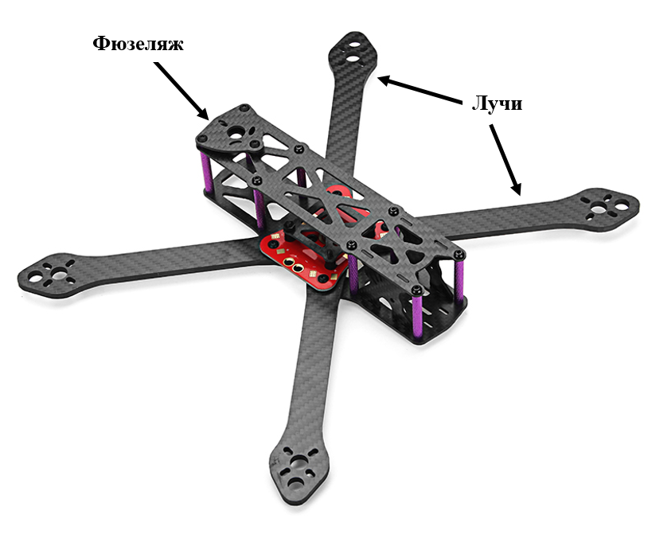
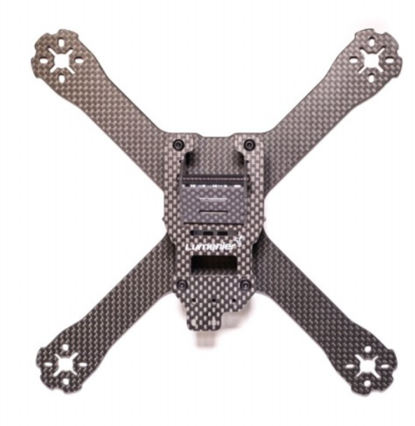
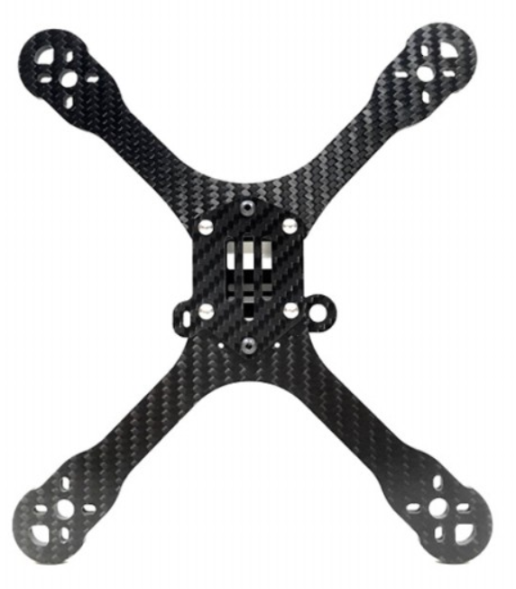
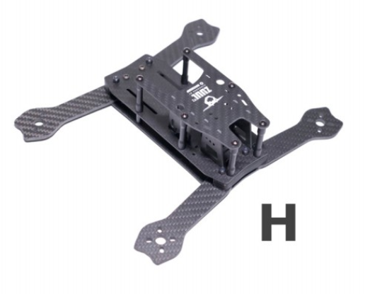
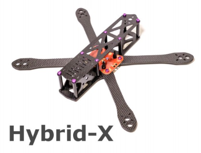
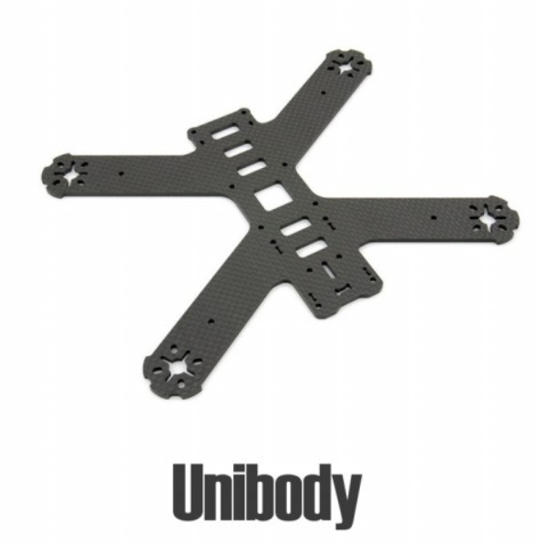
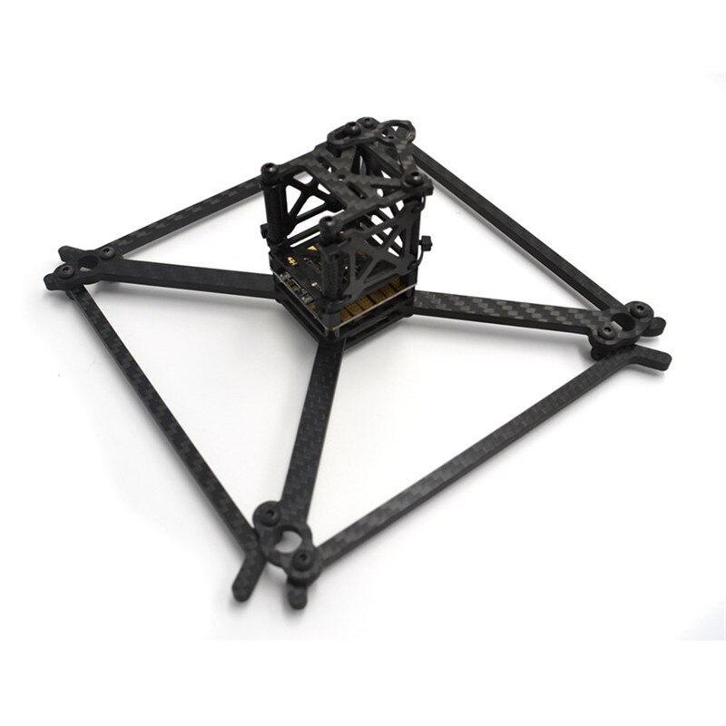
.. |image7| image:: media/image8.png
   :width: 6.49653in
   :height: 4.01319in
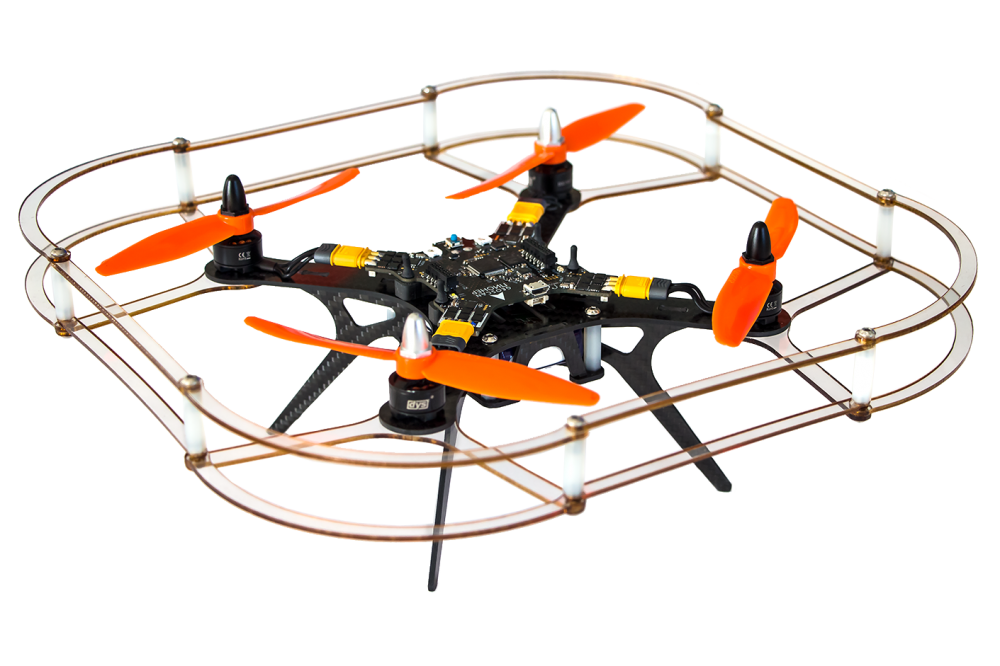
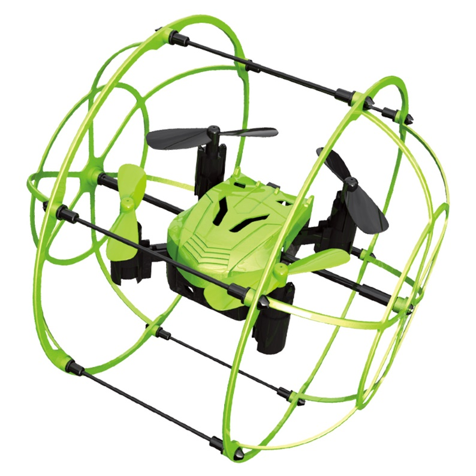
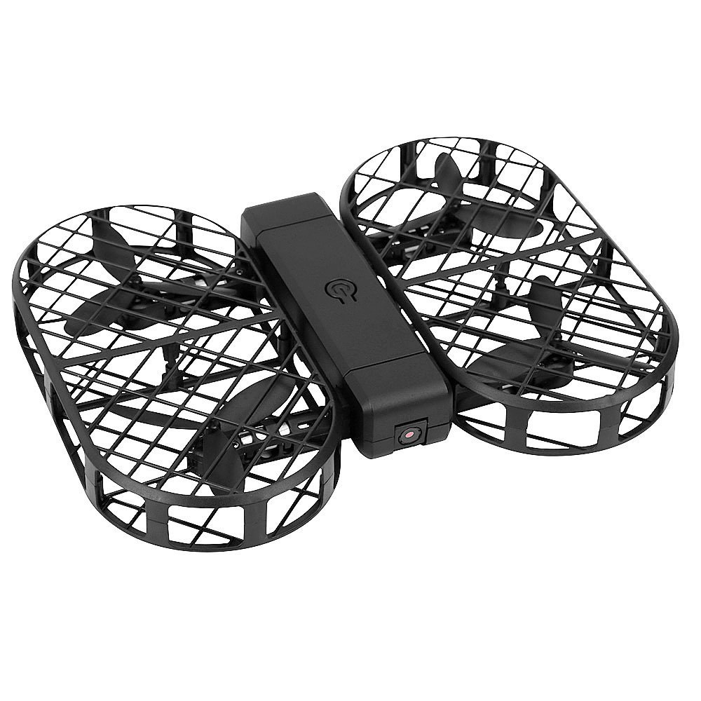
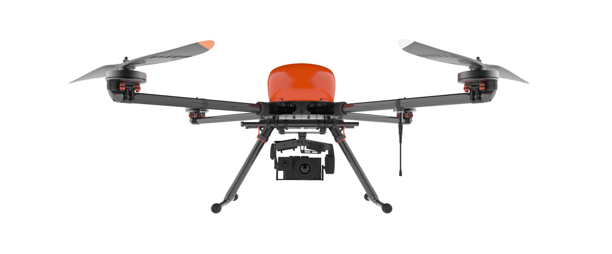
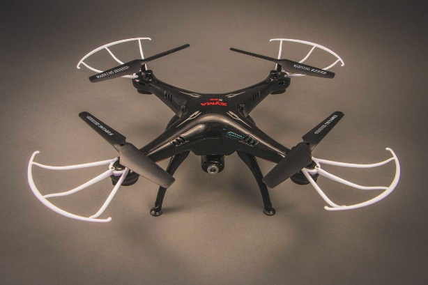
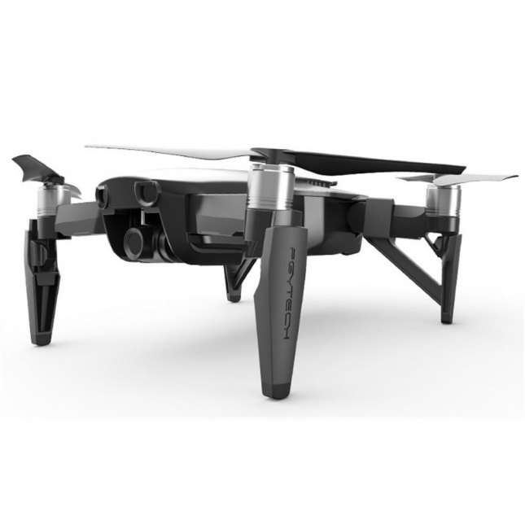

