Радиоаппаратура управления
==========================

Радиосвязь - наиболее распространенный способ передачи информации на
длинные дистанции. Сотовая или спутниковая связь, телевидение - все это
функционирует на базе передачи сигналов посредством электромагнитных
колебаний разной частотности. 

|image0|

Рисунок 1 - Частоты радиосигнала

Как же это работает
~~~~~~~~~~~~~~~~~~~

Высокочастотные колебания определенной частоты формируются в
передатчике, затем на него накладывается сигнал, который необходимо
передать, этот процесс называется модуляцией полезного сигнала.
Сформированный таким образом высокочастотный сигнал излучается антенной
в виде радиоволн.  Этот же сигнал в свою очередь принимается антенной
приёмника, проходит через систему фильтров, выделяющая из множества
сигналов именно тот сигнал с необходимой частотой, который нам нужен, а
сенсор в свою очередь выделяет из него модулирующий сигнал.

В зависимости от несущей частоты передатчика, излучаемый сигнал обладает
разными характеристиками относительно дальности распространения,
рассеивания, способности отражаться и огибать препятствия. Как известно,
радиоволны распространяются в воздушной среде, а почва и вода для них
непрозрачны. Однако, благодаря эффектам искажения и отражения, возможна
связь между точками земной поверхности, не имеющими прямой видимости (в
частности, находящимися на большом расстоянии).

На Рисунок 1 мы можем видеть разные частоты и разную длину волны для
приемников и передатчиков в зависимости от применения сигнала.

Примером модуляции сигнала может служить AM и FM. Это виды аналоговой
модуляции, в которых полезный сигнал передаётся либо за счет амплитуды
волны, либо частоты (Рисунок 2).

|image1|

Рисунок 2 - Длина и частота волн AM и FM сигналов

Принцип работы радиоаппаратуры
------------------------------

Управление подвижными моделями основывается на взаимосвязи манипуляций
человека с каналами связи на пульте ДУ и самой моделью. Аппаратура
радиоуправления состоит из передатчика, который находится у пилота, и
размещенных на модели приемника и полётного контроллера, который и
управляет квадрокоптером через регуляторы мощности (Рисунок 3)

|image2|

Рисунок - Схема связи приемника и передатчика

Каким образом подбирается аппаратура для управления коптером?

Аппаратура управления (Пульт дистанционного управления) — это
устройство, которое позволяет пилоту дистанционно управлять летательным
аппаратом. Сигнал и команды получает приемник, который, в свою очередь,
подключается к полетному контроллеру.

Первый пункт в подборе аппаратуры – **количество каналов**.

Число каналов — это количество функций летательного аппарата, которыми
вообще возможно управлять.

Каждая функция: газ, направление движения, угол тангажа и крена требует
отдельный канал взаимодействия. Для комфортного управления коптером
требуется минимум 4 канала.

|image3|

Рисунок 4 - Разновидности пультов по количеству каналов

Дополнительные каналы - AUX, представлены в виде тумблеров и переменных
резисторов (Рисунок 4). Для профессионального управления коптером
рекомендуется иметь как минимум 5 или 6 каналов. Дополнительные каналы
можно использовать для включения двигателей коптера и для переключения
полетных режимов.

|image4|

Рисунок 5 - Общая схема управления пультом ДУ

Следующий пункт подбора – **режимы конфигураций (моды)**:

Есть 4 разных типа настройки стиков: mode 1, mode 2, mode 3, mode 4
(Рисунок 62):

Mode 1 — руль высоты на левом стике, газ справа;

Mode 2 — наиболее часто встречаемый режим, т.к. коптер повторяет
движение стиков. Руль высоты справа, газ — слева;

Mode 3 — тоже самое что и Mode 1, только элероны и руль направления
поменяны местами;

Mode 4 — тоже самое что и Mode 2, только элероны и руль направления
поменяны местами.

|image5|

Рисунок 6 – Конфигурации настроек пульта дистанционного управления

В некоторых передатчиках благодаря тому, что стики одинаковые, легко
меняются режимы Mode 1 на Mode 3 и наоборот; а также Mode 2 и Mode 4.
Необходимо просто заменить канала элеронов и руля направления. 

Важно понимать, что выбор настроек пульта – дело индивидуально каждого!

На что же стоит обратить свое внимание при подборе аппаратуры связи и
управления: бюджет и количество каналов связи.

Железо и функционал 

При выборе хорошего передатчика нужно учесть очень много вещей,
например, экран (разрешение, подсветка и т.д.), наличие памяти на
несколько моделей, режим тренера и т.д. Некоторые передатчики можно
программировать и прошивать. Их можно настраивать под себя, менять
музыкальное, звуковое и голосовое сообщения и многое другое. Прежде чем
приобретать пульт, изучите доступные варианты.

Эргономика 

Учитывается и вес пульта, качество материала, из которого сделан пульт,
хрупкость элементов и личные предпочтения человека.

Поддержка телеметрии

Полезная возможность подключения телеметрической аппаратуры, позволяющей
приемнику отправлять данные назад в аппаратуру управления.

Возможность установки внешнего радиомодуля

Помимо встроенного радиомодуля, некоторые передатчики имеют отсек для
внешнего модуля.

Поняв, что нам нужно, разберемся из чего же состоит система управления
коптером.

Передатчик
~~~~~~~~~~

Различают два основных вида пультов - джойстиковые и пистолетные
(рисунок 7). Для квадрокоптеров используют джойстиковый пульт. 

|image6|

Рисунок Рисунок - Разновидности пультов ДУ

Для управления коптером требуется воздействие одновременно на несколько
каналов связи, поэтому передатчики радиоуправления делают
многоканальными. Оптимальным для коптеров является наличие четырех
каналов связи: управление газом, угол крена, тангажа и рысканья.
Положение каждого из стиков пульта кодируется при помощи ШИМ импульса.

Каналы управления бывают двух типов: 

-  Пропорциональные – например, управление газом;

-  Дискретные – например, включение/выключение подсветки. 

Дискретные каналы используются только для вспомогательных функций, все
основные функции передаются с помощью пропорциональных каналов.
Вырисовывается логичная закономерность: чем больше задач должен решать
пульт, тем больше ему нужно каналов. Управление подвесом камеры,
передача видео, телеметрии, все это требует дополнительных каналов.

Пульт имеет возможность подстройки (триммирование). У любого коптера
центр массы немного смещен в какую-либо из сторон, какой-то из моторов
может работать чуть лучше. Все эти проблемы решают подстройкой джойстика
под каждую конкретную модель.

На выходе с пульта сигнал модулируется, чтобы передать данные на коптер.
Модуляция сигнала позволяет наложить полезный сигнал на сигнал, для
этого все каналы уплотняются в один посредством кодирования. В основном
для этого используется фазово-импульсная модуляция, обозначаемая буквами
РРМ (Pulse Position Modulation), она распространена из-за единого
стандарта на всем оборудовании. Пульт и приемник разных производителей
могут работать вместе, привязка их друг к другу осуществляется за счет
пары резонаторов.

Приёмник
~~~~~~~~

Приёмник - устройство, предназначенное для радиоприёма, т.е. для
выделения сигналов из радиоизлучения (Рисунок 4). Приёмник
устанавливается на коптере, принимает сигнал с пульта и передаёт его в
полётный контроллер. 

|image7|

Рисунок Рисунок - Внешний вид приемника

А на Рисунок 9 представлена принципиальная схема работы приёмника.

|image8|

Рисунок 9 - Схема работы приемника

Сигналы, принятые антенной, подаются на колебательный контур, в котором
работает приёмник. Этот контур является преселектором (устройство,
соединяющее антенну и приемник). После преселектора сигнал попадает в
усилитель высокой частоты, затем, усиленный сигнал подается на
смеситель. На смеситель так же подается сигнал с гетеродина
(высокочастотного генератора). Антенна воспринимает сигналы со всех
передатчиков, находящихся рядом, в смесителе происходит процесс
первичной фильтрации сигнала. Из смесителя отфильтрованные сигналы
поступают на селектор промежуточной частоты, который должен выбрать из
всех полученных, сигнал нужного приёмника и подавить остальные. После
этого сигнал проходит через усилитель промежуточной частоты и попадает
на демодулятор-дискриминатор, где сигнал проходит обратную модуляции
процедуру, когда принятого сигнала выделяется полезный сигнал. Затем он
попадает на триггер Шмидта, формирующий необходимую амплитуду и крутизну
PPM сигнала, а затем подается на декодер полётного контроллера.

Перед рядовым пользователем встает вопрос: каким образом нужно
подобрать, собрать и использовать коптер с максимальной продуктивностью,
в том числе и дальностью полета. Как известно, сигнал радиопередатчика
ограничен, и при необходимости использования коптера в удаленных
районах, надо позаботиться об усилении сигнала. 

В этом нам помогут антенны усиления сигналов, ведь антенны для
видеопередатчиков и приемников очень сильно влияют на радиус приема
сигнала. 

Устройство антенн
-----------------

-  Активный элемент — проводник, передающий или принимающий сигнал;

-  Коаксиальный кабель — специальный кабель в оплетке для передачи
   сигнала между разъемом и активным элементов без вывода сигнала в
   эфир;

-  Разъем — используется для соединения антенны с приемником или
   передатчиком;

-  Поляризация: круговая и линейная.

В зависимости от поляризации сигнала существует 2 типа антенн: линейной
и круговой поляризации.

Антенны с линейной поляризацией 
~~~~~~~~~~~~~~~~~~~~~~~~~~~~~~~~

В этом случае сигнал колеблется горизонтально или вертикально, но только
в одной из плоскостей (Рисунок 10).

 |image9|

Рисунок 10 – Сигнал антенны линейной поляризации

Антенны линейной поляризации широко распространены из-за простоты
конструкции. Эти антенны имеют малый размер, низкую цену, их легко
ремонтировать и собирать.

Линейная поляризация отлично подходит для больших расстояний, т.к. вся
энергия будет сосредоточена в одной плоскости. Это преимущество не
всегда проявляется из-за многолучевого распространения сигнала. Для того
чтобы получить максимальный уровень сигнала, антенны приемника и
передатчика должны быть расположены параллельно, для получения
максимального перекрытия сигнала.

Монополь — это простейшая антенна линейной поляризации - коаксиальный
кабель без оплетки (Рисунок 117). Чаще всего применяется в приемниках,
т.к. она достаточно дешевая и легко ремонтируется. Однако, монополь не
так эффективен, как диполь, т.к. рабочую частоту антенны составляет
длина провода.

|image10|

Рисунок 11 – Монополь

Диполь — это легкий и устойчивый к повреждениям вид антенн, похожий по
своему устройству на монополи, однако имеющий заземленную гильзу под
активным элементом. Эта гильза может значительно улучшить характеристики
антенны (рисунок 12).

|image11|

Рисунок 12 – Диполь

Антенны с круговой поляризацией
~~~~~~~~~~~~~~~~~~~~~~~~~~~~~~~

При круговой поляризации сигнал распространяется в обоих плоскостях (в
вертикальной и горизонтальной) со сдвигом фазы на 90 градусов. Его еще
представляют в виде штопора (Рисунок 13). Как и антенны линейной
поляризации имеет несколько разновидностей.

|image12|

Рисунок 13 - Сигнал антенны круговой поляризации

Четырехлепестковый клевер (Skew-Planar Wheel antenna) — антенна круговой
поляризации, имеющая отличную устойчивость к отраженным
сигналам. Используется там, где аэродинамическое сопротивление не
критично (Рисунок 1460). Как правило клевер монтируют на приемник,
однако этот вид антенны можно поставить и на передатчик.

|image13|

Рисунок 14 - Четырехлепестковый клевер

Трехлепестковый клевер (The Cloverleaf antenna) — обычно используется на
передатчиках (Рисунок 15). Можно комбинировать с четырехлепестковым для
увеличения радиуса приема и улучшения качества сигнала.

|image14|

Рисунок 15 - Трехлепестковый клевер

Пагода — довольно новый тип антенн. Это ненаправленная антенна с
круговой поляризацией. Уникальный дизайн и используемый материал
(текстолит) делает её очень прочной (рисунок Рисунок 16).

|image15|

Рисунок 16 – Пагода

Хеликс (спиралька) — это направленная антенна с круговой поляризацией,
имеющая в своей конструкции пружинку. Спиральная антенна может иметь
очень большой коэффициент усиления, усиление зависит от числа витков.
Спиральная антенна незаменим в случае, когда необходимо многолучевое
распространение сигнала (Рисунок 17).

|image16|

Рисунок 17 – Хеликс

Патчи — это тоже направленные антенны, они бывают как с линейной, так и
с круговой поляризацией. По сравнению с хеликсом, у них более широкий
луч, но меньший размер.

|image17|

Рисунок 18 – Патч

Сигнал с круговой поляризацией всегда попадает на антенну, независимо от
угла между антенной на коптере и на приемнике. Именно поэтому антенны с
круговой поляризацией приоритетны для полетов в FPV режиме.

Главное достоинство антенн с круговой поляризацией — возможность не
принимать отраженный сигнал. Многолучевое распространение сигнала —
главная причина плохого качества видео (изменение цвета, помехи, двоение
и т.п.). Так бывает, когда сигнал отражается от объектов и приходит с
другой фазой, при этом смешиваясь с основным сигналом.

Круговая поляризация бывает, **как левой (LHCP)**, так и **правой
(RHCP)**. На передатчике и приемнике должны быть антенны с одним и тем
же направлением, в противном случае возможна сильная потеря сигнала
(Рисунок 19).

Круговая поляризация хорошо защищает от переотраженных сигналов, потому
что, когда сигнал отражается от объекта, меняется направление
поляризации. Т.е. антенна LHCP отсекает RHCP сигнал и наоборот (кросс
поляризация).

|image18|

Рисунок 19 - Антенны RHCP (right-hande circular polarized) и LHCP
(left-hande circular polarized)

Антенна с левой поляризацией не принимает сигнал с правой поляризацией и
наоборот, т.е. нет взаимного воздействия двух видеопередатчиков.

По этой же причине использование антенн с круговой поляризацией
позволяет снизить влияние переотраженных сигналов. С каждым отражением
сигнал меняет направление поляризации. Например, LHCP сигнал становится
RHCP, который в свою очередь не принимается LHCP антенной.

Частота и диапазон рабочих частот
~~~~~~~~~~~~~~~~~~~~~~~~~~~~~~~~~

Антенны настраиваются на определенную частоту, они имеют максимальный
КПД при передаче и приеме сигнала на определенной частоте. Однако,
неправильно выбранная антенна может привести к перегреву и сгоранию
передатчика т.к. выходная мощность резонирует от неподходящей антенны и
начинает вырабатываться тепло.

Чтобы выбрать наиболее подходящую частоту и канал, нужно разобраться что
такое частота, на которую настроена антенна и что такое диапазон рабочих
частот. 

Разъемы антенн
~~~~~~~~~~~~~~

У антенн обычно бывает один из двух видов разъемов: SMA или RP-SMA. Они
отличаются внешне и между собой не совместимы. 

Убедитесь, что вы используете антенну с подходящим разъемом!

SMA (RP-SMA), MMCX и U.FL — это три типа разъемов, используемых в FPV
видеопередатчиках, приемниках и антеннах. 

Чем отличаются разъемы SMA и RP-SMA?

Раньше в FPV оборудовании использовали только SMA и RP-SMA. Благодаря их
прочности и надежности они всё ещё довольно часто используются. Но их
существенные недостатки — крупный размер и большой вес.

Заметное преимущество SMA — более 500 циклов подключения/отключения, что
значительно больше, чем у MMCX и U.FL. Чаще всего применяются
разъемы SMA или RP-SMA, другие разъемы на приемниках встречаются очень
редко.

SMA Расшифровывается как Sub-Miniature Version A.  Это разъем для
коаксиального кабеля разработанный в 60х годах 20 века.

RP-SMA — это Reverse Polarity SMA. Т.е. разновидность разъемов SMA, с
измененным полом: вилка-розетка (папа <-> мама).

По качеству передачи видеосигнала между этими разъемами нет никаких
отличий. Однако право на существование имеют оба типа разъемов. Далее мы
выясним, почему же это так.

|image19|

Рисунок 20 - Сравнение разъемов SMA и RP – SMA

Разъемы UFL
~~~~~~~~~~~

Также известны как IPEX, UFL часто использовались в мелких
видеопередатчиках и антеннах для них. Благодаря малому размеру, их можно
встретить во многих приемниках управления.

|image20|

Рисунок 21 - Разъем UFL

 В этих разъемах нет резьбы, соединяются простым прижатием одного к
другому. Они значительно более хрупкие (по сравнению с SMA/RPSMA), и в
своей эксплуатационной живучести они плохо себя показывают (в среднем,
их можно подключать-разъединять не более 30 раз). 

Разъемы MMCX
~~~~~~~~~~~~

| MMCX легче и компактнее, чем SMA, но значительно прочнее U.FL. Они
  значительно более живучие и их можно использовать около 100 раз. Всё
  больше видеопередатчиков оснащаются этими разъемами, так что можно
  ожидать, что они будут очень популярны в ближайшем будущем (
| Рисунок 228). 

| |image21|
| Рисунок 22 - Разъём MMCX

Определившись с выбором гарнитуры, поняв, как они устроены и работают,
нам стоит остановиться на вопросе протоколов передачи данных, т.к. выше
мы затрагивали эту тему, необходимо подробнее ее разобрать.

Протоколы передачи данных
-------------------------

Протоколы передачи данных используются в дронах, радиоуправляемых
самолетах, коптерах и других устройствах, использующих радиосвязь. Их
можно разбить на две основные группы:

-  Протоколы, применяемые в приемниках (связь между приемником сигнала и
   полетным контроллером);

-  Протоколы в передатчиках (обмен данными между передатчиком и
   приемником).

Некоторые протоколы в приемниках очень широко распространены и
используются большинством производителей, другие протоколы являются
закрытыми и используются реже. Примерами таких протоколов связи
являются:

-  PWM (универсальный)

-  PPM (универсальный)

-  PCM (универсальный)

-  SBUS (Futaba, Frsky)

-  IBUS (Flysky)

-  XBUS (JR)

-  MSP (Multiwii)

-  SUMD (Graupner)

-  SUMH (Graupner)

Протоколы, используемые в передатчиках, часто реализованы только одним
производителем. Но некоторые производители позволяют использовать
несколько протоколов, в зависимости от имеющихся у вас приемников. Такие
как:

-  D8 (Frsky)

-  D16 (Frsky)

-  LR12 (Frsky)

-  DSM (Spektrum)

-  DSM2 (Spektrum)

-  DSMX (Spektrum)

-  Flysky

-  A-FHSS (Hitec)

-  FASST (Futaba)

-  Hi-Sky (Deviation)

О каждом виде протоколов стоит поговорить более подробно, чтобы понять,
как они устроены и чем различаются.

PWM (ШИМ) — Pulse Width Modulation

Это наиболее распространенный тип выходного сигнала у приемников. Когда
радиоуправление использовалось в самолетах, приемники нужны были для
управления сервомашинками и регуляторами хода, сигнал был только одного
вида — PWM, один канал для каждой сервомашинки (Рисунок 239). Эта же
технология широко используется и в наше время.

Как нам известно, коптерам для хорошего управления и полета нужно как
минимум 4 или 5 каналов, и именно такое же количество разъемов будет
использоваться для подключения приемника к полетному контроллеру.

|image22|

Рисунок 23 - PWM приемник

PWM (ШИМ) значит, что длина импульса определяет положение сервопривода
или уровень газа. Обычно длительность импульса колеблется между 1000мкс
и 2000мкс, где 1000 мкс — это минимум (одно крайнее положение), а 2000
мкс — максимум (другое крайнее положение).

Радиоприемник с выходами PWM — это наиболее часто используемый тип, и
как правило самый дешевый. Однако, чтобы избежать захламления корпуса
излишками проводов, пользователи предпочитают использовать PPM и SBUS
приёмники.

PPM — Pulse Position Modulation

PPM также известен как PPMSUM и CPPM. Преимущество PPM в том, что нужен
только один провод для передачи нескольких каналов, относительно
отдельных проводов для каждого канала, как в случае с PWM. Так что в
этом случае нужно подключить только 3 провода: питание, земля и сигнал
(Рисунок 24).

|image23|

Рисунок 24 - PPM приемник

PPM сигнал — это просто последовательность PWM импульсов, идущих друг за
другом по одному проводу. Т.е. PPM это аналоговый сигнал, распределенный
по времени, каналы посылаются один за другим, а не одновременно.
Следовательно, передача данных немного не точная, отсюда имеются
искажения и неточности во времени в отличие от цифрового
последовательного канала, но этот вариант широко используется и
поддерживается множеством полетных контроллеров.

Главным преимуществом использования PWM сигнала является широкая
возможность функционала, т.к. PPM не самый популярный вид сигнала (из-за
того, что многие радиостанции не поддерживают PPM сигнал). 

PCM — Pulse Code Modulation

PCM (pulse-code-modulation) - импульсно кодовая модуляция, использующая
цифровой сигнал (ноли и единицы), в то время как PPM использует
аналоговый сигнал (где учитывается длительность импульсов). 

|image24|

Рисунок 25 - PCM (pulse-code-modulation) приемник

PCM сигнал можно проверить на наличие ошибки, или использовать
программные коды для исправления ошибок. PCM более надежен и менее
подвержен межканальному перераспределению радиоволн, но при его
использовании требуется дополнительное преобразование, так что
оборудование стоит значительно дороже (Рисунок 251).

Перейдем к протоколам последовательной передачи данных.

Последовательная передача цифровых данных использует 3 провода - сигнал,
земля и питание. Этот тип передачи требует наличия последовательного
порта как на приемнике, так и на полетном контроллере. SBUS, XBUS, MSP,
IBUS, SUMD.

SBUS (S.BUS) – Frsky, Futaba

SBUS — это протокол последовательной передачи данных, используемый
Futaba и FrSky (Рисунок 26), поддерживающий передачу до 18 каналов по 1
проводу.

SBUS — это инвертированный сигнал UART (COM порт). Практически все
контроллеры могут читать UART, но не все они понимают инвертированный
сигнал, поэтому требуется добавлять специальный преобразователь сигнала.
Некоторые контроллеры, типа Pixhawks и т.д, имеют встроенный инвертор
сигнала именно для этих целей.

|image25|

Рисунок 26 - FrSky R-XSR

Какой же тип сигнала предпочтительнее в использовании современных
коптеров - SBUS или PPM в приемнике. Стоит рассмотреть этот вопрос
детально и сделать свои собственные выводы.

PPM – это старый, аналоговый сигнал. SBUS же новый, цифровой сигнал.

PPM и PWM оба имеют задержку примерно 60-80мс, SBUS – только 10-20мс.
Чтобы устранить помехи, вызванные шириной самого сигнала, в работе PPM
сигнала используется метод CleanFlight, где PPM сигнал обрабатывается,
усредняя свои разветвленные значения.

Обработка ошибок

PPM это аналоговый сигнал, у которого есть помехи и даже интерференция
(межканальное перераспределение радиоволн) с другими сигналами. Полетный
контроллер не способен самостоятельно определить была ли ошибка в
данных, потому что он получил корректные данные. Чтобы устранить это,
используется скользящее среднее по трем точкам (среднее трех
последовательных значений), что служит причиной дополнительных задержек.

Цифровой сигнал с приемника такой как SBUS имеет встроенную возможность
проверки и исправления ошибок, поэтому в усреднении по нескольким точкам
нет необходимости.

Следовательно, SBUS протокол надежнее и эффективнее в эксплуатации,
однако не каждый приемник может использовать данный тип протокола, что
ставит под сомнение использование SBUS протокола в данных условиях и
обстоятельствах.

IBUS — Flysky

IBUS — это новый протокол, используемый FlySky. Передача данных
двунаправленная, т.е. можно как принимать, так и передавать данные —
передавать и получать данные с датчиков.

XBUS – JR

XBUS используется компанией JR, поддерживает до 14 каналов по 1 проводу.
Главное преимущество - очень маленькая задержка сигнала между каналами.

MSP (multiwii serial protocol)

Протокол, созданный как часть программного обеспечения multiwii.
Позволяет передавать до 8 каналов по одному проводу.

Graupner Hott SUMD

Graupner SUMD — это протокол типа SBUS. Каналы кодируются в один
цифровой сигнал, и не имеет заметной задержки при передаче. Преимущества
SUMD:

-  по сравнению с SBUS — не требуется инвертирование сигнала;

-  по сравнению с PPM — выше разрешение сигнала.

Вопросы для самопроверки
------------------------

1. Что такое радиосвязь?

2. Зачем на пульте расположено несколько каналов управления?

3. Какие виды передатчиков бывают?

4. Что такое приемник?

5. Перечислите основные виды антенн.

6. Перечислите названия протоколов передачи данных.

Материалы для самостоятельного изучения
---------------------------------------

Пример настройки пульта дистанционного управления
~~~~~~~~~~~~~~~~~~~~~~~~~~~~~~~~~~~~~~~~~~~~~~~~~

|image26| |image27|

Ссылка:
`*https://youtu.be/HlhcsY5sg3w* <https://youtu.be/HlhcsY5sg3w>`__

Вводный экспресс-курс в теорию антенн и радиосвязь
~~~~~~~~~~~~~~~~~~~~~~~~~~~~~~~~~~~~~~~~~~~~~~~~~~

|image28| |image29|

Ссылка:
`*https://youtu.be/hJVvOIYWUKM* <https://youtu.be/hJVvOIYWUKM>`__

Список использованных источников
--------------------------------

1. Передача радиосигнала.

1.  `*https://revolution.allbest.ru/physics/00342958\_0.html* <https://revolution.allbest.ru/physics/00342958_0.html>`__

2.  *Как выбрать аппаратуру управления квадрокоптером.*

3.  `*https://blog.rcdetails.info/kak-vybrat-apparaturu-upravleniya-kvadrokopterom/* <https://blog.rcdetails.info/kak-vybrat-apparaturu-upravleniya-kvadrokopterom/>`__

4.  *Выбираем антенну для FPV коптеров.*

5.  `*https://blog.rcdetails.info/vybiraem-antennu-dlya-fpv-kopterov/* <https://blog.rcdetails.info/vybiraem-antennu-dlya-fpv-kopterov/>`__

6.  *Антенна с круговой или линейной поляризацией. Что лучше для FPV?*

7.  `*https://blog.rcdetails.info/antenna-s-krugovoj-ili-s-linejnoj-polyarizatsiej-chto-luchshe-dlya-fpv/* <https://blog.rcdetails.info/antenna-s-krugovoj-ili-s-linejnoj-polyarizatsiej-chto-luchshe-dlya-fpv/>`__

8.  `*https://studopedia.info/3-76826.html* <https://studopedia.info/3-76826.html>`__

9.  `*https://www.wekom.ru/kak-rabotaet-am-fm-radio/* <https://www.wekom.ru/kak-rabotaet-am-fm-radio/>`__

10. `*http://olymp.as-club.ru/publ/arkhiv\_rabot/chetyrnadcataja\_olimpiada\_2016\_17\_uch\_god/multirotornye\_sistemy\_kakova\_istorija\_i\_est\_li\_perspektivy\_razvitija\_v\_budushhem/37-1-0-1969* <http://olymp.as-club.ru/publ/arkhiv_rabot/chetyrnadcataja_olimpiada_2016_17_uch_god/multirotornye_sistemy_kakova_istorija_i_est_li_perspektivy_razvitija_v_budushhem/37-1-0-1969>`__

11. `*https://blog.rcdetails.info/kak-vybrat-apparaturu-upravleniya-kvadrokopterom/* <https://blog.rcdetails.info/kak-vybrat-apparaturu-upravleniya-kvadrokopterom/>`__

12. `*https://model-ka.ru/6ch-heli* <https://model-ka.ru/6ch-heli>`__

13. `*https://www.alibaba.com/product-detail/MJX-B2W-Bugs-2-GPS-Brushless\_60722756007.html* <https://www.alibaba.com/product-detail/MJX-B2W-Bugs-2-GPS-Brushless_60722756007.html>`__

14. `*https://www.rc-hobby.com.ua/infocenter/obzory-i-stati/kakoy-vybrat-pult-distantsionnogo-upravleniya-dlya-avtomodeli/* <https://www.rc-hobby.com.ua/infocenter/obzory-i-stati/kakoy-vybrat-pult-distantsionnogo-upravleniya-dlya-avtomodeli/>`__

15. `*https://blog.rcdetails.info/obzor-priemnik-frsky-r-xsr-novyj-samyj-luchshij-priemnik-dlya-mini-kopterov/* <https://blog.rcdetails.info/obzor-priemnik-frsky-r-xsr-novyj-samyj-luchshij-priemnik-dlya-mini-kopterov/>`__

16. `*https://digteh.ru/WLL/PrmPrjamPreobr.php* <https://digteh.ru/WLL/PrmPrjamPreobr.php>`__

17. `*https://blog.rcdetails.info/antenna-s-krugovoj-ili-s-linejnoj-polyarizatsiej-chto-luchshe-dlya-fpv/* <https://blog.rcdetails.info/antenna-s-krugovoj-ili-s-linejnoj-polyarizatsiej-chto-luchshe-dlya-fpv/>`__

18. `*https://ru.mouser.com/new/linx/linx-wrt-mon-antennas/* <https://ru.mouser.com/new/linx/linx-wrt-mon-antennas/>`__

19. `*https://blog.rcdetails.info/vybiraem-antennu-dlya-fpv-kopterov/* <https://blog.rcdetails.info/vybiraem-antennu-dlya-fpv-kopterov/>`__

20. `*https://blog.rcdetails.info/antenna-s-krugovoj-ili-s-linejnoj-polyarizatsiej-chto-luchshe-dlya-fpv/* <https://blog.rcdetails.info/antenna-s-krugovoj-ili-s-linejnoj-polyarizatsiej-chto-luchshe-dlya-fpv/>`__

21. `*https://blog.rcdetails.info/antenna-s-krugovoj-ili-s-linejnoj-polyarizatsiej-chto-luchshe-dlya-fpv/* <https://blog.rcdetails.info/antenna-s-krugovoj-ili-s-linejnoj-polyarizatsiej-chto-luchshe-dlya-fpv/>`__

22. `*https://blog.rcdetails.info/antenna-s-krugovoj-ili-s-linejnoj-polyarizatsiej-chto-luchshe-dlya-fpv/* <https://blog.rcdetails.info/antenna-s-krugovoj-ili-s-linejnoj-polyarizatsiej-chto-luchshe-dlya-fpv/>`__

23. `*https://hobbymania.com.ua/ru/tovar.php?id\_tovar=4995* <https://hobbymania.com.ua/ru/tovar.php?id_tovar=4995>`__

24. `*http://www.mavbot.com/2013/09/longer-range-fpv-for-cheap.html* <http://www.mavbot.com/2013/09/longer-range-fpv-for-cheap.html>`__

25. `*http://www.parkflyer.ru/ru/blogs/view\_entry/4419/* <http://www.parkflyer.ru/ru/blogs/view_entry/4419/>`__

26. `*https://rcsearch.ru/wiki/Клевер* <https://rcsearch.ru/wiki/%D0%9A%D0%BB%D0%B5%D0%B2%D0%B5%D1%80>`__

27. `*https://blog.rcdetails.info/razlichiya-mezhdu-antennymi-razemami-sma-i-rp-sma/* <https://blog.rcdetails.info/razlichiya-mezhdu-antennymi-razemami-sma-i-rp-sma/>`__

28. `*https://fastbox.su/konektor-ipx-ufl-gniazdo-sma-15cm-item-i7232767403.html* <https://fastbox.su/konektor-ipx-ufl-gniazdo-sma-15cm-item-i7232767403.html>`__

29. `*http://ruconnectors.ru/connectors-mmcx-budget/* <http://ruconnectors.ru/connectors-mmcx-budget/>`__

30. `*http://drone-irk.ru/?p=2851* <http://drone-irk.ru/?p=2851>`__

31. `*http://drone-irk.ru/?p=2282* <http://drone-irk.ru/?p=2282>`__

32. `*https://ru.banggood.com/2\_4G-8CH-Receiver-PPM-SBUS-Output-for-Frsky-X9DPLUS-XJT-DJT-DFT-DHT-p-1271793.html?cur\_warehouse=CN* <https://ru.banggood.com/2_4G-8CH-Receiver-PPM-SBUS-Output-for-Frsky-X9DPLUS-XJT-DJT-DFT-DHT-p-1271793.html?cur_warehouse=CN>`__

33. `*http://drone-irk.ru/?p=2282* <http://drone-irk.ru/?p=2282>`__

34. `*https://vam-na-dom.shop/p408298799-cjmcu-20948-pcm1802.html* <https://vam-na-dom.shop/p408298799-cjmcu-20948-pcm1802.html>`__

35. `*https://ru.banggood.com/FrSky-R-XSR-Ultra-SBUSCPPM-D16-16CH-Mini-Redundancy-Receiver-1\_5g-for-RC-Multirotor-FPV-Racing-Drone-p-1186057.html?gmcCountry=RU&currency=RUB&createTmp=1&utm\_source=googleshopping&utm\_medium=cpc\_bgcs&utm\_content=haosen&utm\_campaign=haosen-ssc-rug-toys-0317&ad\_id=426090240449&cur\_warehouse=CN* <https://ru.banggood.com/FrSky-R-XSR-Ultra-SBUSCPPM-D16-16CH-Mini-Redundancy-Receiver-1_5g-for-RC-Multirotor-FPV-Racing-Drone-p-1186057.html?gmcCountry=RU&currency=RUB&createTmp=1&utm_source=googleshopping&utm_medium=cpc_bgcs&utm_content=haosen&utm_campaign=haosen-ssc-rug-toys-0317&ad_id=426090240449&cur_warehouse=CN>`__

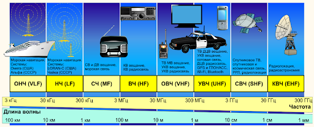
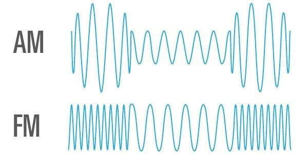
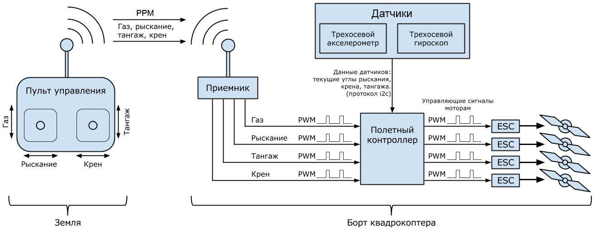
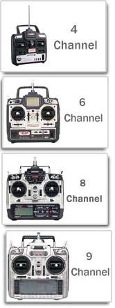
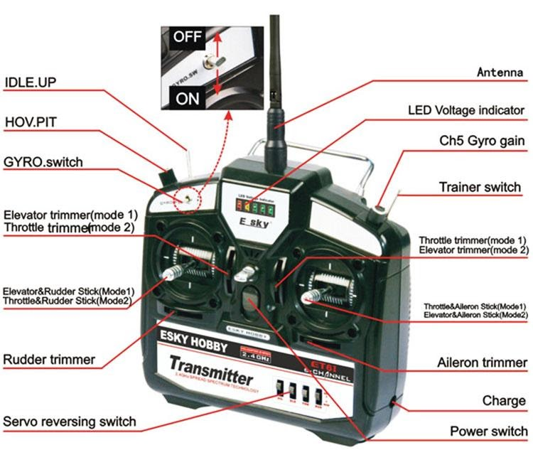
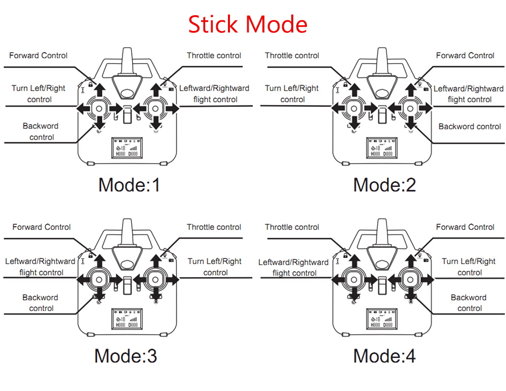
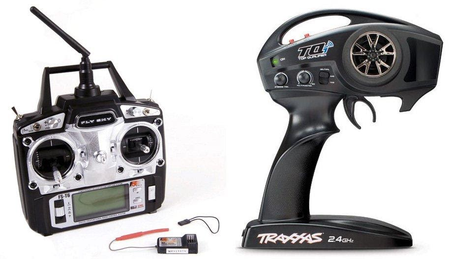
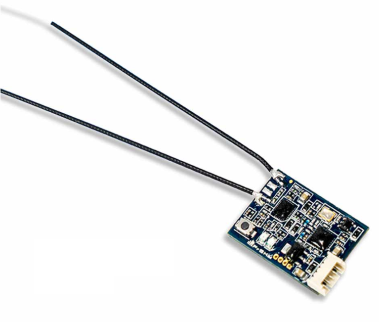
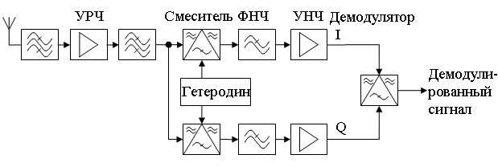
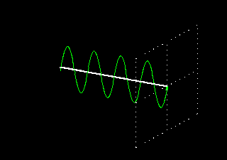
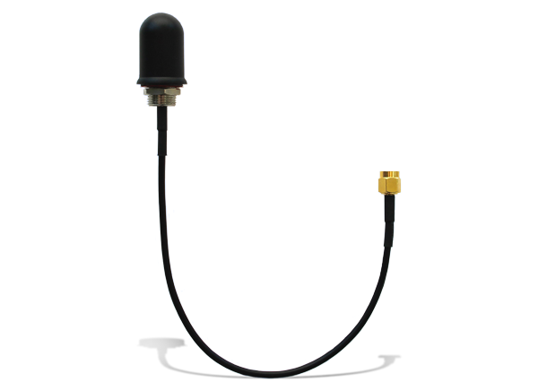
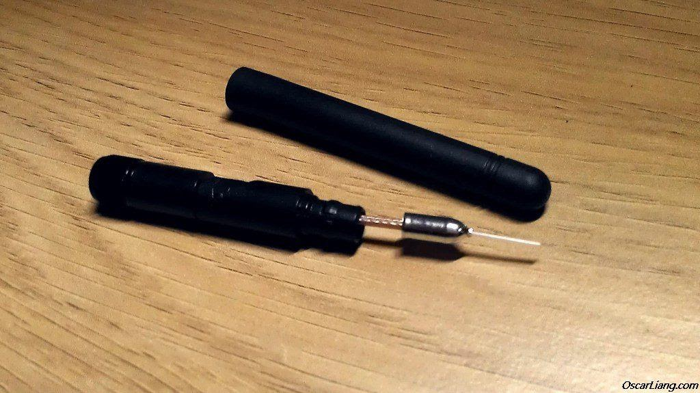
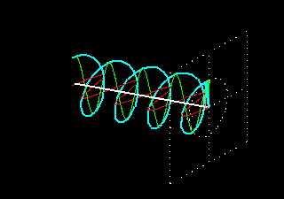
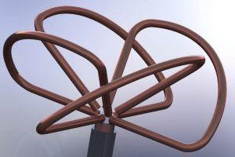
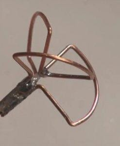
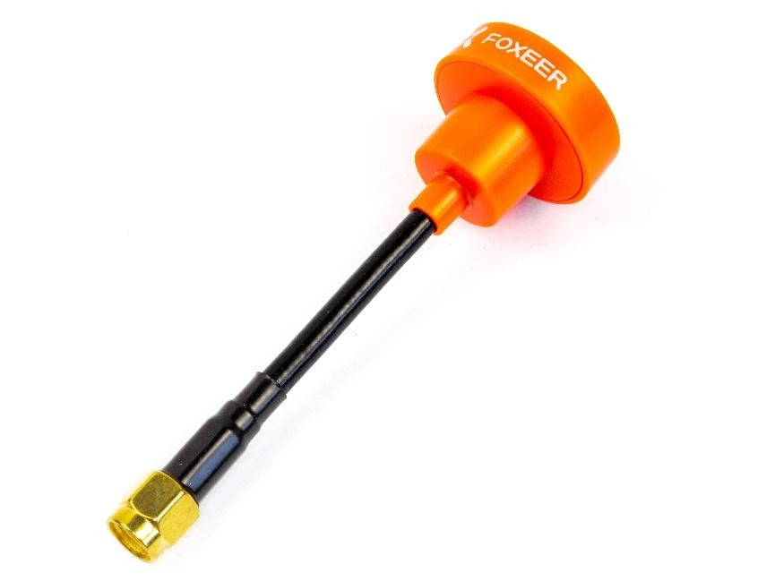
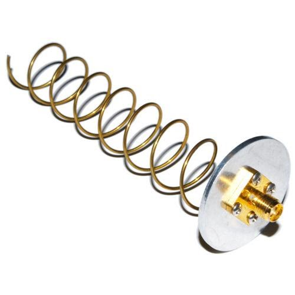
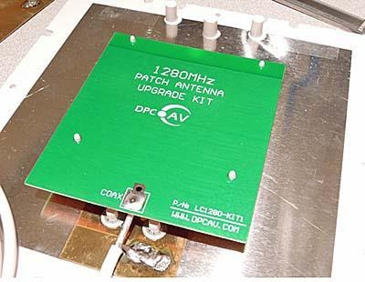
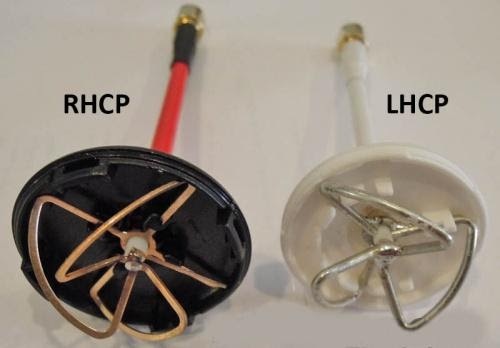
.. |image19| image:: media/image20.png
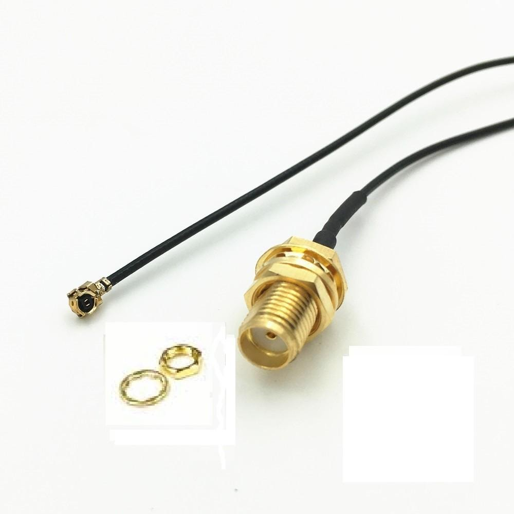
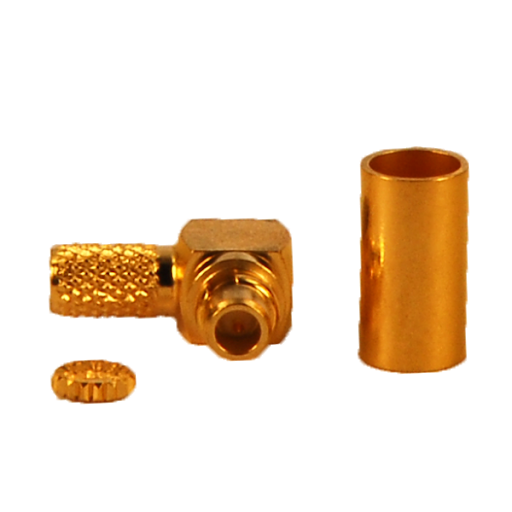
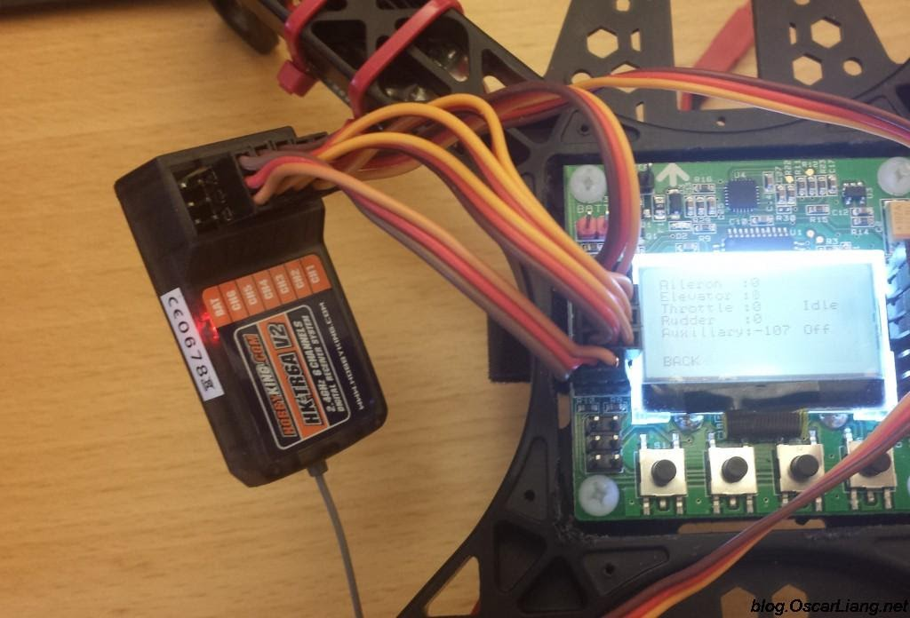
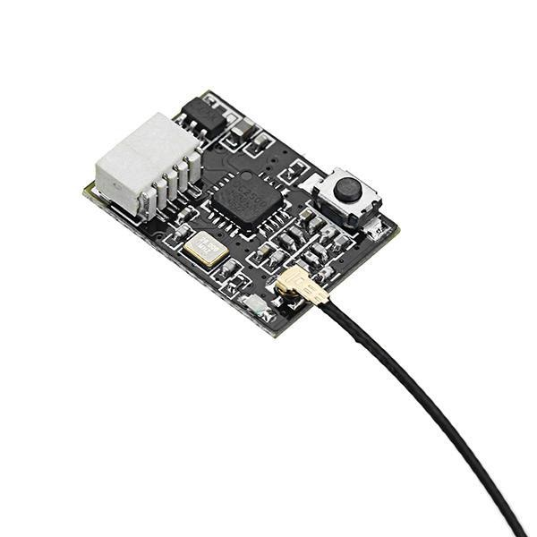
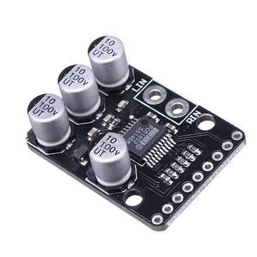
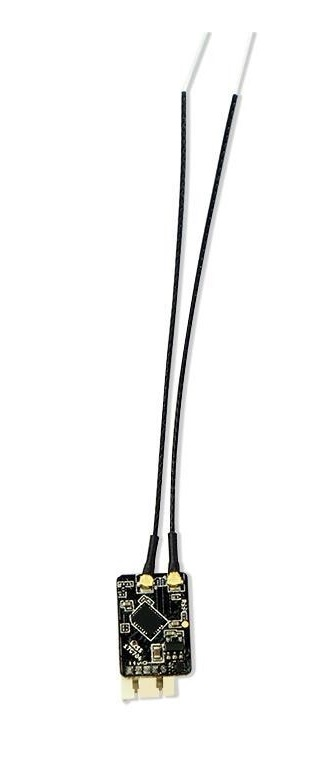
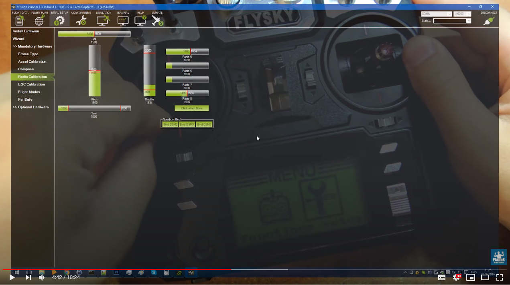

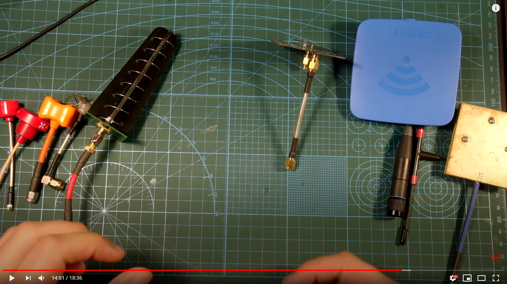

