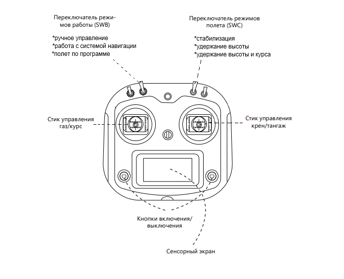

Визуальное пилотирование
------------------------

УМК «Пионер» ( и "Пионер Макс") пилотируется с помощью пульта дистанционное управления
(ДУ). Стоит сразу ответить, что во всех моделях органы управления
практически идентичны. Пульт ДУ делится на две части: *левый* и *правый*
стики управления. Эти стики отвечают за управление перемещением
квадрокоптера в пространстве (рисунок 1). С помощью левого стика регулируется высота полета и
вращение квадрокоптера вокруг оси. Правый стик позволяет контролировать
крен и тангаж для определения направления полета и управления наклоном.

.. note::
   У "Пионера Мини" в качестве пульта используется мобильное приложение на Android
   `"Geoscan Jump"`_. Раскладка управления классическая, но при желании вы так же можете ознакомится с особенностями управления "Пионер Мини" на странице
   :doc:`../../instructions/pioneer-mini/flight/mini-flight`

.. _"Geoscan Jump": https://play.google.com/store/apps/details?id=com.malinowski.quadro&hl=ru

Органы управления
-----------------

Квадрокоптер в пространстве перемещается по трем осям: тангаж (Pitch),
крен (Roll), рыскание (курс) (Yaw). На каждую ось — свой канал в пульте
управления, плюс отдельный канал на газ (Throttle). Итого 4 канала
управления коптером. Ниже на (Рисунок 2) приведена схема элементов
управления и их назначение.

|image0|

Рисунок 1 - Схема дистанционного пульта управления

