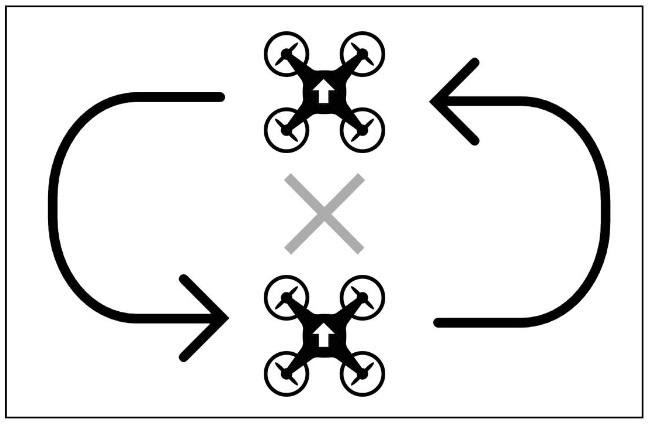

Практические упражнения пилотирования
-------------------------------------

Для получения опыта пилотирования предложены следующие упражнения,
рассчитанные на выполнение в режимах без удержания высоты и курсовой
стабилизации.

.. note:: Данные упражнение были написаны с учётом использования квадрокоптера "Геоскан Пионер", но также подойдут для обучения базовым навыкам пилотирования на других квадрокоптерах.

**Упражнение 1.** Взлет и посадка

Прежде всего необходимо освоить правильные взлет и посадку. Плавно
подвинув стик газа вперед до момента, когда коптер визуально будет
буквально стремиться на взлет, в этой ситуации звук двигателей слегка
меняет свою тональность. После одни точным движением стика увеличиваем
тягу на величину, где коптер плавно, но резко оторвется от поверхности.
Оказавшись на высоте 30-40 см, начинаем отрабатывать процесс посадки.
Тут стоит быть особо внимательными, так как посадка является одной из
самых трудных и опасных задач. Ни в коем случае не укладывайте сразу
левый стик до упора вниз, тем самым полностью минимизируя тягу, которая
приведет к резкому крушению коптера. Необходимо учиться плавно сбавлять
газ стиком, снижая аппарат над поверхностью.

.. tip:: Пульт дистанционного управления держите двумя
         руками, пальцы обеих рук всегда держатся за стики: левая – за стик газ /
         поворота вокруг оси, права – направление вперед/назад/влево/вправо.
         Движение стиками осуществлять без резких движений с максимальной
         плавностью. Повторяйте упражнение «взлет – посадка» не менее одного-двух
         десятков раз до автоматизма и полной уверенности при этом понемногу
         увеличивая высоту взлета в пределах 10-15 сантиметров, но не более 1.5
         метров общей допустимой высоты.

**Упражнение 2.** Зависание в воздухе (кормовой частью дрона к себе)

Очень важно научиться удерживать коптер в воздухе на одной высоте и в
одной точке вручную, без помощи дополнительного режима поддержание
высоты. Коптер может сносить в сторону ветром и турбулентные завихрения
будут вынуждать коптер двигаться в пространстве, а истощение заряда
аккумулятора – постепенно терять высоту. Поэтому контроль полета в
режиме «зависания в воздухе» – одно из важнейших упражнений в процессе
освоения пилотирования коптера.

Взлетаем и удерживаем коптер на высоте 1-1,5 метра над местом взлета.
Двигая стик газа вверх-вниз работаем над контролем высоты в течении 30
секунд, не допускать движение им влево-вправо! В противном случае нос
коптера начнет поворачиваться. При отклонении коптера из стороны в
сторону, одновременно с левым стиком газа, работаем правым стиком
тангажа (вперед/назад) и крена (влево/вправо) для стабилизации и
удержании коптера в одном положении. После совершить мягкую посадку
коптера в точку взлета.

.. tip:: Для более точного управления рекомендуется
         удерживать стики управления указательным и большим пальцем. Разница
         управления коптером одним пальцем и двумя велика. Таким способом проще
         контролировать, как скорость, так и направление коптера, а два средних
         пальца на грани пульта позволят использовать дополнительные возможности
         намного эффективней (снимать видео, делать фотографии, переключать
         режимы полета и тд.) без лишних движений. 

Повторяйте упражнение не менее одного-двух десятков раз, пока не
научитесь удерживать коптер в пределах воображаемого полуметрового
круга.

**Упражнение 3.** Полёты вперед-назад и влево-вправо (кормовой частью
дрона к себе)

Отработав маневры по зависанию в воздухе и посадки, приступаем к
движению коптера по сторонам. Взлетаем и удерживаем коптер на высоте
1-1,5 метра над местом взлета. Одновременно с левым стиком газа,
работаем правым стиком тангажа (вперед/назад) и крена (влево/вправо) для
того, чтобы отлететь в стороны. После совершить мягкую посадку коптера в
точку взлета.

.. tip:: Упражнение не менее одного-двух
         десятков раз до полной уверенности в маневрах и автоматизма действий.

|image0|

**Упражнение 4.** Полёт по кругу (кормой к себе)

Взлетаем и удерживаем коптер на высоте 1-1,5 метра над местом взлета.
Отлетаем на небольшое расстояние от точки взлета, чтобы визуально хорошо
контролировать стороны коптера. Не забываем контролировать газом высоту
полета, плавно начинаем работать правым стиком тангажа (вперед/назад) и
крена (влево/вправо) для полета вокруг точки взлета. После завершения
маневра совершаем мягкую посадку коптера в точку взлета.

.. tip:: Упражнение не менее одного-двух
         десятков раз до полной уверенности в маневрах и автоматизма действий.

|image1|

**Упражнение 5.** Поворот вокруг вертикальной оси (висение боком к себе)

Упражнение аналогично упражнению 2. Однако усложнено тем, что поворот
вокруг вертикальной оси осуществляется стиком, который попутно управляет
газов. Рыскание наклон стика влево/вправо, коптер будет поворачивать
носовую часть по часовой стрелке либо против часовой стрелки.

Взлетаем и удерживаем коптер на высоте 1-1,5 метра над местом взлета.
Поворачиваем коптер на 90 градусов против часовой стрелки и попутно
фиксируя его на одной высоте и в одном положении в течении 30 секунд,
затем поворачиваем обратно по часовой стрелке на 90 градусов и совершаем
мягкую посадку коптера в точку взлета. Для стабилизации и удержания
коптера в одном положении, работаем правым стиком тангажа (вперед/назад)
и крена (влево/вправо). 

.. tip:: Cложное в этом упражнении – удержать
         коптер на одной высоте, так как сместив стик влево или вправо, чтобы
         повернуть нос коптера по часовой или против часовой стрелке, вы
         неумышленно можете добавить или наоборот убавить газ, из-за чего коптер
         может взлететь вверх или наоборот провалиться вниз. Главное старайтесь
         отработать удержании высоты одновременно с поворотами. Присутствие
         погрешности в сбросе или наборе газа во время сдвига стика управления
         влево-вправо поначалу будут неизбежны.

Повторяйте упражнение не менее одного-двух десятков раз до полной
уверенности в маневре и автоматизма действий, пока коптера не будет
отклоняться по высоте не более 20 см.

|image2|

**Упражнение 6.** Полёты вперед-назад и влево-вправо (боком к себе)

Упражнение аналогично упражнению 3. Отработав маневр висение боком к
себе, приступаем к движению коптера по сторонам с развернутым на 90
градусов носом. Тут стоит быть особо внимательными, так как коптер может
быть повернут к вас носом, боком или кормой, но, если передвигать стик
управления вперед, коптер полетит туда, куда направлена его носовая
часть, а не туда куда направлен ваш взгляд. Всегда помните, где у
коптера носовая часть.

 Взлетаем и удерживаем коптер на высоте 1-1,5 метра над местом взлета.
Одновременно с левым стиком газа, работаем правым стиком тангажа
(вперед/назад) и крена (влево/вправо) для того, чтобы отлететь в
стороны. После совершить мягкую посадку коптера в точку взлета.

.. tip:: Упражнение не менее одного-двух
         десятков раз до полной уверенности в маневрах и автоматизма действий.

|image3|

**Упражнение 7.**  Полёт по линии с разворотами в крайних положениях
(боком к себе)

Взлетаем и удерживаем коптер на высоте 1-1,5 метра над местом взлета.
Поворачиваем коптер на 90 градусов по часовой стрелке, либо против
часовой, затем начинаем движение по недлинному отрезку вперед, в конце
разворачиваемся, смещая правый стик (крен) вправо или влево,
одновременно проделав тоже самое с левым стиком (рыскание). При этом не
забываем контролировать высоту, чтобы не свалиться в штопор и вернуть
стики в вертикальное положение, чтобы завершить маневр разворота.

.. tip:: Важно соблюдать плавность и синхронность
         действий двух стиков крена и рыскания при развороте в конце отрезка.

Повторяйте упражнение не менее одного-двух десятков раз до полной
уверенности в маневре и автоматизма действий.

|image4|

**Упражнение 8.** Поворот вокруг вертикальной оси (висение носом к себе)

Упражнение аналогично упражнениям 2 и 5. Не забываем, так как коптер
повернут к нам носом, передвинув стик управления вперед, коптер полетит
туда, куда направлена его носовая часть, а не туда куда направлен ваш
взгляд. Всегда помните, где у коптера носовая часть.

Взлетаем и удерживаем коптер на высоте 1-1,5 метра над местом взлета.
Поворачиваем коптер на 180 градусов против часовой стрелки и попутно
фиксируя его на одной высоте и в одном положении в течении 30 секунд,
затем поворачиваем обратно по часовой стрелке на 180 градусов и
совершаем мягкую посадку коптера в точку взлета. Для стабилизации и
удержания коптера в одном положении, работаем правым стиком тангажа
(вперед/назад) и крена (влево/вправо). 

.. tip:: Упражнение не менее одного-двух
         десятков раз до полной уверенности в маневре и автоматизма действий,
         пока коптера не будет отклоняться по высоте не более 20 см.

|image5|

\ **Упражнение 9.** Полёт по кругу (носом к вперёд)

Упражнение аналогично упражнению 4. Взлетаем и удерживаем коптер на
высоте 1-1,5 метра над местом взлета. Поворачиваем коптер на 90 градусов
против, либо по часовой стрелке и попутно фиксируя его на одной высоте,
плавно начинаем работать правым стиком тангажа (вперед/назад) и крена
(влево/вправо). Смещая правый стик (крен) вправо или влево, одновременно
проделываем тоже самое с левым стиком (рыскание) для полета вокруг точки
взлета. После завершения маневра совершаем мягкую посадку коптера в
точку взлета.

.. tip:: Упражнение не менее одного-двух
         десятков раз до полной уверенности в маневре и автоматизма действий.

|image6|

Выполнив успешно все предыдущие упражнения, отработав основные маневры
пилотирования, ознакомившись с основными моментами безопасности при
пилотировании в режиме FPV, переходим к двух заключительными
упражнениям.

.. note::
   Первые полеты в FPV рекомендуется выполнять в режиме
   удержания высоты.

**Упражнение 10.** Пилотирование в FPV (в просторной зоне)

Взлетаем и удерживаем коптер на высоте 1-1,5 метра над местом взлета. Не
забываем контролировать газом высоту полета, если полёт осуществляется
без режима удержания высоты. Плавно начинаем работать правым стиком
тангажа (вперед/назад) и крена (влево/вправо) для преодоления строго
обозначенного маршрута согласно изображению. После преодоления маршрута
совершаем мягкую посадку коптера в точке, противоположенной точке
взлета.

|image7|

**Упражнение 11.** Пилотирование в FPV (c препятствиями)

Упражнение с пролётами через кольца, ворота, рассчитанное на
аккуратность управления коптером.

Взлетаем и удерживаем коптер на высоте 1-1,5 метра над местом взлета. Не
забываем контролировать газом высоту полета, если полёт осуществляется
без режима удержания высоты. Плавно начинаем работать правым стиком
тангажа (вперед/назад) и крена (влево/вправо) для преодоления строго
обозначенного маршрута, через кольца согласно изображению (допустима
другая вариация расстановки колец, ворот). После преодоления маршрута
совершаем мягкую посадку коптера в точке, противоположной точке
взлета.

|image8|

.. |image3| image:: media/image4-4.jpeg

.. |image5| image:: media/image6-4.png
.. |image6| image:: media/image7-4.png
.. |image7| image:: media/image8-4.png

