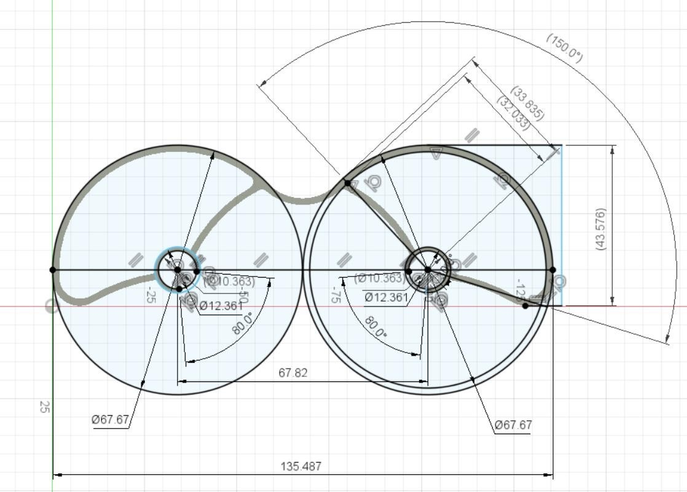
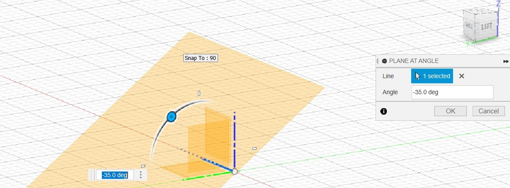
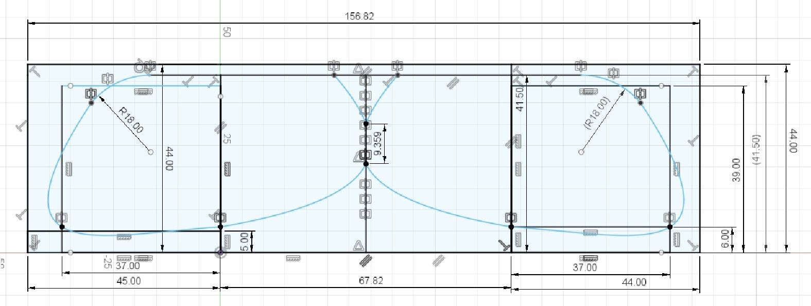
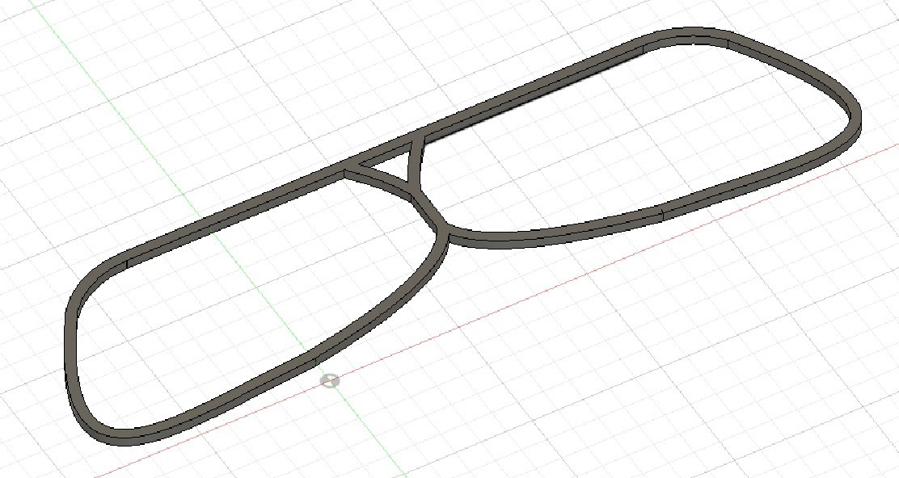
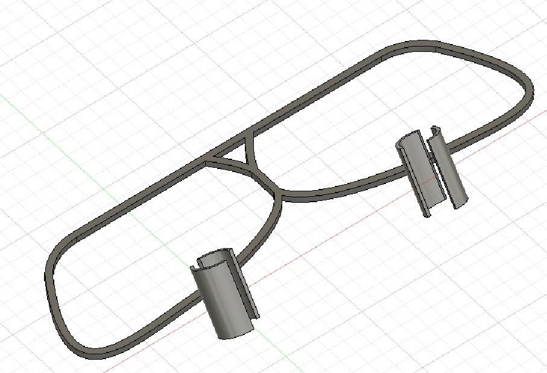
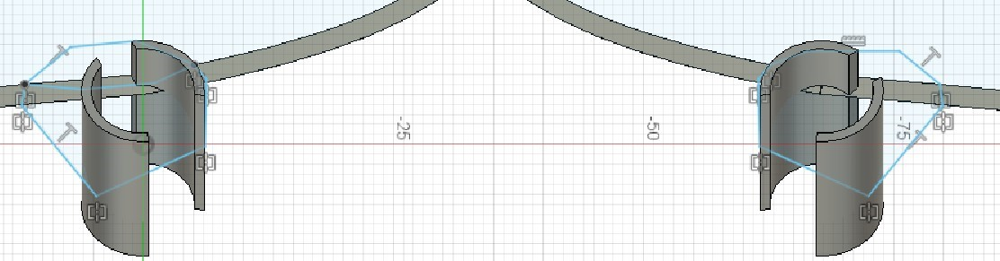
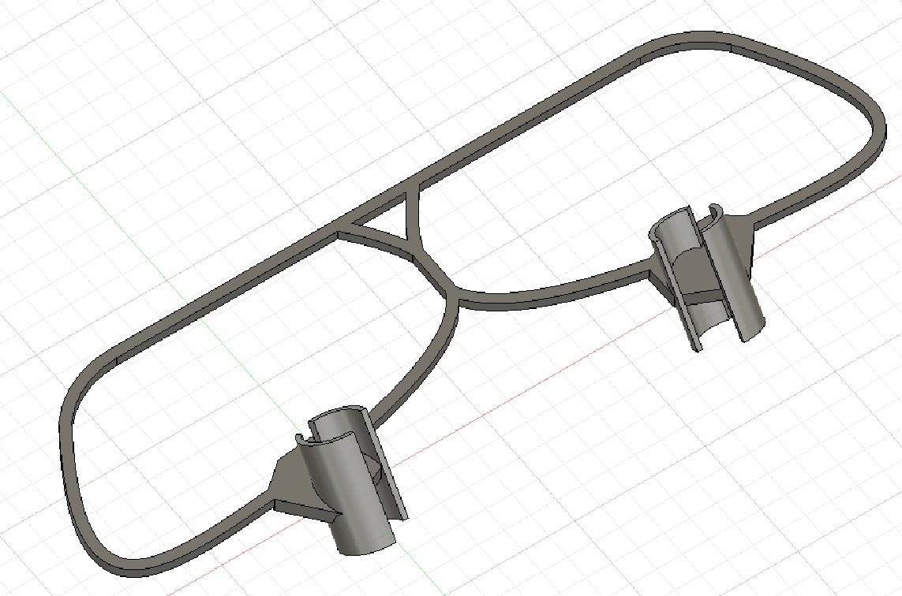

Разработка простой и эффективной защиты для Пионера Мини
========================================================

Конструкция квадрокоптера Пионер Мини позволяет его кастомизировать.
Пользователь Николай Семёнов поставил перед собой задачу разработать эффективную защиту для винтов квадокптера Пионер Мини, которую можно легко распечтатаь на простом 3D-принтере.
Николай решил поделиться опытом проектования модели в Autodesk Fusion 360 и постановки её на 3D-печать.

Разработка защиты состояла из следующих этапов:

#. Определние требований к защите

#. Анализ альетрнативной защиты

#. Снятие размеров с реального обьекта

#. Cоздание эскизов и проектирование 3D-модели

#. Печать защиты на 3D-принтере

#. Тестирование защиты

Опрделение требований:
----------------------

Перед тем, как начать проектировать защиту для винтов необходимо определится с требованиями к ней.

**Требование №1** Возможность изготовления детали простой технологией FDM-печати без добавления поддерживающих слоёв материала

**Требование №2** Должна быть высокая зона охвата винтов

**Требование №3** Хорошее опротивление ударным нагрузкам

**Требование №4** Вес комплекта защиты не должен привышать 15 грамм

**Требование №5** Надёжность крепления деталей к раме БПЛА

Учитывая все заявленные требования, было принято решение сделать деталь плоской, но придать крепёжному кольцу некоторый угол наклона. При установке детали на раму БПЛА ось крепёжного кольца совпадёт с вертикальной осью гондолы двигателя, а внешняя часть контура детали после установки будет находиться в точности на уровне лопастей винтов, обеспечивая им должный уровень защиты.

Анализ альтернативной защиты:
-----------------------------

На момент начала работ по проектированию, уже существовала альтернативная модель защиты винтов(рисунок 1), однако взять за основу альтернативного комплекта данную модель не представлялось возможным ввиду того, что её внешний контур при установке на раму БПЛА располагается не на уровне лопастей винтов, а сильно ниже, не обеспечивая требуемый уровень защиты винтов.

|image0|

Рисунок 1 - Альтернативаня модель защиты винтов

Однако из данной модели в качестве справочной информации был взят ряд размеров, в частности, диаметр посадочного отверстия на гондолу двигателя и величина угла прорези крепёжного кольца, через которую осуществляется боковая установка детали на гондолу двигателя. Эскиз с обозначенными размерами представлен на рисунке 2.

|image1|

Рисунок 2 - Размеры альтернативной модели

Снятие размеров с реального обьекта:
------------------------------------

Оставшаяся часть размеров, в частности, диаметр винтов и внешние габариты, были взяты непосредственно с самого БПЛА при помощи штангенциркуля.

Cоздание эскизов и проектирование 3D-модели:
--------------------------------------------

Построение детали начинается с построения вспомогательной плоскости под углом 35˚ к горизонтальной плоскости. Построение осуществляется командой «Construct - Plane At Angle». Осью поворота в данном случае выступает ось Х. Вспомогательная плоскость представлена на рисунке 3.

|image2|

Рисунок 3 - Вспомогательная плоскость 1

Далее в этой плоскости строится эскиз 1, представлен на рисунке 4.

|image3|

Рисунок 4 - Эскиз 1

В плоскости XY выполняем построение эскиза 2, моделируя внешний контур детали. Эскиз 2 намеренно оставляем видимым для совмещения с ним эскиза 3, что представлено на рисунке 5.

|image4|

Рисунок 5 - Эскиз 2

Посредством нескольких применений операции «Create - Pipe» моделируем внешний контур детали, что представлено на рисунке 6. Сечение контура квадратное, сторона 2 мм.

|image5|

Рисунок 6 - Модель внешнего контура детали

Посредством команды «Create – Extrude - Join» получаем заготовки крепёжных колец, что представлено на рисунке 7. Join характеризует объединение полученных заготовок с внешним контуром детали в единое тело. Длина пути выдавливания не играет большой роли, т. к. в дальнейшем планируется обрезание детали.

|image6|

Рисунок 7 - Заготовки крепёжных колец

Для крепления крепёжных колец к внешнему контуру детали необходимо усиление конструкции, поэтом устроим эскиз 3, представленный на рисунке 8. Построение эскиза происходит в плоскости, лежащей на верхней горизонтальной плоскости внешнего контура.

|image7|

Рисунок 8 - Эскиз 3

Далее применяется команда «Create – Extrude - Join» (глубина выдавливания 3 мм), что представлено на рисунке 9.

|image8|

Рисунок 9 - Добавление усиления к детали

Произведём вырез отверстия и паза в крепёжных кольцах посредством применения команды «Create – Extrude – Cut», что представлено на рисунке 10.
Профиль выдавливания взят из эскиза 1.

|image9|

Рисунок 10 - Деталь с вырезами

Произведём увеличение внешнего контура детали на 1 мм в высоту (основание детали должно лежать в одной плоскости) в направлении, обратном оси Z. Для этого перевернём деталь и воспользуемся командой «Create – Extrude - Join», что представлено на рисунках 11 и 12.

|image10|

Рисунок 11 - Модель до увеличения

|image11|

Рисунок 12 - Модель после увеличения

Произведём обрезание лишних частей крепёжных колец посредством создания прямоугольников нужного размера в составе эскизов 4 и 5 в верхней и нижней горизонтальных плоскостях внешнего контура детали соответственно и дальнейшего применения команды «Create – Extrude – Cut», что представлено на рисунке 13.

|image12|

Рисунок 13 - Модель после обрезания

На внутреннем крае профиля детали произведём фаску, что представлено на рисунке 14.

|image13|

Рисунок 14 - Создание фаски

Переведём деталь из тела в компонент командой «Create components from bodies». Модель полученной детали защиты винтов для левого борта БПЛА представлена на рисунке 15.

|image14|

Рисунок 15 - Модель и дерево

Поскольку деталь защиты винтов для правого борта симметрична текущей детали, её построение в данном и последующих разделах рассматривать не будем.
Физические свойства полученной детали с назначением материала, близкого по своим характеристикам к заявленному в требованиях, представлены на рисунке 16.

|image15|

Рисунок 16 - Физические свойства детали

Ассоциативный чертеж был создан при помощи команды «Drawing – From design». Поскольку САПР Autodesk Fusion 360 не поддерживает построение чертежей в соответствие с ЕСКД, текущий и последующие чертежи будут выполнены в наиболее близком к ЕСКД формате ISO - основном международном стандарте оформления чертежей. 
К деталям защиты винтов требований по точности и шероховатости предъявлено не было ввиду низкой степени ответственности деталей, поэтому в чертежах текущей и последующих деталей соответствующие обозначения указаны не будут. Окончательные чертежи детали в горизонтальном и рабочем положениях представлены на рисунках 17 и 18, а также в приложении Б.

|image16|

Рисунок 17 - Чертёж детали в горизонтальном положении

|image17|

Рисунок 18 - Чертёж детали в рабочем положении

.. |image0| image:: media/image0.jpg
   :width: 2in
   :height: 2in

.. |image3| image:: media/image3.jpg
   :width: 2in
   :height: 2in

.. |image9| image:: media/image9.jpg
   :width: 2in
   :height: 2in
.. |image10| image:: media/image10.jpg
   :width: 2in
   :height: 2in
.. |image11| image:: media/image11.jpg
   :width: 2in
   :height: 2in
