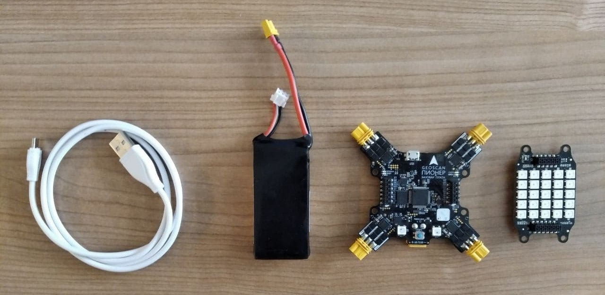

Проект Geoscan Base. Работа с гироскопом и led-матрицей.
========================================================

! Тема урока: Работа с гироскопом и светодиодной мтарицей.

! Необходимые комноненты: плата квадрокптера, "Модуль LED", аккумулятор, usb-кабель.

! Цель урока: создание игры по сбору меток в пределах матрицы светодиодов.

|image0|

.. important:: "Модуль LED" работет только при подключенном к базовой плате аккумуляторе.

Работа с гиросокпом
-------------------

К гироскопу на кадрокптерке мы обращаемся через класс Sensors() и получем от него три прараметра, а именно углы отклнения по тангажу и крену а также рысканье.
Выглядит это следующим образом: 

*roll, pitch, yaw = Sensors.orientation()*

Работа с LED модулем
--------------------

На модуле находится 25 адресных светодидов, в программе их адрес задаётся после основных четырёх светодиодов, т.е. с 4 по 28 включительно.

Создание игры
-------------

Если с управлением в игре при помощи гироскопа всё более менее понятно, то вот с созданием границ у матрицы всё сложнее. Ведь персонаж "сборщик" при максимальном смещении 
должен упираться в стенку, а не перходить на другой ряд матрицы. Для этого необходимо

    
.. literalinclude:: led_matrix_game.lua
   :language: lua
   :encoding: windows-1251
   :linenos:

.. |image1| image:: media/image1.jpg
   :width: 2in
   :height: 2in

