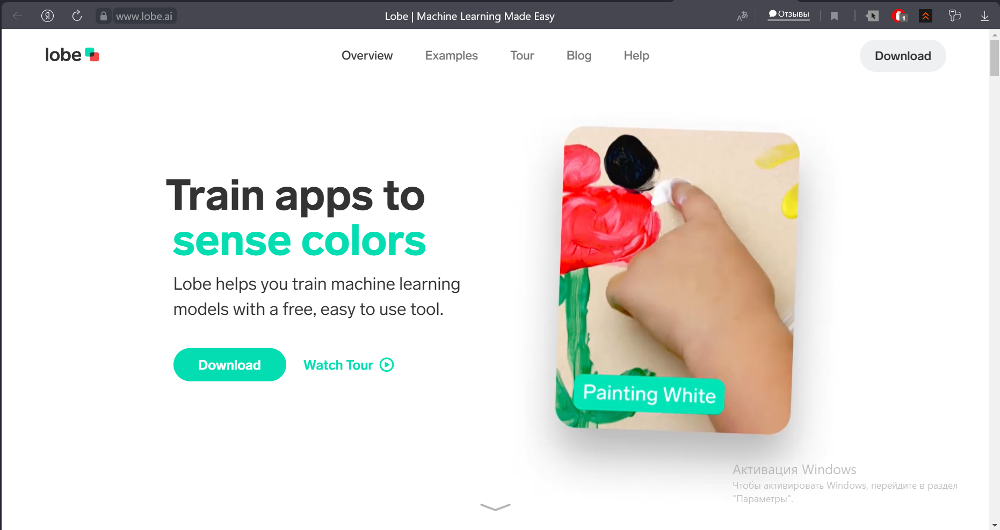
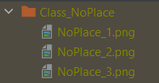

Поиск вертолетных площадок
==========================

Описание проекта
----------------

Данный проект предназначен для ознакомления с бесплатным программным обеспечением LobeAI, позволяющим с помощью простого
графического интерфейса натренировать собственную нейронную сеть. Нейронная сеть работает в режиме классификатора, это значит, что
она может лишь определять, есть ли на изображении объект того или иного класса, или его нет, положение на изображении не определяется.

.. image:: ./media/work-gif.gif
   :width: 1800

Проект доступен на `GitHub`_:

::

    git clone https://github.com/DgtalCode/parking_finder.git

.. _GitHub: https://github.com/DgtalCode/parking_finder

Установка компонентов
---------------------

Для работы проекта нам понадобится установить некоторые библиотеки и программы.

Для установки всех необходимых библиотек в папке проекта есть файл **requirements.txt**, в котором есть список названий.
Запустите команду из командной строки, находясь в корневой папке проекта:

::

    pip install requirements.txt

.. note::
    Чтобы быстро открыть командную строку, перейдите в проводнике в нужную папку и впишите "cmd" (без кавычек) в строку
    с текущим путём.

Для установки программы Lobe переходим на их `официальный сайт`_ и нажимаем кнопку Download, после чего устанавливаем
как самую обычную программу.

.. _официальный сайт: https://lobe.ai

Этапы разработки
----------------

Начало
~~~~~~

Для того, чтобы натренировать нейронную сеть, необходимо сначала получить тренировочные двнные (датасет). Сделать это можно двумя способами:

* скачать готовый датасет,
* скачать картинки из интернета и вручную отсортировать по классам,
* сделать свои фотографии.

Поиск датасетов в интернете
~~~~~~~~~~~~~~~~~~~~~~~~~~~

На данный момент сообщество, работающее с нейросетями, развивается очень стремительно, и отчасти это связано с тем, что все больше
наборов данных появляются в сети в свободном доступе.

Для поиска датасетов существует сайт `Kaggle`_, на котором помимо форума, примеров программ, соревнований, есть как раз множество открытых
датасетов.

.. _Kaggle: https://www.kaggle.com/datasets

Самостоятельное создание датасета
~~~~~~~~~~~~~~~~~~~~~~~~~~~~~~~~~

Датасета с фотографиями вертолетных площадок на просторах интернета найти не удалось, поэтому попробуем
его создать собственноручно. Для этого напишем небольшую прогруммку,
которую в дальнейшем можно будет использовать и для тестирования проекта.

Напишем программу, которая протестирует правильность установки всех библиотек и качество связи с квадрокоптером:

.. code-block:: python

    import pioneer_sdk
    import cv2
    import numpy as np

    pioneer = pioneer_sdk.Pioneer()

    while True:
        raw = pioneer.get_raw_video_frame()
        frame = cv2.imdecode(np.frombuffer(raw, dtype=np.uint8), cv2.IMREAD_COLOR)

        cv2.imshow("Frame", frame)

        k = cv2.waitKey(1)

        if k == ord('q'):
            break

    cv2.destroyAllWindows()

При подключении к коптеру и запуске программы у вас появится окно с изображением с камеры Пионера:

.. image:: ./media/img.png
    :width: 350

Теперь можно усовершенствовать нашу программу таким образом, чтобы она сохраняла в определенный каталог
фотографии по нажатии на кнопки (f, b - переключение классов; a - добавить фотографию в класс):

.. code-block:: python

    import pioneer_sdk
    import cv2
    import numpy as np
    import os

    pioneer = pioneer_sdk.Pioneer()

    classes = ('NoPlace', 'Place')
    indexes = []
    cur_class = 0

    for cls in classes:
        if f'Class_{cls}' not in os.listdir():
            os.mkdir(f'Class_{cls}')
        indexes.append(len(os.listdir(path=f'./Class_{cls}')))

    while True:
        raw = pioneer.get_raw_video_frame()
        frame = cv2.imdecode(np.frombuffer(raw, dtype=np.uint8), cv2.IMREAD_COLOR)

        k = cv2.waitKey(1)

        if k == ord('q'):
            break

        if k == ord('f') and cur_class < len(classes)-1:
            cur_class += 1
        if k == ord('b') and cur_class > 0:
            cur_class -= 1
        if k == ord('a'):
            indexes[cur_class] += 1
            cv2.imwrite(f'./Class_{classes[cur_class]}/{classes[cur_class]}_{indexes[cur_class]}.png', frame)
            print(f'Image added to class {classes[cur_class]}!!!')

        cv2.putText(frame, f'Current class is {classes[cur_class]}', (20, 450), cv2.FONT_HERSHEY_SIMPLEX, fontScale=0.5,
                    color=(0, 0, 255))
        cv2.putText(frame, f'Images in class: {indexes[cur_class]}', (20, 470), cv2.FONT_HERSHEY_SIMPLEX, fontScale=0.5,
                    color=(0, 0, 255))
        cv2.imshow("Frame", frame)

    cv2.destroyAllWindows()

Фотографии сохраняются в папках с названием, соответствующих названиям классов: Class_<ИмяКласса>, имена фотографий
также соответсвуют названию классов + порядковый номер: <ИмяКласса>_<Номер>.png

Для обучения в программе Lobe требуется минимум 5 фотографий на каждый класс, при этом классов может быть минимум 2. Однако
на таком небольшом объеме данных нейросеть не может обучиться хорошо, поэтому следует на каждый класс делать не менее 20 фотографий
в разных условиях.

.. note::
    Например, в нашем случае фотографии места посадки стоит делать на разной высоте, с разным углом поворота и углом обзора.

Загрузка датасета в Lobe
~~~~~~~~~~~~~~~~~~~~~~~~

Для загрузки наших созданных папок с фотографиями в Lobe необходимо провести следующие операции:

#. Открываем Lobe и нажимаем Import в правом верхнем углу:

   .. image:: ./media/img_3.png
      :width: 450

#. Появляется 3 режима импорта, выбираем Dataset:

   .. image:: ./media/img_4.png
      :width: 450

#. Заходим в рабочую директорию проекта и выбираем **папку** с изображениями первого класса:

   .. image:: ./media/img_5.png
      :width: 450

#. При импорте вы можете изменить название класса, или оставить его таким же, как название папки. Оставляем без изменений:

   .. image:: ./media/img_6.png
      :width: 450

#. Класс изображений импортировался. Проводим аналогичную операцию с оставшимися классами; нажимаем Import:

   .. image:: ./media/img_7.png
      :width: 450

#. Выбираем Dataset:

   .. image:: ./media/img_8.png
      :width: 450

#. Как и в прошлый раз выбираем папку с фотографиями нужного класса

#. Немного подождите, пока нейросеть обучится, после чего можете перейти на вкладку Camera для тестирования:

   .. image:: ./media/img_9.png
      :width: 450

   .. note::
      Для работы данной функции ван нужна вебкамера.

   Перед вами откроется окно с изображением с вашей камеры, по которому нейросеть будет пытаться предсказывать класс объекта.
   Слева у вас показывается предсказанный класс и степень "уверенности" нейросети в предсказании (заполненность полоски).
   Справа расположены кнопки, которые позволяют сказать нейросети, правильно ли она сделала предсказание. Такое решение позволяет
   прямо во время тестирования улучшать работу нейросети.

#. После получения удовлетворительных результатов нам нужно экспортировать обученную нейросеть для использования в своих программах.
   Для этого в левом меню нажимаем на Export:

   .. image:: ./media/img_10.png
      :width: 450

#. Выбираем TensorFlow (красная кнопка):

   .. image:: ./media/img_11.png
      :width: 450

#. Выбираем место, куда экспортируется модель:

   .. image:: ./media/img_12.png
      :width: 450

#. Соглашаемся на оптимизацию:

   .. image:: ./media/img_13.png
      :width: 450

#. Через некоторое время получаем папку с натренированной моделью, готовой к использованию:

   .. image:: ./media/img_14.png
      :width: 450

Исходный код
------------

.. literalinclude:: ./parking_finder/main.py
   :language: python

Данный код позволяет управлять квадрокоптером Геоскан Пионер Мини с помощью ноутбука клавишами WASD, а также с помощью
обученной нейросети квадрокоптер будет автоматически включать сигнальные светодиоды при нахождении над предполагаемым местом посадки.