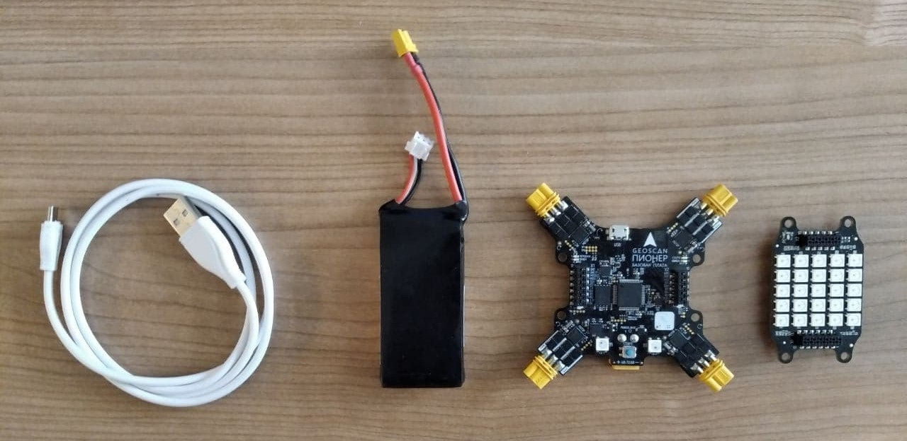

Проект Geoscan Base. Работа с гироскопом и led-матрицей.
========================================================

! Тема урока: Работа с гироскопом и светодиодной матрицей.

! Необходимые компоненты: базовая плата квадрокоптера, "Модуль LED", аккумулятор, usb-кабель.

! Цель урока: создание игры по сбору меток в пределах матрицы светодиодов.

|image0|

.. important:: "Модуль LED" работает только при подключённом к базовой плате аккумуляторе.

Работа с гироскопом
-------------------

К гироскопу на квадрокоптере мы обращаемся через класс Sensors() и получаем от него три параметра, а именно углы отклонения по тангажу, крену, а также рысканью: 

*roll, pitch, yaw = Sensors.orientation()*

Работа с LED модулем
--------------------

На модуле находится 25 адресных светодиодов, в программе их адрес задаётся после основных четырёх светодиодов, т.е. с 4 по 28 включительно.

Создание игры
-------------

Если с управлением в игре при помощи гироскопа всё более менее понятно, то вот с созданием границ у матрицы всё сложнее. Ведь персонаж "сборщик" при максимальном смещении должен упираться в стенку, а не переходить на другой ряд матрицы.

    
.. literalinclude:: led_matrix_game.lua
   :language: lua
   :encoding: windows-1251
   :linenos:

