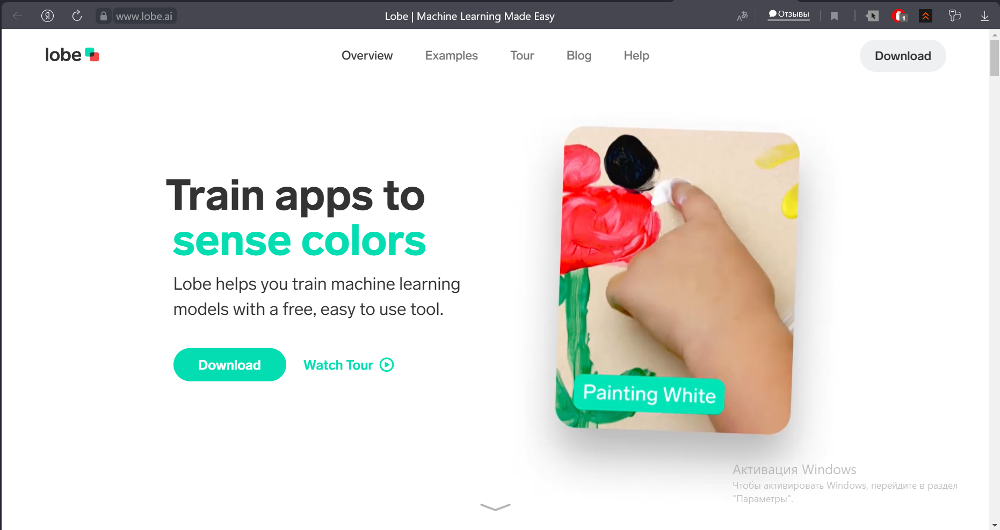
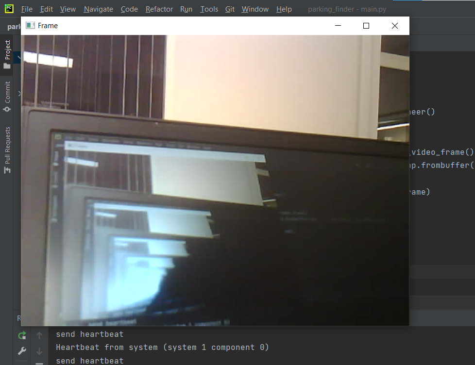
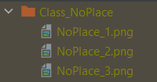

Поиск вертолетных площадок
==========================

Описание проекта
----------------

Данный проект предназначен для ознакомления с бесплатным программным обеспечением LobeAI, позволяющим с помощью простого
графического интерфейса натренировать собственную нейронную сеть. Нейронная сеть работает в режиме классификатора, это значит, что
она может лишь определять, есть ли на изображении объект того или иного класса, или его нет, положение на изображении не определяется.

.. image:: ./media/work-gif.gif
   :width: 1800

Проект доступен на `GitHub`_

.. _GitHub: https://github.com/GeoScan-Pioneer/parking_finder

.. note::
   При клонировании проекта и создании знака, непохожего на показанный в видео, у вас может нестабильно работать определение вертолетных площадок. Это связано с тем,
   что нейросеть натренирована на представленном выше месте, поэтому другие знаки она может определять хуже.
   Если вы столкнулись с некорректной работой нейросети, то проведите процесс дополнительного обучения при тестировании,
   о коотором пойдет речь далее.

Установка компонентов
---------------------

.. important::
    Не рекомендуется использовать последнюю прошивку автопилота (1.6.7747) так как она замедляет скорость выполнения
    команд квадрокоптером. Для нормальнйо работы программы `установите прошивку`_ версии 1.6.7482.

.. _установите прошивку: https://docs.geoscan.aero/ru/master/downloads/software-d.html#a-pioneer-mini

Для работы проекта нам понадобится установить некоторые библиотеки и программы.

Для установки всех необходимых библиотек в папке проекта есть файл **requirements.txt**, в котором есть список названий.
Запустите команду из командной строки, находясь в корневой папке проекта:

::

    pip install -r requirements.txt

.. note::
    Чтобы быстро открыть командную строку, перейдите в проводнике в нужную папку и впишите "cmd" (без кавычек) в строку
    с текущим путём.

Для установки программы Lobe переходим на их `официальный сайт`_ и нажимаем кнопку Download, после чего устанавливаем
как самую обычную программу.

.. _официальный сайт: https://lobe.ai

Этапы разработки
----------------

Начало
~~~~~~

Для того, чтобы натренировать нейронную сеть, необходимо сначала получить тренировочные двнные (датасет). Сделать это можно двумя способами:

* скачать готовый датасет,
* скачать картинки из интернета и вручную отсортировать по классам,
* сделать свои фотографии.

Поиск датасетов в интернете
~~~~~~~~~~~~~~~~~~~~~~~~~~~

На данный момент сообщество, работающее с нейросетями, развивается очень стремительно, и отчасти это связано с тем, что все больше
наборов данных появляются в сети в свободном доступе.

Для поиска датасетов существует сайт `Kaggle`_, на котором помимо форума, примеров программ, соревнований, есть как раз множество открытых
датасетов.

.. _Kaggle: https://www.kaggle.com/datasets

Самостоятельное создание датасета
~~~~~~~~~~~~~~~~~~~~~~~~~~~~~~~~~

Датасета с фотографиями вертолетных площадок на просторах интернета найти не удалось, поэтому попробуем
его создать собственноручно. Для этого напишем небольшую прогруммку,
которую в дальнейшем можно будет использовать и для тестирования проекта.

Для проверки корректности установки всех библиотек, связанных с работой с дроном, можно запустить файл ``pioneer_sdk/examples/camera_stream.py``

При подключении к коптеру и запуске программы у вас появится окно с изображением с камеры Пионера:

Теперь можно усовершенствовать нашу программу таким образом, чтобы она сохраняла в определенный каталог
фотографии по нажатии на кнопки (f, b - переключение классов; a - добавить фотографию в класс):

.. code-block:: python

    import pioneer_sdk
    import cv2
    import numpy as np
    import os

    pioneer = pioneer_sdk.Pioneer()

    classes = ('NoPlace', 'Place')
    indexes = []
    cur_class = 0

    for cls in classes:
        if f'Class_{cls}' not in os.listdir():
            os.mkdir(f'Class_{cls}')
        indexes.append(len(os.listdir(path=f'./Class_{cls}')))

    while True:
        raw = pioneer.get_raw_video_frame()
        frame = cv2.imdecode(np.frombuffer(raw, dtype=np.uint8), cv2.IMREAD_COLOR)

        k = cv2.waitKey(1)

        if k == ord('q'):
            break

        if k == ord('f') and cur_class < len(classes)-1:
            cur_class += 1
        if k == ord('b') and cur_class > 0:
            cur_class -= 1
        if k == ord('a'):
            indexes[cur_class] += 1
            cv2.imwrite(f'./Class_{classes[cur_class]}/{classes[cur_class]}_{indexes[cur_class]}.png', frame)
            print(f'Image added to class {classes[cur_class]}!!!')

        cv2.putText(frame, f'Current class is {classes[cur_class]}', (20, 450), cv2.FONT_HERSHEY_SIMPLEX, fontScale=0.5,
                    color=(0, 0, 255))
        cv2.putText(frame, f'Images in class: {indexes[cur_class]}', (20, 470), cv2.FONT_HERSHEY_SIMPLEX, fontScale=0.5,
                    color=(0, 0, 255))
        cv2.imshow("Frame", frame)

    cv2.destroyAllWindows()

Фотографии сохраняются в папках с названием, соответствующих названиям классов: Class_<ИмяКласса>, имена фотографий
также соответсвуют названию классов + порядковый номер: <ИмяКласса>_<Номер>.png

Для обучения в программе Lobe требуется минимум 5 фотографий на каждый класс, при этом классов может быть минимум 2. Однако
на таком небольшом объеме данных нейросеть не может обучиться хорошо, поэтому следует на каждый класс делать не менее 20 фотографий
в разных условиях.

.. note::
    Например, в нашем случае фотографии места посадки стоит делать на разной высоте, с разным углом поворота и углом обзора.

Загрузка датасета в Lobe
~~~~~~~~~~~~~~~~~~~~~~~~

Для загрузки наших созданных папок с фотографиями в Lobe необходимо провести следующие операции:

#. Открываем Lobe и нажимаем Import в правом верхнем углу:

   .. image:: ./media/img_3.png
      :width: 450

#. Появляется 3 режима импорта, выбираем Dataset:

   .. image:: ./media/img_4.png
      :width: 450

#. Заходим в рабочую директорию проекта и выбираем **папку** с изображениями первого класса:

   .. image:: ./media/img_5.png
      :width: 450

#. При импорте вы можете изменить название класса, или оставить его таким же, как название папки. Оставляем без изменений:

   .. image:: ./media/img_6.png
      :width: 450

#. Класс изображений импортировался. Проводим аналогичную операцию с оставшимися классами; нажимаем Import:

   .. image:: ./media/img_7.png
      :width: 450

#. Выбираем Dataset:

   .. image:: ./media/img_8.png
      :width: 450

#. Как и в прошлый раз выбираем папку с фотографиями нужного класса

#. Слева в разделе **Training** появится круговая диаграмма прогресса обучения модели. Немного подождите, пока нейросеть обучится, после чего можете перейти на вкладку Camera для тестирования:

   .. image:: ./media/img_9.png
      :width: 450

   .. note::
      Для работы данной функции ван нужна вебкамера.

   Перед вами откроется окно с изображением с вашей камеры, по которому нейросеть будет пытаться предсказывать класс объекта.
   Слева у вас показывается предсказанный класс и степень "уверенности" нейросети в предсказании (заполненность полоски).
   Справа расположены кнопки, которые позволяют сказать нейросети, правильно ли она сделала предсказание. Такое решение позволяет
   прямо во время тестирования улучшать работу нейросети.

#. После обучения модели перейдите в раздел **Use** чтобы провести валидацию модели - загрузить дополнительные снимки с коптера и проверить работу обученной модели

   .. important::
      Валидационные изображения **не** должны быть взяты из набора, на котором модель обучалась

#. После получения удовлетворительных результатов нам нужно экспортировать обученную нейросеть для использования в своих программах.
   Для этого в левом меню нажимаем на Export:

   .. image:: ./media/img_10.png
      :width: 450

#. Выбираем TensorFlow (красная кнопка):

   .. image:: ./media/img_11.png
      :width: 450

#. Выбираем место, куда экспортируется модель:

   .. image:: ./media/img_12.png
      :width: 450

#. Соглашаемся на оптимизацию:

   .. image:: ./media/img_13.png
      :width: 450

#. Через некоторое время получаем папку с натренированной моделью, готовой к использованию:

   .. image:: ./media/img_14.png
      :width: 450

Исходный код
------------

Интеграция с программой управления квадрокоптером
~~~~~~~~~~~~~~~~~~~~~~~~~~~~~~~~~~~~~~~~~~~~~~~~~

.. literalinclude:: ./parking_finder/main.py
   :language: python

Данный код позволяет управлять квадрокоптером Геоскан Пионер Мини с помощью ноутбука клавишами WASD, а также
с помощью обученной нейросети квадрокоптер будет автоматически включать сигнальные светодиоды при нахождении над
предполагаемым местом посадки.

Разбор кода
~~~~~~~~~~~

Давайте разобъем код на блоки и рассмотрим их подробнее, чтобы лучше понять, как программа работает.

В строке **7** загружается модель. Проверьте, что название модели, экспортированной из Lobe, совпадает с названием в коде.

Тут задаются переменные для перемещений квадрокоптера, то есть указывается расстояние, на котороое коптер должен перемещаться
при одном нажатии на кнопку:

.. literalinclude:: ./parking_finder/main.py
   :language: python
   :lines: 11-17

На строках **19-22** объявляются вспомогательные переменные:

* **new_command** - если True, коптеру необходимо лететь в новую точку;

* **leds_sent** - если True, коптеру необходимо изменить состояние светодиодов. Переменная нужна для единоразовой отправки таковой команды, чтобы не слать значение светодиодов постоянно;

* **old_prediction** - хранит значение предсказания нейросети с предыдущей итерации цикла. Служит в тех же целях, что и **leds_sent**.

.. literalinclude:: ./parking_finder/main.py
   :language: python
   :lines: 19-22

На строках **24-27** реализованна функция учёта угла курса при подсчёте смещения по заданной команде с клавиатуры:

.. literalinclude:: ./parking_finder/main.py
   :language: python
   :lines: 24-27

Внутри бесконечного цикла на строках **30-36** происходит:

* считывание сырого изображения с камеры квадрокоптера **(30)**,
* преобразование его в понятный OpenCV формат **(31)**,
* преобразование изображения из цветового пространства BGR (Blue Green Red), используемого в OpenCV в пространство RGB (Red Green Blue), используемого нейросетью **(33)**
* а также преобразование RGB-зображения в формат PIL (библиотека для работы с изображениями) **(34)**
* и наконец получение предсказания модели **(36)**

.. literalinclude:: ./parking_finder/main.py
   :language: python
   :lines: 25-31

На строках **33-93** происходит считывание и обработка нажатий клавиш клавиатуры, а также отправка команды квадрокоптеру на движение
в новую точку:

.. literalinclude:: ./parking_finder/main.py
   :language: python
   :lines: 33-93

На строке **99-100** располагается отрисовка текста ка показываемом на экране компьютера изображении, в котором содержится наименование
предсказанного нейросетью класса.

.. literalinclude:: ./parking_finder/main.py
   :language: python
   :lines: 99-100

На строках **102-113** происходит установка значений светодиодов на коптере. Логика у условий уследующая: проверяется имя предсказанного
класса и проверяется, было ли установлено значение на светодиоды (**leds_sent** будет **False** при смене предсказаний
нейросети). Если условия выполняются, то на светодиоды устанавливаются новые значения, а переменная **leds_sent** принимает значение
**True**. Далее происходит проверка, различаются ли предсказания на текущей и предыдущей итерациях. Если различаются, то это значит, что
необходимо отправлять на светодиоды новые значения, то есть переменная **leds_sent** становится **False**.

.. literalinclude:: ./parking_finder/main.py
   :language: python
   :lines: 102-113

Последними строками идут отображение вида с камеры коптера на экране ноутбука **(120)** и закрытие всех окон после выхода из цикла **(122)**