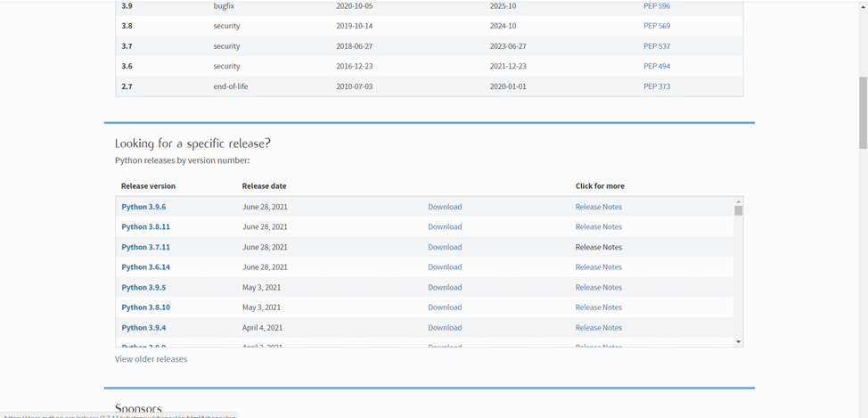
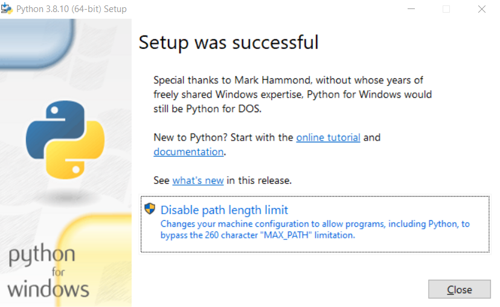
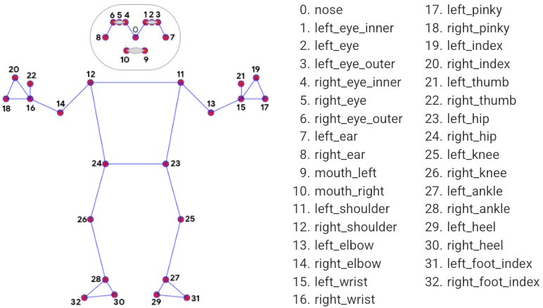

Дрон-фотограф
=============

.. contents:: Содержание
   :depth: 3

Описание проекта
----------------

Описание
~~~~~~~~

В данном проекте реализовывается возможность отслеживания действий
человека во время автономного полета квадрокоптера «Геоскан Пионер
Мини».

С помощью нейронных сетей, которые занимаются распознаванием скелета
человека на изображении, программа умеет удерживать человека в кадре
ровно по центру и на заданном расстоянии, а также детектировать
настраиваемые жесты, которые могут означать всевозможные команды:
фотографирование, посадка, подлет ближе к человеку, смещение вбок и так
далее.

Возможные проблемы при текущей реализации проекта:
~~~~~~~~~~~~~~~~~~~~~~~~~~~~~~~~~~~~~~~~~~~~~~~~~~

-  Иногда возможно определение скелета с невысокой точностью. Попробуйте
   изменить фон, чтобы тело было контрастно.
-  Недостаточная скорость реакции на изменение положения человека в
   пространстве. Исправляется постепенным увеличением коэффициентов
   регуляторов.

Команды (позы)
~~~~~~~~~~~~~~

-  Поднятая вверх согнутая левая рука - подлет ближе

.. figure:: ./readme_images/img_8.png
   :alt: img\_8.png

-  Поднятая вверх согнутая правая рука - отлет дальше

.. figure:: ./readme_images/img_7.png
   :alt: img\_7.png

-  Вытянутая вбок левая рука - движение влево

.. figure:: ./readme_images/img_10.png
   :alt: img\_10.png

-  Вытянутая вбок правая рука - движение вправо

-  Скрещенные перед грудью руки - фотография

.. figure:: ./readme_images/img_11.png
   :alt: img\_11.png

-  Две опущенные руки, согнутые в локтях - посадка

Установка компонентов
---------------------

.. important::

    В данном разделе инструкции представлены для графических
    операционных систем. Во всех операционных системах процесс установки
    компонентов не отличается, за исключением систем без графического
    интерфейса в моменте установки интерпретатора Python и среды
    разработки PyCharm.

    Если вы используете в качестве операционной системы не Windows или
    Mac, то перед установкой пакетов через PIP необходимо установить
    дополнительные пакеты для самой ОС следующей командой:

    ::

          sudo apt-get install libxml2-dev libxslt-dev python-dev

Python
~~~~~~

Для повторения данного проекта, как и программирования квадрокоптера
«Геоскан Пионер Мини» необходимо установить интерпретатор языка
программирования Python (версия 3.7 и выше) на ваш компьютер. Это,
необходимо, так как все вычисления будут проводиться на компьютере, а на
квадрокоптер будут отправляться лишь команды по типу «Лететь в точку».

Рассмотрим установку интерпретатора Python для OS Windows.

Чтобы установить интерпретатор языка Python, необходимо перейти на
`официальный сайт <https://www.python.org/>`__, открыть вкладку
Downloads и выбрать All releases для открытия страницы со всеми релизами
Python.

.. figure:: ./readme_images/img.png
   :alt: img.png

\

На 04.07.2021 рекомендуется скачивать версию 3.7.Х или 3.8.Х

\

Некоторые релизы не имеют установочных файлов, поэтому поищите версии, в которых будут файлы установки под вашу операционную систему, блок с файлами на странице релиза будет выглядеть примерно так:

.. figure:: ./readme_images/img_13.png
   :alt: img\_13.png

\

Здесь следует выбрать Windows installer (64 или 32 bit в зависимости от вашей OS)

Запустите скачанный установочный файл и обязательно выберите оба пункта внизу окна, после чего нажмите Install now:

.. figure:: ./readme_images/img_14.png
   :alt: img\_14.png

\

После окончания установки отключите ограничение на длину переменной Path, нажав на соответствующую кнопку:

\

PyCharm
~~~~~~~~~~~~~~~~~~~~~~~

PyCharm – это среда разработки с большим функционалом для удобного
написания программ, например, удобные подсказки, или интеграция с
системой контроля версий GIT (нуждается в отдельной установке) и др.

Для установки среды разработки PyCharm следует также перейти на
`официальный сайт <https://www.jetbrains.com/ru-ru/pycharm/download/>`__
и выбрать версию Community, так как она полностью бесплатна.

.. figure:: ./readme_images/img_2.png
   :alt: img\_2.png

\

После скачивания установочного файла, процесс установки не будет
отличаться от установки любой другой программы на ваш ПК.

Скачивание проекта
~~~~~~~~~~~~~~~~~~

Есть два варианта скачать проект:

1. Если у вас установлен Git, то откройте командную строку в директории, куда хотите сохранить папку с проектом и выполните команду:

    .. code::

        git clone https://github.com/DgtalCode/PioneerHumanTracking.git

   У вас появится папка PioneerHumanTracking, где будут лежать все исходные файлы.

2. Если у вас Git не установлен, то перейдите
   `на страницу  <https://github.com/DgtalCode/PioneerHumanTracking>`__
   проекта на GitHub и скачайте zip архив, нажав на зеленую кнопку в верхней части экрана. Распакуйте архив в любую удобную папку.

Пакеты для Python
~~~~~~~~~~~~~~~~~

Сперва нужно установить пакет, который будет использоваться для установки других пакетов:

::

    pip3 install wheel

А далее, для удобства установки всех необходимых пакетов, в корне проекта
существует специальный файл, хранящий названия нужных библиотек –
requirements.txt. Чтобы установить все библиотеки, которые прописаны
внутри него, достаточно вызвать следующую команду:

::

    pip3 install -r requirements.txt

После чего нужно всего лишь дождаться окончания установки всех модулей.

Открытие проекта в PyCharm
~~~~~~~~~~~~~~~~~~~~~~~~~~

Запустите PyCharm, щелкнув два раза по иконке программы:

\

У вас откроется приветственное окно программы, где будут отображаться ранее открытые проекты (если они есть):

.. figure:: ./readme_images/img_17.png
   :alt: img\_17.png

\

.. important::

    Если вы вышли из программы, не закрыв проект, то при следующем запуске у вас откроется сразу последний проект.

Чтобы открыть скачанный проект нажмите на Open:

.. figure:: ./readme_images/img_18.png
   :alt: img\_18.png

\

Укажите путь до папки PioneerHumanTracking, которую вы скачали ранее и нажмите Ok:

\

Важной частью является вот это небольшое меню, в котором происходит настройка используемого интерпретатора и выбор исполняемого файла:

.. figure:: ./readme_images/img_20.png
   :alt: img\_20.png

\

Нажмите на «+», чтобы добавить новую конфигурацию:

\

\

Выберите интерпретатор Python из предложенного списка, который вы установили ранее, а также путь до файла, который нужно запускать, в данном случае, main.py, после чего нажмите Ok.

Теперь панель инструментов будет выглядеть вот так:

\

.. important::

    Средства работы с Git не важны для запуска программы, если их нет - ничего страшного.

Программное обеспечение квадрокоптера
~~~~~~~~~~~~~~~~~~~~~~~~~~~~~~~~~~~~~

Удостоверьтесь, что на квадрокоптере установлены последние версии прошивок, так как это влияет на стабильность работы всех систем.

Подробнее о прошивках написано в
`этом разделе <https://pioneer-doc.readthedocs.io/ru/master/instructions/pioneer-mini/settings/mini-settings_main.html>`__

Описание исходного кода
-----------------------

Модули
~~~~~~

Импорт необходимых модулей:

.. code:: python

    import cv2
    import mediapipe as mp
    import numpy as np
    from piosdk import Pioneer
    from collections import namedtuple
    import time

Пройдемся по библиотекам:

- **cv2** - это библиотека OpenCV. Она предназначена для работы с компьютерным зрением.
- **mediapipe** - это библиотека, разработанная компанией Google для определения на изображении различных частей тела, а если быть точнее, то различных точек на теле человека, из которых уже и стоится его скелет, руки, лицо и прочее. Подробное описание библиотеки mediapipe находится на `официальном сайте <https://google.github.io/mediapipe/>`__.
- **numpy** - библиотека, предназначенная для удобной и оптимизированной работы с большими числовыми массивами и просто различными математическими функциями.
- **collections** - стандартная библиотека, которая дает дополнительные возможности по работе с массивами данных. В данном случае из этой библиотеки используется лишь ее часть под названием namedtuple. С помощью этого класса в дальнейшей работе можно легко создавать массивы, где у каждого элемента будет своё имя.
- **time** - библиотека для работы со временем.
- **piosdk** - эта библиотека для непосредственного взаимодействия с квадрокоптером. Она не нуждается в установке, так как находится внутри проекта.

--------------

Переменные
~~~~~~~~~~

Далее идет блок кода относящийся уже к конфигурированию нейросети для
определения скелета человека:

.. code:: python

    # создание объектов для работы нейросети:
    # для рисования
    mpDrawings = mp.solutions.drawing_utils
    # предварительный конфигуратор детектора
    skeletonDetectorConfigurator = mp.solutions.pose
    # создание детектора с некоторыми настройками
    skDetector = skeletonDetectorConfigurator.Pose(static_image_mode=False,
                                                   min_tracking_confidence=0.8,
                                                   min_detection_confidence=0.8,
                                                   model_complexity=2)

Здесь нужно пояснить, что Mediapipe - весьма обширная библиотека,
включающая в себя множество модулей и дающая множество возможностей.
Так, она включает в себя как модули для обнаружения различных точек на
теле, так и модули для отрисовки этих точек на изображении. Именно
поэтому мы видим, как из библиотеки mediapipe берутся модули
drawing\_utils (отвечает за рисование) и pose (отвечает за детект
скелета на изображении).

Однако в случае с pose мы берем просто сырой класс, из которого нужно
еще правильно создать уже полноценный объект, который и будет определять
скелет на изображении с заданными нами настройками. Это делается в
последней строке данного блока кода. В этой строке можно заметить 4
параметра:

- **static_image_mode** - параметр. отвечающий за то, в каком режиме будет работать программа: со статичным изображением или же с видеопотоком.
- **min_tracking_confidence** - параметр, отвечающий за минимальный предел трекинга точки. Дело в том, что данная библиотека для значительного ускорения своей работы использует нейросети не для каждого кадра. В начальный момент нейросеть определяет точки скелета на изображении, а затем эти точки с помощью алгоритмов компьютерного зрения просто отслеживаются, и когда точность слежения падает ниже значения, заданного этим параметром, то происходит новое включение нейросети.
- **min_detection_confidence** - параметр, который отвечает так же за нижний порог, только на этот раз за порог точности детектирования нейросетью точек, то есть если нейросеть определяет точки скелета с точностью меньше, чем указано данным параметром, то предсказания сбрасываются, то есть ничего не возвращается в программу, пока определение не пройдет качественно.
- **model_complexity** - "тяжеловесность" модели. Данный параметр отвечает за то, с какой точностью и с какими затратами ресурсов в принципе нейросеть будет пытаться выполнять свою работу

    - 0 - для устройств, которые не обладают большой вычислительной мощностью, результаты не очень точны.
    - 1 - для устройств, обладающих средней вычислительной мощностью, определение имеет ошибки в относительно сложных условиях, например, при небольших засветах.
    - 2 - для устройств с хорошей вычислительно мощностью, определение будет очень хорошим даже в сложных условиях.

--------------

Далее идет строка настройки, откуда будет идти видео: с квадрокоптера
или с вашей веб-камеры:

.. code:: python

    # использование встроенной камеры или камеры квадрокоптера
    useIntegratedCam = False

Дело в том, что такое решение позволяет очень удобно и хорошо отлаживать
те части программы, в которых напрямую не задействован квадрокоптер, то
есть, например, при тестировании определения скелета человека на
изображении.

--------------

Следующим блоком идет создание объекта, через который в дальнейшем будет
происходить считывание видеопотока, то есть в зависимости от выбранной
ранее настройки будет создан либо объект, через который будет
происходить взаимодействие с квадрокоптером, либо объект, через который
будет только приходить видео с веб-камеры компьютера:

.. code:: python

    # создание источников видео в зависимости от переменной
    if not useIntegratedCam:
        pioneer = Pioneer()
    else:
        cap = cv2.VideoCapture(0)

--------------

Затем идет большой блок с объявлением различных переменных, много о
которых не скажешь:

.. code:: python

    # объявление переменных, хранящих ширину и высоту изображения
    IMGW, IMGH = None, None

    # объявление переменной, хранящей значение нажатой кнопки
    key = -1

    # объявление переменной, хранящей время начала отсчета таймера для фотографирования
    # то есть текущее время на момент прихода команды на создание фотографии
    take_photo_time = -1

    # объявление переменной, хранящей время начала отсчета таймера для следующего детектирования жестов
    # то есть текущее время на момент детектирования жеста, для создание небольшой задержки до след. срабатывания
    pose_detected = -1

    # переменные, хранящие положение квадрокоптера в пространстве
    cordX = .0
    cordY = .0
    cordZ = 1.5
    yaw = np.radians(0)

    # шаг, на который будет происходить изменение положения квадрокоптера при выполнении команд
    stepXY = 0.2

Так же этот блок продолжается объявлением переменных для работы
Пропорционально-Дифференциальных регуляторов, которые занимаются
удержанием человека в центре изображения и заданного до него расстояния:

.. code:: python

    # переменные для работы ПД регулятора при повороте
    yaw_err = 0
    yaw_errold = 0
    yaw_kp = .005
    yaw_kd = .0025
    yaw_k = 0.01

    # переменные для работы ПД регулятора при движении вверх/вниз
    z_err = 0
    z_errold = 0
    z_kp = .00004
    z_kd = .00001

    # переменные для работы ПД регулятора при движении вперед/назад
    y_err = 0
    y_errold = 0
    y_kp = .12
    y_kd = .01

--------------

Далее объявляется словарь (переменная типа dict), в котором описываются
используемые в работе части тела человека (шея, плечо, предплечье и
т.д.) и точки, эти части тела образующие, а точнее, то индексы этих
точек:

.. code:: python

    # имена частей тела с индексами точек, образующих их
    JOINTS_LIST = {"neck": [33, 0],
                   "left_clavicle": [33, 12],
                   "left_arm": [12, 14],
                   "left_forearm": [14, 16],
                   "right_clavicle": [33, 11],
                   "right_arm": [11, 13],
                   "right_forearm": [13, 15]}

Имена частей тела выбираются и задаются произвольно, ведь это как раз
тот блок, который может активно изменяться: если вы собираетесь
показывать какие-то жесты ногами, то их спокойно можно сюда добавить по
аналогии с представленными частями тела.

Индексы точек берутся основываясь на картинке, которая взята с
официального сайта проекта Mediapipe из раздела Pose:

..
    _comment

.. important::

    *Как можно заметить из представленной схемы выше - в скелете нет
    33-й точки, которая как-то используется в словаре. Это точка будет
    рассчитываться в программе самостоятельно и добавляться в массив с
    оригинальными точками.*

    *33-я точка - это центральная точка между лопатками.*

--------------

Последним блоком объявления переменных идет создание уникальных
именованных массивов:

.. code:: python

    # массив Точка имеет 4 именованных параметра, описывающих точку скелета
    Point = namedtuple('Point', 'x y z visibility')

    # массив, содержащий сгенерированные части тела в виде векторов,
    # в котором к элементам можно обратиться через точку
    Parts = namedtuple("Parts", JOINTS_LIST.keys())

    # массив, описывающий конкретную часть тела в виде вектора
    Part = namedtuple("Part", 'x y angle')

Объявление массивов таких типов случит исключительно для удобства, ведь
хранить данные можно было бы и в обычных кортежах, но обращение к
элементам по числовому индексу вносило бы сильную путаницу.

Так, массив Point позволят удобно описать точку скелета, имеющую 4
параметра: 3 пространственные координаты и видимость.

Массив Part позволяет уже описать конкретную часть тела в виде вектора,
например, предплечье. У вектора в данном случае есть 3 параметра:
координаты на плоскости и направление. \ **Направление у всех векторов
является глобальным**\ , то есть не зависит от положения предыдущей
части тела. Угол измеряется в градусах и отсчитывается от положительной
оси X на координатной плоскости:

Массив Parts в свою очередь хранит в себе предыдущие массивы типа Part.
Обращение к элементам происходит по именам, прописанным в массиве
JOINTS\_LIST. Служит опять же для упрощения написания и читабельности
кода.

--------------

Функции
~~~~~~~

remap(oldValue, oldMin, oldMax, newMin, newMax)
"""""""""""""""""""""""""""""""""""""""""""""""

Первой идет функция для преобразования числа из одного диапазона в
другой, под названием **remap**:

.. literalinclude:: main.py
    :language: python
    :start-after: # объявление функции remap
    :end-before: # конец объявления

--------------

convert\_points(points)
"""""""""""""""""""""""

Далее определяется функция **convert\_points**, которая преобразует
относительные координаты всех точек в глобальные. Изначально, после
определения нейросетью точек на теле человека, их координаты имеют
дробные значения в диапазоне от 0 до 1, данная функция занимается
преобразованием дробного числа в привычные координаты в пикселях. Для
преобразования обязательно должны быть объявлены переменные IMGW и IMGH,
хранящие ширину и высоту изображения в пикселях соответственно.

Также в этой функции производится вычисление 33й, базовой точки, которая
находится между лопатками.

.. literalinclude:: main.py
    :language: python
    :start-after: # объявление функции convert_points
    :end-before: # конец объявления

--------------

ang(v1)
"""""""

Затем идет небольшая функция **ang**, которая возвращает направление
вектора:

.. literalinclude:: main.py
    :language: python
    :start-after: # объявление функции ang
    :end-before: # конец объявления

Здесь используется функция arctan2, которая позволяет правильно
определить угол, на который повернут вектор. Используя только одну
известную всем со школы тригонометрическую функцию (sin, cos, tan)
добиться правильного определения угла сложно, так как все они имеют
некоторые ограничения, например, синус может выдавать одинаковые
значения в разных точках, что недопустимо. Arctan2 исправляет все эти
недостатки и позволяет получать абсолютно верные углы:

.. figure:: ./readme_images/img_5.png
   :alt: img\_5.png

Как видно из иллюстрации, углы вычисляются в радианах, поэтому их надо
конвертировать в градусы используя функцию degrees, после чего округлить
функцией round, а в конце для удобства представления происходит
изменение диапазона значений с [-179, 180] на [0, 359] функцией remap.

Функция arctan2 принимает 2 аргумента: У-координата вектора,
Х-координата вектора.

--------------

generate\_parts\_vectors(pts)
"""""""""""""""""""""""""""""

Далее идет функция **generate\_parts\_vectors**, которая выражает все
части тела через векторы:

.. literalinclude:: main.py
    :language: python
    :start-after: # объявление функции generate_parts_vectors
    :end-before: # конец объявления

Расчет вектора происходит по следующей формуле:

.. figure:: ./readme_images/img_6.png
   :alt: img\_6.png

--------------

eq(num1, num2, err=10)
""""""""""""""""""""""

Затем идет функция **eq**, которая позволяет сравнить 2 \ **не
отрицательных**\  числа, но с небольшой погрешностью, то есть ее можно
назвать примерным сравнением:

.. literalinclude:: main.py
    :language: python
    :start-after: # объявление функции eq
    :end-before: # конец объявления

Если одно из сравниваемых чисел будет отрицательным, то функция
обязательно вернет True.

Она используется при определении поз, когда нужно сравнить идеальное
значение направления вектора и его текущее значение. Вот наглядный
пример:

Обратимся к рисунку, который уже был показан в самом начале. Нам нужно
определить, что вектор, описывающий плечо направлен влево (180 град.), а
предплечье - вверх (90 град.). Можно сравнивать и просто с конкретным
числом встроенными в язык средствами, но тогда распознавание жестов
будет очень плохим, так как в реальности согнуть руку на такие углы
очень сложно. Поэтому и используется эта функция - чтобы жест было
показать намного легче.

.. figure:: ./readme_images/img_7.png
   :alt: img\_7.png

--------------

eq\_all(lside=[], rside=[], neck=[])
""""""""""""""""""""""""""""""""""""

И последней идет функция **eq\_all**, которая позволяет в удобной форме
проверять направления всех описанных ранее векторов:

.. literalinclude:: main.py
    :language: python
    :start-after: # объявление функции eq_all
    :end-before: # конец объявления

**Функция не является адаптивной!** Это значит, что она рассчитана
только на текущую конфигурацию частей тела (две руки и шея). При
добавлении новых частей тела данную функцию нужно будет редактировать.

В данную функцию передаются 3 массива, в которых последовательно
передаются "идеальные" направления векторов (в град.).

Так, в массивах lside и rside обязательно должны быть 3 значения: 1.
направление вектора "лопатка" 2. направление вектора "плечо" 3.
направление вектора "предплечье"

В массиве neck должно быть 1 значение: направление вектора "шея"

Перечисленные массивы могут не указываться, тогда определение позы не
будет зависеть от не указанных частей тела. Например, если НЕ указывать
массивы rside и lside, то определение будет зависеть только от
направления шеи, а руки могут располагаться как угодно.

Основной блок
~~~~~~~~~~~~~

Основная часть программы с комментариями представлена ниже:

.. literalinclude:: main.py
    :language: python
    :start-after: '''~~~~~~~~~~~~~~~~~~~~~~~~~~~~~~~~~~~~~~ГЛАВНЫЙ ЦИКЛ~~~~~~~~~~~~~~~~~~~~~~~~~~~'''

Запуск программы
----------------

**При первом запуске:**

1. Подключитесь к интернету

2. Запустите файл main.py любым способом (в PyCharm, через IDLE, двойным кликом по нему).

3. Начнется скачивание модели нейросети

4. Через некоторое время программа остановится с предупреждением, что невозможно подключиться к квадрокоптеру.

5. Можно переходить к дальнейшим запускам

Дело в том, что библиотека mediapipe изначально не хранит в себе модели всех нейросетей для экономии места при скачивании, поэтому при первом запуске программы автоматически происходит скачивание нужных в работе моделей.

**При дальнейших запусках:**

1. Подключитесь к квадрокоптеру по WI-FI, как рассказывается в примерах работы с Пионер Мини.

2. Запустите файл main.py любым способом (в PyCharm, через IDLE, двойным кликом по нему).

3. На экране появится окно с изображением с камеры квадрокоптера, а сам он начнет взлетать.

4. Встаньте перед квадрокоптером, чтобы он выровнялся.

5. Для завершения работы программы нажимайте кнопку l до начала процесса посадки, а после посадки нажмите q для выключения двигателей.