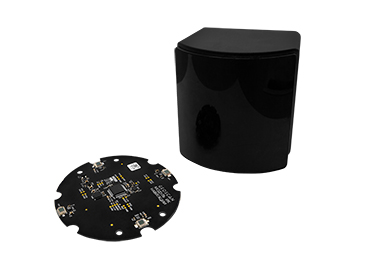
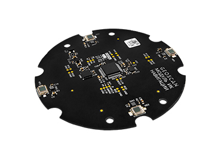
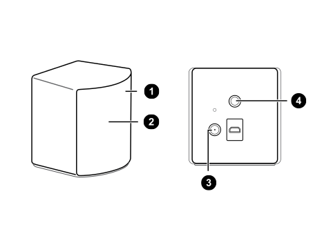
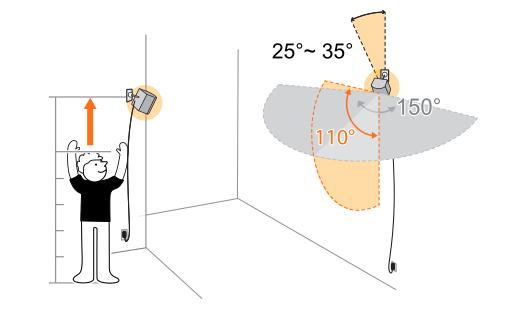
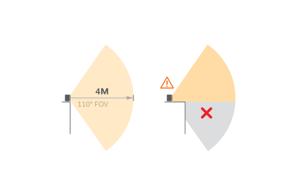
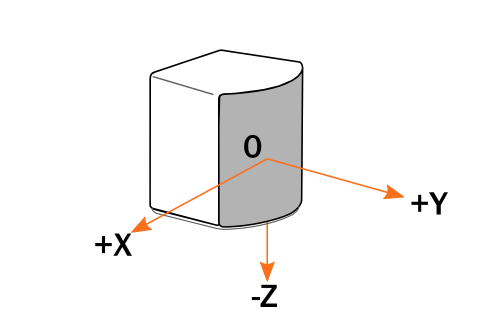
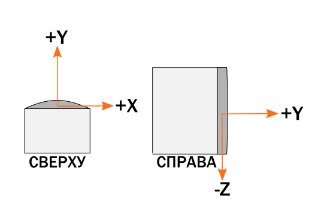

Модуль ИК навигации
===================

Используйте модуль ИК навигации вместе с Базовой станцией SteamVR Base
Station 2.0 для высокоточного автономного полета в помещении.

Модуль вместе с базовой станцией образуют систему навигации, которая
позволяет точно позиционировать квадрокоптер внутри помещения, когда
использование других систем навигации невозможно или затруднено.
(Например GPS/ГЛОНАСС/Оптический поток).

*Модуль совместим с Пионер и Пионер Макс.*

Комплект модуля:

-  ИК-модуль;

-  Плата адаптер;

Модуль монтируется на базовую плату через адаптер расширения с помощью
четырех винтов М3, при этом обеспечивается надежное соединение разъемов.

.. attention:: Значения цветовой индикации на модуле:

                 -  Красный - ошибка, полет запрещен;

                 -  Красный моргает быстро - станция рядом, но процесс инициализации не запущен;

                 -  Красный моргает медленно - станция обнаружена, идет калибровка;

                 -  Зеленый - связь установлена, полет разрешен.

Базовая станция
---------------

Базовая станция SteamVR 2.0 (HTC Vive Base Station 2.0)

Является важным элементом работы систем виртуальной реальности, используется для обеспечения отслеживания шлемов, контроллеров и трекеров. Специалисты компании "Геоскан" адаптировали данную станцию для отслеживания квадрокоптера внутри помещения.

.. important:: На данный момент для корректной работы ИК-навигации достаточно одной базовой станции. В дальнейшем, система ИК-навигации сможет поддерживать большее количество базовых станций, тем самым увеличивая зону полета.

.. important:: Базовые станции продаются отдельно. Для заказа пишите на почту sales@geoscan.aero или
               `на официальном сайте разработчика Vive`_.
               Комплект поставки включает одну базовую станцию и один адаптер питания с кабелем длинной 2.5 метра.

.. _на официальном сайте разработчика Vive: https://www.vive.com/ru/accessory/base-station2/

**Устройство базовой станции:**
~~~~~~~~~~~~~~~~~~~~~~~~~~~~~~~

1. Индикатор состояния

2. Лицевая панель

3. Порт подключения питания

4. Резьбовое монтажное отверстие

**Значения цветовой индикации на базовой станции:**
~~~~~~~~~~~~~~~~~~~~~~~~~~~~~~~~~~~~~~~~~~~~~~~~~~~

-  Белый или зеленый (в зависимости от варианта оборудования) - базовая станция полностью готова к работе.

-  Светит или мигает синим - базовая станция в ожидании стабилизации. Если она долго остается в этом состоянии, проверьте надежность крепления, не испытывает ли поверхность, на которой установлена базовая станция, вибрации.

-  Мигает красным - произошла ошибка.

Установка базовой станции
-------------------------

Базовая станция должна быть установлена выше уровня головы (выше двух
метров) и направлена к полу под углом 25-35 градусов. Пространство, в
которое «смотрит» базовая станция должно быть свободно от мебели,
посторонних предметов. Базовая станция должна быть установлена на
штативе, кронштейне или другом устойчивом основании. Убедитесь, что
станция надежно зафиксирована так, что ее невозможно случайно уронить,
чтобы избежать повреждений или некорректной работы.

.. important:: Каждая базовая станция имеет горизонтальное поле обзора 150 градусов и вертикальное поле обзора 110 градусов.

**Внимание!**

Базовая станция передает оптические сигналы на квадрокоптер. Не
закрывайте фронтальную панель каким-либо материалом.

Когда базовая станция включена, она может влиять на некоторые соседние
инфракрасные датчики, например, на телевизионном пульте ДУ.

Подробнее про базовую станцию можно почитать `на сайте разработчика HTC`_.

.. _на сайте разработчика HTC: https://enterprise.vive.com/ru/support/vive-pro/category\_howto/base-stations.html

Обновление прошивки ИК модуля
-----------------------------

Для обновления прошивки модуля ИК навигации на вашем компьютере должна
быть установлена программа **Pioneer Station**.

1) Нажмите и удерживайте кнопку «Старт» на базовой плате квадрокоптера и
   подключите аккумулятор. Квадрокоптер должен перейти в режим прошивки.

2) Подключите квадрокоптер кабелем microUSB к компьютеру.

3) Запустите Pioneer Station и выберите подключение по USB.

4) В окне программы выберите пункт меню **«Обновление прошивки»** и
   следуйте указаниям помощника.

5) При переходе к пункту **«Выбор устройства»** в списке будет
   отображаться не только базовая плата квадрокоптера *PioneerBase*, но
   и модуль **ИК навигации IRNav**. Поставьте галочку напротив **модуля
   ИК** и нажмите **«Далее».**

6) При выборе источника прошивки рекомендуется **«встроенный»** — это
   последняя актуальная версия, входящая в сборку программы.

.. hint:: Если версия модуля не определяется автоматически, прочтите маркировку на обратной стороне платы и выберите соответствующую прошивку из доступных в папке Pioneer Station. Скачать прошивку модуля можно здесь
            :doc:`../downloads/download-main`

7) Дождитесь окончания прошивки. После этого квадрокоптер перезагрузится
   в обычный режим.

 

Настройка полетного задания
---------------------------

*Работа с данной системой имеет некоторые особенности, пожалуйста ознакомьтесь с информацией ниже.*

Положение квадрокоптера в пространстве определяется по трем координатам
(x, y, z). Точка начала координат - базовая станция.

.. warning:: Нельзя задавать в полетном задании координату (0, 0, 0) — Это приведет к столкновению квадрокоптера и станции и последующей поломке оборудования.

.. warning:: Координата по Y не должна быть меньше чем **0,5**. В противном случае, квадрокоптер попадет в слепую зону базовой станции и потеряет ориентацию в пространстве. Это может привести к поломкам оборудования, травмам.

.. important:: Важно! Координата по Z (высота) - всегда задается в отрицательных значениях. Учитывайте высоту, на которой у вас установлена базовая станция.

В среде Pioneer Station в настройках автопилота необходимо выставить
позиционирование по локальной системе координат (кнопка LPS).

Перед полетом
~~~~~~~~~~~~~

1) Установите базовую станцию и включите ее. (Примечание, станцию нужно
   только включить, никаких дополнительных действий не нужно.)
   только включить, никаких дополнительных действий не нужно.)

2) Внесите настроенный квадрокоптер с установленным модулем в полётную
   зону.

3) Установите связь квадрокоптера и базовой станции. Связь настраивается
   автоматически, необходимо дождаться пока на модуле ИК не загорится
   зеленый светодиод.

4) Опытным путем определите полетную зону квадрокоптера (радиус действия
   базовой станции). Для этого нужно с включенным квадрокоптером в руках
   медленно отойти в разные стороны от станции. При потере сигнала
   светодиоды на модуле начнут мерцать красным. При необходимости
   скорректировать полетное задание.

5) Убедиться, что в зоне полетов, не находится посторонних.

.. important:: Координаты в локальной системе не должны превышать 4 метра (радиус действия базовой станции). При координатах, превышающих это значение велик риск потери связи с квадрокоптером, что ведет к поломкам оборудования, травмам.

.. important:: На данный момент, при вылете квадрокоптера за пределы полетной зоны. Вам будет необходимо в ручном режиме вернуть его обратно. Для этого тумблер SWc должен быть всегда в среднем положении, а тумблер SWb должен быть переведен из среднего в верхнее положение.

Пример Lua-скрипта для автономного полета
~~~~~~~~~~~~~~~~~~~~~~~~~~~~~~~~~~~~~~~~~

Скрипт реализует полет по квадрату в заданных координатах, с учётом особенностей системы ИК-навигации.

.. important:: Прочитайте внимательно комментарии внутри скрипта, требуется дополнительная настройка пульта.

.. literalinclude:: ir-nav-demo.lua
   :language: lua
   :encoding: UTF-8
   :linenos:

1) Для запуска примера: скопируйте код, приведенный ниже и вставьте его в окно редактирования кода Pioneer Station.

2) Проверьте, что в параметрах автопилота выставлено позиционирование по локальной системе координат **(LPS)**

3) Загрузите программу в квадрокоптер, подключив его по радиомодему или USB (подробнее про загрузку программы в квадрокоптер на странице
:doc:`../programming/pioneer_station/pioneer_station_upload`

4) Отключите квадрокоптер от компьютера. Поставьте его в зону действия
базовой станции, дождитесь соединения квадрокоптера и базовой станции.

5) Если вы не проводили проверку рабочей зоны квадрокоптера, то произведите
ее по алгоритму, описанному выше в пункте «Перед полетом»

6) Дальше, запустите скрипт, нажав кнопку "Старт" на базовой плате.

7) Переведите тумблер SWB в нижнее положение. Дождитесь начала выполнения
полетного задания.

8) При возникновении внештатной ситуации или опасности для окружающих,
переведите квадрокоптер в ручной режим и совершите посадку.

 

Меры предосторожности
---------------------

1) Не пытайтесь вскрыть базовые станции, это может привести к травмам
   или повреждениям конструкции

2) Если лицевая панель имеет трещины или повреждения, прекратите
   использование базовых станций и обратитесь с службу поддержки
   производителя.

3) Обязательно снимите защитную пленку с лицевой панели после монтажа
   базовых станций.

4) Внимание! Используйте только блоки питания и кабели из комплекта
   поставки базовых станций.

5)  После включения не перемещайте и не регулируйте углы расположения
   базовых станций, поскольку это может препятствовать процессу
   отслеживания. В противном случае может потребоваться повторная
   настройка.

