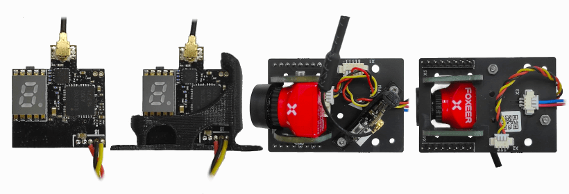
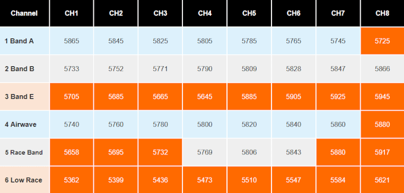
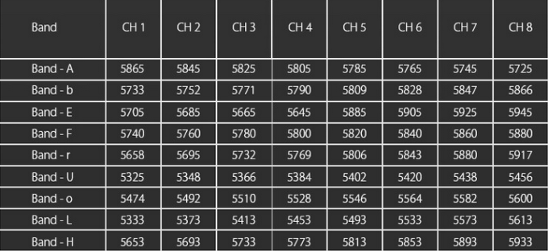
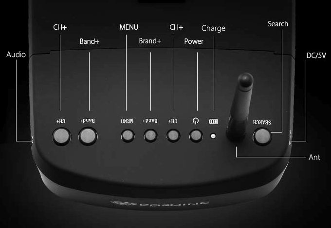

FPV комплект
================

FPV-комплект(First Person View - вид от первого лица) - позволяет оператору получать изображение с курсовой камеры, расположенной на борту квадрокоптера. За счёт минимальной задержки и постоянной информации о положении и ориентации квадрокоптера возможно управление за пределами прямой видимости, что значительно расширяет область полёта. 

В комплект входит:

* Одна из камер: RunCam Hybrid(fpv+4k), Foxeer Predator, RunCam Split (в поздней комплектации).
* Один из видеопередатчиков с антенной: RunCam TX200U, Eachine VTX03.
* FPV шлем с приемником 

Для сборки модуля камеры и настройки видеопередатчика, следуйте следующим инструкциям. 

.. attention::	Выполняйте все действия аккуратно, не прилагая излишних усилий. 

Монтаж видеопередатчика RunCam TX200U 
-------------------------------------

	- | Шаг 1. Расположите видеопередатчик в кронштейне как показано на картинке. 
	- | Шаг 2. Демонтируйте плату камеры выкрутив винты из 4-х стоек. 
	- | Шаг 3. Аккуратно извлеките кабель из разъёма X1. Использование плоской отвёртки и плоскогубц может привести к повреждению коннектора! Самый простой способ отключить кабельную сборку - держать её за все провода и осторожными движениями вытягивать из разъёма.
	- | Шаг 4. Подключите кабель видеопередатчика в разъём X2 и зафиксируйте кронштейн с обатной стороны с помощью небольшого самореза. 
	- | Шаг 5. Подключите обратно кабель камеры в разъём X1 и зафиксируйте плату на стойках с помощью 4 винтов.

Монтаж видеопередатчика Eachine VTX03
-------------------------------------

	- | Шаг 1. Расположите видеопередатчик в кронштейне как показано на картинке. 
	- | Шаг 2. Зафиксируйте кронштейн с помощью двух винтов 
	- | Шаг 3. Подключите кабель видеопередатчика в разъём X2 на модуле камеры.
	

Настройка видеопередатчиков и fpv-шлема.
----------------------------------------
Для настройки видеопередатчиков следует выбрать мощность его работы и необходимую частоту.
Выходная мощность передатчика регулируется в зависимости от модели. В случае, если полёт не групповой, можно выбирать максимальную мощность для достижения максимальной дальности полёта и стабильности сигнала.
Частота настраивается с помощью выбора группы(Band) и канала(СH), согласно сетке частот.

.. attention::	Не включайте видеопередатчик без подключённой антенны! Это может привести к его поломке!

.. caution::	Корпус видеопередатчика может сильно нагреваться в процессе работы! 

Настройка видеопередатчика RunCam TX200U (VTX01A12B)
~~~~~~~~~~~~~~~~~~~~~~~~~~~~~~~~~~~~~~~~~~~~~~~~~~~~
Выходная мощность передатчика TX200U регулируется 2-я режимами: 25мВт/200мВт. 
Сетка частот делится на 6 групп, каждая из которых включает 8 каналов. 

На корпусе видеопередатчика расположено 8 светодиодов:

Синий(1) - индикация каналов(CH). 
Кратковременное нажатие на кнопку меняет каналы от 1 до 8. При каждом коротком нажатии синий светодиод мигает один раз, и только когда выбран 1-й канал, светодиод горит постоянно.

Красный(6) - индикация группы(Band).
Нажатие в течении 2-х секунд переключает группы. Удерживайте кнопку пока не загорится светодиод соответсвующий необходимой группе (1-A; 2-B; 3-E; 4-Airwave; 5-RaceBand; 6-LowRace).

Оранжевый(1) - индикация мощности. 
На Runcam TX200U по умолчанию включена блокировка и выходная мощность ограничена 25 мВт, а доступные каналы находятся в диапазоне от 5725 до 5875 МГц. Оранжевым цветом в сетке частот показаны каналы, которые недоступны в режиме блокировки! Для разблокировки всего диапазона и перхода в режим работы 200мВт удерживайте кнопку в течении 5 секунд, при этом на видеопередатчике загорится оранжевый светодиод.

.. important::	В режиме блокировки недоступные каналы будут игноироваться! Переключение группы и каналов будет происходить на следующий доступный вариант.

Настройка видеопередатчика Eachine VTX03
~~~~~~~~~~~~~~~~~~~~~~~~~~~~~~~~~~~~~~~~
Выходная мощность передатчика VTX03 регулируется 4-я режимами: 0/25мВт/50мВт/200мВт.
Сетка частот делится на 9 групп, каждая из которых включает 8 каналов.

При включении видеопередатчика дисплей показывает 0, что указывает на то, что видеопередатчик включен, но не ведёт трансляцию.
Кратковременное нажатие на кнопку меняет каналы(CH) от 1 до 8, согласно сетке частот. Коротко нажимайте, пока на дисплее не отобразится необходимый канал.

Нажатие в течении 2-х секунд приводит к настройке групп(Band). Удерживайте кнопку нажатой, пока дисплей не начнёт мигать, после чего короткими нажатиями выберите необходимую группу (A/b/E/F/r/U/o/L/H).

Нажатие в течении 5 секунд приводит к настройке мощности видеопередатчика. Удерживайте кнопку нажатой, пока дисплей не начнёт мигать, после чего короткими нажатиями выберите необходимую мощность. 0 - соответсвует режиму "тишины", одна черта - мощности 25мВт, две - 50мВт, три - максимальной мощности 200мВт.

Настройка шлема Eachine EV800
~~~~~~~~~~~~~~~~~~~~~~~~~~~~~
В комплект fpv-оборудования входит шлем Eachine EV800, позволяющий получать изображение с курсовой камеры. 
Управление и настройка происходит с помощью кнопок, расположенных в верхней части шлема. В том числе на корпусе есть ряд разъёмов. Ниже описано их назначение.

* **DC/5V** - Разъём подключения кабеля зарядки. Допустимый вольтаж от 5-12В, что позволяет подключать шлем напрямую к портативному внешнему аккумулятору(2S-3S), и заряжать его в процессе работы.

* **Search** - Автоматический поиск сигнала. Поиск остановится на канале с допустимым качеством сигнала. В процессе поиска все остальные кнопки не работают. Следует обратить внимание, что автопоиск не всегда может попасть на необходимую частоту и этот момент рекомендуется контролировать, либо выбирать группу и канал вручную.

* **Ant** - Разъём для подключения антенны. 

* **Сharge**  - Внешний индикатор процесса зарядки. Красный - сообщает о том, что баттарея заряжается. Зелёный - заряд завершён. 

* **Power** -  Удержание кнопки в течении 5 секунд включает либо выключает шлем.

* **СH+** - В стандартном режиме переключает каналы(СH) от 1 до 8. В режиме меню соответсвует значению --- (минус).

* **Band+** - В стандартном режиме переключает группу каналов (Band) от A до R согласно сетке частот видеоприёмника расположенного в шлеме. В режиме меню соответсвует значению + (плюс).

* **Menu** - Короткое нажатие - отвечает за переключение режимов. Удержание в течении 2-x секунд открывает меню настроек. В режиме меню соответсвует выбору следующей опции настроек.

* **Band+** - полностью дублирует функцию ранее описанной кнопки Band+

* **CH+** - полностью дублирует функцию ранее описанной кнопки СH+

* **Audio** - аудиовыход для подключения наушников. 

Монтаж камеры RunCam Split
--------------------------

Как настроить:

Плата подключения дополнительных модулей не совместима с модулем FPV. Используйте стандартную крышку отсека аккумулятора. Снимите её с Пионера и притяните модуль FPV сверху четырьмя винтами. После этого снова установите крышку на Пионер так, чтобы камера оказалась снизу. 

Подключите коннектор модуля к разъему X1 на базовой плате квадрокоптера. Снимите защитный колпачок с линзы камеры. Для дальнейшей настройки подключите аккумулятор Пионера.
