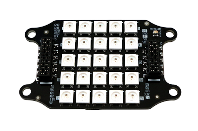

Модуль LED
==========

Модуль LED - это плата с матрицей из 25 светодиодов. Модуль крепится к плате расширения снизу. Подключение через разъем X2 комплектным шлейфом.

Блок светодиодов может использоваться для подсветки или индикации событий в зависимости от заданной программы. 

Пример
-----------

В качестве примера приведена программа, которая случайно меняет цвет блока светодиодов каждую секунду. Чтобы загрузить программу на "Пионер", воспользуйтесь :doc:`/pioneer_station/pioneer_station_main`. 

::

	-- количество светодиодов на основной плате пионера(4) + на модуле LED (25)
	local ledNumber = 29
	-- создание порта управления светодиодами
	local leds = Ledbar.new(ledNumber)
	
	-- функция, изменяющая цвет RGB светодиодов
	local function changeColor(red, green, blue)
	   for i=0, ledNumber - 1, 1 do
	       leds:set(i, red, green, blue)
	   end
	end
	
	-- функция, которая выключает светодиоды и таймер timerRandomLED
	local function emergency()
	   timerRandomLED:stop()
	   -- так как после остановки таймера его функция выполнится еще раз, то выключаем светодиоды через секунду
	   Timer.callLater(1, function () changeColor(0, 0, 0) end)
	end
	
	function callback(event)
	   -- проверка, низкое ли напряжение на аккумуляторе
	   if (event == Ev.LOW_VOLTAGE2) then
	       emergency()
	   end
	end
	
	-- создание таймера, который каждую секунду меняет цвет всех светодиодов на случайный
	timerRandomLED = Timer.new(1, function ()
	   changeColor(math.random(), math.random(), math.random())
	end)
	-- запуск созданного таймера
	timerRandomLED:start()

Чтобы освоить продвинутую работу с матрицей светодиодов, используйте пример ниже:

::

    local led_count = 29  -- Общее количество светодиодов (4 на плате + 25 на матрице)
    local led_offset = 4  -- Количество светодиодов на плате
    local matrix_count = 25  -- Количество светодиодов на матрице
    local leds = Ledbar.new(led_count)  -- Создание порта управления светодиодами
    local unpack = table.unpack  -- Ассоциируем функцию распаковки таблиц из модуля table для упрощения
    local colors = {    red =       {1, 0, 0},   -- Таблица цветов в RGB. Яркость цвета задается диапазоном от 0 до 1
                        green =     {0, 1, 0}, 
                        blue =      {0, 0, 1},
                        purple =    {1, 0, 1},      
                        cyan =      {0, 1, 1}, 
                        yellow =    {1, 1, 0}, 
                        white =     {1, 1, 1}, 
                        black =     {0, 0, 0}}  -- черный = светодиоды выключены
    
    local dig = {   {3, 7, 8, 13, 18, 22, 23, 24},                              -- 1 Таблица символов цифр
                    {2, 3, 4, 9, 12, 13, 14, 17, 22, 23, 24},                   -- 2
                    {2, 3, 4, 9, 12, 13, 14, 19, 22, 23, 24},                   -- 3
                    {2, 4, 7, 9, 12, 13, 14, 19, 24},                           -- 4
                    {2, 3, 4, 7, 12, 13, 14, 19, 22, 23, 24},                   -- 5
                    {3, 4, 7, 12, 13, 14, 17, 19, 22, 23, 24},                  -- 6
                    {2, 3, 4, 9, 13, 18, 23},                                   -- 7
                    {2, 3, 4, 7, 9, 13, 17, 19, 22, 23, 24},                    -- 8
                    {2, 3, 4, 7, 9, 12, 13, 14, 19, 22, 23},                    -- 9
                    {1, 3, 4, 5, 6, 8, 10, 11, 13, 15, 16, 18, 20, 21, 23,  24, 25}, -- 10
                    [0] = {2, 3, 4, 7, 9, 12, 14, 17, 19, 22, 23, 24} }         -- Индексация Lua начинается с 1, поэтому 0 указан в    явном виде
    
    local ledMatrix = {}  -- Массив для хранения выводимой информации на матрицу
    
    for i = 1, matrix_count + 1, 1 do
        ledMatrix[i] = colors.black  -- Инициализация массива
    end
    
    -- Вывод массива на матрицу
    local function updateMatrix()
        for i = led_offset, led_count - 1, 1 do
            leds:set(i, unpack(ledMatrix[i-led_offset + 1]))
        end
    end
    
    -- Установка цвета на заданный пиксель массива матрицы. x - столбец; y  - строка; colors - цвет в RGB
    local function setPixelMatrix( x, y, colors )
        i = (y - 1) * 5 + x
        if ledMatrix [i] then 
            ledMatrix [i] = colors
        end
    end
    
    -- Заполнение массива матрицы цветом. colors - цвет в RGB
    local function fillMatrix( colors )
        for i = 1, matrix_count + 1, 1 do
            ledMatrix [i] = colors
        end
    end
    
    -- Запись символа цифры в массив матрицы. x - цифра; colors - цвет в RGB
    local function setDig( x, colors )
        for _, v in ipairs(dig[x]) do
            ledMatrix[v] = colors
        end
    end 
    -- Здесь заканчивается описание работы с матрицей
    

    function callback( event )
    end

    -- Пример. Программа выводит цифры от 0 до 9, при этом изменяя  цвет от красного к фиолетовому
    function digitOutput()
        colors_any[1],  colors_any[2], colors_any[3] = fromHSV(col, 100,    10)    -- Генерация цвета
        setDig (i,  colors_any)                                                  --  Запись цифры в массив заданного цвета
        updateMatrix()                                                           -- Вывод массива на матрицу
        if col < 360    then                                                       
            col = col +     1                                                       --  Изменение значения цвета
        elseif i < #dig-1   then                                                   
            fillMatrix( colors.black)                                            --  Очистка массива матрицы перед записью новой цифры
            col =   0                                                                 -- Обнуление значения цвета
            i = i +     1                                                           --  Увеличение переменной цифры
        else
            fillMatrix(colors.black)
            col =   0                                                                 -- Обнуление значения цвета
            i = 0                                                                -- Обнуление значения цифры
        end
        Timer.callLater(0.003, function () digitOutput()    end)                   -- Период, через который обновляется цвет
    end

    colors_any = {0,0,0}    -- Переменная цвета в формате RGB
    i = 0                   -- Переменная выводимой цифры
    col = 0                 -- Переменная цвета в формате HSV
    digitOutput()           -- Запуск программы
