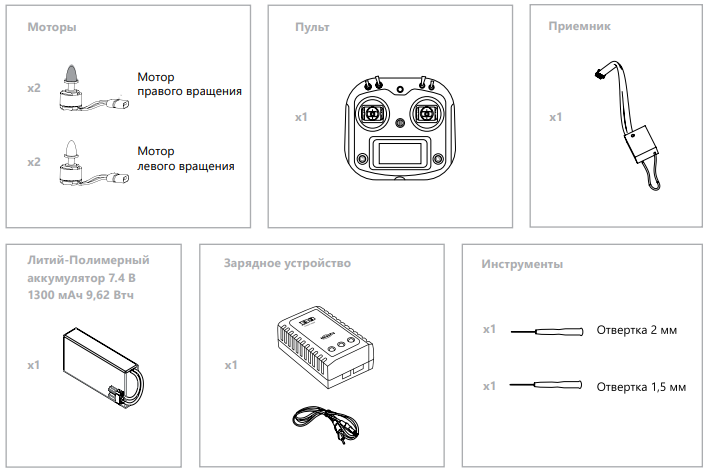

Сборка "Пионера"
===================

.. important:: В наборе "Пионер" есть все элементы и инструменты для сборки и запуска квадрокоптера.

Собирайте "Пионер" в два этапа:

:doc:`assembling_frame`

:doc:`assembling_protection`

В разделе :doc:`/modules/modules_main` подробно рассказано о том, как их подключить и запрограммировать.

.. toctree::
   :maxdepth: 2
   :caption: Содержание:

   assembling_frame
   assembling_protection
   assembling_switch_on
