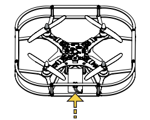
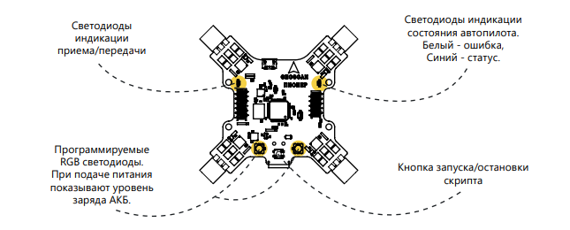

Первое включение
================

Вставьте аккумулятор в раму "Пионера" и включите силовой(желтый) разъем в желтое гнездо на базовой плате.

.. important:: * При подключении аккумулятора квадрокоптер издает звуковой сигнал и мигает светодиодами, отображая уровень заряда аккумулятора. Красный цвет – аккумулятор разряжен, зеленый – заряжен
				* Медленно мигает синий светодиод – готов к эксплуатации
				* Быстро мигает синий светодиод – на квадрокоптере запущено выполнение скрипта
				* Быстро мигает белый светодиод - ошибка
				* При падении напряжения аккумулятора ниже допустимого квадрокоптер издает звуковые сигналы

.. attention::
	"Пионер" оснащен системой отключения моторов при нештатных ситуациях:
				* при наклоне квадрокоптера более чем на 90°;
				* при ударе или падении;

