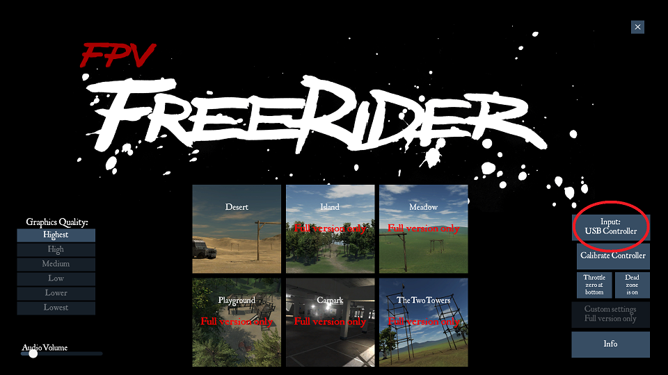
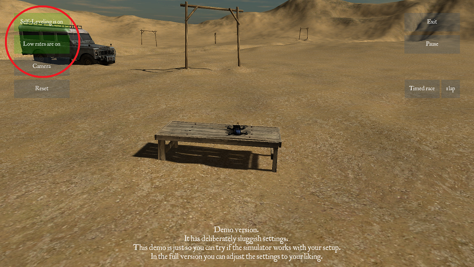

Cимулятор
=====================

Если у вас нет опыта управления квадрокоптером, а также если вы хотите совершенствовать свои навыки, начните с полетов в симуляторе. Так вы освоите управление без риска для квадрокоптера, себя и окружающих. 

Подключите пульт FlySky F6S к компьютеру проводом microUSB, и вы сможете тренироваться с ним в любом симуляторе.

В разделе :doc:`rc_unit` смотрите за что отвечают кнопки и стики.

Из доступных симуляторов полета на квадрокоптере большинство - платные. Для получения начальных навыков пилотирования достаточно бесплатных аналогов или демо-версий. 

Мы предлагаем попробовать FPVFreerider. Скачать бесплатную версию можно `здесь`_ , прокрутите страницу до Download demo и выберите версию для Вашей ОС.

.. _здесь: https://fpv-freerider.itch.io/fpv-freerider

Установив программу, подключите пульт к компьютеру, включите его и запустите симулятор. Все тумблеры на пульте должны быть в крайнем верхнем положении.

Выберите управление через USB controller и перейдите в пункт **calibrate controller**. Далее следуйте указаниям на экране, поочередно приводя соответствующий стик в крайнее положение и нажимая ОК. По завершении калибровки проверьте правильность реакции программы на движения стиков, подправьте ошибки с помощью ползунков **trim**. Виртуальный пульт должен в точности повторять ваши движения, от этого зависит удобство управления.

Закончив калибровку, откройте доступную карту для полета. 

Вначале обычно рекомендуют научиться управлять квадрокоптером с видом от третьего лица (Line of sight) и в режиме стабилизации. Для этого шелчком мыши по кнопкам в левом верхнем углу экрана выберите режим self-level, low rates и camera, как на скриншоте:

**Перейдем к полетам**:

* Плавно толкните левый стик вперед. Когда квадрокоптер оторвется от поверхности, постарайтесь удержать его на небольшой высоте, а затем приземлиться, плавно возвращая стик в нижнее положение. Научитесь чувствовать момент взлета и касания. 

* удерживая квадрокоптер на одной высоте, толкните и отпустите правый стик в любом направлении. Обратите внимание, что при наклоне квадрокоптер не только разгоняется, но и теряет высоту. Чтобы компенсировать снижение, добавьте оборотов левым стиком. Научитесь летать в разных направлениях без потери высоты и не упуская квадрокоптер из виду. Если хотите начать заново, нажмите кнопку Reset в левой части экрана.

* Наклон левого стика в стороны управляет поворотом квадрокоптера. При изменении направления управлять полетом становится сложнее, т.к. надо учитывать в какую сторону "смотрит" аппарат. Стандартное упражнение на такой случай - полет по квадрату. Попробуйте летать по воображаемому квадрату небольшой площади, разворачивая коптер на 90 градусов в каждом угле. Пролетев против часовой стрелки, смените направление. Постепенно вы научитесь контролировать направление полета. 

Управление квадрокоптером - это навык, требующий практики. Осваивая полет в симуляторе, вы сможете чувствовать свой прогресс. Научившись лететь в выбранном направлении, не допуская падений и не теряя квадрокоптер из виду, можете смело переходить к практике на "Пионере".

.. note::
	Также в симуляторе можно научиться управлять коптером в режиме вида от первого лица (FPV) с курсовой камеры. Для этого щелчком мыши переключите кнопку Camera в режим FPV.  

