.. raw:: html
   <!-- Yandex.Metrika counter -->  <noscript>

</noscript> <!-- /Yandex.Metrika counter -->

.. raw:: html
   <!-- Global site tag (gtag.js) - Google Analytics -->

   

   

Сборка Пионер Макс
==================

Ознакомившись с данной инструкцией вы сможете собрать квадрокоптер "Пионер Макс".

.. attention:: Страница находится на обновлении

.. note:: Технические характеристики, внешний вид и комплектация товара могут быть изменены производителем без предварительного уведомления.

Видеоинструкция по сборке квадрокоптера Пионер Макс.
----------------------------------------------------

.. raw:: html

   <iframe width="560" height="315" src="https://www.youtube.com/embed/ihXs_8gXJBk" frameborder="0" allow="accelerometer; autoplay; clipboard-write; encrypted-media; gyroscope; picture-in-picture" allowfullscreen></iframe>

Инструкция по сборке квадрокоптера Пионер Макс.
----------------------------------------------------

**Шаг 1**

   Используются: центральная пластина рамы - 1 шт., луч передний - 2 шт.,
   луч задний - 2 шт., стягивающая пластина - 1 шт., винт DIN7991 M3x8 - 7
   шт.

 Соедините лучи, основание рамы и стягивающую пластину с помощью винтов
DIN7991 M3х8.

**Шаг 2**

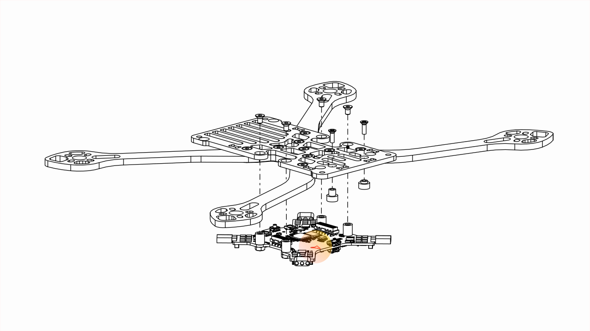

   Используются: модуль автопилота - 1 шт., крепление кронштейна – 2 шт.,
   винты DIN7991 M3х5 - 4 шт., винт ISO7046-1 M2.5x8 - 1 шт., винт ISO7046-1 M2.5x10 - 1 шт

Закрепите снизу центральной пластины крепление кронштейна Raspberry
Camera с помощью двух винтов М2.5х8. После чего закрепите модуль
автопилота при помощи винтов 4-х M3х5, как показано на рисунке. Обратите
внимание на иконку “стрелки” на плате, она обозначает направление
вперед.

.. attention:: В зависимости от конкретной поставки, кронштейн камеры может
   отличаться, чтобы посмотреть, как установить другой кронштейн перейдите
   по ссылке. `Установка старого кроншейна Raspberry Camera`_. Устанавливайте кронштейн только после настройки модуля автопилота. Как это сделать можно посмотреть на странице: "Настройка Пионер Макс.

.. hint:: Скачать новое крепление кронштейна вы можете по ссылкам ниже:
          :download:`Кронштейн камеры Raspberry съемный <stl/Kronstein-rasp-camera-new.STL>`
          :download:`Крепление кронштейна деталь 1 <stl/boss-left.STL>`
          :download:`Крепление кронштейна деталь 2 <stl/boss-right.STL>`

**Шаг 3**

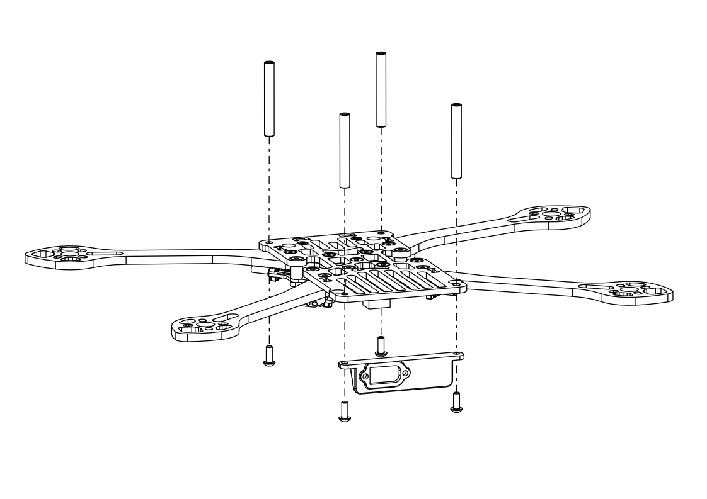

   Используются: стойка 37х5 мм - 4 шт., винты ISO 7380 M3х8 - 4 шт.,
   кронштейн разъема питания – 1 шт.

Установите четыре стойки с помощью винтов M3x8, перед установкой задних
стоек не забудьте под основание рамы установить кронштейн разъема
питания и только после этого установите задние стойки.

**Шаг 4**

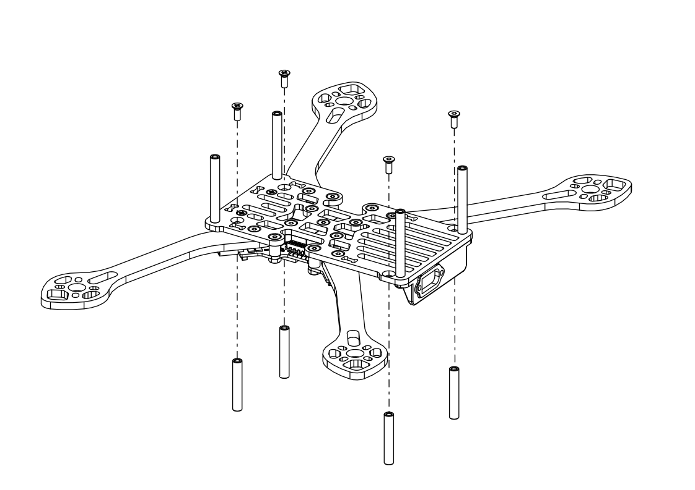

   Используются: стойка 28х5 мм - 4 шт., винты DIN 7991M3х8 - 4 шт.

С помощью винтов М3х8 закрепите на нижней стороне центрального основания
рамы четыре стойки 28 мм, как показано на рисунке.

**Шаг 5**

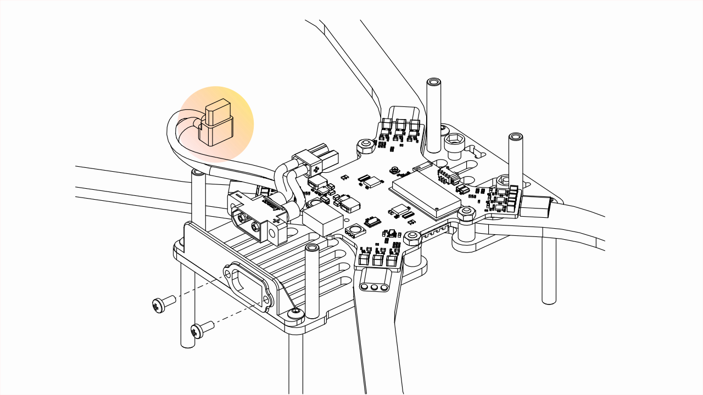

   Используются: кабель подключения платы распределения питания – 1 шт.,
   винты M2.5х6 - 2 шт.

Подключите кабельную сборку питания в модуль автопилота, а внешний
разъем питания закрепите винтами M2.5x6. Не забудьте обернуть угловой
разъем выделенный на рисунке вокруг стойки.

**Шаг 6**

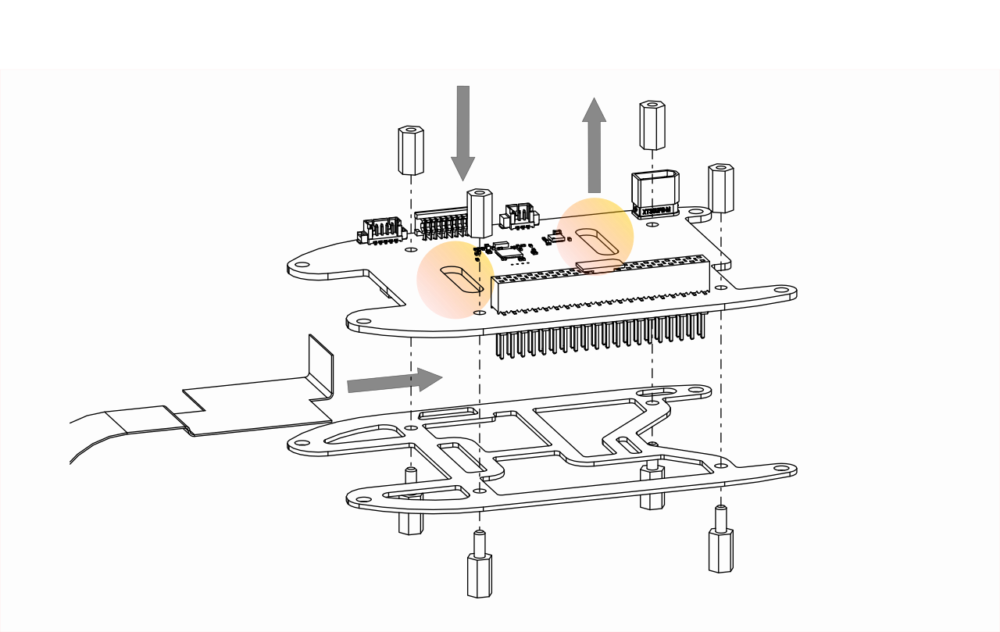

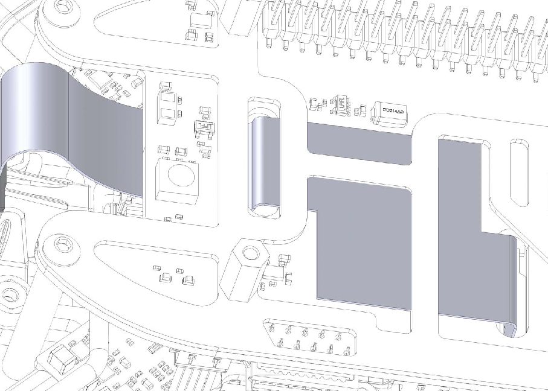

   Используются: стойка с внешней резьбой – 4 шт., стойка с внутренней
   резьбой – 4 шт., шлейф Raspberry Camera – 1 шт., плата распределения
   питания – 1 шт., нижняя пластина – 1 шт.

Проложите шлейф, подключенный к камере Raspberry Camera между пластиной
и платой распределения питания. Обратите внимание на второй рисунок.
После чего соедините всё стойками, как показано на рисунке. Не пережмите
шлейф на линиях сгиба.

.. attention:: Внимание в зависимости от конкретной поставки, стойки у вас могут быть заменены на винты M2.5 в этом шаге.

.. hint:: При необходимости вы можете напечатать стойки с внутренней резьбой:
          :download:`Стойка с внутренней резьбой <stl/rack-hex.STL>`

**Шаг 6.1**

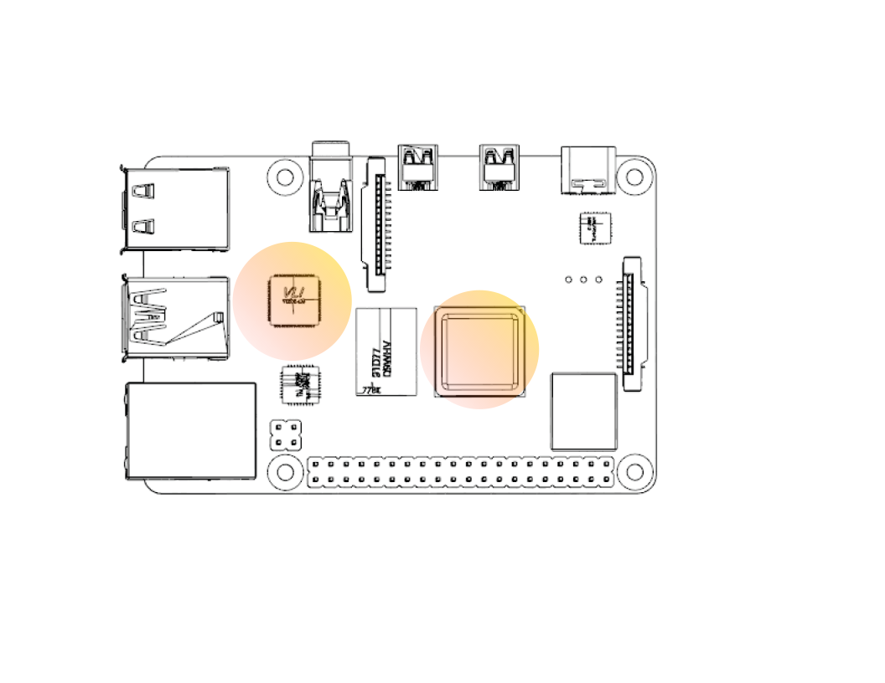

   Используются: Радиатор - 2 шт., Raspberry Pi 4 - 1 шт.,

Устнавите соотвествущего размера радиаторы на подсвеченные области, как показано на рисунке.

**Шаг 7**

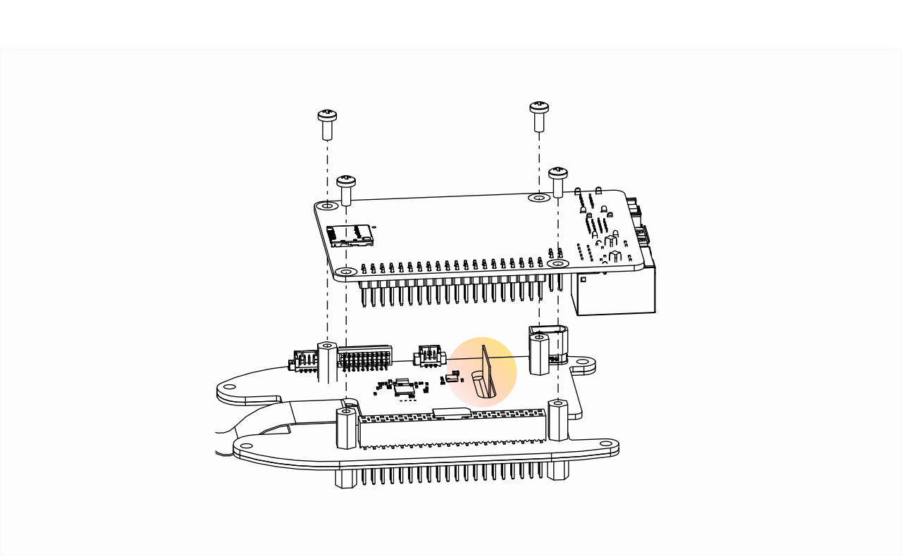

   Используются: узел, собранный на шаге 6 - 1 шт., Raspberry Pi 4 - 1 шт.,
   винт ISO7045 M2.5x6 – 4 шт.

 

С помощью четырех винтов M2.5x6 закрепите одноплатный компьютер
Raspberry Pi 4, не забудьте перед этим подключить шлейф камеры в разъем
Raspberry Pi 4.

**Шаг 8**

Установите приемник в разъем на плате автопилота, обратите на
область, выделенной цветом. Закрепите приемник на луче на стяжку, обратите внимание, что кнопка должна смотреть от
луча, чтобы к ней был доступ для нажатия, это понадобиться позднее.

.. tip:: Приемник надо присоеденить к базовой плате автопилота, обратите внимание на фотографию ниже.

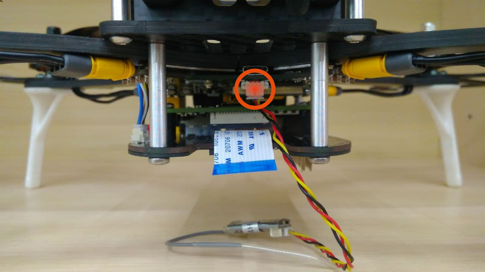

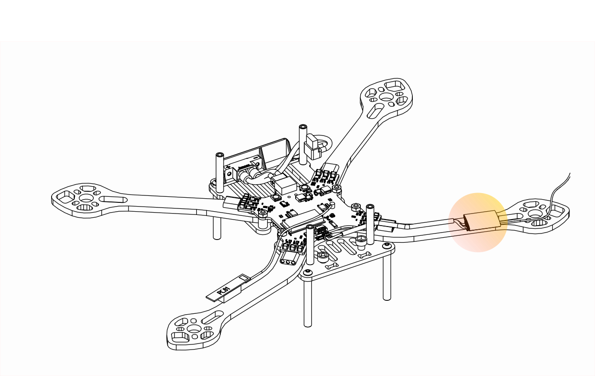

   Используются: узле собранный на шаге 7 - 1 шт., винты ISO7380 M3x8 - 4
   шт., шлейф коммутационный – 1 шт.

**Шаг 9**

	Пункт 1.	Возьмите узел, собранный на шаге 7.

	.. figure:: media/newpdb_1.jpg
	   :align: center
	   :scale: 47%

	Пункт 2.	Расположите модуль распределения питания как показано на изображении, подключив разъём XT30 в ответную часть.

	.. figure:: media/newpdb_2.jpg
	   :align: center
	   :scale: 50%

Пункт 3.	Используйте фиксатор для крепежа модуля на луче следующим образом. Первый паз фиксируется на луче коптера. Во второй паз укладываются провода от мотора. Третий паз - поддерживает сам модуль. Дополнительно, обратите внимание, что силовой кабель должен распологаться перед стойкой!

	.. figure:: media/newpdb_3.jpg
	   :align: center
	   :scale: 45%

Пункт 4.	Зафиксируете всю конструкцию с помощью кабельной стяжки продев её во все отверстия. Подключите кабель питания в соответствующий разъём.
Будьте внимательны при подключении кабеля питания к плате распределения. Соблюдайте полярность подключения, во избежание возгорания.

	.. figure:: media/newpdb_4.jpg
	   :align: center
	   :scale: 45%

**Шаг 10**

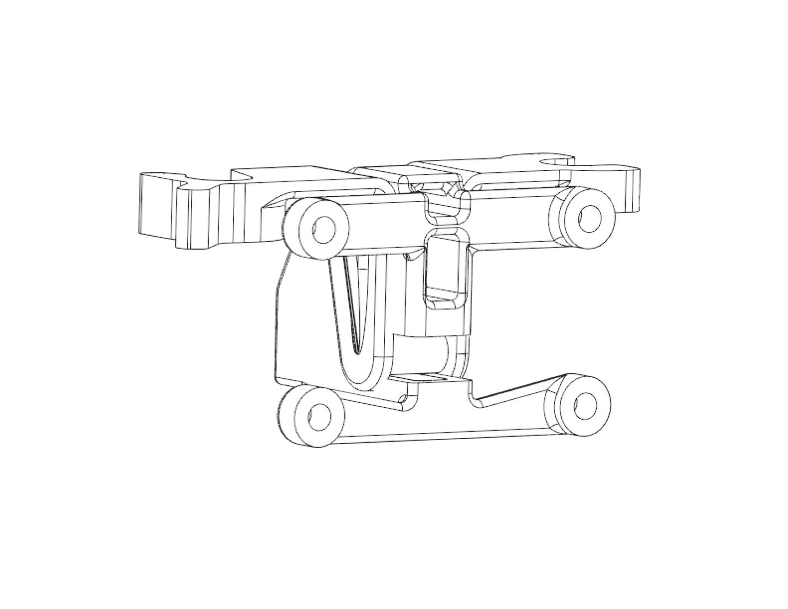

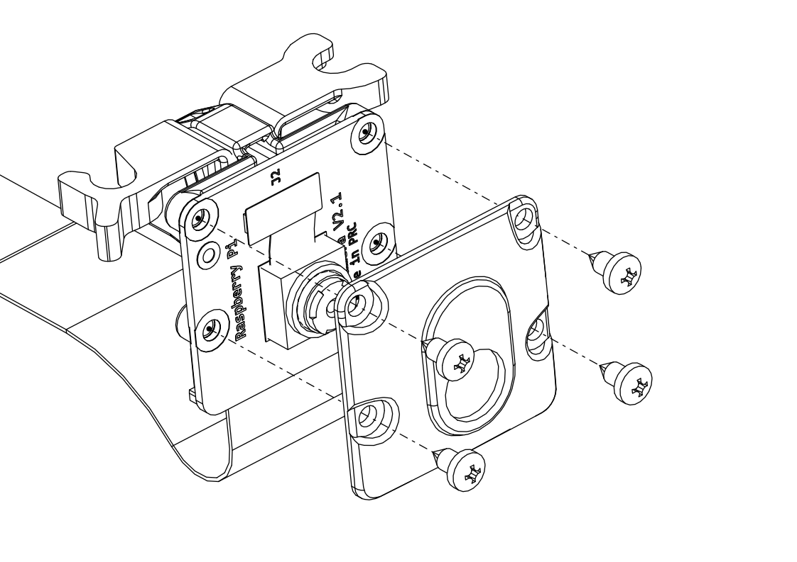

   Используются: крышка Raspberry Camera - 1 шт., Raspberry Camera - 1 шт.,
   кронштейн Raspberry Camera – 1 шт., шуруп DIN7049-ST 2.2x4.5 – 4 шт.

Сначала соберите кронштейн камеры, как показано на первом рисунке. После
чего закрепите крышку на камере с помощью 4 шурупов, как показано на
рисунке. Подключите шлейф, идущий от Raspberry Pi к камере.

**Внимание**, в зависимости от конкретной поставки, кронштейн камеры может
отличаться, чтобы посмотреть, как установить другой кронштейн перейдите
по ссылке: `Установка старого кроншейна Raspberry Camera`_

**Шаг 11**

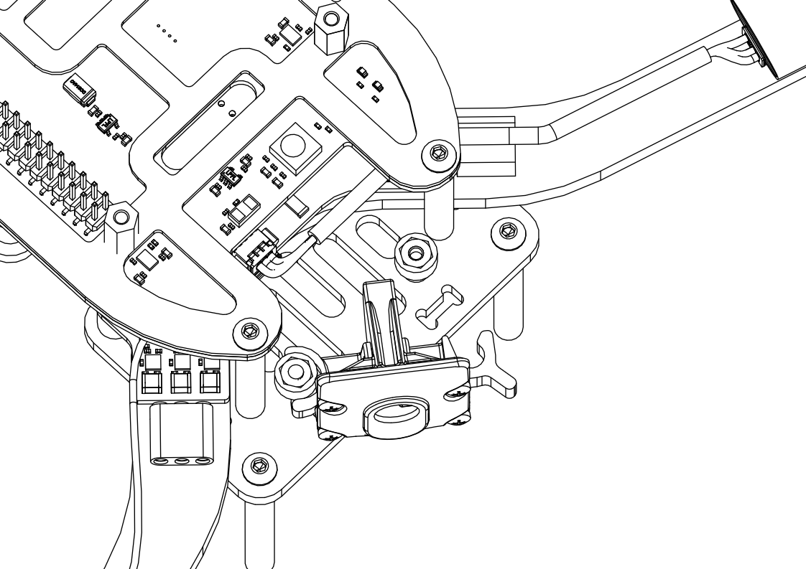

   Используются: собранная Raspberry Camera – 1 шт.

Защелкните кронштейн как показано на рисунке.

**Шаг 12**

.. figure:: media/image16.png
   :align: center
   :scale: 70%

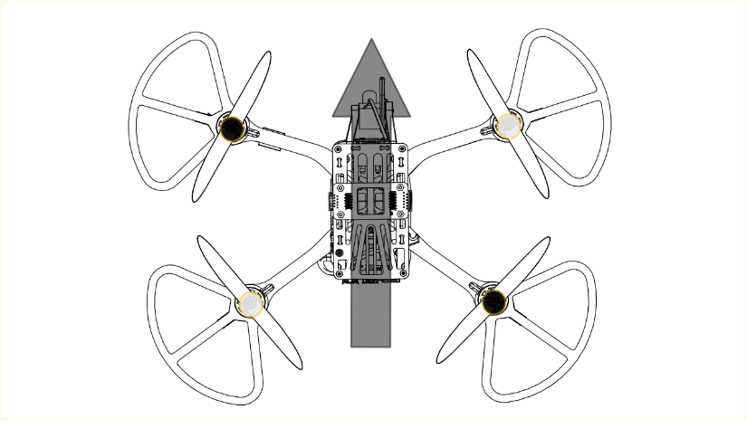

   Используются: мотор правого вращения (черная гайка) - 2 шт., мотор
   левого вращения (серебристая гайка) - 2 шт., винт M3x12 – 16 шт., опора
   – 4 шт., защита винтов – 4 шт.

Перед установкой двигателей не забудьте продеть разъем мотора через
специальное отверстие в луче. После чего закрепите защиту, моторы и
опоры винтами M3x12 на луче, как показано на рисунке. Обратите внимание
на цветовую маркировку гаек двигателя, они могу быть серебристого или
черного цветов, сверьтесь с правильным расположением двигателей на
рисунке выше.

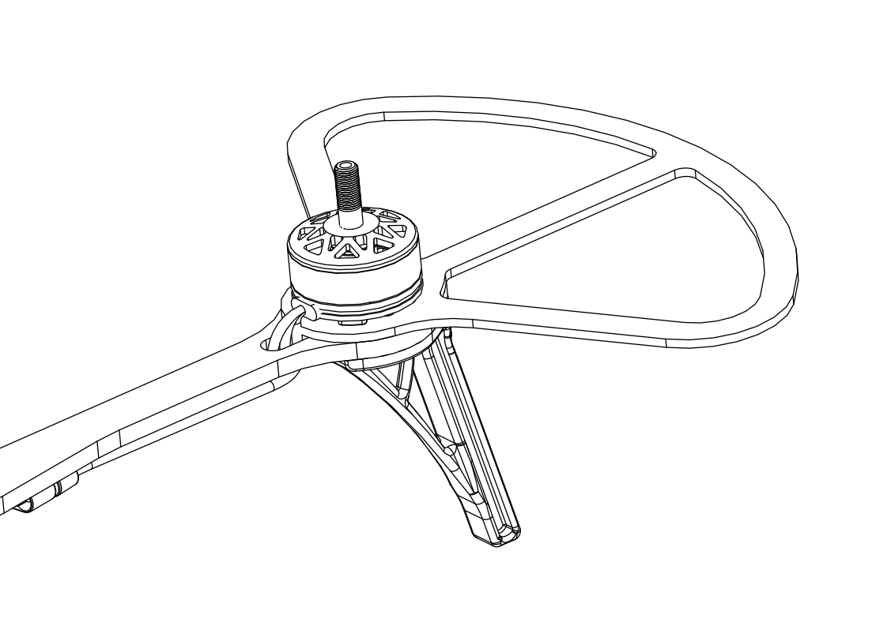

**Шаг 14**

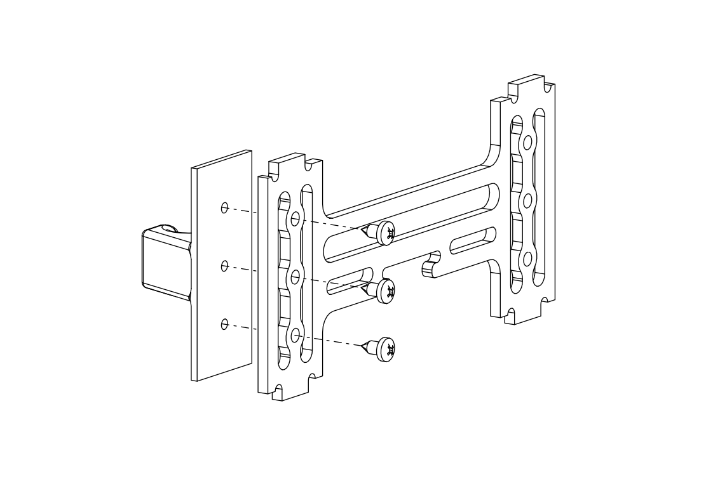

Используются: шуруп M2.2x6.5 – 3 шт., боковая стенка – 1 шт., кронштейн
резинки – 1 шт.

Установите кронштейн с помощью шурупов, как показано на рисунке.

.. hint:: При поломке кронштейна крепления фиксатора АКБ вы его можете напечатать на 3D-принтере:
          :download:`Кронштейн фиксатора АКБ <stl/battery-mount-max.STL>`

**Шаг 15**

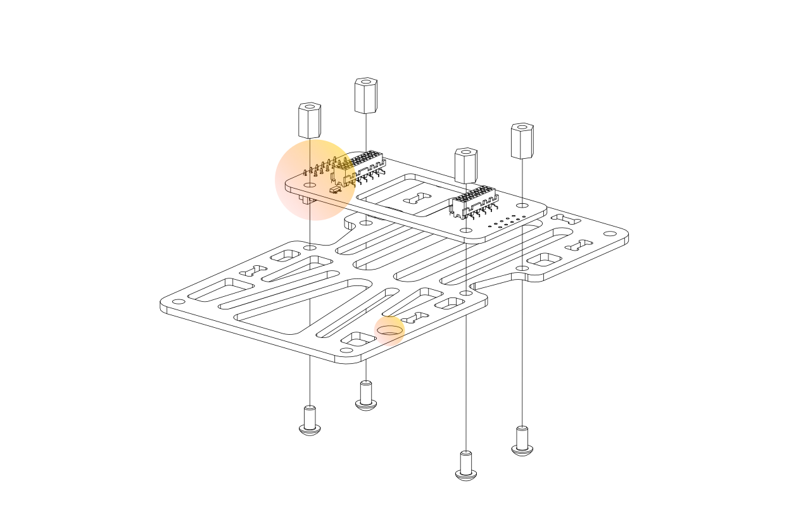

   Используются: винт ISO7380 М3х6 – 4 шт., стойка – 4 шт., плата-адаптер –
   1 шт., верхняя пластина рамы – 1 шт.

Правильно сориентировав плату-адаптер, закрепите ее на верхней пластине
с помощью стоек и винтов, как показано на рисунке.

**Шаг 16**

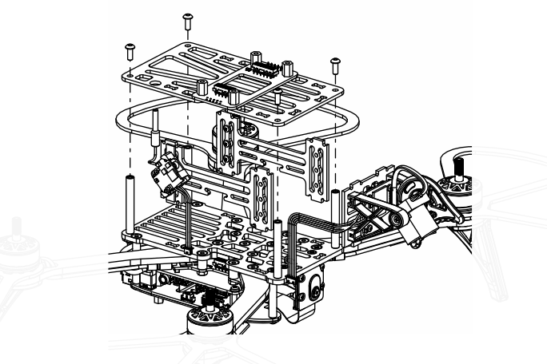

   Используются: винт DIN 7380 M3x8 – 4 шт., боковая стенка рамы – 1 шт.,
   узел, собранный на шаге 15 – 1 шт., узел, собранный на шаге 14 – 1 шт.,
   узел, собранный на шаге 13 – 1 шт., модуль фото/видеокамеры – 1 шт.

Вставьте детали в пазы закрепив сверху крышкой и винтами, как показано
на рисунке.

**Шаг 17**

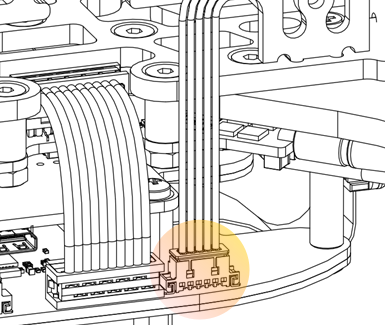

   Используются: кабель подключения фото/видеокамеры – 1 шт.

Подключите кабель, идущий от фото/видеокамеры к плате распределения
питания.

**Шаг 18**

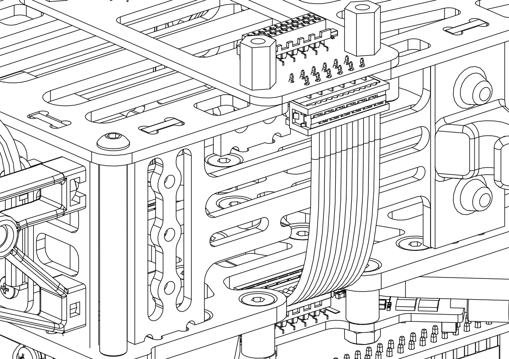

   Используются: кабель подключения платы-адаптера – 1 шт.

Подключите кабель, выделенный на рисунке к плате автопилота и к
плате-адаптеру.

**Шаг 19**

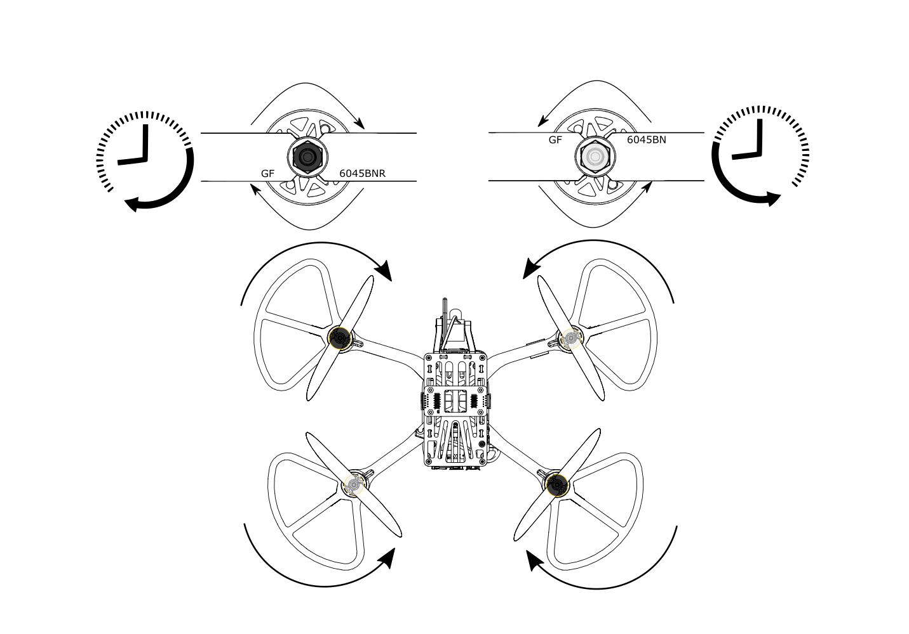

   Используются: собранный квадрокоптер, винт воздушный левого вращения
   6045BN - 2 шт., винт воздушный правого вращения 6045BNR - 2 шт.

Обратите внимание: черные гайки имеют левую резьбу! Надписи на винтах
(6045BN или 6045BNR) обозначают направление вращения, установите винты
согласно рисунку. Открутите гайки с осей моторов, установите воздушные
винты (надписи на винтах должны быть сверху) и закрепите их гайками.
Серебристые гайки закручиваются по часовой стрелке (правая резьба),
черные гайки – против часовой стрелки (левая резьба). Важно убедиться в
том, что вы прочно зафиксировали воздушные винты, проверять это лучше
перед каждым полетом.

**Шаг 20**

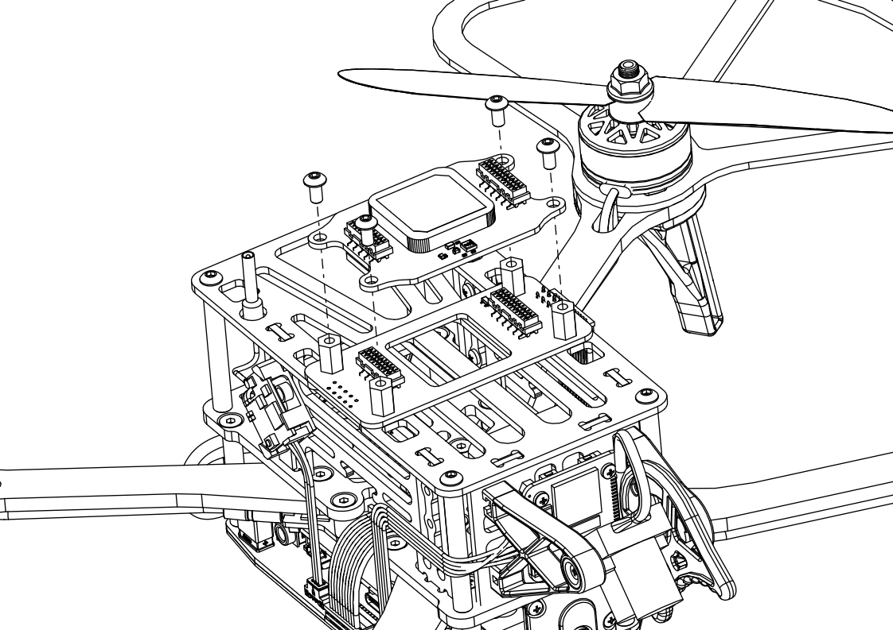

   Используются: модуль навигации – 1 шт., винт ISO7380 M3x6 – 4 шт.

В зависимости от вашей комплектации вы можете подключить дополнительный
модуль навигации, например, модуль GPS/ГЛОНАСС для автономного полета на
улице, или ИК-модуль навигации для полета в помещениях (требуется HTC
LightHouse v2). Перед полетом не забудьте поменять параметры автопилота,
чтобы он использовал правильную систему навигации.

**Шаг 21**

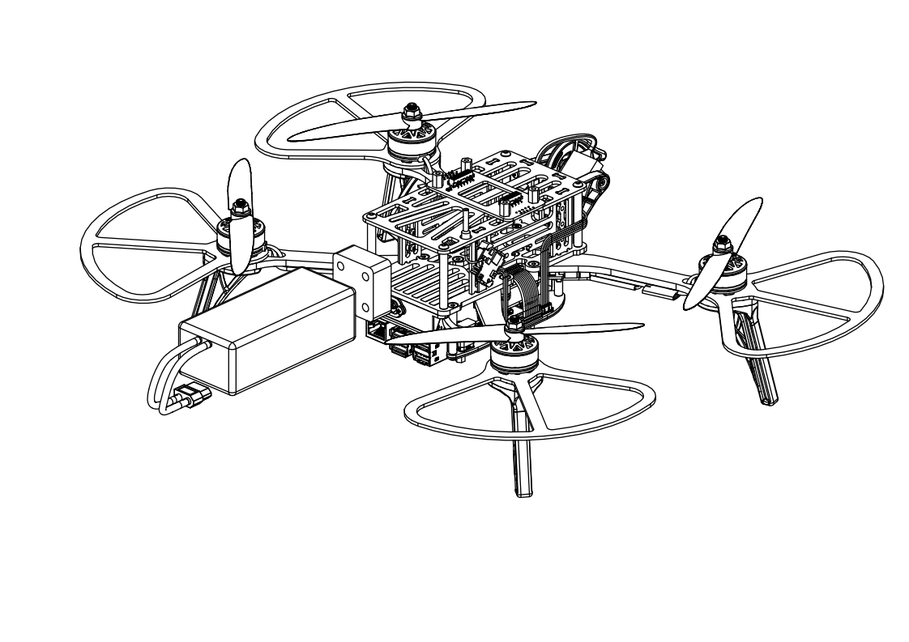

   Используются: аккумуляторная батарея – 1 шт., проставка АКБ – 1 шт.

Приклейте проставку АКБ на аккумулятор после чего установите аккумулятор
и закрепите его с помощью резинки сзади, сделав петлю вокруг правой
стойки и закрепив на фиксаторе на боковой стенке.

.. warning:: Перед началом полетов, пожалуйста ознакомьтесь со всей инструкцией. Вам обязательно необходимо будет обновить автопилот и параметры к нему.

Установка старого кроншейна Raspberry Camera 
--------------------------------------------

   Используются: модуль с Raspberry Сamera – 1шт., винты M2.5х6 - 2 шт., гайки М2.5.

Установите собранный модуль Raspberry Camera под основанием платы,
закрепив на два винта и гайки М2.5, как показано на рисунке.

