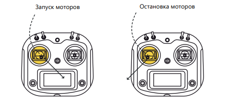

Подготовка к полету - первый старт.
===================================

Перед полетом прочтите раздел :doc:`rc_control`

**Для успешного старта:**

1. Полностью зарядите аккумулятор квадрокоптера и проверьте заряд батареек в пульте.
2. Убедитесь что на квадрокоптере нет заметных повреждений.
3. Установите стик газ/курс в положение минимум - до упора на себя.
4. Включите пульт управления;
5. До упора вставьте аккумулятор в отсек в задней части квадрокоптера. Убедитесь, что он не выпадает при наклоне квадрокоптера.
6. Подключите аккумулятор.
7. Прозвучит звуковой сигнал и на квадрокоптере загорятся светодиоды.
8. Дождитесь пока светодиод статуса не начнет мигать синим.
9. Запустите моторы. Для этого до упора зажмите левый стик в правый нижний угол на 2-3 секунды.
10. Дождитесь пока все винты начнут вращаться и плавно взлетайте. Во время полета соблюдайте правила эксплуатации. Не допускайте падения квадрокоптера. 
11. После полета остановите моторы. Для этого до упора зажмите левый стик в левый нижний угол на 2-3 секунды.

    

 	
 	
