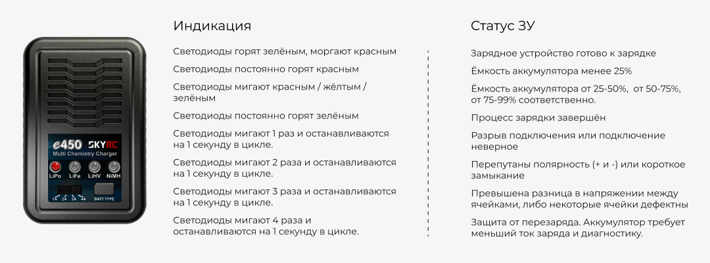

Аккумуляторная батарея 
======================

В качестве источника энергии на "Пионер Макс" используется трёхэлементный(3S) LiPo аккумулятор ёмкостью 5400 мАч с напряжением 11.7V. Батареи такого типа легкие и мощные, но могут быть пожароопасны при неправильной эксплуатации. Прочитав этот раздел, вы научитесь работать с LiPo аккумуляторами.

.. attention:: При экспулатации используйте только штатные АКБ для "Пионера Макс"! Использование АКБ с другими электрическими характеристиками может привести к выходу оборудования из строя! 

**Зарядка**

#. Для зарядки выберете негорючую поверхность вдали от легковоспламенимых предметов (шторы, ковры, мягкая мебель)
#. Осмотрите аккумулятор, на нем не должно быть вмятин, бугров, разрывов оболочки.
#. Подключите зарядное устройство к сети 220 В.
#. Нажатием на кнопку "BATT TYPE" выберите LiPo.
#. Поставьте переключатель cилы тока в 2A.
#. Подключите вывод аккумулятора (желтый) к ответному выводу зарядки.
#. Подключите балансировочный (маленький) вывод аккумулятора к разъему зарядного устройства.
#. Индикатор заряда должны начать мигать. Зеленый цвет индикатора (светит постоянно) указывает на то, что аккумулятор заряжен на 100%.
#. Дождитесь полной зарядки аккумулятора и отключите его от зарядного устройства. Нельзя оставлять заряжающийся аккумулятор без присмотра!

.. note::
  Если вы планируете хранить аккумулятор, не используя, дольше месяца - разрядите его примерно наполовину и дозаряжайте до того же состояния раз в 3-4 месяца. При таком режиме акуумулятор не выйдет из строя при переразряде.

.. attention::
	Не заряжайте и не используйте поврежденный аккумулятор. До момента утилизации его следует хранить отдельно от исправных, вдали от горючих предметов и поверхностей Используйте металлический контейнер (например, кастрюлю с крышкой) или специальный огнестойкий чехол.

**Индикация на зарядном устройстве**

В комплект включено зарядное устройство (далее ЗУ) - SkyRC-E450. Узнать статус и состояние ЗУ можно с помощью светодиодной индикации.
Ниже указаны все возможные состояния и их индикация на ЗУ.

**Эксплуатация**

* При установке аккумулятора в раму следите, чтобы пропеллеры не задевали провода.
* Подключите аккумулятор к квадрокоптеру перед взлетом и отключите сразу после посадки.
* Не допускайте короткого замыкания между контактами аккумулятора. 
* Перед взлетом и после посадки осмотрите аккумулятор. На нём не должно быть повреждений, вмятин, проколов и разрывов оболочки. Недопустим нагрев батареи выше 50\ :sup:`о`\ C и разбухание оболочки.

.. danger::
	Если в полете аккумулятор был поврежден, **не пытайтесь немедленно достать его из рамы!** От изгиба и дополнительного притока воздуха батарея может вспыхнуть. При появлении дыма или пламени из квадрокоптера немедленно совершите посадку на негорючую поверхность.	

	**Недопустимо тушить аккумулятор водой!** Для тушения можно использовать плотную ткань, песок, землю, углекислотный или порошковый огнетушитель. Если тушить нечем - дождитесь пока батарея догорит сама и утилизируйте то что осталось.

	Продукты горения LiPo аккумулятора **крайне токсичны**, не вдыхайте образовавшийся дым.
