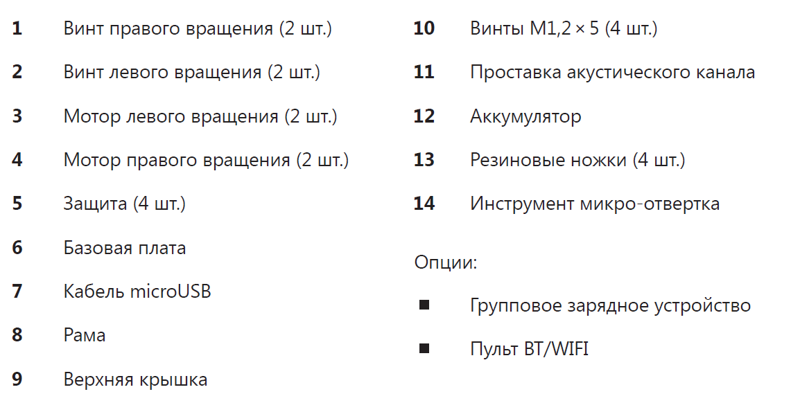

Сборка "Пионер Мини"
====================

Прочитав данную инструкцию вы сможете собрать "Пионер Мини"

.. important:: В наборе "Пионер мини" есть все элементы и инструменты для сборки и запуска квадрокоптера.

Для сборки и настройки "Пионер мини" пройдите в следующие подразделы:

:doc:`assembling_drone`

:doc:`../settings/settings_main`

В разделе :doc:`/programming/programming_main` подробно рассказано о том, как запрограммировать квадрокоптер.

.. note:: Программирование на базовом уровне, идентично программированию стандартного Пионера (:doc:`/pioneer-base/pioneer-base_main`) , поскольку они используют одинаковый автопилот.  Для работы с ESP-32 смотрите страницу "Работа с ESP32" (скоро будет)

.. note:: Технические характеристики, внешний вид и комплектация товара могут быть изменены производителем без предварительного уведомления.

.. toctree::
   :maxdepth: 2
   :caption: Содержание:

   assembling_drone
   battery
   assembling_switch_on
