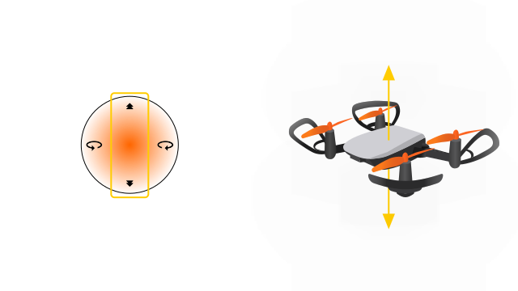
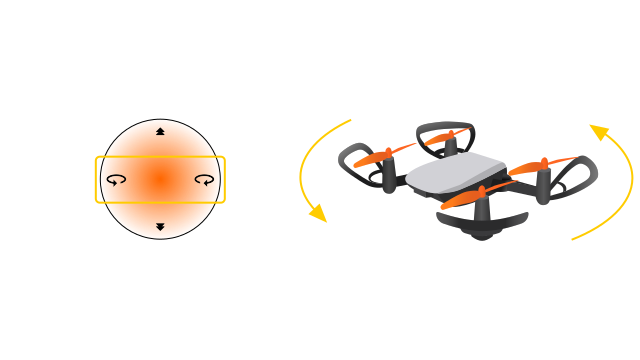
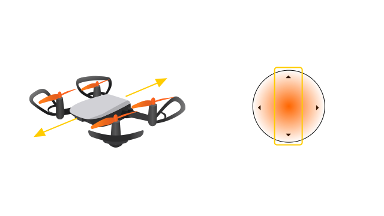
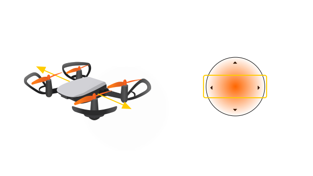

Памятка по управлению через приложение
======================================

**Для управления "Пионером Мини" с помощью мобильного приложения следуйте правилам приведенным ниже:**

Управление классическое, если вы до этого управляли "Геоскан Пионер" или другим квадрокоптером, сложностей у вас возникнуть не должно.
Если у вас есть также Bluetooth джойстик (является опцией), то советуем изучить данную страницу по его настройке. :doc:`bt-rc-set`.

**Управление высотой**

.. important:: При перемещении стика газ/курс от себя квадрокоптер набирает высоту, при перемещении на себя – снижается.

**Вращение вокруг своей оси**

.. important:: При перемещении стика газ/курс влево/вправо квадрокоптер поворачивается вокруг своей оси.

**Полет вперед/назад**

.. important::  При перемещении стика крен/тангаж от себя, квадрокоптер наклоняется вперед и летит вперед. При перемещении стика крен/тангаж на себя, квадрокоптер наклоняется назад и летит назад.

**Полет боком влево/вправо**

.. important:: При перемещении стика крен/тангаж влево/вправо, квадрокоптер летит боком влево/вправо.

.. attention::  Управляйте квадрокоптером плавно, не дергайте стики пульта слишком резко или сразу в крайнее положение. Пульт управления держите двумя руками, пальцы обеих рук всегда держатся за стики. 

Для выполнения первого полета перейдите в раздел :doc:`flight_preparation`

