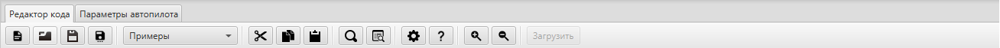

Редактор кода
=============

Этот раздел поможет научиться работать с Pioneer station

Основное окно **Pioneer station** - это редактор кода. В нём вы можете разрабатывать и редактировать полетные задания "Пионера" на языке Lua.

Главное меню редактора кода: 

Назначение кнопок меню редактора:

* Создать новый файл
	.. image:: media/_code_editor_1.png

* Открыть файл из папки
	.. image:: media/_code_editor_2.png

* Сохранить файл
	.. image:: media/_code_editor_3.png

* Сохранить как
	.. image:: media/_code_editor_4.png

* Выбор одной из готовых программ примеров
	.. image:: media/_code_editor_5.png

* Вырезать блок кода
	.. image:: media/_code_editor_6.png

* Скопировать блок кода
	.. image:: media/_code_editor_7.png

* Вставить блок кода
	.. image:: media/_code_editor_8.png

* Поиск
	.. image:: media/_code_editor_9.png

* Замена
	.. image:: media/_code_editor_10.png

* Настройки редактора
	.. image:: media/_code_editor_11.png

* Справка
	.. image:: media/_code_editor_12.png

* Увеличить масштаб
	.. image:: media/_code_editor_13.png

* Уменьшить масштаб
	.. image:: media/_code_editor_14.png

* Загрузить программу на "Пионер" (активна только при подключении к квадракоптеру)
	.. image:: media/_code_editor_15.png
