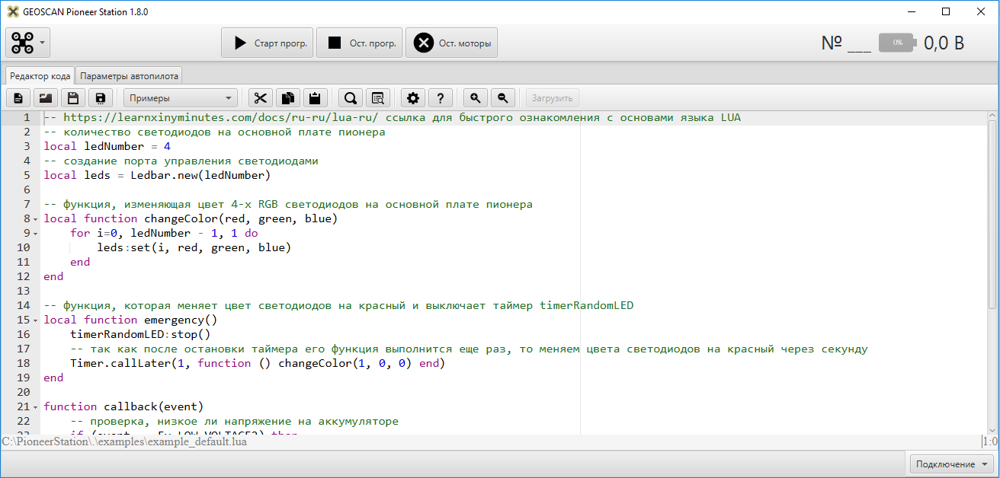

Работа с Pioneer station
========================

Интерфейс программы при запуске без подключенного "Пионера":

В верхней части окна программы представлено **Главное меню**, в котором производится обновление **Pioner station** и прошивки автопилота. 
Также в **Главном меню** производится настройка модема. В центральной части расположены кнопки запуска/остановки программы и остановки моторов.
В правой части окна - индикатор подключения. После подключения в нем будет отображаться номер квадрокоптера и заряд аккумулятора.
В центральной части окна располагаются окна: :doc:`pioneer_station_code_editor` и :doc:`/pioneer-base/settings/autopilot_parameters`, работа с ними подробно описана в соответствующих разделах.

.. attention:: Если ваша программа предполагает полет, не запускайте ее из интерфейса **Pioneer station**. Запуск квадрокоптера, подключенного по usb, опасен для вас и окружающих!

.. toctree::
   :maxdepth: 2
   :caption: Содержание:
   
   pioneer_station_code_editor